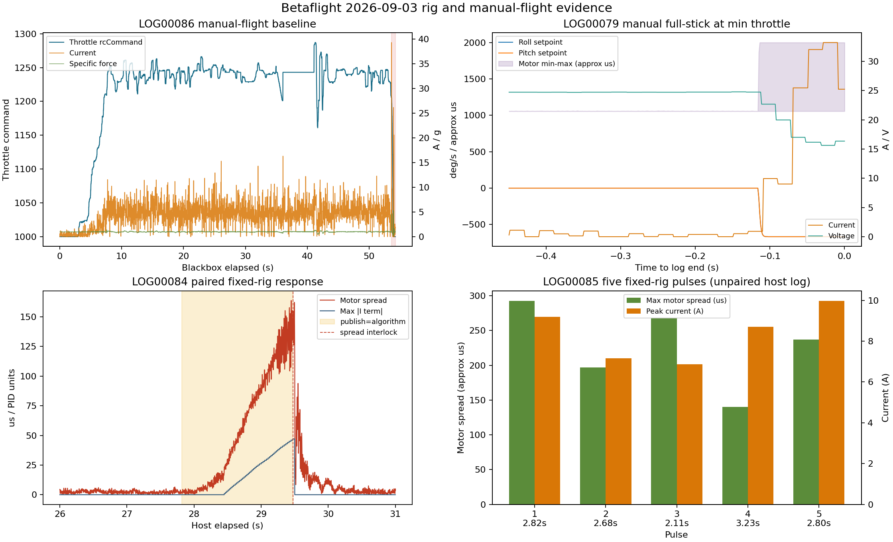

# 2026-09-03 Betaflight 飞行与台架数据重分析

## 1. 结论

本次重新纳入当天全部 `LOG00078.BFL--LOG00090.BFL`、主机 CSV、事件日志和审计结果。13 份
Blackbox 均正常解码且失败帧为零。数据能够支持以下结论：

1. `LOG00089/90` 的两次约 `0.9 s` PNG 接管确实进入 Betaflight。Roll/Pitch 命令均限制在
   `+/-3 deg/s`，角速度响应方向正确，接管窗口没有电机饱和或 MSP 写错误。
2. 油门交接存在可重复 P0 缺陷。两次接管的 Blackbox 油门分别由 `1240/1243` 降到
   `1197/1198`，比力中位由约 `1 g` 降到 `0.877/0.842 g`，GPS 高度均下降约 `0.2 m`。
3. 新纳入的人工自由飞基线 `LOG00086` 进一步排除了悬停油门标定错误：稳定飞行段油门中位
   `1243`、比力中位 `1.001 g`，与 PNG 接管前状态一致。问题在接管入口的油门 mapper/slew
   状态初始化，不应靠提高悬停油门掩盖。
4. 台架安全联锁有效。`LOG00084` 中固定机体无法跟随 `3 deg/s` 指令，PID I 项积累，电机差速
   达约 `164 us` 后触发 `motor_output_spread_high`。该现象是固定台架约束的结果，不能外推成
   自由飞行不稳定。
5. `LOG00079` 末端约 `115 ms` 的 Roll/Pitch 满杆、raw 电机饱和、`33.23 A / 15.63 V` 是人工
   低油门满杆事件，不是 PNG。后续日志电压和动力恢复正常，没有持续 ESC/电池故障证据，但该
   操作不应重复。
6. 真实目标 LOG_ONLY 在最终调度下的感知年龄 P95 已达到 `84.4 ms`；实际主动飞行配置仍为
   `127.7 ms`，其中姿态融合等待 P95 `94.5 ms`。NPU 推理 P95 只有 `6.5 ms`，瓶颈仍是姿态
   轮询/融合调度。

因此当前结论是：**低权限姿态/MSP链路通过，比例导引计算链已运行，但油门交接未通过，真实
拦截能力和 80% 命中率均未被本次数据证明。修复油门前不得按原配置再次主动飞行。**



两次主动飞行的详细时序图见
[`BETAFLIGHT_FLIGHT_ACTIVE09_LOG00089_90_ANALYSIS.md`](BETAFLIGHT_FLIGHT_ACTIVE09_LOG00089_90_ANALYSIS.md)。

## 2. 数据与方法

Blackbox 输入为 `logs/blackbox_import/LOG00078.BFL--LOG00090.BFL`。使用 Blackbox tools 提交
`f832acf9cd9dbe5ad8220de1a5f4eb4021523d72` 解码：

```bash
/tmp/betaflight-blackbox-tools/obj/blackbox_decode \
  --unit-rotation raw --unit-height m --unit-gps-speed mps \
  --merge-gps --save-headers \
  --output-dir /tmp/blackbox_today_all.IwLTNO \
  logs/blackbox_import/LOG00078.BFL \
  logs/blackbox_import/LOG00079.BFL \
  logs/blackbox_import/LOG00080.BFL \
  logs/blackbox_import/LOG00081.BFL \
  logs/blackbox_import/LOG00082.BFL \
  logs/blackbox_import/LOG00083.BFL \
  logs/blackbox_import/LOG00084.BFL \
  logs/blackbox_import/LOG00085.BFL \
  logs/blackbox_import/LOG00086.BFL \
  logs/blackbox_import/LOG00087.BFL \
  logs/blackbox_import/LOG00088.BFL \
  logs/blackbox_import/LOG00089.BFL \
  logs/blackbox_import/LOG00090.BFL
```

固件均为 `MICOAIR743V2 / Betaflight 2025.12.2`，`acc_1G=2048`，Rate 配置为
`RC Rate=1.0 / Super=0.7 / Expo=0`，Blackbox 电机 raw 边界为 `158--2047`。电机可读 PWM
继续沿用同固件 `LOG00042` 的经验拟合：

```text
MSP_motor_us ~= 0.499231573 * blackbox_motor_raw + 977.151031
```

该换算只用于展示，饱和判定始终使用 raw 边界。`LOG00080--85` 的飞控 RTC 为零，因此不能按
绝对时间与主机日志强行配对；只有时长和电机特征唯一匹配时才建立对应关系。

## 3. Blackbox 完整分类

|日志|时长|分类|可用于证明|
|---|---:|---|---|
|`LOG00078`|`0.304 s`|极短 ARM|无有效实验窗口|
|`LOG00079`|`161.691 s`|台架人工输入，末端满杆|危险瞬态归因，不是 PNG|
|`LOG00080`|`188.572 s`|台架怠速/低输出|无饱和，最大约 `1090 us`|
|`LOG00081`|`128.818 s`|台架怠速/低输出|无饱和，最大约 `1068 us`|
|`LOG00082`|`35.339 s`|与 `OPERATOR_FREE_RUN` ARM 段匹配|只有安全拒绝和 passthrough|
|`LOG00083`|`19.458 s`|台架怠速/低输出|无饱和，最大约 `1072 us`|
|`LOG00084`|`58.319 s`|与 `REPEAT_5S_300S` 精确配对|一次有效 PNG 台架脉冲及联锁|
|`LOG00085`|`61.338 s`|无主机 CSV 的五次受限脉冲|电机/PID/电流定性证据|
|`LOG00086`|`54.234 s`|人工自由飞基线|悬停油门、动力、GPS、落地瞬态|
|`LOG00087`|`0.227 s`|极短 ARM|无有效实验窗口|
|`LOG00088`|`0.935 s`|极短 ARM|无有效实验窗口|
|`LOG00089`|`94.835 s`|第一次 PNG 自由飞|完整主机+Blackbox 第一次接管|
|`LOG00090`|`94.953 s`|第二次 PNG 自由飞|Blackbox 第二次接管，主机尾段缺失|

全部日志的 Betaflight failsafe phase 均为 `IDLE`。Blackbox 文本把当前定制固件 mode flag 解码
成 `ANGLE_MODE` 或 `ANGLE_MODE|HORIZON_MODE`，但同固件已确认该文本位定义不匹配；主动窗口
模式判定使用主机 MSP mode flag 和运行时 Acro 门控，不使用该错误文本标签。

## 4. LOG_ONLY 与虚拟框

### 4.1 真实目标最终调度

`RIG_T4_LOG_ONLY_RETRY` 运行 `119.981 s`，全程 `state=LOG_ONLY`、`publish=disabled`，所有
`MSP_SET_RAW_RC` 计数均为零。3093 个成功处理且带 track 的新结果全部 confirmed，保持
`track_id=1`，switch/fragment 均为零：

|指标|结果|
|---|---:|
|感知结果年龄 P95/max|`84.36 / 119.61 ms`|
|姿态融合等待 P95/max|`40.30 / 80.26 ms`|
|RKNN 总耗时 P95/max|`6.41 / 9.57 ms`|
|MSP parser/checksum error|`0 / 0`|

“processed track confirmed 100%”只描述已经形成有效 track 的结果，不等于全场景检测召回率。
该室内 USB 测试没有 GPS，全部运动学状态为 `gps_fix_invalid`，所以导引因
`velocity_invalid` 被拒绝。它证明最终调度下的视觉连续性和延迟，不证明 NED 速度建立导引。

`RIG_T4_PITCH_RETRY` 的处理结果 P95 同样约 `84.67 ms`，但出现 3 个 track ID、2 次 switch 和
2 次 fragment；这与测试中目标漏检/重新进入一致，不作为单目标连续跟踪通过证据。

### 4.2 虚拟框计算

`VM_VIRTUAL_4_6_LOG_ONLY_RETRY` 全程没有发送 `MSP_SET_RAW_RC`，得到 2985 行有效比例导引：

|指标|结果|
|---|---:|
|总加速度模长 P50/P95/max|`1.000 / 1.000 / 1.000 m/s2`|
|理论载荷 P50/P95/max|`1.047 / 1.099 / 1.102 g`|
|2.412 kg 整机所需推力 P50/P95/max|`24.76 / 26.01 / 26.06 N`|
|水平框偏移与期望 Roll 相关系数|`+0.920`|
|垂直框偏移与期望 Pitch 相关系数|`-0.920`|
|Roll/Pitch 输出上限|`3 deg/s`|

这证明虚拟框到 NED 加速度、`R_IB/R_BC` 转换和候选角速度的数值边界一致。载荷是根据命令计算
的理论值，不是推力台或加速度计实测；虚拟框也绕过 YOLO/ByteTrack，不能证明识别性能。

## 5. 台架主动输出

### 5.1 早期无桨方向测试

当天较早的无桨方向证据已经单独归档：修正后必须保持 `roll_rate_sign=+1`、
`pitch_rate_sign=-1`。机头侧目标使后电机高、产生低头趋势；机尾侧目标使前电机高、产生抬头
趋势。详见
[`BETAFLIGHT_VELOCITY_PNG_NOPROP_MOTOR_DIRECTION_20260903.md`](BETAFLIGHT_VELOCITY_PNG_NOPROP_MOTOR_DIRECTION_20260903.md)。

### 5.2 虚拟框无桨主动脉冲

`VM_VIRTUAL_4_6_ACTIVE_MASK15` 真正 `publish=algorithm` 约 `1.055 s`，最大电机输出
`1163 us`、最大差速 `107 us`，写错误为零，无电机饱和。全局写入速率 `49.181 Hz`，但有一次
`101.799 ms` 发送间隔且 P99.9 为 `61.998 ms`，超过 `40/60 ms` 统计门限；这说明该轮串口调度
有偶发抖动，不能标记为严格全通过。

### 5.3 带桨固定台架

三份主机主动日志需要分开解释：

|主机日志|ARM/RC7|真正 algorithm|结果|
|---|---:|---:|---|
|`PROP_RIG_MASK15_ACTIVE_05S_RETEST`|ARM `61.55 s`，RC7 两次|`0 s`|`motor_telemetry_stale` 已锁存，只验证拒绝|
|`PROP_RIG_MASK15_OPERATOR_FREE_RUN`|ARM `35.34 s`，RC7 四次|`0 s`|首次 watchdog 后接管计时联锁锁存，只验证 passthrough|
|`PROP_RIG_MASK15_REPEAT_5S_300S`|ARM `58.40 s`，RC7 五次|首次 `1.654 s`|随后差速联锁锁存，后四次 passthrough|

`LOG00084` 与第三份主机日志的电机曲线对齐为：

```text
host_elapsed = blackbox_elapsed + 19.942716 s
correlation  = 0.994075
RMSE         = 1.623 us
```

有效算法窗口为主机 `27.819855--29.473929 s`。Roll/Pitch 约为 `-3 deg/s`，Blackbox 油门最高
`1126`，最大电机约 `[1158,1261,1117,1208] us`，最大差速约 `164--165 us`，无 raw 饱和。
最大 I 项约 `[23,47,0]`，电机差速与最大 I 项相关系数为 `0.9859`。机体被固定后不能实现目标
角速度，I 项持续增加，约 1 秒后触发差速联锁。这证明联锁按设计工作，不能据此判断空中会出现
同样差速。

`LOG00085` 没有可唯一配对的主机 CSV，因此只作 Blackbox 定性分析：

|脉冲|持续|最大差速|最大 I 项 R/P/Y|峰值电流|最低电压|
|---:|---:|---:|---:|---:|---:|
|1|`2.822 s`|`292.55 us`|`31 / 116 / 6`|`9.20 A`|`22.97 V`|
|2|`2.677 s`|`196.70 us`|`17 / 81 / 4`|`7.16 A`|`23.14 V`|
|3|`2.109 s`|`268.09 us`|`31 / 86 / 1`|`6.86 A`|`23.04 V`|
|4|`3.226 s`|`140.28 us`|`24 / 25 / 2`|`8.70 A`|`23.17 V`|
|5|`2.802 s`|`237.13 us`|`29 / 69 / 6`|`9.97 A`|`23.07 V`|

五段指令都不超过 `+/-3 deg/s`，油门最高 `rcCommand=1236`，没有 raw 电机饱和，也没有
`>20 A` 电流。差速随固定约束和 I 项积累而增加，支持飞行前把持续差速联锁恢复到约 1 秒，
不支持把固定台架的电机差速当作自由飞控制效果。

### 5.4 `LOG00079` 人工异常输入

该日志油门全程 `rcCommand=1000`。结束前约 `114.9 ms`，人工 Roll/Pitch 输入达到 `+/-500`
满杆，对应 setpoint `+/-667 deg/s`；电机 raw 达 `2047`，饱和累计约 `114.9 ms`，电流峰值
`33.23 A`，电压最低 `15.63 V`，低于 `20 V` 约 `92.8 ms`。事件 I 项为零，是满杆 P/D/FF 和
`pid_at_min_throttle=1` 的直接响应，远超 PNG 的 `3 deg/s` 上限。

该瞬态不能忽略，但不能归因给 PNG。后续 `LOG00080--90` 电压恢复，人工飞行和两次主动飞行均
完成，因此目前没有持续硬件损坏证据。

## 6. 人工自由飞基线 `LOG00086`

该日志从 UTC `10:31:24.591` 开始，持续 `54.234 s`，油门高于 `1050` 共 `49.145 s`。剔除
起降各 2 秒、`>1.5 g`、`>15 A` 和 `>100 deg/s` 瞬态后得到 `43.047 s` 稳定样本：

|指标|P05|P50|P95|
|---|---:|---:|---:|
|Throttle `rcCommand`|`1221`|`1243`|`1257`|
|电压|`24.70 V`|`24.79 V`|`24.91 V`|
|电流|`1.84 A`|`4.87 A`|`8.50 A`|
|比力|`0.882 g`|`1.001 g`|`1.098 g`|
|平均电机近似 PWM|`1264.6 us`|`1285.2 us`|`1298.9 us`|
|电机差速近似 PWM|`16.5 us`|`44.9 us`|`87.9 us`|

GPS 有 509 个独立更新，卫星数 `20/24/24`，更新间隔 P95 `134.2 ms`、最大 `412.7 ms`，最大
地速 `2.77 m/s`；相对起点最大水平位移约 `12.53 m`，GPS 高度范围 `11.5--15.9 m`。全程没有
Betaflight failsafe。

最后约 `0.64 s` 为落地/接触段：第一次电机 raw 饱和在 `53.598 s`，饱和累计 `28.4 ms`；
电流峰值 `39.30 A` 出现在 `53.604 s`，最大 `5.297 g` 出现在油门已回到 `1000` 后的
`53.923 s`，最低电压仍为 `23.75 V`。这说明触地阶段本来就可能有短时大过载和差速，可用于
解释 `LOG00090` 的日志末端事件，但不能自动解释发生在飞行中段的异常。

## 7. 两次 PNG 自由飞

|指标|`LOG00089`|`LOG00090`|
|---|---:|---:|
|PNG 窗口|`68.755--69.681 s`|`49.082--49.988 s`|
|持续时间|`0.926 s`|`0.905 s`|
|Roll 响应相关/滞后|`0.777 / 34 ms`|`0.756 / 30 ms`|
|Pitch 响应相关/滞后|`0.762 / 9 ms`|`0.755 / 23 ms`|
|接管前/最低油门|`1240 / 1197`|`1243 / 1198`|
|接管前/接管中比力中位|`0.999 / 0.877 g`|`0.993 / 0.842 g`|
|GPS 高度变化|`-0.2 m`|`-0.2 m`|
|接管窗口电机饱和|`0`|`0`|
|接管窗口最低电压/峰值电流|`24.33 V / 7.06 A`|`24.17 V / 8.40 A`|

第一次接管有完整主机侧证据：27/27 个新结果 confirmed，均为 `track_id=29`；控制窗口内
`guidance_valid=45/45`，总加速度全部受限为 `1.0 m/s2`，Roll/Pitch 最终受限为 `3 deg/s`。
`SET_RAW_RC` 间隔 P50/P95/max 为 `20.03/25.22/29.67 ms`，所有写入、请求、解析和校验错误
均为零。

油门交接的内部指纹为：物理源 `1278 us`、原始算法目标 `1275 us`，但 slew mapper 尚停留在
约 `1004 us`，经相对 `+/-40 us` 安全带后交接目标错误地变成 `1238 us`。这与人工基线的稳定
悬停油门一致地证明了实现缺陷。

第一次接管视觉年龄 P95 为 `127.7 ms`，姿态融合等待 P95 `94.5 ms`，RKNN P95 `6.52 ms`。
因此延迟优化应针对 ATTITUDE 轮询和融合，不应优先重写 YOLO/C++。

`LOG00089` 在 PNG 退出 `2.157 s` 后有一次 `3.475 g / 80.64 A` 扰动。当时 setpoint 三轴为零、
主机已是 `passthrough`，故不是 PNG 命令直接造成；可能是接触或外部扰动，缺少同步视频无法再
细分。`LOG00090` 末端 `5.919 g / 73.7 A` 同时存在人工 Pitch 输入，且距 PNG 约 44 秒，符合
人工恢复/触地段。

主机 CSV 在约 `96.5 s` 被截断，因此第二次接管没有对应的视觉、guidance 和 MSP 尾段；其
姿态和动力响应只能由 `LOG00090` 证明。

## 8. 通过项与阻断项

|检查项|判定|
|---|---|
|真实目标检测、单段 track 连续性|通过；最终 LOG_ONLY 调度 P95 `84.4 ms`|
|虚拟框到 VM/PNG/姿态命令数值链|通过；加速度 `1 m/s2`、理论最大 `1.102 g`|
|无桨双向电机物理方向|通过；Roll `+1`、Pitch `-1`|
|固定台架电机差速联锁|通过|
|自由飞 Roll/Pitch 低权限 MSP 链|通过；`+/-3 deg/s`|
|主动窗口串口发送与 ACK|通过；无错误，窗口最大间隔 `29.67 ms`|
|油门保持与交接|**失败，P0**|
|主动飞行感知年龄 P95 `<100 ms`|失败，当前 `127.7 ms`|
|第二次主机日志完整性|失败，尾段截断|
|比例导引真实命中率/80% 指标|未证明|

## 9. 下一步

1. 离线修复接管入口：用物理油门或原始算法目标初始化 throttle mapper/slew state，再做相对
   限幅和 `0.8 s` 交接。增加回归测试，覆盖 `source=1278`、`raw target=1275`，要求全过程不低于
   `1270 us`，不能再次得到 `1238 us`。
2. 把飞行配置的 ATTITUDE 调度调整到已经在 `RIG_T4_LOG_ONLY_RETRY` 证明可达到的延迟档位，
   同时保持主动窗口 `SET_RAW_RC` 50 Hz 和最大发送间隔不恶化。
3. 修复主机 CSV 周期 flush/正常收尾，确保 DISARM 后记录 10 秒并落盘，避免第二架次再次缺少
   host-side 证据。
4. 处理接管计时器可用性问题：没有真正进入 `publish=algorithm` 时不应消耗并锁存接管时限；
   保留 DISARM 才能复位的安全原则。
5. 完成单元测试和离线日志回放后，只补一次受监督短脉冲，复核油门不下降、比力不下降、感知
   P95 `<100 ms`、退出后恢复 passthrough。无需重复已经完成的轴向、无桨电机方向或人工基线。

结构化结果见
[`BETAFLIGHT_20260903_FLIGHT_AND_RIG_metrics.json`](evidence/BETAFLIGHT_20260903_FLIGHT_AND_RIG_metrics.json)。
