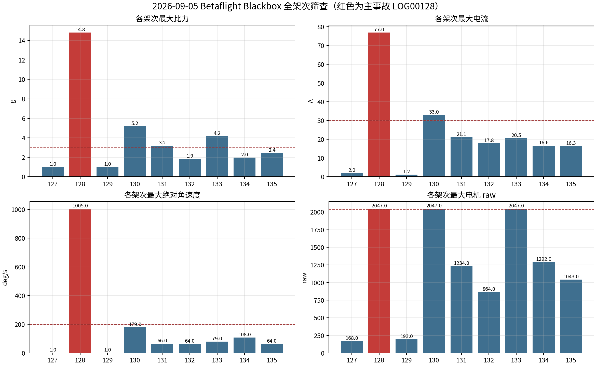
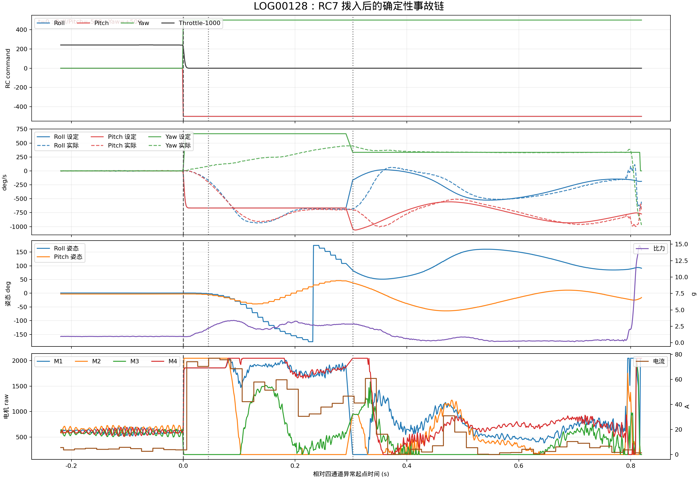
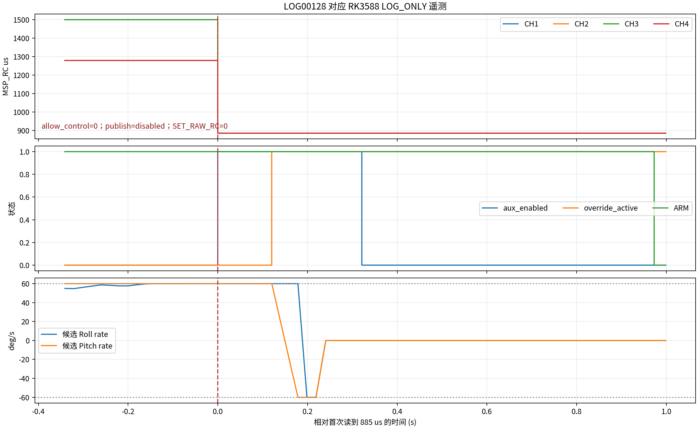
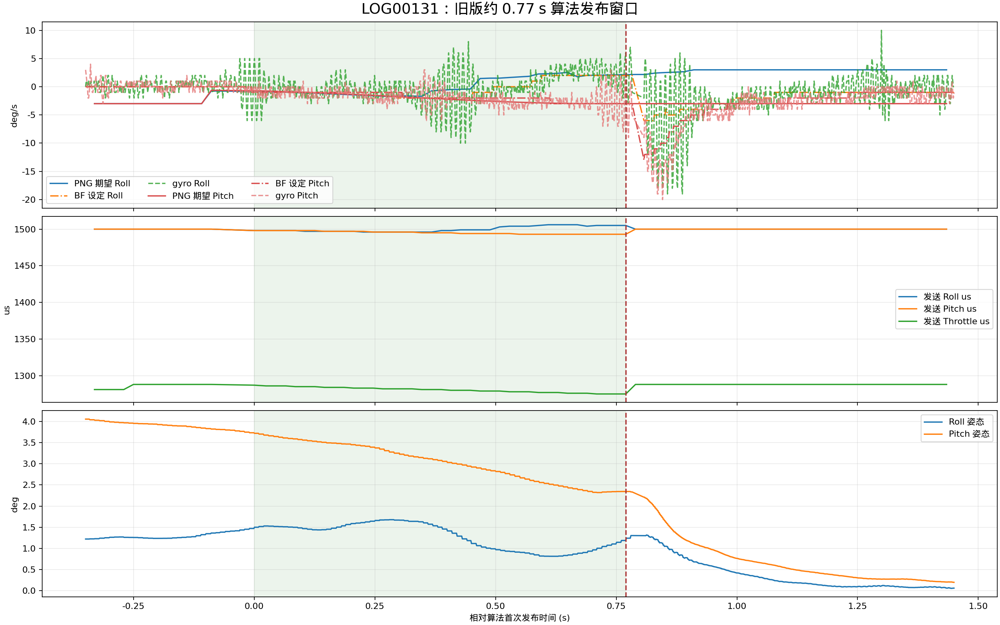
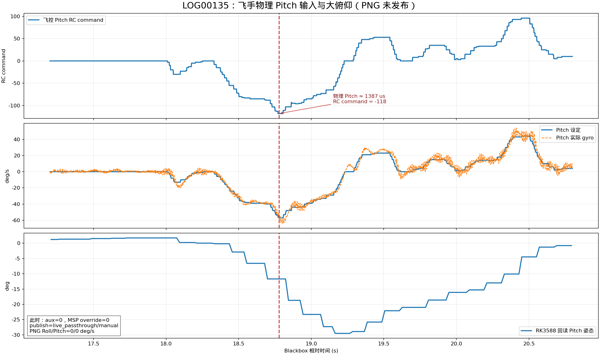

# Betaflight 2026-09-05 外场全架次与翻转事故分析

## 1. 结论

今天导入的 `LOG00127.BFL` 至 `LOG00135.BFL` 中，能够与“切换后立即翻转”现场描述唯一
对应的是 `LOG00128.BFL`。事故输入起点为 Blackbox 相对时间 `140.661378 s`，即
`2026-09-05 18:36:20.959 +0800` 左右。

本次事故**不是 PNG 比例导引指令造成的**。对应的 RK3588 元数据明确记录：

- 配置文件为 `config/betaflight.rk3588.velocity_png.flight_contact_supervised.json`；
- `control_mode=log_only`；
- `allow_control=false`；
- 全程 `publish=disabled`；
- `MSP_SET_RAW_RC` 尝试数和成功数均为 `0`。

但 Betaflight 当时仍配置了 `msp_override_channels_mask=15`。飞手拨入 RC7 后，飞控启用了
MSP OVERRIDE，四个受管通道却没有收到任何有效预填控制帧。RK3588 随后从 `MSP_RC` 读到
CH1--CH4 全部为 `885 us`；Blackbox 同时记录到飞控有效命令突变为：

```text
Roll=-500, Pitch=-500, Yaw=+500, Throttle -> 1000
```

这组满量程组合先于角速度和碰撞出现，是翻转的直接原因。飞控在输入突变后约
`1.263 ms` 就出现电机 `2047 raw` 饱和，约 `44.823 ms` 后实际角速度超过
`200 deg/s`，随后完成快速翻转并发生撞击。峰值达到：

- 最大角速度：Roll `935 deg/s`、Pitch `1005 deg/s`、Yaw `972 deg/s`；
- 最大电流：`76.96 A`；
- 最大比力：`14.82 g`；
- 电机边界：`158/2047 raw`。

因此，“允许接触版本一切换就反转”的准确描述应修正为：**接触配置以 LOG_ONLY 运行时，
RC7 激活了飞控侧四通道 MSP Override；由于 LOG_ONLY 按设计不发送控制帧，飞控使用无效的
885 us override 通道值并翻转。此次没有执行接触版 PNG 主动控制。**

`LOG00135` 另有一次大俯仰：Pitch 从接近水平发展到约 `-29.6 deg`。该动作前飞控已收到
Pitch `rcCommand=-118`、Pitch setpoint `-57 deg/s`，实际 Pitch gyro 最低
`-64 deg/s`。补回的 RK3588 日志确认对应时刻 `aux_enabled=0`、
`msp_override_active=0`、`publish=live_passthrough/manual`，物理 Pitch 通道从约 `1415 us`
下降到 `1387 us`，算法 Roll/Pitch 设定均为零。因此这次大俯仰来自飞手物理 Pitch 输入，
不是 PNG；飞机随后恢复且没有电机饱和，也不是 `LOG00128` 的同类事故。

当前结论是 **NO-GO**：接触配置、非接触配置和旧版主动配置均不得继续带桨接管。首先必须修复
LOG_ONLY 与 MSP Override 的互斥条件、验证无有效 MSP 帧时的飞控行为，并完成事故后硬件检查。

## 2. 数据范围与可信度

Blackbox 使用以下固件和解码条件：

|项目|值|
|---|---|
|飞控|MICOAIR743V2 / STM32H743|
|固件|Betaflight `2025.12.2` custom|
|解码器 commit|`f832acf9cd9dbe5ad8220de1a5f4eb4021523d72`|
|解码方式|`--unit-rotation raw --merge-gps --save-headers`|
|采样率|约 `792 Hz`|
|坏帧|9 个文件均为 0|
|日志缺循环|约 74.5%，来自四分之一循环记录配置，不是文件损坏|

当前定制固件的 Blackbox gyro raw 数值可按 `deg/s` 解释。定制固件的 mode bit 枚举与上游
`blackbox_decode` 文本标签不一致，因此报告不使用 `ANGLE_MODE/HORIZON_MODE` 文本直接判定
飞行模式；有主机日志时，以 MSP `mode_flags`、`aux_enabled` 和 `msp_override_active` 为准。
Blackbox `imuQuaternion[0..2]` 是省略正 `w` 分量并以 `32767` 缩放的 `x/y/z`。报告中的姿态按
该固件源码约定重建，并以同期 MSP 姿态回读交叉检查。

从 `orangepi5max`（RK3588 OPi 5 Max，`192.168.124.42`）补回日志后，今天的主要
Blackbox 均有 RK3588 主机记录可配对：

|Blackbox|RK3588 日志|证据用途|
|---|---|---|
|`LOG00127/128`|`CONTACT_LOG_ONLY_20260905_183304...csv`、`CONTACT_LOG_ONLY_RETEST_20260905_183540...csv`|覆盖接触 LOG_ONLY 两次运行，并确定事故时零发布及 885 us 通道突变|
|`LOG00129/130`|`OUTDOOR_ACTIVE_1S_BASELINE_20260905_184318...csv`|目标 watchdog 拒绝，无算法发布|
|`LOG00131`|`OUTDOOR_ACTIVE_1S_RETEST_20260905_184559...csv`|约 0.77 s 旧版算法发布|
|`LOG00132`|`OUTDOOR_ACTIVE_1S_RETEST2_20260905_184740...csv`|约 0.12 s 旧版算法发布|
|`LOG00133`|`OUTDOOR_ACTIVE_1S_RETEST3_20260905_184842...csv`|约 0.08 s 旧版算法发布；主机进程未写 final completion/manifest|
|`LOG00134`|`OUTDOOR_ACTIVE_1S_RETEST4_20260905_185134...csv`|约 0.91 s 旧版算法发布并触发时长联锁|
|`LOG00135`|`OUTDOOR_ACTIVE_1S_REPEAT_20260905_185527...csv`|目标 watchdog 拒绝；确认大俯仰为物理 Pitch 输入|

`LOG00130--135` 的油门序列对齐相关系数为 `0.99397--0.99776`，持续时间误差均低于
`0.30 s`，足以标注主机发布窗口。本机仍没有 2026-09-05 靶机 ULog，因此本报告不计算
双机相对距离、脱靶距离或当日命中率。

## 3. 全架次筛查

|日志|本地起始时间|时长|最大比力|最大电流|最大角速度|最大电机 raw|GPS星数/最大速度|判断|
|---|---|---:|---:|---:|---:|---:|---:|---|
|`LOG00127`|18:33:58.925|0.428 s|1.00 g|2.03 A|1 deg/s|168|21 / 0.06 m/s|短 ARM/日志起点，无飞行动作|
|`LOG00128`|18:34:00.298|141.481 s|14.82 g|76.96 A|1005 deg/s|2047|25 / 4.41 m/s|主事故；RC7 后四通道无效 override 导致翻转|
|`LOG00129`|18:44:23.517|0.420 s|1.01 g|1.21 A|1 deg/s|193|24 / 0.08 m/s|短 ARM/日志起点，无飞行动作|
|`LOG00130`|18:44:25.924|46.444 s|5.17 g|32.98 A|179 deg/s|2047|26 / 3.99 m/s|末端低油门地面接触，非接管期满量程输入|
|`LOG00131`|18:46:05.630|32.204 s|3.20 g|21.11 A|66 deg/s|1234|27 / 3.75 m/s|唯一完整主机配对的旧版短接管|
|`LOG00132`|18:47:48.442|32.181 s|1.85 g|17.78 A|64 deg/s|864|28 / 2.55 m/s|无电机饱和，末端正常落地量级|
|`LOG00133`|18:48:47.092|29.280 s|4.17 g|20.47 A|79 deg/s|2047|28 / 2.13 m/s|末端低油门地面接触，瞬时电机边界响应|
|`LOG00134`|18:51:45.409|30.315 s|1.97 g|16.56 A|108 deg/s|1292|27 / 3.04 m/s|无电机饱和，末端落地冲击|
|`LOG00135`|18:55:52.918|31.415 s|2.45 g|16.34 A|64 deg/s|1043|28 / 4.23 m/s|物理 Pitch 输入造成约 -29.6 deg 大俯仰，随后恢复|



除 `LOG00128` 外，没有任何架次出现三轴 RC command 同时满量程、角速度超过
`200 deg/s` 和 `>10 g` 冲击的组合。`LOG00130`、`LOG00133` 的电机 `2047` 均发生在
日志末端且油门已降到接近最低：

- `LOG00130` 首次饱和时 Throttle command 约 `1002`，随后才出现 `5.17 g` 冲击；
- `LOG00133` 首次饱和时 Throttle command 约 `1124`，同时已有地面接触角速度扰动；
- 两者都没有 `+/-500` 的 RC 轴输入，也没有超过 `200 deg/s` 的翻转角速度。

这两次属于落地/接触后 Betaflight PID 的短时电机边界响应，不能归为 PNG 主动控制饱和。

## 4. LOG00128 事故链

### 4.1 飞控高频时间线

以四通道异常首次出现的 `140.661378 s` 为 `t=0`：

|相对时间|Blackbox 事件|解释|
|---:|---|---|
|`-1.262 ms`|RC `0/0/0/1240`，姿态约 Roll `0.7 deg`、Pitch `-2.6 deg`|飞机仍正常|
|`0 ms`|RC 变为 `-500/-500/+500/1226`|四个 override 通道开始失效；油门滤波正向 1000 下降|
|`+1.263 ms`|至少一个电机达到 `2047 raw`，另一个为 `158 raw`|PID 直接响应满量程三轴命令，尚非撞击恢复|
|`+6.314 ms`|电流首次超过 `30 A`|动力输出已经异常|
|约 `+12.6 ms`|setpoint 达到 `-667/-667/+667 deg/s`|Rate 输入完全建立|
|`+42.298 ms`|比力首次超过 `2 g`|快速姿态运动/接触开始|
|`+44.823 ms`|任一实际角速度首次超过 `200 deg/s`|进入不可人工恢复的高速翻转|
|`+45.454 ms`|电流峰值 `76.96 A`|异常动力峰值|
|`+66.918 ms`|比力首次超过 `3 g`|强冲击|
|`+303.025 ms`|飞行模式位变化|发生在失控以后，不能作为事故首因|
|`+816.271 ms`|比力峰值 `14.82 g`|最终撞击/弹跳|



关键的因果顺序为：

```text
RC7 拨入
  -> MSP OVERRIDE 生效
  -> 四个有效通道变为 885 us
  -> 飞控 RC command 三轴满量程
  -> 电机差速立即饱和
  -> 实际角速度快速增长
  -> 翻转与撞击
```

并不是“先撞击，飞控再把电机打满”。电机边界比首次 `>2 g` 早约 `41 ms`，且 setpoint
来自明确的极值 RC command。

### 4.2 RK3588 交叉证据

RK3588 在运行相对时间 `40.539260 s` 首次读到：

```text
rc_in_ch1..4 = 885 / 885 / 885 / 885 us
aux_enabled  = 1
```

其上一帧仍为约 `1500/1500/1500/1279 us`。主机在 `40.659631 s` 才从较低频率的状态轮询
观察到 `msp_override_active=1`，该约 `120 ms` 差值是主机观测延迟，不代表飞控延迟启用；
Blackbox 已证明飞控通道在更早时刻直接变化。



事故时：

- `rxSignalReceived=1`；
- `rxFlightChannelsValid=1`；
- `failsafePhase=IDLE`；
- 配置中 `msp_override_failsafe=OFF`。

这说明接收机链路本身没有被 Betaflight 判定为失联。885 us 是 MSP Override 生效后的有效
通道来源异常，而不是普通 RXLOSS，所以常规接收机 failsafe 没有阻止这组命令。

主机日志中的 `rc_raw_ch1..4=1500/1500/1200/1500` 只是本地候选 RC 对象；由于
`allow_control=false`，它从未发送。事故不能归因于这组值。

### 4.3 PNG 候选量与实际输出

事故前 0.5 s，接触控制器在 LOG_ONLY 中计算的候选量已经接近或达到：

- Roll rate `49.95--60.0 deg/s`；
- Pitch rate 恒为 `60.0 deg/s`；
- 候选油门约 `1358.8--1368.4 us`。

这些值同样**没有发送**。它们与 Blackbox 实际收到的 `-667/-667/+667 deg/s` 在幅值和方向
上均不相符，因此不是此次翻转的输入源。不过双轴候选很早达到 `60 deg/s` 上限，说明该接触
控制器即使修复接管链，也不能仅凭这次 LOG_ONLY 数据批准带桨运行。

两次接触 LOG_ONLY 运行的视觉链统计如下：

|指标|首次运行 `183304`|事故重测 `183540`|
|---|---:|---:|
|运行时长|`120.06 s`|`51.60 s`|
|主循环全部行 confirmed 比例|`32.60%`|`44.10%`|
|新感知结果 confirmed 比例|`41.91%`|`61.00%`|
|新结果年龄 P50/P95/max|`42.45/77.37/144.10 ms`|`46.11/80.89/104.65 ms`|
|tracker switch|`9`|`8`|
|tracker fragment|`4`|`1`|

两次运行的 P95 结果年龄低于 `100 ms`，但均发生多次 ID 切换。由于没有人工标注“目标实际
可见区间”，全程 confirmed 比例不能直接当成检测召回率，也不能用来证明 `>=95%` 可见段门槛；
这些数据只能说明当日视觉链没有形成足够稳定的主动接触批准证据。

## 5. 旧版主动运行的全部配对结果

补回主机日志后，六次旧版主动运行可归纳如下。表中的“算法发布”从
`publish_mode=algorithm` 开始计至 Safety 离开 `ACTIVE`；`LOG00130/135` 虽然观察到 RC7
请求，但在算法发布前即被 watchdog 拒绝。

|Blackbox|配对相关系数|算法发布|结束原因|结论|
|---|---:|---:|---|---|
|`LOG00130`|`0.99628`|`0 s`|`watchdog_expired`|没有发布 PNG，随后恢复人工侧|
|`LOG00131`|`0.99397`|`0.770 s`|`aux_disabled`|小幅指令方向正确，无饱和|
|`LOG00132`|`0.99451`|`0.122 s`|`aux_disabled`|过短；退出附近飞行模式位改变，不能用于动态增益判断|
|`LOG00133`|`0.99408`|`0.084 s`|`aux_disabled`|过短且感知陈旧；主机 final summary 缺失|
|`LOG00134`|`0.99776`|`0.909 s`|`takeover_duration_interlock`|最长有效发布，方向正确，无电机饱和|
|`LOG00135`|`0.99716`|`0 s`|`watchdog_expired`|没有发布 PNG；后续大俯仰为飞手输入|

### 5.1 LOG00131 短接管

`LOG00131` 与 `OUTDOOR_ACTIVE_1S_RETEST_20260905_184559` 的油门对齐相关系数为
`0.99397`，主机相对 Blackbox 偏移为 `5.904001 s`，可以唯一配对。

算法实际发布窗口为主机 `20.618929--21.388681 s`，跨度 `0.769752 s`、39 行。退出原因为
`aux_disabled`。本架次运行的是 commit `69ff8cfd...` 的旧版 `flight_active_1s`，不是当天新建
的接触主动控制器；其加速度上限为 `1 m/s2`，Roll/Pitch 上限约 `3 deg/s`。

|量|Roll|Pitch|
|---|---:|---:|
|PNG 期望范围|`-1.75--+2.53 deg/s`|`-3.00---0.71 deg/s`|
|Betaflight setpoint|`-2--+2 deg/s`|`-3---1 deg/s`|
|实际 gyro|`-10--+8 deg/s`|`-8--+3 deg/s`|

发送通道范围为：

```text
Roll     1496--1506 us
Pitch    1493--1498 us
Throttle 1275--1287 us
Yaw      1500 us
```

接管期间四电机为 `486--745 raw`，最大电机差 `259 raw`，没有 `158/2047` 饱和。Pitch 姿态
从约 `3.72 deg` 变到 `2.34 deg`，与负 Pitch rate 指令方向一致；Roll 姿态基本没有净变化。
这组数据证明旧版短接管没有命令即时反转，也没有轴向符号反转。



接管期 MSP 发送均值约 `49.81 Hz`，P99.9/最大间隔约 `22.71/22.71 ms`，写入错误为 0；串口
发布不是本架次问题。接管窗口 tracker、guidance 和 kinematics 均为 100% 有效，但感知结果
年龄 P95 为 `141.05 ms`、最大 `175.03 ms`，超过 `100 ms` 目标。由于指令幅值很小且 gyro
噪声占比较高，本架次适合证明“没有反向和饱和”，不适合重新估计高带宽 PID 增益。

### 5.2 LOG00132/133 短脉冲

两次发布分别只有约 `0.122 s` 和 `0.084 s`。RK3588 实际发送的姿态通道都接近中位：

|日志|Roll/Pitch 发送|油门发送|发布期感知年龄 P95|
|---|---|---:|---:|
|`LOG00132`|`1502--1507 / 1502--1505 us`|`1285--1287 us`|`124.27 ms`|
|`LOG00133`|`1494--1498 / 1498--1500 us`|`1284 us`|`266.06 ms`|

`LOG00132/133` 的 Blackbox 在退出附近出现了与 RC command 不一致的较大姿态 setpoint，同时
飞行模式位发生变化；这属于飞控模式切换/恢复段，不是 RK3588 发送了大杆量。两次均无电机
饱和，但时间太短、模式不纯且感知年龄超标，不能用于判定 PNG 的动态响应或批准主动控制。

### 5.3 LOG00134 最长发布

`LOG00134` 是今天最完整的旧版主动窗口。算法发布约 `0.909 s`，随后按配置触发
`takeover_duration_interlock`。实际发送范围为：

```text
Roll     1498--1507 us
Pitch    1502--1507 us
Throttle 1275--1288 us
Yaw      1500 us
```

对应 Blackbox Roll/Pitch setpoint 约 `-1--+3 / +1--+3 deg/s`，实际 gyro 约
`-10--+10 / -4--+8 deg/s`；四电机为 `478--794 raw`，没有饱和。该架次证明旧版小权限
控制链方向和幅值基本正确，但感知年龄 P95 为 `154.89 ms`，仍超过 `100 ms` 门槛。

退出联锁后，`release_hold` 持续到飞手物理解除 RC7；在这段时间中飞手并非立即获得实时四轴
控制。它没有造成今天的 `LOG00128` 事故，但属于旧版发布语义的残余风险，不能作为新版主动
配置的放行依据。

## 6. LOG00135 大俯仰事件

`LOG00135` 在 `18.778256 s` 收到 Pitch `rcCommand=-118`，形成 Pitch setpoint
`-57 deg/s`；实际 gyro 在约 `21.5 ms` 后达到 `-64 deg/s`。Pitch 姿态由
`18.3 s` 附近的 `+0.06 deg` 变到 `19.232941 s` 的 `-29.62 deg`，随后恢复到接近水平。



配对偏移为主机减 Blackbox `24.585741 s`，油门对齐相关系数 `0.99716`。大俯仰输入起点
对应主机约 `43.364 s`，主机同时记录：

```text
aux_enabled=0
msp_override_active=0
publish_mode=live_passthrough
publish_reason=manual
physical Pitch=1387 us
algorithm Roll/Pitch rate=0/0 deg/s
```

这次事件没有电机饱和，最大电流只有 `16.34 A`，最终 `2.45 g` 落地冲击发生在约
`31.272 s`，比大俯仰晚约 12 s。因此：

- 它不是 `LOG00128` 的同类瞬时四通道故障；
- 它不是 `+/-3 deg/s` 有界 PNG 算法输出；
- 它由飞手物理 Pitch 输入驱动，passthrough 只复制该物理输入；
- 它不能用于判断 PNG Pitch 符号或控制增益。

## 7. 根因与非根因

### 7.1 直接根因

`msp_override_channels_mask=15` 与 LOG_ONLY 的零发送语义不兼容。RC7 激活飞控侧 override 后，
Betaflight 使用了未有效预填的四通道值；这组值是 885 us，并被解释为满量程姿态命令。

### 7.2 促成因素

1. LOG_ONLY 运行时保留了飞控 `mask=15` 和 AUX mode 50 的可激活状态。
2. LOG_ONLY 为保证“不发控制”而没有预填 `MSP_SET_RAW_RC`，但现场仍拨入了 RC7。
3. `msp_override_failsafe=OFF`，override 源异常没有进入飞控 failsafe。
4. Blackbox 中 RX 有效位保持为 1，普通 RXLOSS 保护没有触发。
5. 主机在 override 生效后把缓存的 manual RC 视为 fresh，网页不能可靠提示当前有效通道已是
   885 us；这是遥测语义缺陷，不是事故输入本身。

### 7.3 已排除的首因

- **PNG Roll/Pitch 符号反向**：事故时 PNG 没有发送，且实际极值远超候选上限。
- **目标丢失后盲推**：目标丢失发生在翻转开始以后；主机输出始终 disabled。
- **MSP 串口卡顿**：没有执行 MSP RC 写入；串口延迟无法生成三轴满量程值。
- **GPS/NED 方向错误**：飞控 Rate 输入在 GPS 之外已直接异常。
- **碰撞后的 Betaflight 恢复动作**：电机饱和比明显冲击和大角速度更早。
- **USB 功率不足**：这是 6S 带桨飞行，异常来自明确的飞控通道值。

## 8. 放行结论与整改顺序

### P0：再次上桨前

1. 对 `LOG00128` 后的机架、桨叶、电机轴承、电机固定、ESC、焊点、电池和电源线做硬件检查；
   受过 `14.82 g/76.96 A` 冲击的桨叶不得继续使用。
2. LOG_ONLY 必须满足以下二选一：
   - 飞控 `msp_override_channels_mask=0`，并禁用 AUX mode 50；
   - 保持 mask 但物理上禁止 RC7 进入 override 区间。
3. 运行入口增加硬门控：`allow_control=false` 时若快照仍声明可激活 MSP Override，应拒绝 ARM
   科目或显示不可忽略的红色故障，而不是仅显示 `publish=disabled`。
4. 修复 `physical_rc_fresh` 语义：override 生效后不能因为存在旧 manual cache 就把 885 us
   有效通道显示为 fresh。
5. 拆桨验证三种故障：启动前拨 RC7、运行中停止进程、MSP 帧超时；任何一种都不得产生
   885 us 或三轴满量程命令。

### P1：主动控制前

1. 主动配置只有在 live passthrough 已持续预填有效 RC 帧、飞控回读通道正常、批准哈希匹配后，
   才允许 RC7 拨入。
2. 验证 RC7 退出与 ANGLE/救援联锁：200 ms 内必须解除物理 override，不能只改变飞行模式。
3. 接触控制器需解决双轴 `60 deg/s` 候选过早饱和、tracker 8 次切换和 confirmed 比例不足；本次
   LOG_ONLY 不能作为接触主动批准证据。
4. 修复 `LOG00133` 异常结束时没有 final completion/runtime manifest 的日志完整性问题；其他
   架次虽然已经配对，也不能替代新版控制器重新验证。

## 9. 当前可以证明与不能证明的内容

可以证明：

- `LOG00128` 的翻转由 RC7 后四通道 override 变成 885 us 触发；
- 事故时接触版 PNG 处于 LOG_ONLY，未发送任何 MSP RC；
- 旧版共有四次算法发布，其中 `LOG00131/134` 的约 0.77/0.91 s 窗口没有符号反向、电机饱和
  或串口发送失败；`LOG00132/133` 过短且受模式切换/感知陈旧污染；
- `LOG00130/133` 的满电机事件位于低油门末端接触段，不是三轴满杆事故；
- `LOG00135` 的大俯仰来自飞手物理 Pitch 输入，且不属于旧版 PNG 的 `+/-3 deg/s` 输出范围。

不能证明：

- 当天接触版 PNG 已完成主动飞行验证；事实上它从未在 `LOG00128` 中发布控制；
- 接触或非接触版本达到 80% 真实命中率；
- 当天双机相对轨迹与脱靶距离；缺少靶机 ULog 和共同时间锚点。

## 10. 文件索引

- 机器可读指标：
  [`BETAFLIGHT_20260905_OUTDOOR_INCIDENT_metrics.json`](evidence/BETAFLIGHT_20260905_OUTDOOR_INCIDENT_metrics.json)
- 全架次图：
  [`blackbox_all_flights_overview.png`](figures/betaflight_20260905_outdoor/blackbox_all_flights_overview.png)
- 主事故高频图：
  [`log00128_incident_timeline.png`](figures/betaflight_20260905_outdoor/log00128_incident_timeline.png)
- LOG_ONLY 主机交叉图：
  [`log00128_host_log_only_crosscheck.png`](figures/betaflight_20260905_outdoor/log00128_host_log_only_crosscheck.png)
- 旧版配对接管图：
  [`log00131_paired_algorithm_window.png`](figures/betaflight_20260905_outdoor/log00131_paired_algorithm_window.png)
- LOG00135 大俯仰图：
  [`log00135_pitch_event.png`](figures/betaflight_20260905_outdoor/log00135_pitch_event.png)
- 原始 Blackbox：`logs/blackbox_import/LOG00127.BFL` 至 `LOG00135.BFL`
- 解码文件：`logs/analysis/BETAFLIGHT_20260905_BLACKBOX_DECODE/`
- 主事故 RK3588 日志：`logs/contact_log_only/CONTACT_LOG_ONLY_RETEST_20260905_183540_*`
- 接触版两次 RK3588 日志：`logs/contact_log_only/CONTACT_LOG_ONLY*_20260905_*`
- 旧版全部 RK3588 日志：`logs/flight_active_legacy_retest/OUTDOOR_ACTIVE_1S*_20260905_*`
- 新增配对分析：`logs/analysis/BETAFLIGHT_20260905_HOST_PAIRING/`
