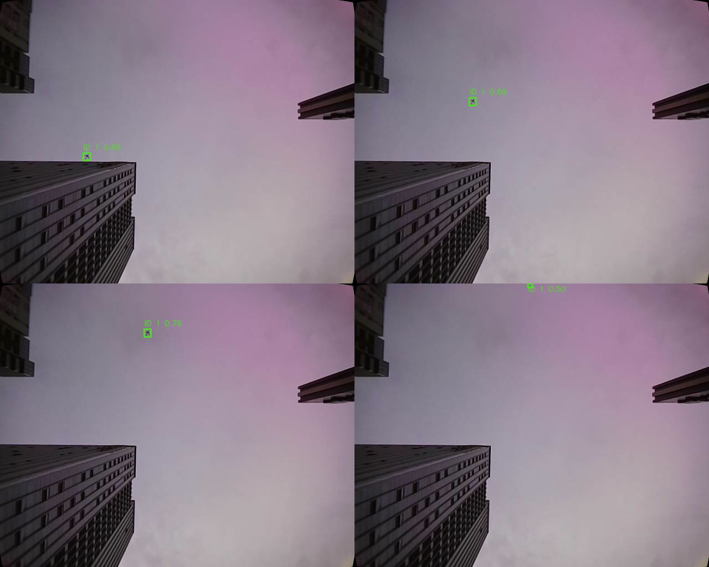

# Betaflight F00 室外天空负样本分析（2026-09-01）

## 1. 试验目的与边界

本报告汇总 2026-09-01 的三次 `F00_SKY_GROUND` 地面采集，验证上视相机在真实天空、云层和建筑
边缘背景下的 YOLO+ByteTrack 假轨迹、时延及安全链路。飞机拆桨、`DISARM`、RC7 人工侧，程序
使用 `log_only`，未授权或发送 MSP RC 控制。现场没有目标无人机；第三次运行中的移动目标由操作
者人工确认为天空中的飞机。

本试验只能评价地面天空负样本和感知链路，不能证明悬停状态、双机跟踪、TTC 精度或 PNG 闭环
拦截能力。

## 2. 固定配置

| 项目 | 实际值 |
| --- | --- |
| Betaflight | 2025.12.2，MSP API 1.47 |
| 输入图像 | 640x512，上视相机；采集请求 1280x1024 MJPG/180 FPS |
| 推理模型 | `drone_v8n_v21_kd_relu_lambda008_640_640-rk3588.rknn` |
| 模型 SHA256 | `ad905c19e3e2b5386fa1a5d562285a02d89ce2f1d344810c60f59` |
| 运行配置 SHA256 | `259f9793fb4c74750275595ced8a07ff33986de3b0044d0cce9158c9dec50a99` |
| 检测阈值 | RKNN 前置 `0.05`；最终/跟踪高阈值 `0.25`；IoU `0.70` |
| ByteTrack | 30 Hz，确认 3 帧，buffer 15 帧（0.5 s），Ultralytics 8.4.71 vendored |
| 时间戳 | `capture_return_monotonic`，不是硬件曝光时间 |
| 外参状态 | 本报告采集时为`verified=false`、光轴误差90 deg；后续2026-09-02专项复验已关闭此项 |

三次运行的配置和模型哈希一致，可以直接比较。

## 3. 指标结果

仅统计 `perception_new_result=1`，避免把 50 Hz 主循环保持行重复计数。

| RUN_ID | 时长 / 新结果 | 有原始候选的结果 | tracked / confirmed | guidance / SP valid | 结果年龄 P95 / max | 结论 |
| --- | ---: | ---: | ---: | ---: | ---: | --- |
| `F00_SKY_GROUND_20260901_141859` | 239.864 s / 6708 | 340 | 272 / 256 | 81 / 81 | 46.55 / 119.16 ms | 出现持续移动小目标；无录像，类别不能追溯确认 |
| `F00_SKY_REVIEW_20260901_143149` | 239.974 s / 6447 | 6 | 0 / 0 | 0 / 0 | 47.12 / 60.86 ms | 瞬时小黑点被 ByteTrack 拒绝 |
| `F00_SKY_CONTINUE_20260901_144608` | 174.457 s / 4599 | 337 | 315 / 300 | 73 / 73 | 50.54 / 96.59 ms | 操作者确认目标为真实飞机 |

三次共记录 32,465 行主循环数据、17,754 个新感知结果和约 654.3 s。各次感知结果年龄 P95 均
小于 51 ms，没有 RKNN worker 错误。

### 3.1 首次未录像事件

`track_id=2` 在 `elapsed=162.211-171.846 s` 出现，中间有一次短暂失去确认；两个 confirmed 段
分别为 3.292 s 和 6.203 s。分数范围为 0.314-0.763，面积比为
`0.000223-0.000360`，目标框由约 `[134,254,143,264]` 向画面顶部移动。该轨迹形态与后续飞机
事件相似，但由于没有连接 MJPEG 客户端，未保存图像，不能事后直接标注为飞机。

### 3.2 录像复测与瞬时目标

第二次运行完成一次约 72 deg 航向变化。没有 tracked、confirmed、guidance 或 SP valid 结果。
`elapsed=212.677 s` 附近出现一个单帧小黑点，原始最高分 0.314；连续放大帧显示目标快速出现后
消失，ByteTrack 未建立轨迹，时序门控行为符合预期。

### 3.3 飞机事件

第三次运行在机体静止、航向约 358 deg 时发现移动目标。同一 `track_id=1` 从
`elapsed=70.361 s` 持续到 `83.489 s`，事件跨度 13.128 s，中间有约 0.252 s 未确认间隔，未
发生 ID switch。目标框从 `[149.7,276.3,163.0,288.7]` 移到
`[312.7,-0.1,320.8,7.1]`，分数 0.50-0.763，面积比
`0.000176-0.000617`。录像中的目标沿稳定轨迹穿过天空，操作者现场确认其为飞机。

绿色框是程序实时预览叠加。该证据说明检测不是建筑边缘或静态天空纹理造成，但也说明当前单类
`UAV` 模型会把非目标航空器送入 confirmed 和制导评估链路。

## 4. 安全与数据完整性

三次运行均满足：

- `armed` 真值行数为 0，`msp_override_active` 真值行数为 0；
- `MSP_SET_RAW_RC` attempt、write、success 和 ACK 最大值均为 0；
- `publish=disabled`，没有任何指令作用于 Betaflight；
- 三份无桨日志审计均 `passed=true`、`violations=[]`；
- 第三次录像记录 1215 帧，网页预览无丢帧，MSP parser/checksum 无错误。

日志中的 154 个 `guidance_valid/sp_valid` 是离线算法候选，不代表飞控收到控制。该日志采集时外参
仍未验证，因此这些历史候选只能用于确认“检测进入了制导链路”，不能用后续外参结论追溯性地
确认本轮方向正确。

## 5. 判定

| 门禁 | 判定 | 依据 |
| --- | --- | --- |
| LOG_ONLY 安全与日志完整性 | 通过 | 三次零 RC 写入、零接管、审计无违规 |
| 静态天空/建筑背景稳定性 | 当前样本通过 | 录像复测无持续静态背景轨迹 |
| 瞬时小目标时序拒绝 | 通过 | 第二次运行 6 个候选结果均未形成 track |
| 非目标航空器类别抑制 | 未通过 | 飞机形成 13.128 s confirmed 事件和 73 个有效制导候选 |
| 四次航向覆盖 | 未完成 | 已明确记录的复测仅完成一次约 72 deg 转向 |
| 主动控制放行 | 未通过 | 当时外参未验证，且非目标航空器可进入制导链路；后续只关闭了外参项 |

因此可按操作者口径记录为 **F00-A 静态背景子项通过**；按当前测试卡“所有进入画面的非目标物均
应被拒绝”的严格门禁，完整 `F00_SKY_NEGATIVE` 尚未关闭。`release_passed` 必须保持 `false`。

## 6. 后续处理

1. 保留飞机样本作为困难负样本，不直接使用最小面积阈值处理；远距离真实无人机可能具有相同面积。
2. 结合 F03/F04 真实无人机数据评估类别复核、轨迹运动特征或二级分类，避免只依据当前单次事件改阈值。
3. 正式关闭 F00 前补齐其余航向和 `F00_SKY_HOVER`；室内厂房测试另标记为 `F00_FACTORY_NEGATIVE`。
4. 主动控制评审前完成显式 `R_BC` 外参验证，并重新检查所有 LOS 和输出轴符号。

## 7. 文件索引

- 首次证据包：`logs/outdoor_g00/F00_SKY_GROUND_20260901_141859_bundle.tar.gz`，SHA256
  `1a764131e5c8d2e0d76a02fcbe1735e719ef898390a6540a3a74bdb4f20dfb75`
- 录像复测包：`logs/outdoor_f00_review/F00_SKY_REVIEW_20260901_143149_bundle.tar.gz`，SHA256
  `b1185b687b7d0a03fdde0a1cfc26d9448fe8be8d0f4ab27945b9822321bc252f`
- 飞机事件包：`logs/outdoor_f00_continue/F00_SKY_CONTINUE_20260901_144608_bundle.tar.gz`，SHA256
  `ed72fce39c0a899081c47ed1cd2284e220c7e7181698583a3bd0f57c107567b2`
- 机器可读摘要：`doc/evidence/F00_SKY_GROUND_20260901_analysis.json`
