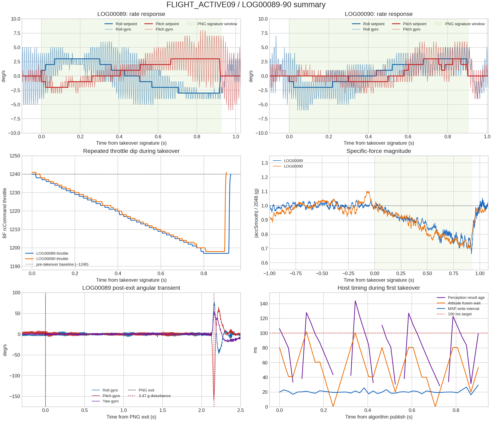

# Betaflight FLIGHT_ACTIVE09 / LOG00089-90 详细分析

## 1. 结论

两次约 `0.9 s` 的 PNG 接管均真实进入飞控、产生小幅 Roll/Pitch 角速度响应，并按超时联锁退出；
接管窗口内没有 MSP 错误、电机饱和或错误 Yaw 指令。低权限角速度链路和超时退回物理直通可判为
通过。

本次同时发现一个可重复的 P0 缺陷：两次接管的油门都从物理悬停附近下降约 `40--45` 个
Betaflight `rcCommand` 单位，并持续约 `0.74--0.76 s`。两架次比力中位分别从接管前约
`0.999/0.993 g` 降到 `0.877/0.842 g`，GPS 高度各下降约 `0.2 m`。配置期望的算法油门是
`1275 us`，与物理 `1278 us` 基本相同，因此这不是悬停油门标定误差，而是油门交接实现错误。
修复前不应继续同配置的主动飞行。

第一架次视觉跟踪稳定，但检测结果年龄 P95 为 `127.7 ms`，高于既定 `100 ms` 目标；其中姿态
融合等待 P95 为 `94.5 ms`，而 RKNN 推理 P95 仅 `6.5 ms`。当前延迟瓶颈是 10 Hz 姿态轮询及
融合等待，不是 NPU 推理。

`LOG00089` 在 PNG 退出后约 `2.157 s` 出现一次真实大扰动。扰动时 Blackbox 三轴 setpoint
严格为零、油门保持约 `1240`，主机已经处于 `passthrough`，所以不是 PNG 命令造成。事件更像
外部碰撞/接触或机体突发转动后的飞控强力恢复；没有同步视频，无法再细分物理原因。



## 2. 证据与方法

|输入|时间/时长|SHA256|
|---|---:|---|
|`logs/blackbox_import/LOG00089.BFL`|UTC `10:35:24.135`，`94.834979 s`|`16bebdf98de63051e0be8a883835c4e126056b76cea1e393a3203a4964163127`|
|`logs/blackbox_import/LOG00090.BFL`|UTC `10:37:02.463`，`94.953346 s`|`09d63f25ceb8cd4f1c939fce4b84e8c78f0acf1300074c2dc6573daa33425bff`|
|`logs/flight_active_09/FLIGHT_ACTIVE09_20260903_183501_20260903_183502.csv`|完整行到 `96.505095 s`|`9e4073ac5f96761f26a7760349140dbb97e36b92ea87fe4cadca7c1cf99d654f`|
|同名前缀 `_meta.json`|配置快照|`378b824ed3d46ae13bbbbcf35ad5e61d05d66c3e27926783fd0ed9cd064b09a6`|

两份 BFL 均来自 `MICOAIR743V2 / Betaflight 2025.12.2`，`acc_1G=2048`，Rates 为
`RC Rate=1.0 / Super=0.7 / Expo=0`。使用 Blackbox tools 提交
`f832acf9cd9dbe5ad8220de1a5f4eb4021523d72` 解码：

```bash
/tmp/betaflight-blackbox-tools/obj/blackbox_decode \
  --unit-rotation raw --unit-height m --unit-gps-speed mps \
  --merge-gps --save-headers --output-dir /tmp/blackbox_active09_raw \
  logs/blackbox_import/LOG00089.BFL logs/blackbox_import/LOG00090.BFL
```

两份文件都是 `Log clean end`，解码失败帧为零。Blackbox 四分之一记录策略造成约 74.5% PID
循环未写入，这是配置采样率，不是文件损坏。角速度按当前固件的 raw 数值直接作为 deg/s；过载按
`norm(accSmooth)/2048` 计算。

电机近似 PWM 沿用同固件 `LOG00042` 的实测拟合：

```text
MSP_motor_us ~= 0.499231573 * blackbox_motor_raw + 977.151031
```

该换算只用于可读性，判断饱和仍以 Blackbox 头中的 raw 边界 `158--2047` 为准。独立 GPS 帧的
`GPS_velned[]` 除以 100 转成 m/s，`GPS_altitude` 除以 10、`baroAlt` 除以 100 转成 m。

旧的无桨对齐工具把本次自由飞行误对齐到 `10.212 s` 并给出零 setpoint，不能用于本次结论。
本报告用主机发出的 Roll/Pitch/Throttle 联合特征直接匹配 Blackbox，得到唯一接管窗口：

|文件|Blackbox 接管特征窗口|持续时间|
|---|---:|---:|
|LOG00089|`68.755326--69.680889 s`|`0.925563 s`|
|LOG00090|`49.082339--49.987667 s`|`0.905328 s`|

## 3. 主机侧第一次接管

### 3.1 安全状态与退出

|事件|主机 elapsed|
|---|---:|
|`state=ACTIVE`，RC7 接管被识别|`90.066967 s`|
|`publish=algorithm`|`90.087051 s`|
|0.9 s 接管联锁锁存|`90.987931 s`|
|恢复 `publish=passthrough`|`91.008316 s`|
|飞手把 RC7 切回人工侧|`93.544534 s`|

联锁从识别接管到锁存共 `0.920964 s`；算法发布样本跨度 `0.900880 s`。锁存后一个约 `20 ms`
控制周期即恢复物理直通。RC7 又保持高位约 2.56 s，但这段已经不是算法发布。

算法窗口实际发送：Roll `1493--1507 us`、Pitch `1496--1507 us`、Yaw 恒为 `1500 us`；映射后
Roll/Pitch 均未超过 `+/-3 deg/s`。44/45 个算法行仍处在 `0.8 s` 入场平滑中，完整导引输出只
维持约最后 `0.1 s`，因此本次证明的是低权限链路和方向响应，不是稳态导引能力。

### 3.2 MSP 与飞控遥测

|指标|算法窗口结果|判读|
|---|---:|---|
|SET_RAW_RC 写间隔 P50/P95/P99/max|`20.03/25.22/28.42/29.67 ms`|满足 50 Hz 有界发布|
|ACK 年龄 P95/max|`13.46/13.92 ms`|正常|
|写入/请求/解析/校验错误|`0/0/0/0`|通过|
|STATUS 年龄 max|`233.8 ms`|低于 0.5 s 安全门限|
|ATTITUDE 年龄 P95/max|`113.3/131.9 ms`|偏慢，影响视觉融合|
|GPS/高度年龄 max|`233.9/235.3 ms`|低于 0.5 s 门限|
|MOTOR 年龄 max|`129.6 ms`|可用于监测，不用于快环控制|
|GPS|fix 2，25 星，HDOP raw `126--134`|原点锁定，运动学 100% 有效|
|电压/电流 MSP|`24.5--24.6 V`，中位 `4.62 A`|正常|
|I2C error count|恒为 `6`|窗口内未增长|
|RK3588 温度|最高 `49 C`|无热降频证据|

全局 SET_RAW_RC 平均约 `49.62 Hz`，无写错误；但全局 P99.9 最大间隔为 `44.056 ms`，略超过
配置中的 `40 ms` 统计目标。该尖峰不在算法窗口内，主动窗口最大仅 `29.669 ms`。

### 3.3 视觉与比例导引遥测

算法窗口有 27 个新感知结果，27 个全部 confirmed，均为 `track_id=29`；累计 switch/fragment
计数在窗口内没有增加。目标框面积比约 `0.00177--0.00201`，检测分数约 `0.763--0.826`。

|指标|结果|
|---|---:|
|感知结果年龄 P50/P95/P99/max|`98.5/127.7/139.7/143.9 ms`|
|姿态融合等待 P95/max|`94.5/101.9 ms`|
|RKNN 总耗时 P95/max|`6.52/6.77 ms`|
|相机 read P95|`9.08 ms`|
|感知 worker 中位频率|`30 Hz`|
|接管窗口新增 queue drop|`0`|

27 个新结果均能进入导引；45/45 个控制行 `guidance_valid=1`。惯性系导引经 `R_IB/R_BC` 转到
FRD 后，加速度模长始终被总上限限制为 `1.0 m/s2`。速度建立项和 FOV 项 45/45 行均饱和，PNG
项 16/45 行饱和，总和 45/45 行饱和。对应期望姿态约为 Roll `+0.19--+2.34 deg`、Pitch
`-5.42---4.85 deg`，最终角速度仍被 `3 deg/s` 限幅。

这说明完整 PNG 计算链运行了，但本段一直顶着 `1 m/s2` 上限，无法验证“误差变小时输出按比例
减小”的幅值特性，也不能据此计算真实命中率。

## 4. 两次接管的 Blackbox 响应

|指标|LOG00089|LOG00090|
|---|---:|---:|
|Roll setpoint 范围|`-3--+3 deg/s`|`-2--+3 deg/s`|
|Pitch setpoint 范围|`-2--+3 deg/s`|`-1--+3 deg/s`|
|Yaw setpoint|恒 `0`|恒 `0`|
|Roll gyro 范围|`-5--+6 deg/s`|`-6--+5 deg/s`|
|Pitch gyro 范围|`-3--+8 deg/s`|`-3--+6 deg/s`|
|Roll 相关系数/最佳滞后|`0.777 / 34 ms`|`0.756 / 30 ms`|
|Pitch 相关系数/最佳滞后|`0.762 / 9 ms`|`0.755 / 23 ms`|
|积分姿态变化 R/P/Y|`-0.134/+1.026/+0.018 deg`|`+0.321/+0.553/-0.244 deg`|
|电机极差 P95/max，近似 PWM|`52.42/69.89 us`|`52.47/66.90 us`|
|接管窗口电机 raw 饱和|`0`|`0`|
|电压最低/电流峰值|`24.33 V / 7.06 A`|`24.17 V / 8.40 A`|

两架次的角速度响应相关性和符号一致，差异主要来自指令仅 1--3 deg/s、Blackbox 整数角速度量化
以及飞行扰动。没有错误轴、Yaw 串扰命令或接管窗口内的电机饱和证据。

把视觉结果年龄与 Blackbox 角速度响应相加只能得到约 `137--162 ms` 的工程量级，不能当作严格
端到端时延，因为 `capture_return_monotonic` 不是硬件曝光时间，两个时延统计也不是同一批样本的
可直接相加分位数。

## 5. 油门交接缺陷

主机第一次接管的关键内部状态为：

```text
物理油门 source             = 1278 us
算法原始目标 rc_raw/target  = 1275 us
slew limiter 初始 rc_ch3    = 1004 us，之后每个 20 ms 周期约增加 2 us
相对油门安全带              = source +/- 40 us
交接采用的 target           = 1238 us
实际输出                    = 1278 -> 1238 us，0.8 s 线性下降
```

也就是说，交接逻辑读取了尚未从 `1000 us` 爬升到 `1275 us` 的 slew-limited mapper 状态，再被
相对油门门限钳到 `1278-40=1238 us`。它没有使用已经正确的原始算法目标 `1275 us`。Blackbox
在两架次中给出相同指纹：

|指标|LOG00089|LOG00090|
|---|---:|---:|
|接管前 throttle 中位|`1240`|`1243`|
|接管最小 throttle|`1197`|`1198`|
|下降量|`43`|`45`|
|下降至少 10 的累计时长|`740.9 ms`|`761.4 ms`|
|接管前/接管中/恢复后比力中位|`0.999/0.877/1.004 g`|`0.993/0.842/0.987 g`|
|GPS 高度变化|`-0.2 m`|`-0.2 m`|

电流也从接管前约 `5 A` 降到接管中约 `4 A`，与推力下降一致。该行为虽然被 `+/-40 us` 安全带
限制，没有造成失控，但与“接管时维持当前悬停油门”目标相反，且两架次完全复现。

修复方向应是：在接管入口用物理油门或原始算法油门初始化 throttle mapper/slew state，再执行
相对限幅和 0.8 s 交接；不能简单提高 `throttle_hover_us` 掩盖状态初始化错误。

## 6. 全程飞控遥测

|指标|LOG00089|LOG00090|
|---|---:|---:|
|独立 GPS 帧数|913|908|
|卫星数 min/median/max|`20/24/27`|`23/27/27`|
|GPS 帧间隔 P95/max|`134/605 ms`|`148/329 ms`|
|GPS 地速最大|`3.20 m/s`|`5.11 m/s`|
|电压 median/P01|`24.58/24.41 V`|`24.34/24.19 V`|
|电流 median/P95|`4.95/8.98 A`|`5.12/8.78 A`|
|日志末累计电量|`270 mAh`|`545 mAh`|
|RX 信号/飞行通道|首 1 ms 后全程有效|首 1 ms 后全程有效|
|Betaflight failsafe phase|全程 `IDLE`|全程 `IDLE`|

LOG00089 的单次 `605 ms` GPS 间隔不在第一次接管窗口；主机接管窗口 GPS age 最大仅
`233.9 ms`，运动学门控未失效。LOG00090 没有主机尾段，不能复核第二次接管的 host-side
`kinematics_valid`，但 BFL 接管窗口仍有 26--27 星及 8 个独立 GPS 帧。

Blackbox 把 flightMode flag 解码成 `ANGLE_MODE`，LOG00090 末段还出现
`ANGLE_MODE|HORIZON_MODE`。同固件以往日志已确认该 flag 定义与当前定制固件不匹配；主机主动
窗口的 MSP mode flags 为 `0x10000001`，运行时 Acro 门控已通过。因此不把 Blackbox 的文本标签
作为模式切换证据。

## 7. 接管外瞬态

### 7.1 LOG00089：接管退出后约 2.157 s

在 BFL `71.838230 s`，记录到：

```text
setpoint R/P/Y       = 0 / 0 / 0 deg/s
rcCommand R/P/Y/T    = 0 / 0 / 0 / 1240
gyro R/P/Y           = +72 / -158 / +52 deg/s
specific force       = 3.475 g
motor approximate    = 1999 / 1549 / 1916 / 1056 us
current max          = 80.64 A
voltage min          = 21.81 V
```

主机低频 MSP 在约 `93.22 s` 也记录到最大 `93.125 deg/s`、电机最大 `1518 us`、极差
`304 us`。此时 0.9 s 联锁已经锁存、`publish=passthrough`，物理 Roll/Pitch/Yaw 仍为中位；RC7
直到 `93.544534 s` 才回人工侧。Blackbox 的高分辨率数据说明先发生了机体大角速度/3.475 g
冲击，PID 随后产生满幅差速；约 0.2 s 后物理油门才升到约 `1447`。

因此可排除 PNG setpoint 和飞手姿态杆命令直接触发。剩余物理原因可能是外部接触、气动扰动或
机体姿态瞬态，日志本身不能区分。该事件应保留为恢复段风险证据，但不能并入 0.9 s PNG 响应
统计。

### 7.2 LOG00090：日志末端

`93.925589 s` 的 `73.7 A / 22.41 V / 5.919 g` 瞬态发生在 clean end 前约 `1.03 s`，同时有
Pitch `rcCommand=166` 和 `setpoint=36--38 deg/s`。它距 PNG 接管结束约 44 s，具有明确人工姿态
输入，符合末端人工恢复/触地段特征，与第二次 PNG 脉冲无因果关系。

## 8. 日志完整性

主机配置要求运行 300 s，但 CSV 只有 4789 个完整行到 `96.505095 s`，最后一行又在字符串字段
中被截断；meta 没有正常 stop/final 信息。Orange Pi 后续掉电使页缓存尾段丢失。因此：

- 第一次接管的主机视觉、MSP 和安全状态可完整分析。
- 第二次接管只能由 `LOG00090` 分析飞控命令与动力响应，不能给出对应视觉年龄、track ID、
  guidance 分量和主机 MSP 错误计数。
- 旧 audit 的 `invalid_guidance_command_frames`、`motor_telemetry_missing`、
  `web_no_telemetry_published` 和 `post_disarm_log_tail_incomplete` 受截断末行/缺少正常 footer 影响，
  不能解释为主动窗口故障。
- audit 在 `93.22 s` 报告的 `armed_motor_spread_high` 是真实事件，但位于 PNG 退出后的物理直通段。

后续日志应周期性 flush，并在落地 DISARM 后保持程序运行至少 10 s 再正常退出；避免飞行后立即
断电。

## 9. 判定与下一步

|检查项|判定|
|---|---|
|两次低权限 Roll/Pitch 命令进入 Betaflight|通过|
|角速度方向、幅值和 Yaw 中立|通过|
|接管窗口电机差速及无饱和|通过|
|单 UART 主动窗口 50 Hz 发布和 ACK|通过|
|0.9 s 联锁锁存及恢复 passthrough|通过|
|第一次接管目标跟踪连续性|通过|
|油门无跳变/保持悬停推力|失败，P0|
|视觉结果年龄 P95 `<100 ms`|失败，当前 `127.7 ms`|
|第二次接管主机遥测完整性|失败，日志尾段丢失|
|真实比例导引拦截能力/命中率|本实验不能证明|

下一次主动飞行前只需处理本次新增问题，不需要重跑已经完成的基础科目：

1. 修复接管入口 throttle mapper/slew 状态初始化，增加单元测试，确认物理 `1278 us`、算法
   `1275 us` 时交接不会向 `1238 us` 下拉。
2. 在 LOG_ONLY 或无桨模式把姿态融合等待 P95 降到 100 ms 内，优先处理 10 Hz ATTITUDE 调度，
   同时保持主动窗口 SET_RAW_RC 最大间隔不恶化。
3. 给 CSV/event/meta 增加周期 flush/结束完整性保护，避免掉电丢失第二架次遥测。
4. 三项离线/台架验证通过后，只补一次受监督 `0.9 s` 接管，核对油门、比力、感知 P95 和退出
   后 3 s 恢复段；无需重复 F00、F02 或既有轴向测试。

结构化指标见
[`FLIGHT_ACTIVE09_LOG00089_90_analysis.json`](evidence/FLIGHT_ACTIVE09_LOG00089_90_analysis.json)。
