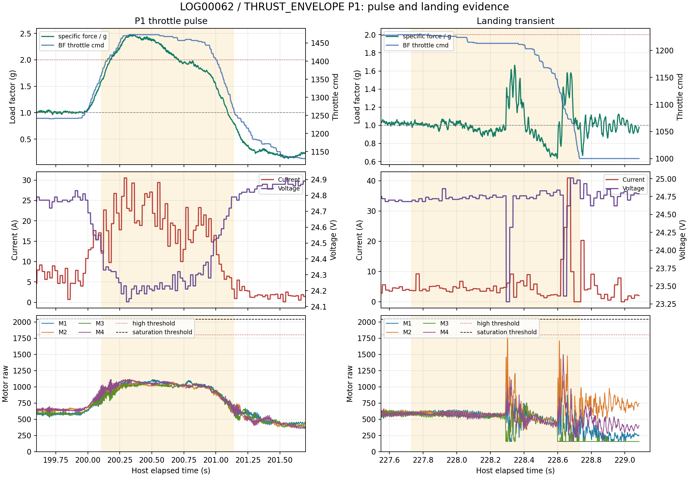

# Betaflight LOG00062 P1推力与过载分析

## 证据与方法

本次主机证据为`THRUST_ENVELOPE_20260901_164023`，飞控证据为
`logs/blackbox_import/LOG00062.BFL`。Blackbox使用`blackbox-tools`提交
`f832acf9cd9dbe5ad8220de1a5f4eb4021523d72`按`--unit-rotation raw --merge-gps`解码。
文件有效时长178.672863 s，0帧解码失败并有`Log clean end`。缺失74.51%的PID循环来自当前
Blackbox四分之一记录率，不是文件损坏。

主机ARM窗口为50.653070至229.113196 s，与Blackbox时长相差0.212737 s。油门波形拟合得到：

```text
host_elapsed_s = blackbox_elapsed_s + 50.411070
correlation = 0.999278974
RMSE = 4.601 command units
```

电压和电流与主机MSP低频样本的相关系数分别为0.9891和0.9228，确认文件配对。全程
`override_active=0`、`MSP_SET_RAW_RC write success=0`、failsafe为`IDLE`，所以所有动作均来自
飞手，Orange Pi只记录数据。

过载按固件头`acc_1G=2048`计算：

```text
n = norm(accSmooth) / 2048
```

该值是机体比力模长。机体接近水平且气动阻力可忽略时，可近似认为`T/W = n`，垂直净加速度为
`a_up = (n - 1) * g`。

实机整机起飞质量为`2.412 kg`，动力组合为`6S 10000 mAh`电池、`3115-900KV`电机和
四副10x5.0三叶桨；桨距依据实物标记`1050R`确认，`R`表示反向旋转版本。电池C数未记录；
手制ESC额定连续/峰值电流未提供，操作员暂评估其不是当前限制项。
该评估不等于ESC无电流上限，本报告仍不从器件标称参数外推满油门能力。

## P1脉冲结果

主机物理油门高于1350 us的P1窗口为200.107125至201.137818 s，共1.030693 s；1495 us以上
平台为200.308246至200.715185 s，共0.406939 s。脉冲前8秒悬停油门中位为1277 us，脉冲峰值
1500 us，因此本次实际增量约223 us，不是原计划的50 us。

|指标|脉冲窗口|1500 us平台|判读|
|---|---:|---:|---|
|物理油门中位/最大|1483/1500 us|1500/1500 us|形成清晰阶跃|
|过载中位/P95/峰值|2.021/2.446/2.476 g|2.371/2.463/2.476 g|轴2占主导|
|100/200 ms滑动峰值|2.448/2.427 g|2.447/2.424 g|不是单样本尖峰|
|超过2.0 g时长|0.531 s|0.400 s|连续段成立|
|超过2.25 g时长|0.330 s|0.277 s|短时能力成立|
|电流中位/峰值|18.85/30.52 A|20.52/29.40 A|主机1 Hz轮询低估峰值|
|最低电压/峰值功率|24.13 V/739.50 W|24.13 V/712.95 W|相对悬停中位跌落0.66 V|
|电机raw最大|1119|1119|未达到1800高值门限|
|电机饱和时长|0 s|0 s|未达到2040饱和门限|

1500 us平台的Roll为0.6至1.2度，Pitch为-1.6至-0.2度；Blackbox横向setpoint最大仅2/6度每秒，
因此2.37 g平台主要是垂向推力，不是大倾角产生的矢量混合。按平台中位计算，短时垂直净加速度
约13.45 m/s2；按200 ms滑动峰值计算约13.96 m/s2。使用`T = n * m * g`和标准重力加速度
`9.80665 m/s2`，悬停需求总推力约`23.65 N（2.412 kgf）`；1500 us平台中位的动态总推力
估计约`56.09 N（5.72 kgf）`，峰值约`58.57 N（5.97 kgf）`。若四电机平均分担，平台中位约为
`14.02 N（1.43 kgf）/电机`。这些数值由飞行中比力反推，忽略气动阻力且依赖姿态接近水平的假设，
不等同于推力台静推力。

脉冲平台四电机raw中位为`[1061,1033,1027,1062]`。沿用LOG00042同固件的换算后约为
`[1507,1493,1490,1507] us`，各电机最大约`[1533,1515,1508,1536] us`。这说明1500 us物理
油门下仍有命令余量，但电机raw、PWM近似值与实际推力不线性，不能据此外推满油门推力。

## 悬停与恢复

脉冲前8秒的比力中位为1.002 g、电流中位5.07 A、电压中位24.79 V；脉冲后延迟1秒再取8秒，
比力中位1.032 g、电流中位5.07 A、电压中位24.76 V。电压已恢复，未见持续电源下陷。悬停物理
油门中位由1277 us变为1284 us，单架次差异不足以证明电池补偿关系，可暂记悬停候选约1280 us，
不能直接写入飞行批准配置。

## 落地末端正常触地瞬态

Blackbox末端177.320至178.319 s出现与P1不同的短瞬态：最大电流40.92 A、最低电压23.28 V、
单电机最大1985 raw、电机极差最大1827 raw。电机超过1800累计1.892 ms，未达到2040饱和门限；
电流超过20 A累计39.765 ms。该事件发生在收油和DISARM前，现场已确认为正常触地后的短时姿态
修正，不定性为电机、ESC或电池故障。

该触地瞬态不单独阻断同包线重复实验，但其PID姿态修正与垂向推力实验的受力条件不同，必须从
推力曲线、过载平台和持续电流统计中排除。后续仍按正常操作落地、最低油门和DISARM，并保留
末端波形用于区分短时可解释瞬态与持续动力异常。

## 结论与限制

- P1数据质量通过：主机与Blackbox可靠配对，短时2.4 g级比力不是采样尖峰，脉冲内没有电机饱和。
- 本次证明约1500 us油门下存在约2.37 g的0.4秒平台能力，不是整机最大推力或持续过载测试。
- 不建议继续P2加油门。落地瞬态已解释，可在不超过既有1500 us上限的条件下重复两次，确认过载、
  电流和压降的重复性；任何一次出现电机高值持续、电压低于门限或姿态异常即停止。
- 已按`2.412 kg`起飞质量给出动态总推力估计；电池、ESC和电机连续电流限值仍必须与30.52 A
  实测峰值核对。
- 本架次记录了`ANGLE_MODE|HORIZON_MODE`，只支持人工推力包线结论，不校准Acro模式的
  `RC us -> body rate`映射。
- 当前`release_passed=false`保持不变。该结果不证明视觉跟踪、相机外参、比例导引、人工接管或
  双机拦截成功率，也不足以自动填写PNG的总加速度、倾角或油门上限。

## 图表与复现



结构化指标见[`LOG00062_THRUST_ENVELOPE_analysis.json`](evidence/LOG00062_THRUST_ENVELOPE_analysis.json)。
主机包SHA256为`aaeec568b8b2c893c7c53a6dba954dc5f0f9c8901bcf3127a12bee1353ffef2d`；
`LOG00062.BFL` SHA256为`601a50923a7424117158024d1012cf5cb14de8b2c572790e6e33856d5cfec46a`。

复现分析：

```bash
/tmp/betaflight-blackbox-tools/obj/blackbox_decode \
  --unit-rotation raw --merge-gps --save-headers \
  --output-dir /tmp/blackbox_log62_raw logs/blackbox_import/LOG00062.BFL

python3 tools/analyze_betaflight_blackbox_flight.py \
  --host-csv <THRUST_ENVELOPE主机CSV> \
  --blackbox-csv /tmp/blackbox_log62_raw/LOG00062.01.csv \
  --blackbox-bfl logs/blackbox_import/LOG00062.BFL \
  --decoder-commit f832acf9cd9dbe5ad8220de1a5f4eb4021523d72 \
  --motor-scale-us-per-raw 0.499231573 --motor-offset-us 977.151031 \
  --thrust-pulse-threshold-us 1350 --thrust-plateau-threshold-us 1495 \
  --acc-1g-raw 2048 --thrust-hover-window-s 8 \
  --thrust-hover-gap-s 2 --thrust-post-delay-s 1 \
  --output doc/evidence/LOG00062_THRUST_ENVELOPE_analysis.json
```
