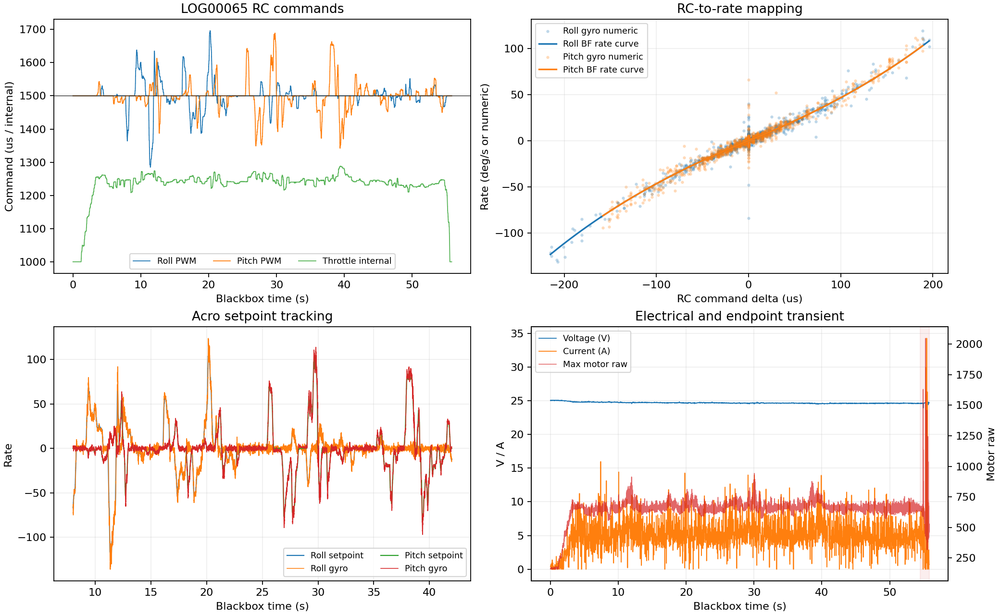

# Betaflight LOG00063--65 悬停与 Acro Rate 分析

## 1. 数据范围

2026-09-02先后执行`HOVER_THROTTLE_CONFIRM_01`和`ACRO_RATE_MAP_01`。主机始终运行
`LOG_ONLY`，`msp_override_active=0`，所有`MSP_SET_RAW_RC`发送计数和MSP请求错误均为0。

- `LOG00063.BFL`：自稳模式人工悬停确认，Blackbox 55.816 s。
- `LOG00064.BFL`：低油门ARM及模式切换，不作为飞行映射样本。
- `LOG00065.BFL`：人工Acro飞行，Blackbox 55.814 s。
- 主机配置SHA256：`259f9793fb4c74750275595ced8a07ff33986de3b0044d0cce9158c9dec50a99`。
- Blackbox解码器：`f832acf9cd9dbe5ad8220de1a5f4eb4021523d72`，旋转字段按`raw`解码。

结构化结果见[`LOG00063_65_HOVER_ACRO_analysis.json`](evidence/LOG00063_65_HOVER_ACRO_analysis.json)，
悬停通用分析见[`LOG00063_HOVER_CONFIRM_analysis.json`](evidence/LOG00063_HOVER_CONFIRM_analysis.json)。

## 2. 悬停油门

主机ARM区间56.216 s；去掉起飞后10 s和落地前5 s后，稳定窗口为41.199 s。

|指标|P10|中位|P90|
|---|---:|---:|---:|
|物理油门输入|1263 us|1275 us|1280 us|
|电池电压|24.8 V|24.8 V|24.9 V|
|电流|4.22 A|4.97 A|5.64 A|

因此`1275 us`可作为当前6S、2.412 kg、10x5.0三叶桨组合的悬停候选。Blackbox内部
`rcCommand[3]`中位为1235；这是Betaflight内部油门命令，不应替代接收机物理PWM。

LOG00063稳定段四电机raw中位为`[574,611,580,643]`，段内无饱和。末端1 s出现
`62.78 A`及两个电机raw 2047，为触地修正瞬态，从悬停拟合中排除。

## 3. Acro 模式确认

当前Rate配置由Blackbox头确认：Betaflight Rates、RC Rate=`1.00`、Expo=`0.00`、
Super Rate=`0.70`。令`x=(PWM-1500)/500`，理论小于满杆的角速度为：

```text
omega = 200*x/(1-0.70*abs(x)) deg/s
```

LOG00065的实际`setpoint`与该公式高度一致：Roll相关系数0.999600、MAE 0.454 deg/s；
Pitch相关系数0.999507、MAE 0.474 deg/s。相同计算用于自稳LOG00063时，Roll/Pitch相关系数
只有0.526/0.504且MAE均约28 deg/s。该差异从控制行为上确认LOG00065确实进入了Acro/Rate。

旧解码器仍把LOG00065标成`ANGLE_MODE`，与RC8实际位置及上述控制规律冲突，因此定制固件的
`flightModeFlags`文本标签不能作为飞行模式判据。

## 4. RC 到角速度映射

|轴|实测物理PWM范围|Betaflight setpoint范围|gyro数值范围|
|---|---:|---:|---:|
|Roll|1285--1696 us|-123--108 deg/s|-136--124|
|Pitch|1342--1689 us|-81--103 deg/s|-97--114|

在3.0--54.514 s分析段，将Blackbox gyro与setpoint按1 ms重采样并进行5 ms平滑后：

|轴|最佳滞后|相关系数|跟踪增益|拟合RMSE|
|---|---:|---:|---:|---:|
|Roll|10 ms|0.991295|1.0162|2.50|
|Pitch|11 ms|0.993427|1.0390|2.38|

`gyroADC`按raw解码后的数值与setpoint近似1:1，但旧解码器的`--unit-rotation deg/s`会输出
无效大数；本报告不使用该转换结果。当前数据已验证约Roll `[-123,108] deg/s`、Pitch
`[-81,103] deg/s`的实际Rate工作区，不能外推到未飞过的满杆667 deg/s。

将主机`MSP_RAW_IMU`与Blackbox按同一动作对齐后，X/Roll和Y/Pitch同轴同号，相关系数为
0.997133/0.997479；自由拟合比例为0.06042/0.06199，接近协议候选值`1/16=0.0625`。
固定使用`gyro_deg_s=gyro_msp_raw/16`时，Roll/Pitch RMSE为2.00/1.52 deg/s，P95绝对误差为
5.18/3.56 deg/s。该结果足以为当前飞控及固件建立显式、配置绑定的MSP gyro转换；Yaw仅有
低激励证据，不用于本轮控制标定。

## 5. 电气与日志完整性

Acro主体段电压中位24.66 V、电流中位5.07 A/P90 7.73 A/最大15.97 A，四电机raw最大
`[780,894,807,943]`，没有饱和。末端1.3 s的34.25 A和单电机2047再次属于触地瞬态，
不进入Rate拟合。

LOG00065与主机RC在共同区间的Roll/Pitch相关系数为0.999429/0.999621，合并RMSE 1.44 us，
证明日志身份和时间对齐正确。但主机CSV只覆盖Blackbox前30.212 s，后25.602 s没有主机记录；
完整动作仍由Blackbox保留。后续架次必须让runner持续到落地DISARM后至少10 s再停止，并检查
CSV末尾已记录`armed=0`。



## 6. 结论

1. 悬停物理油门候选收敛为`1275 us`，本轮无需重复悬停。
2. Acro切换和`100/0/70` Betaflight Rate曲线已由飞行数据确认。
3. Roll/Pitch setpoint到实际gyro的响应约10--11 ms，已测区间内跟踪增益接近1且无电机饱和。
4. 精确PWM或姿态角不是飞手动作要求；后续应按实际Blackbox RC/gyro分箱分析。
5. 当前runner已实现绑定`BTFL 25.12.2 / MSP API 1.47`的`MSP_RAW_IMU / 16`转换，并增加
   `--stop-after-disarm-s 10`自动尾段和meta完成状态；下一次室内动作采集需验证转换日志及自动退出。
6. 相机仍使用错误的旧`pitch_up_deg=90`候选，光轴误差90度；必须先完成室内固定目标下的抬头、
   低头和左右滚转采集，再写显式`R_BC`，不能直接标记`verified=true`。

后续状态：第6项已由2026-09-02的`R_BC_GYRO_120S_OFFSET`和独立pitch复测关闭，当前显式矩阵为
`[[0,1,0],[1,0,0],[0,0,-1]]`，RAW_IMU转FRD符号为`[+1,-1,+1]`。原结论保留用于说明本报告生成
时的阻塞项；复验证据见`doc/BETAFLIGHT_RBC_GYRO_VALIDATION_20260902.md`。
