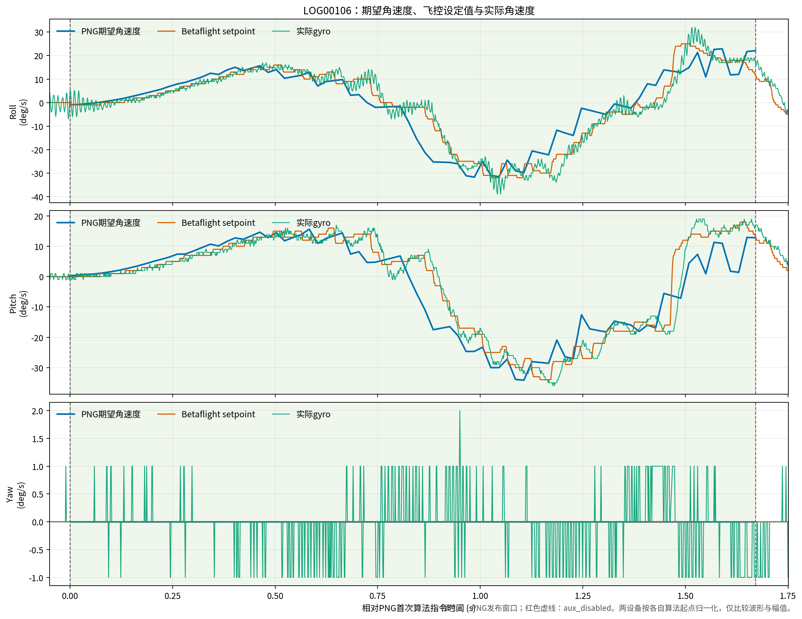
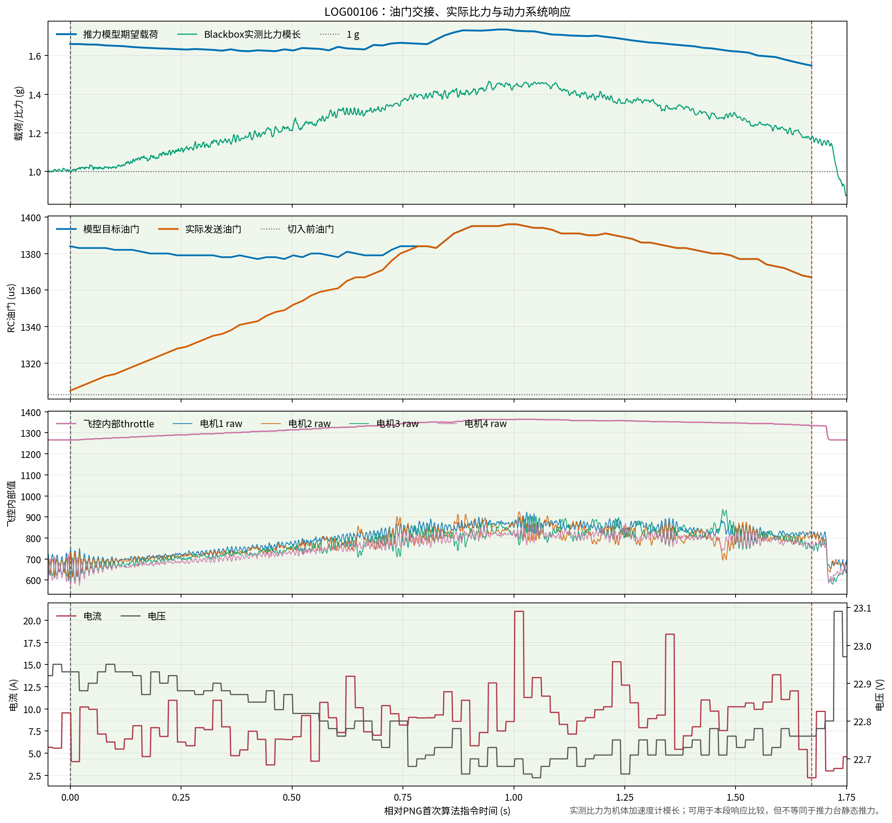
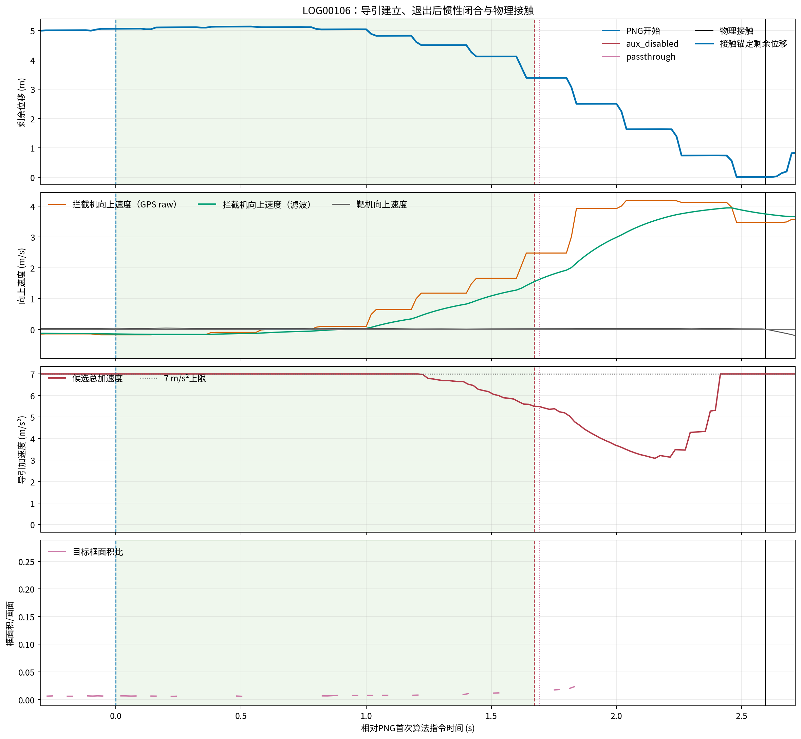

# Betaflight LOG00106 期望指令与实际响应报告

## 1. 分析范围

本报告只分析最后一次外场主动接管架次，不混入此前台架或飞行数据：

- Orange Pi：`FLIGHT_ACTIVE_05S_VIDEO_20260904_183721_20260904_183722.csv`
- 拦截机 Blackbox：`LOG00106.BFL`
- 靶机 PX4 ULog：`10_35_19.ulg`
- PNG 实际算法发布时长：`1.670804 s`，共 84 个主机控制记录行
- 物理接触发生在 PNG 停止发布后约 `0.902 s`

统计窗口只包含碰撞前的算法响应，碰撞后的 `963 deg/s`、电机 `158/2047` 和 `82.06 A`
均被排除。碰撞后数据是外部接触引发的 Betaflight 恢复动作，不是 PNG 指令。

主机和 Blackbox 曲线分别以各自记录到的第一条算法指令归零，用于比较波形、方向和幅值。
跨设备图线不能用于精确测量主机到飞控的延迟。本文的 `15 ms` 角速度延迟只由 Blackbox 内部
setpoint 与 gyro 同一时钟计算。

### 1.1 场景与算法链

|项目|本架次参数|
|---|---|
|参与飞行器|1 架 Betaflight 拦截机、1 架 PX4 靶机|
|目标状态|PNG 发布窗口内平移基本静止；速度 P95 `0.056 m/s`|
|相机/图像|上视固定相机；推理输出 `640 x 512`|
|检测与关联|`rknn_bytetrack`；接管窗口 confirmed `100%`，track ID 始终为 5|
|导引律|`velocity_establishing_png`，导航系数 `N=3`|
|速度建立|`fixed_vm=10 m/s`，速度来源 `msp_kinematics`|
|导引上限|总加速度 `7 m/s2`；72.6% 控制行达到上限|
|执行链|视觉框 -> LOS/LOS rate -> VM/PNG 加速度 -> FRD 姿态/角速度 -> MSP RAW RC -> Betaflight Rate PID -> 电机|
|控制权限|mask 15，Roll/Pitch/Throttle/Yaw；Yaw 固定中位|
|记录链|主机 50 Hz CSV、拦截机约 800 Hz Blackbox、靶机 PX4 ULog|

## 2. 结论

最后一次架次的角速度控制链合理：PNG 期望值、Betaflight setpoint 和实际 gyro 的方向一致，
Roll/Pitch 同时完成正负反转；同钟分析得到两轴约 `15 ms` 延迟、相关系数
`0.991/0.994`、跟踪增益约 `1.026/1.009`。没有达到 `60 deg/s` 限制，也没有证据表明
Roll/Pitch 符号或 Rate 映射错误。

油门链路也按设计工作：模型目标为 `1367--1396 us`，实际发送值从切入前 `1303 us` 经
`0.8 s` 交接上升到最高 `1396 us`，没有下跳，也没有超过 `1500 us`。Blackbox 内部 throttle、
电机输出和电流随发送油门同步上升，证明飞控确实接收并执行了增推指令。

需要修正的是推力模型，而不是通信链。模型要求 `1.548--1.736 g`，Blackbox 实测比力模长为
P50 `1.298 g`、P95 `1.450 g`、最大 `1.468 g`。在 `0.8 s` 油门交接完成后，实测/模型比值
中位约 `0.81`，即模型对本次瞬态可用比力高估约 `19%`。低于标定电压、真实油门曲线非线性、
快速上升入流和动力动态都可能贡献该差异。

尽管实际比力低于模型，拦截机仍建立了约 `4.1--4.4 m/s` 的向上速度，并最终与基本静止靶机
发生物理接触。这证明单次静止目标场景中 PNG 能建立命中轨迹，但一个接触样本不能证明
`>=80%` 命中率，也不能代表动态目标成功率。

## 3. 角速度响应



|轴|PNG 期望范围|Betaflight setpoint|实际 gyro|同钟延迟|相关系数|跟踪增益|P95 绝对误差|
|---|---:|---:|---:|---:|---:|---:|---:|
|Roll|`-31.74--+22.87 deg/s`|`-32--+25 deg/s`|`-39--+32 deg/s`|`15 ms`|`0.9910`|`1.0255`|`4.41 deg/s`|
|Pitch|`-34.14--+15.64 deg/s`|`-34--+18 deg/s`|`-36--+19 deg/s`|`15 ms`|`0.9944`|`1.0085`|`3.51 deg/s`|
|Yaw|始终 `0 deg/s`|始终 `0 deg/s`|`-1--+2 deg/s`|不计算|不计算|不计算|不计算|

图中可见：

- Roll 和 Pitch 的 setpoint 正确跟随 PNG 期望方向，并都发生了所需的正负反转。
- gyro 紧跟 setpoint，幅值略有动态超调，但没有持续发散或反向。
- Yaw setpoint 始终为零，实际只有 `-1--+2 deg/s` 小扰动，符合固定中位设计。
- 主机曲线比飞控曲线更稀疏，来源是 50 Hz 主机记录与约 800 Hz Blackbox 采样率差异。

因此，本架次可以把“角速度映射错误”排除为主要问题。跨设备曲线的水平错位包含日志采样、
MSP 调度和时钟对齐误差，不能据此重新解释 `15 ms` 同钟闭环延迟。

## 4. 油门、比力与动力响应



|指标|结果|判断|
|---|---:|---|
|切入前油门|`1303 us`|交接基准正常|
|模型目标油门|`1367--1396 us`，P50 `1382 us`|未超过配置上限|
|实际发送油门|`1305--1396 us`，P50 `1375 us`|0.8 s 平滑交接正常|
|模型期望载荷|`1.548--1.736 g`，P50 `1.650 g`|要求明显增推|
|实测比力模长|P50/P95/max `1.298/1.450/1.468 g`|方向正确，幅值低于模型|
|交接后实测/模型比值|P50 `0.809`，P95 `0.847`|模型约高估 15%--24%，中位约 19%|
|飞控内部 throttle|`1266--1364`|与发送油门同步变化；不是物理 PWM 测量|
|四电机 raw|`573--936`|远离 `158/2047` 边界|
|最大电机极差|`242 raw`|姿态控制产生合理差速|
|电压最低|`22.65 V`|低于约 24 V 标定工况|
|电流 P95/峰值|`13.68/21.01 A`|随增推上升，无碰撞前异常峰值|

油门曲线先从 `1303 us` 线性接近模型目标，再随模型要求回落，说明油门交接器没有绕过模型，
也没有发生旧版本的切入下跳。四电机均随总推力上升，同时保留 Roll/Pitch 所需差速；碰撞前没有
单电机或全部电机触边。

“实测比力低于模型”不能解释成 MSP 丢失油门，因为发送值、飞控内部 throttle、电机和电流四条
证据链方向一致。更合理的解释是当前两点线性推力模型没有充分描述该电压和快速爬升工况。

## 5. 导引、退出与接触



图中时间以 PNG 首次算法发布为零：

|相对时间|事件|
|---:|---|
|`0.000 s`|PNG 开始发布算法指令|
|`1.670804 s`|飞行模式门控变为 `aux_disabled`|
|`1.691851 s`|发布模式切回 `passthrough`|
|`2.594173 s`|双机发生物理接触|

算法发布期间，接触锚定的剩余位移从约 `5.06 m` 缩短至约 `3.39 m`。与此同时，拦截机向上速度
由接近零持续建立。PNG 停止后，飞行器仍有较大的向上速度，因此在随后 `0.902 s` 内继续闭合到
接触。该时序说明：碰撞不是停止后 PNG 继续发送旧导引造成的，但轨迹和动量由此前 PNG 增推及
姿态导引建立。

候选总加速度在发布初段长期达到 `7 m/s2` 上限。停止发布后，主机仍可计算候选导引，但
`publish=passthrough` 表示这些候选值没有发送到飞控。目标框面积在接近末端快速增大，最后有效
曝光距接触约 `54.7 ms`；当前丢失超时仍允许候选导引保持约 `0.3 s`，这是后续近距末端控制需要
处理的问题。

## 6. 可以证明与不能证明

本架次可以证明：

- PNG 到 Betaflight 的 Roll/Pitch/Yaw 速率映射和方向正确。
- Betaflight 速率闭环能以约 `15 ms` 延迟、高相关性跟踪 setpoint。
- 油门交接、上限和 MSP 传输正确，动力系统确实执行增推。
- 靶机在 PNG 发布窗口内平移基本静止，拦截机建立闭合速度并发生物理接触。
- 碰撞前没有角速度限制触发、电机饱和或 MSP 连续错误。

本架次不能证明：

- 真实命中率达到 `80%`。当前只有一次物理接触样本。
- 对横移、机动或规避目标有同样命中能力。
- 两机绝对 GPS 可给出脱靶距离；接触时两机 GPS 仍有约 `5.34 m` 水平残差。
- 当前推力模型已精确标定；本次瞬态实测比力明显低于模型需求。
- 切换飞行模式等同于恢复人工控制。RC7 未退出时，`passthrough` 仍发送切入前冻结值。

## 7. 工程判定

|项目|判定|
|---|---|
|角速度方向与 Rate 映射|通过|
|Roll/Pitch 闭环跟随|通过|
|Yaw 固定中位|通过|
|油门交接和 1500 us 上限|通过|
|碰撞前电机输出无饱和|通过|
|推力模型幅值准确性|需修正；本次交接后约高估 19%|
|静止目标单次闭合/接触|通过|
|非碰撞短时监督科目|未通过；本架次发生接触|
|命中率 `>=80%`|证据不足|

当前最明确的代码改进方向是把油门到可用比力的映射改为电压相关、非线性的实测曲线，并增加
近距大框/面积增长率终端状态。角速度映射不需要因本架次数据反向或改轴。

## 8. 复现与文件索引

绘图脚本：`tools/plot_log00106_control_response.py`

Blackbox 解码后执行：

```bash
python3 tools/plot_log00106_control_response.py \
  --blackbox-csv /tmp/log00106_decode_raw_20260904_0402/LOG00106.01.csv \
  --blackbox-event /tmp/log00106_decode_raw_20260904_0402/LOG00106.01.event
```

产物：

- 机器可读指标：`doc/evidence/BETAFLIGHT_LOG00106_CONTROL_RESPONSE_metrics.json`
- 图目录：`doc/figures/log00106_control_response/`
- 完整碰撞联合分析：`doc/BETAFLIGHT_FLIGHT_ACTIVE_LOG00106_COLLISION_ANALYSIS.md`
- 联合时序原始产物：`logs/analysis/LOG00106_target_joint/`
