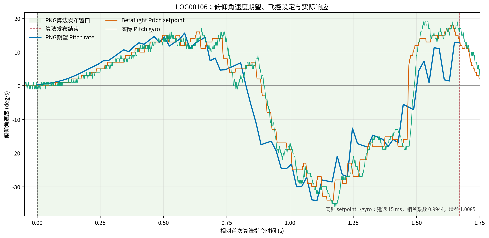

# LOG00106 俯仰角速度简析

## 数据

- PNG期望角速度：中文CSV的`设定俯仰角速度_deg_s`。
- Betaflight设定角速度：`LOG00106.BFL`解码结果的`setpoint[1]`。
- 实际俯仰角速度：同一Blackbox中的`gyroADC[1]`。
- 分析窗口：PNG实际发布算法指令的`1.670804 s`。
- 三曲线CSV：[BETAFLIGHT_LOG00106_PITCH_RATE_CURVES.csv](evidence/BETAFLIGHT_LOG00106_PITCH_RATE_CURVES.csv)。
  CSV使用共同的`2 ms`时间轴；三路数据均线性插值到该时间轴，并额外保留精确结束时刻。

## 结果

|指标|结果|
|---|---:|
|PNG期望范围|`-34.14--+15.64 deg/s`|
|Betaflight setpoint范围|`-34--+18 deg/s`|
|实际gyro范围|`-36--+19 deg/s`|
|setpoint到gyro同钟延迟|`15 ms`|
|setpoint与延迟后gyro相关系数|`0.9944`|
|跟踪增益|`1.0085`|
|P95绝对跟踪误差|`3.51 deg/s`|

## 结论

Betaflight Pitch setpoint与PNG期望的方向和正负反转一致。实际Pitch gyro紧跟飞控setpoint，
增益接近`1`，没有持续反向、明显欠跟踪或发散，因此本架次不支持“俯仰角速度跟踪异常”的判断。

PNG曲线来自RK3588约50 Hz日志，setpoint和gyro来自飞控约800 Hz Blackbox。图中两套设备时间轴
按各自首次算法指令归零，只适合比较趋势和幅值，不能用蓝线与橙线的水平距离测端到端延迟；
`15 ms`只由同一飞控时钟下的setpoint与gyro计算。
