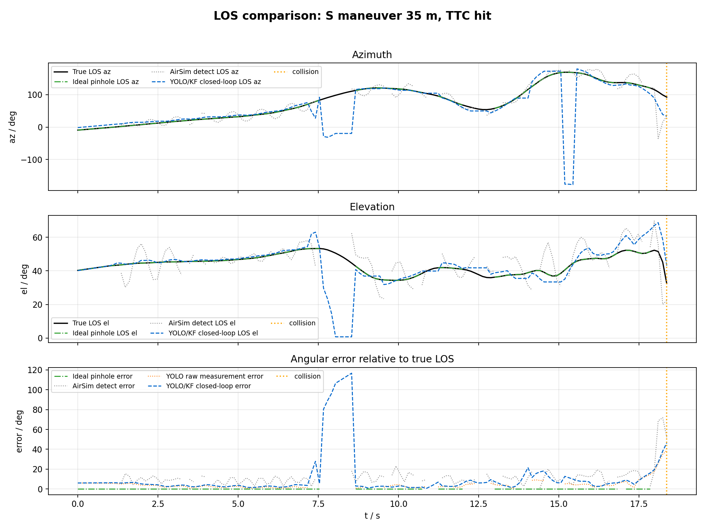
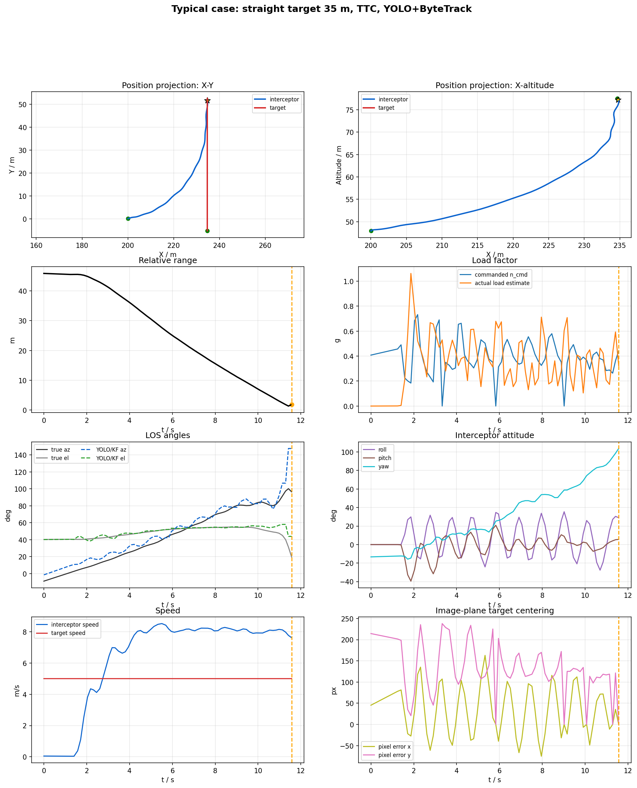
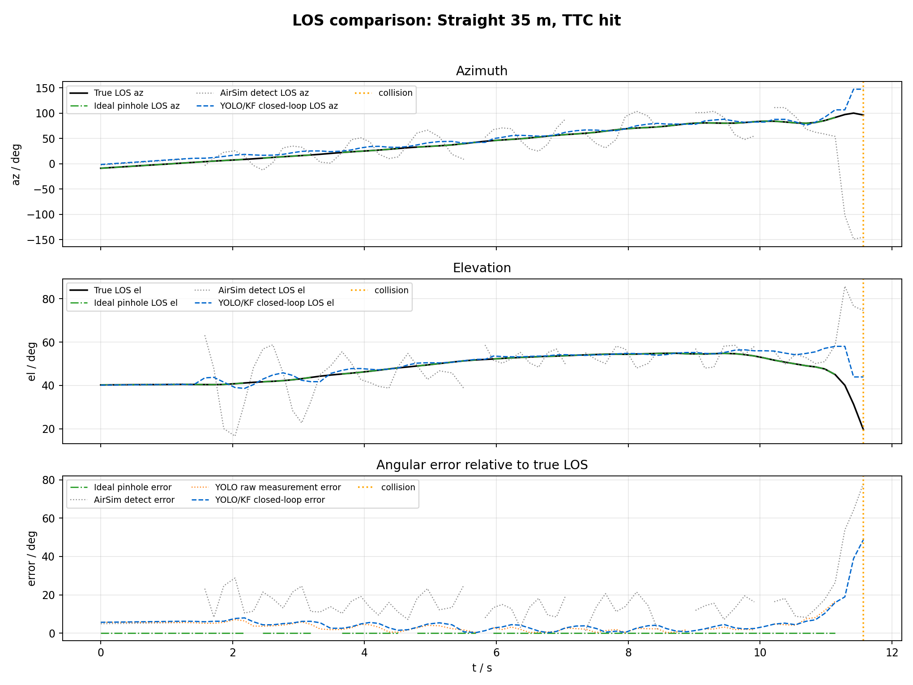
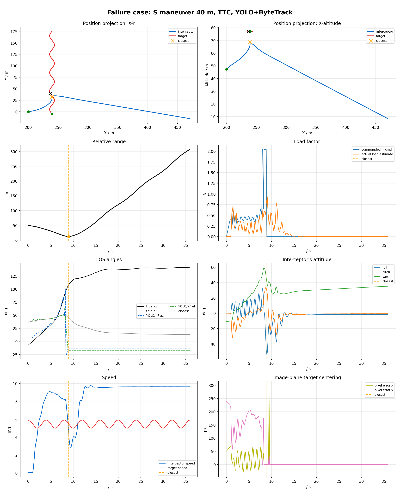
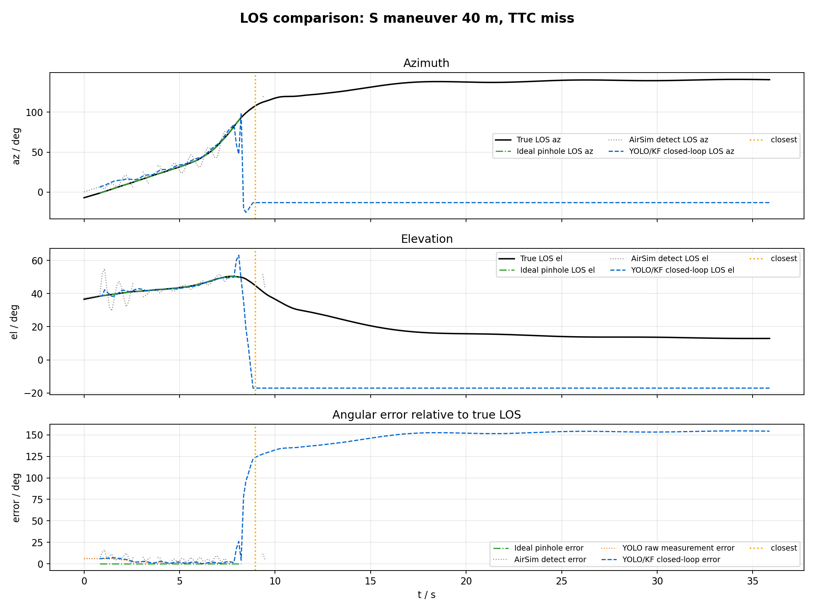
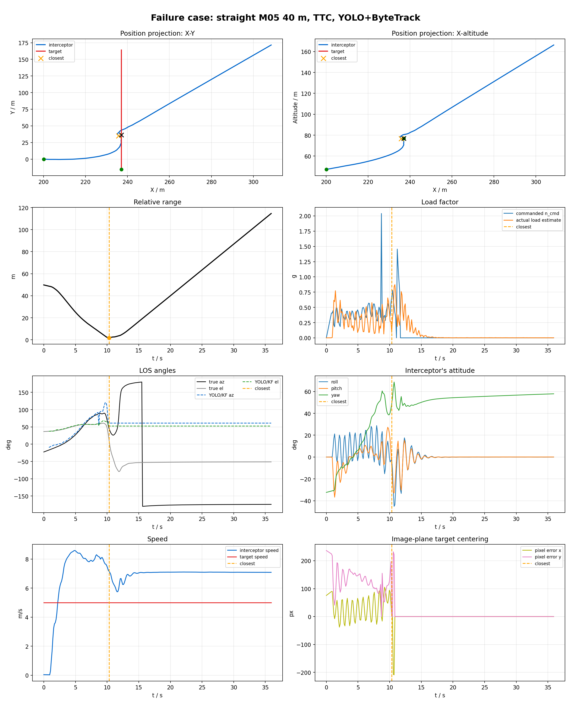
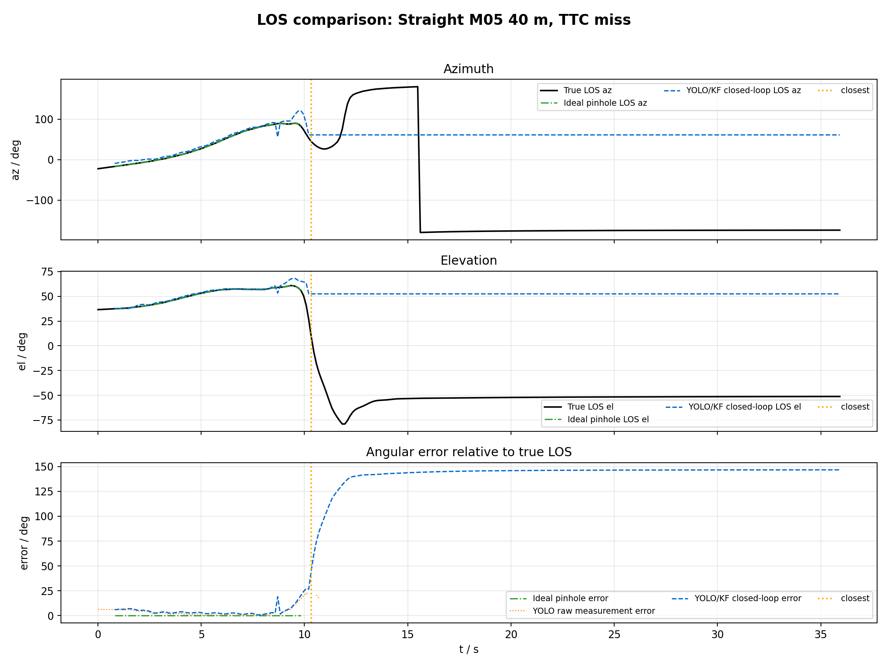

# 上视相机 YOLO+ByteTrack PNG 拦截算法说明

这份说明记录 AirSim/PX4 仿真中的上视相机纯视觉 PNG 拦截链路。范围包括闭环输入、LOS 形成、TTC/`V_m` 比例导引、末端外推和实验结果；场景搭建只保留与复现实验相关的设置。

## 1. 问题设定与闭环边界

拦截机使用固定竖直上视相机，目标由 AirSim actor 或脚本轨迹驱动。典型相机设置为 `camera_pitch_deg=-90`、`camera_x=0`、`fov_deg=120`、分辨率 `640x480`。目标进入图像后，由 YOLO+ByteTrack 给出目标框，再经过 LOS 滤波和比例导引生成拦截指令。

闭环只使用三类信息：上视相机图像、拦截机姿态、飞控速度状态。AirSim 真值不参与控制，只用于碰撞判定、脱靶量统计、离线曲线和报告。`--shadow-airsim-detect` 仅记录 AirSim detect 的影子对照字段；只有显式设置 `--detector-source airsim` 时，AirSim detect 才进入闭环。

实现入口见下表：

| 模块 | 文件 |
| --- | --- |
| 主闭环、参数解析、日志、PX4 输出 | `examples/run_airsim_strapdown_vision_png.py` |
| YOLO+ByteTrack 检测与目标选择 | `vision_guidance/yolo_bytetrack_detector.py` |
| 像素到 LOS 几何 | `vision_guidance/geometry.py` |
| LOS 6D Kalman 滤波 | `vision_guidance/los_filter.py` |
| bbox 面积膨胀 TTC | `vision_guidance/ttc.py` |
| TTC 增益调度 | `vision_guidance/png_eval.py` |
| 图像平面末端预测 | `vision_guidance/terminal_image_kf.py` |
| 盲区保持状态机 | `vision_guidance/terminal_extrapolation.py` |

## 2. 数据流与接口

闭环数据流如下：

```text
AirSim RGB 图像
    -> YOLO+ByteTrack 检测、关联、单目标选择
    -> bbox 中心 + 相机内参 + 固定上视外参
    -> 惯性系 LOS 测量 lambda_I
    -> LOS 6D Kalman 滤波 + 延迟补偿
    -> bbox 面积膨胀 TTC 估计
    -> TTC-PNG 或 V_m-PNG 生成 PNG 加速度
    -> upward centering / frame guard / frame centering
    -> TerminalImageKF + TerminalExtrapolator 末端外推
    -> 速度参考 + 总加速度指令
    -> PX4 MAVLink body-rate + thrust
```

主要模块接口：

| 模块 | 输入 | 输出 | 说明 |
| --- | --- | --- | --- |
| 图像采集 | AirSim camera name、vehicle name | BGR/RGB 图像 | YOLO 模式使用 `simGetImage` 取当前相机图像 |
| YOLO+ByteTrack | 图像、模型、类别、上一帧 track id | `FrameDetection` | 输出 bbox、score、track id、选择来源 |
| LOS 几何 | bbox 中心、相机内参、`R_BC`、`R_IB` | `lambda_I` | 将像素射线转到惯性系 |
| LOS 滤波 | `lambda_I` 测量、时间戳 | `lambda_I`、`omega_los` | 约束 `lambda` 单位化、`lambda_dot` 垂直于 `lambda` |
| TTC 估计 | bbox 面积序列、图像尺寸 | `TTCState` | 只在面积有效膨胀时输出有效 TTC |
| PNG 导引 | `lambda_I`、`omega_los`、TTC 或 `V_m` | `a_cmd_png` | 使用 `gain * cross(omega_los, lambda_I)` |
| 视场保持 | 图像误差、面积、TTC、LOS | 调整后的速度/加速度 | 抑制目标滑出上视视场 |
| 末端外推 | image-KF、近期速度/加速度窗口、丢失原因 | 预测 LOS 或保持指令 | 处理 bbox 裁剪、短时丢检和近距盲区 |
| PX4 输出 | 总加速度、姿态、yaw-rate | body rates、thrust | 通过 MAVLink offboard 发送姿态角速度与推力 |

## 3. 主流程

### 3.1 初始化

1. 连接 AirSim RPC，确认拦截机和目标 actor/vehicle 存在。
2. 按实验参数设置初始几何、目标运动、固定上视相机位姿。
3. 创建检测器：`airsim`、`yolo_bytetrack` 或 `yolo_kcf`；本文实验闭环使用 `yolo_bytetrack`。
4. 创建 `LOSKalmanFilter6D`、`ScaleExpansionTTC`、`TTCGainSchedule`、`TerminalImageKF` 和 `TerminalExtrapolator`。
5. 探测相机内参，计算固定相机外参 `R_BC`。
6. 计算速度上限 `speed_cap = speed_ratio * intruder_speed`，以及固定 VM 增益 `fixed_vm_gain = N * speed_cap`。
7. PX4 输出模式为 `mavlink_body_rate` 时，先发送中性 body-rate/thrust，使 PX4 进入 offboard。

初始化代码片段：

```python
detector = create_detection_provider(args, airsim_module=airsim)
client.simSetCameraPose(args.camera, _fixed_camera_pose(airsim, args), vehicle_name=args.interceptor)

los_filter = LOSKalmanFilter6D(los_filter_config)
ttc_filter = ScaleExpansionTTC(
    TTCConfig(min_area=max(0.0, args.ttc_min_area), max_ttc_s=max(0.1, args.ttc_max_s))
)
gain_schedule = TTCGainSchedule()
terminal_extrapolator = TerminalExtrapolator(_terminal_config_from_args(args))
terminal_image_kf = TerminalImageKF(_terminal_image_kf_config_from_args(args))

speed_cap = args.speed_ratio * intruder_speed
fixed_vm_gain = float(args.navigation_constant) * float(speed_cap)
R_BC = _fixed_camera_R_BC(args)
intrinsics = _probe_camera_intrinsics(client, airsim, config, args)
```

### 3.2 主循环

```text
while sim_t < duration_s:
    更新目标 actor 运动，读取拦截机位置、速度、姿态
    R_IB = 拦截机机体系到惯性系旋转矩阵
    attitude_buffer.push(sim_t, R_IB)

    detector_frame = detector.detect(image, active_track_id)
    detection = detector_frame.selected

    if detection 有效:
        bbox = detection.bbox
        center = bbox 中心
        clip_flags = bbox 是否触碰图像边缘
        los_C = camera_ray_from_pixel(center, intrinsics)
        lambda_meas = los_camera_to_inertial(los_C, R_BC, R_IB_at_exposure)

        if bbox 被裁剪且启用 clipped_los_kf_predict:
            暂不把裁剪中心送入 strapdown LOS KF
            等待 TerminalImageKF 预测 LOS
        else:
            los = LOSKalmanFilter6D.update(lambda_meas)
            omega_los = los.omega_los

        if guidance_law == ttc_png:
            ttc = ScaleExpansionTTC.update(bbox_area)

        lambda_eff, omega_eff = predict_los_delay(lambda, omega_los, delay_s)
        a_png = PNG(lambda_eff, omega_eff, ttc 或 fixed_vm_gain)
    else:
        标记 no_detection
        若短时丢失，保留 last_lambda 和 last_omega

    image_kf = TerminalImageKF.update(center, detected, clipped)
    if PNG 无效且 image_kf 处于短时预测:
        用 image_kf 预测中心重建 LOS 和 LOS-rate
        继续执行有限时间视觉预测导引

    frame_guard = 根据图像误差、面积、TTC、丢失保持决定速度上限
    a_center = upward_centering(lambda_eff, R_IB)
    a_cmd = clip(a_png + a_center, max_guidance_accel)
    v_ref = 由 LOS、积分加速度、frame_guard、frame_centering 得到速度参考

    terminal = TerminalExtrapolator.update(...)
    if terminal blind push:
        速度盲推或加速度保持，根据 upward-camera 默认策略选择

    total_accel = a_cmd + speed_hold_gain * (v_ref - current_velocity)
    body_rates, thrust = body_rate_command_from_accel(total_accel, R_IB, attitude, yaw_rate)
    send_body_rate(body_rates, thrust)

    记录检测、LOS、TTC、导引、末端状态、PX4 指令和碰撞结果
```

### 3.3 核心子流程

```text
select_detection(detections, active_track_id):
    if active_track_id 存在且当前帧有同 ID:
        return 同 ID 检测框
    if single_target_mode:
        return 与上一帧中心/面积最连续的检测框
    if 有 ByteTrack ID 的检测:
        return 最高置信度检测框
    if allow_untracked_fallback:
        return 最高置信度未关联检测框，track_id = -1
    return None
```

```text
png_guidance(lambda, omega_los, ttc):
    if fixed_vm_png:
        gain = N * V_m
    else if ttc_png 且 TTC 有效:
        gain = N * V_m * clip(schedule(TTC), min_scale, 1)
    else if ttc_png 且 soft guidance:
        gain = N * V_m
    else:
        return invalid
    return clip(gain * cross(omega_los, lambda), max_guidance_accel)
```

```text
terminal_extrapolation(state, bbox, image_kf, recent_commands):
    if 图像仍可用或 image-KF 可短时预测:
        保持 TerminalVisual，不立即盲推
    if terminal 已 armed 且 bbox 裁剪、面积过大或短时丢失:
        进入 BlindPush
    if upward-camera accel_body_rate:
        默认不覆盖速度命令，使用近期 PNG 加速度均值做衰减保持
    if blind 时间超过 blind_duration_s:
        标记 Complete，退出盲区保持
```

## 4. YOLO+ByteTrack 检测与目标选择

闭环检测源设置为 `--detector-source yolo_bytetrack`。模型文件为 `vision_guidance/best.pt`，目标类别为 `--yolo-class-id 0`。实验中常用 `--yolo-conf 0.05`、`--yolo-iou 0.7` 和 `--yolo-tracker bytetrack.yaml`。检测器从 AirSim 相机读取图像，调用 Ultralytics `track()`，由 ByteTrack 维护跨帧 ID。

检测器创建逻辑：

```python
def create_detection_provider(args: Any, airsim_module: Any = None):
    source = str(getattr(args, "detector_source", "airsim") or "airsim")
    if source == "airsim":
        return AirSimBuiltinDetector()
    if source == "yolo_bytetrack":
        return YoloByteTrackDetector(
            model_path=str(getattr(args, "yolo_model", "") or ""),
            class_id=getattr(args, "yolo_class_id", None),
            conf=float(getattr(args, "yolo_conf", 0.25)),
            iou=float(getattr(args, "yolo_iou", 0.70)),
            imgsz=int(getattr(args, "yolo_imgsz", 640)),
            tracker=str(getattr(args, "yolo_tracker", "bytetrack.yaml") or "bytetrack.yaml"),
            allow_untracked_fallback=bool(getattr(args, "yolo_allow_untracked_fallback", False)),
            single_target_mode=bool(getattr(args, "yolo_single_target_mode", False)),
            airsim_module=airsim_module,
        )
```

单帧处理流程：

```python
image_bgr = self._read_scene_image(client, config)
results = self.model.track(
    image_bgr,
    persist=True,
    tracker=self.tracker,
    conf=self.conf,
    iou=self.iou,
    imgsz=self.imgsz,
    verbose=False,
)
detections, parse_stats = self._detections_from_results(results, image_bgr.shape)
selected, selector_source, selector_distance_px = _select_yolo_detection(
    detections,
    active_track_id,
    allow_untracked_fallback=self.allow_untracked_fallback,
    single_target_mode=self.single_target_mode,
    last_center=self._last_selected_center,
    last_area=self._last_selected_area,
    max_center_jump_px=self.single_target_max_center_jump_px,
)
```

目标选择顺序：

1. 若已有 `active_track_id`，优先沿用同一 ByteTrack ID。
2. 若启用 `--yolo-single-target-mode`，使用上一帧中心和面积做连续性选择，抑制短时 ID 抖动。
3. 若没有连续性候选，选择最高置信度的有 track ID 目标。
4. 启用 `--yolo-allow-untracked-fallback` 时，ByteTrack 尚未分配 ID 的目标框可临时进入闭环，记为 `track_id=-1`。

核对闭环检测源时，重点看 `detector_source`、`detector_reject_reason`、`yolo_raw_count`、`yolo_class_filtered_count`、`yolo_track_filtered_count`、`yolo_selected_track_id`、`yolo_selected_score`、`yolo_selected_source` 和 `yolo_used_untracked_fallback`。

## 5. LOS 测量、滤波与延迟补偿

YOLO bbox 中心 `(u, v)` 先经相机内参还原为相机坐标系射线，再经固定外参 `R_BC` 和机体姿态 `R_IB` 转到惯性系，得到测量视线 `lambda_I`。上视相机的光轴沿机体竖直方向，图像边缘误差主要对应机体系横向偏差；前向相机的末端外推策略不能直接套用。

几何转换：

```python
def camera_ray_from_pixel(u: float, v: float, intrinsics: CameraIntrinsics) -> np.ndarray:
    x_n = (u - intrinsics.cx) / intrinsics.fx
    y_n = (v - intrinsics.cy) / intrinsics.fy
    return normalize(np.array([x_n, y_n, 1.0], dtype=float))

def airsim_fixed_camera_to_body(yaw_rad=0.0, pitch_rad=0.0, roll_rad=0.0) -> np.ndarray:
    return rotation_z(yaw_rad) @ rotation_y(-pitch_rad) @ rotation_x(roll_rad) @ airsim_camera_zero_to_body()

def los_camera_to_inertial(los_C: np.ndarray, R_BC: np.ndarray, R_IB: np.ndarray) -> np.ndarray:
    return normalize(R_IB @ R_BC @ normalize(los_C))
```

主循环中的 LOS 测量：

```python
center = frame_detection.center
px_err_x = center[0] - intrinsics.cx
px_err_y = center[1] - intrinsics.cy

lookup = attitude_buffer.lookup(frame_detection.exposure_ts)
los_C = camera_ray_from_pixel(*center, intrinsics)
lambda_I_measured = los_camera_to_inertial(los_C, R_BC, lookup.sample.R_IB)
lambda_raw = normalize(lambda_I_measured)
```

LOS 滤波器 `LOSKalmanFilter6D` 使用 6 维状态：

```text
x = [lambda_x, lambda_y, lambda_z, lambda_dot_x, lambda_dot_y, lambda_dot_z]
```

滤波器采用常速度 LOS 模型，量测为归一化后的 `lambda_I`。每次预测和更新后，`lambda` 重新单位化，`lambda_dot` 投影到垂直于 `lambda` 的平面。LOS 角速度按 `omega_los = lambda x lambda_dot` 计算。

LOS KF 核心代码：

```python
F = np.eye(6, dtype=float)
F[:3, 3:] = dt * np.eye(3)
self.x = F @ self.x
self.P = F @ self.P @ F.T + Q
self._apply_constraints()

H = np.zeros((3, 6), dtype=float)
H[:, :3] = np.eye(3)
y = z - H @ self.x
innovation_norm = float(np.linalg.norm(y))
if innovation_norm > self.config.innovation_reject:
    return self._estimate(timestamp, innovation_norm, valid=False, reason="los_innovation_reject")

S = H @ self.P @ H.T + R
K = self.P @ H.T @ np.linalg.inv(S)
self.x = self.x + K @ y
self.P = (np.eye(6) - K @ H) @ self.P
self._apply_constraints()
```

延迟补偿按当前 LOS 角速度前推视线，减少检测、渲染和低 clock speed 带来的相位滞后。实现中使用 `lambda_dot = omega_los x lambda`：

```python
def _predict_los_delay(lambda_I, omega_los, delay_s):
    if lambda_I is None or omega_los is None:
        return lambda_I, omega_los
    lam = np.asarray(lambda_I, dtype=float)
    omega = np.asarray(omega_los, dtype=float)
    if not np.all(np.isfinite(lam)) or not np.all(np.isfinite(omega)):
        return lambda_I, omega_los
    delay = max(0.0, float(delay_s))
    if delay <= 0.0:
        return lam, omega
    lam_dot = np.cross(omega, lam)
    pred = normalize(lam + lam_dot * delay)
    omega_pred = project_perpendicular(omega, pred)
    return pred, omega_pred
```

upward-camera 成功实验的 LOS 参数：

| 参数 | 推荐值 | 作用 |
| --- | ---: | --- |
| `los_filter_process_lambda` | `5e-4` | LOS 方向过程噪声 |
| `los_filter_process_lambda_dot` | `2e-2` | LOS 变化率过程噪声 |
| `los_filter_measurement_noise` | `8e-3` | bbox 中心测量噪声 |
| `los_filter_innovation_reject` | `0.75` | 常规创新门限 |
| `los_filter_terminal_innovation_reject` | `1.20` | 末端放宽门限 |
| `los_delay_compensation_s` | `0.18` | LOS 延迟补偿时间 |

## 6. TTC 面积膨胀估计与增益调度

TTC 由 `ScaleExpansionTTC` 根据 bbox 面积膨胀估计。设滤波后的框面积为 `A`，滑动窗口线性拟合得到 `A_dot`，则：

```text
TTC = 2 * A / A_dot
```

该公式来自透视尺度关系：目标线尺寸近似与距离倒数成正比，bbox 面积近似与距离平方倒数成正比，因此面积膨胀率可用于估计剩余接近时间。实现上只在目标框未裁剪、面积足够大、面积跳变正常且 `A_dot > 0` 时输出有效 TTC。bbox 触边时，TTC 返回 `bbox_top_clipped`、`bbox_bottom_clipped`、`bbox_left_clipped` 或 `bbox_right_clipped`，后续由末端预测或盲区保持处理。

TTC 估计代码：

```python
area = detection.area
if area < self.config.min_area:
    return self._state(ts, None, 0.0, 0.0, False, "bbox_area_too_small")
clip_reason = _bbox_clip_reason(detection, image_width, image_height)
if clip_reason:
    return self._state(ts, None, 0.0, 0.0, False, clip_reason)

if self.area_filtered is None:
    self.area_filtered = area
else:
    self.area_filtered = (
        self.config.alpha_area * area + (1.0 - self.config.alpha_area) * self.area_filtered
    )
self.window.append((ts, self.area_filtered))
area_dot = self._slope()
if area_dot is None or area_dot <= self.config.min_area_dot:
    return self._state(ts, None, 0.2, 0.0 if area_dot is None else area_dot, False, "area_not_expanding")

ttc = 2.0 * self.area_filtered / area_dot
```

`ttc_png` 模式下，TTC 只调度导引增益，不替代 LOS。`TTCGainSchedule` 在小 TTC 时提高增益，在大 TTC 时降低增益。实验配置保留 `--ttc-soft-guidance`：TTC 无效时退回 VM 风格 LOS 导引，TTC 有效时按 schedule 缩放 `N*V_m`，缩放下限由 `ttc_soft_min_gain_scale` 控制。

## 7. TTC-PNG 与 V_m-PNG 导引律

TTC-PNG 和 `V_m`-PNG 共用 LOS、视场保持和 PX4 输出链路，差别只在导引增益 `K_png` 的来源。实现形式为：

```text
a_png = K_png * (omega_los x lambda_I)
```

其中 `lambda_I` 为惯性系单位视线，`omega_los` 为 LOS 角速度，`K_png` 为导引增益。代码中的叉乘顺序为 `np.cross(omega_los, lambda_I)`，符号约定与 AirSim NED 坐标、相机外参和 PX4 控制链路保持一致。

### 7.1 TTC-PNG

`--guidance-law ttc_png` 根据面积膨胀 TTC 调度增益。开启 soft guidance 时实际闭环为：

```text
TTC 无效: K_png = N * V_m
TTC 有效: K_png = N * V_m * clip(schedule(TTC), min_scale, 1)
a_png = K_png * (omega_los x lambda_I)
```

该策略避免 YOLO 面积抖动、遮挡或 bbox 裁剪造成导引瞬断，同时保留近距小 TTC 时提高响应的效果。

### 7.2 V_m-PNG

`--guidance-law fixed_vm_png` 完全忽略 TTC，只使用固定闭合速度尺度：

```text
V_m = speed_ratio * intruder_speed
K_png = N * V_m
a_png = K_png * (omega_los x lambda_I)
```

典型参数为 `navigation_constant=3`、`intruder_speed=5m/s`、`speed_ratio=2`，对应 `V_m=10m/s`、`K_png=30`。VM 模式适合检查 LOS 和控制链路本身；TTC 模式近距响应更强，但对 bbox 面积趋势更敏感。

主循环中的导引律：

```python
lambda_eff, omega_eff = _predict_los_delay(los_lambda, los_omega, los_delay_compensation_s)
if args.guidance_law == "fixed_vm_png":
    guidance_gain = fixed_vm_gain
    g_eval = guidance_gain * np.cross(omega_eff, lambda_eff)
    valid = True
    guidance_mode = "fixed_vm_png"
elif not ttc.valid or ttc.ttc is None:
    reason = ttc.reject_reason or "ttc_invalid"
    if bool(args.ttc_soft_guidance):
        guidance_gain = fixed_vm_gain
        g_eval = guidance_gain * np.cross(omega_eff, lambda_eff)
        valid = True
        guidance_mode = "ttc_soft_vm"
else:
    gain = gain_schedule.gain(ttc.ttc)
    if bool(args.ttc_soft_guidance):
        gain_scale = gain / max(1.0e-6, float(gain_schedule.max_gain))
        min_scale = float(np.clip(float(args.ttc_soft_min_gain_scale), 0.0, 1.0))
        guidance_gain = fixed_vm_gain * float(np.clip(gain_scale, min_scale, 1.0))
        g_eval = guidance_gain * np.cross(omega_eff, lambda_eff)
    else:
        guidance_gain = gain
        g_eval = gain * omega_eff
    valid = True
    guidance_mode = "ttc_png"
```

PNG 加速度由 `max_guidance_accel_mps2` 限幅；upward-camera 成功配置中常用 `20m/s^2`。

## 8. 上视相机视场保持

上视相机不沿飞行方向观察目标。拦截机需要通过横向运动和姿态角速度，把目标维持在机体上方视场内。链路中有三层处理：`upward_centering`、`frame_guard` 和 `frame_centering`。

### 8.1 upward_centering

`upward_centering` 将惯性系 LOS 转到机体系，取 `lambda_B[:2]` 作为横向居中误差，并生成机体系 XY 加速度。该项只在固定上视相机条件下启用。

```python
def _upward_centering_acceleration(lambda_I, R_IB, args):
    if not bool(getattr(args, "upward_centering", False)) or float(args.camera_pitch_deg) > -75.0:
        return np.zeros(3, dtype=float), np.zeros(2, dtype=float), 0
    direction_I = _fallback_direction(lambda_I)
    if direction_I is None:
        return np.zeros(3, dtype=float), np.zeros(2, dtype=float), 0
    lambda_B = R_IB.T @ direction_I
    err_B = np.asarray(lambda_B[:2], dtype=float)
    accel_B = np.array(
        [
            float(args.upward_centering_gain) * err_B[0],
            float(args.upward_centering_gain) * err_B[1],
            0.0,
        ],
        dtype=float,
    )
    accel_B = _clip_vector_norm(accel_B, float(args.upward_centering_max_accel_mps2))
    return R_IB @ accel_B, err_B, 1
```

实验中常用 `upward_centering_gain=8.0`、`upward_centering_max_accel_mps2=4.0`。该项不替代 PNG，只叠加在 `a_cmd_png` 上，用于抑制目标在末端前从上视视场侧向滑出。

### 8.2 frame_guard

`frame_guard` 根据图像误差、bbox 面积、TTC 和裁剪标志调度速度上限。目标越接近图像边缘或 bbox 越大，速度上限越低，横向/垂向速度约束越强。成功配置中常用 `enter_error_ratio=0.70`、`exit_error_ratio=0.45`、`area_mid_ratio=0.004`、`area_ratio=0.018`、`ttc_mid_s=1.6`、`ttc_terminal_s=0.7`。

### 8.3 frame_centering

`frame_centering` 是更强的视场保持状态机，状态包括 `tracking`、`frame_centering`、`terminal_capture` 和 `loss_hold`。进入条件由图像误差、bbox 面积、TTC、裁剪标志和短时丢失决定。在 `terminal_capture` 或 `loss_hold` 中，代码压低横向速度并保持最近有效速度，避免拦截机在末端横向穿过目标下方导致丢框。

视场保持与 PNG 加速度叠加：

```python
candidate_v_cmd, a_cmd, accel_integral_dt = _candidate_guidance_velocity(
    interceptor_vel, lambda_I, omega_los, guidance_gain, scheduled_speed_cap, guidance_dt, valid, args
)
a_cmd_png = np.array(a_cmd, dtype=float)
if valid or image_kf_guidance_used:
    upward_centering_accel_I, upward_centering_err_B, upward_centering_active = _upward_centering_acceleration(
        lambda_I, R_IB, args
    )
    a_cmd = _clip_vector_norm(
        a_cmd_png + upward_centering_accel_I,
        float(args.max_guidance_accel_mps2),
    )
```

## 9. 末端预测与盲区保持

末端处理由图像平面 KF 和盲区状态机组成。上视相机下，bbox 裁剪或短时丢失不等于目标已经越过机体前方，更常见的情况是目标接近视场边缘。因此策略顺序是：先用 image-KF 做短时视觉预测，视觉确实不可用后再进入盲区保持。

### 9.1 TerminalImageKF 图像平面预测

`TerminalImageKF` 跟踪图像角误差：

```text
x = [theta_x, theta_y, theta_dot_x, theta_dot_y]
theta_x = atan2(u - cx, fx)
theta_y = atan2(v - cy, fy)
```

bbox 未裁剪且测量创新正常时，KF 正常更新；bbox 裁剪、短时无检测或图像创新过大时，KF 在 `max_predict_s` 内继续输出预测中心。主循环用预测中心重建 `lambda_I` 和 `omega_los`，导引模式标记为 `*_kf_predict`。

关键代码：

```python
usable_measurement = bool(detected and measurement_valid and not clipped and center is not None)
if usable_measurement:
    theta = angle_error_from_center(center, intrinsics)

self._predict_to(timestamp)
if not usable_measurement or theta is None:
    reason = "bbox_clipped" if clipped else "no_measurement"
    return self._prediction_estimate(timestamp, reason)

innovation = theta - self.x[:2]
if innovation_norm > max(1.0e-9, self.config.innovation_reject_rad):
    if self.config.soft_reject_predict:
        return self._prediction_estimate(timestamp, "image_kf_soft_reject")
    self.reset(theta, timestamp, track_id)
    return self._estimate(timestamp, IMAGE_KF_INVALID, False, "image_kf_innovation_reject")
```

主循环接管 image-KF 预测 LOS：

```python
if (
    not valid
    and bool(args.terminal_image_kf_guidance)
    and image_kf.valid
    and image_kf.mode == IMAGE_KF_PREDICT
    and (_is_short_visual_loss_reason(reason) or clipped_los_kf_predict_active)
):
    predicted_lambda_I, predicted_omega_los = _image_kf_los_guidance_estimate(image_kf, intrinsics, R_BC, R_IB)
    lambda_eff, omega_eff = _predict_los_delay(predicted_lambda_I, predicted_omega_los, los_delay_compensation_s)
    guidance_gain = fixed_vm_gain
    g_eval = guidance_gain * np.cross(omega_eff, lambda_eff)
    valid = True
    los_source = "image_kf_predict_clipped" if clipped_los_kf_predict_active else "image_kf_predict"
```

常用参数为 `terminal_image_kf_max_predict_s=1.0`、`terminal_image_kf_meas_noise_rad=0.006`、`terminal_image_kf_innovation_reject_rad=0.35`、`terminal_image_kf_max_rate_rad_s=12.0`、`terminal_image_kf_soft_reject_predict=true`。

### 9.2 TerminalExtrapolator 盲区状态机

`TerminalExtrapolator` 状态包括 `Waiting`、`Tracking`、`TerminalVisual`、`BlindPush`、`LossHold`、`Complete` 和 `AbortHold`。进入末端的依据包括 bbox 面积比例、soft image-KF 测量和近期有效导引历史。切入盲推的原因包括 bbox 裁剪、面积过大、目标丢失和安全门控。

状态机核心判断：

```python
normal_measurement = bool(detected and measurement_valid and score_valid)
soft_terminal_measurement = bool(
    detected and soft_measurement_valid and area_ratio >= self.config.soft_enter_area_ratio
)
visual_usable = bool(normal_measurement or soft_terminal_measurement or soft_kf_prediction)

if normal_measurement:
    self.miss_count = 0
    if area_ratio >= self.config.terminal_enter_area_ratio:
        self.state = TERMINAL_VISUAL
        self.terminal_armed = True
    else:
        self.state = TRACKING
elif soft_terminal_measurement or soft_kf_prediction:
    self.miss_count = 0
    self.state = TERMINAL_VISUAL
    self.terminal_armed = True
elif self.terminal_armed:
    self.miss_count += 1
    self.state = TERMINAL_VISUAL
else:
    self.state = LOSS_HOLD if not detected else TRACKING
```

进入盲区后，速度盲推路径对近期速度命令求均值，并叠加 LOS 趋势和上推偏置后指数衰减：

```python
samples = self._window_samples(timestamp)
self.blind_base_v_cmd = np.mean([sample.v_cmd for sample in samples], axis=0)
omega_samples = [sample.omega_los for sample in samples if sample.omega_los is not None]
if omega_samples:
    trend = speed_cap * self.config.trend_bias_gain * np.mean(omega_samples, axis=0)
    self.blind_trend_bias = _clamp_norm(trend, max(0.0, self.config.trend_bias_max_mps))
self.blind_pitch_bias = np.array([0.0, 0.0, -max(0.0, self.config.pitch_up_bias_mps)], dtype=float)

decay = float(np.exp(-elapsed / self.config.command_decay_tau_s))
command = self.blind_base_v_cmd + decay * (self.blind_trend_bias + self.blind_pitch_bias)
```

上视相机的加速度输出模式下，默认不让速度盲推直接覆盖闭环，而是使用近期 PNG 加速度窗口做衰减保持：

| 开关 | 策略 | 原因 |
| --- | --- | --- |
| `terminal_velocity_blind_push` | `false` | 不直接用速度盲推覆盖 body-rate 闭环 |
| `terminal_accel_hold` | `true` | 保持近期 PNG 加速度更符合加速度到 body-rate 的输出链路 |
| `terminal_blind_requires_visual_loss` | `true` | bbox 裁剪但 image-KF 仍可用时优先视觉预测 |
| `terminal_clipped_los_kf_predict` | `true` | 裁剪框不直接进入 strapdown LOS KF，先走 image-KF LOS |

成功参数组使用 `terminal_enter_area_ratio=0.008`、`terminal_soft_enter_area_ratio=0.004`、`terminal_cutoff_area_ratio=0.03`、`terminal_cutoff_miss_count=1`、`terminal_blind_duration_s=1.0`、`terminal_accel_hold_window_s=0.35`、`terminal_accel_decay_tau_s=0.6`、`terminal_accel_hold_max_mps2=20`。

## 10. PX4 body-rate 输出

upward-camera 闭环使用：

```text
guidance_output_mode = accel_body_rate
px4_command_mode = mavlink_body_rate
body_rate_control_profile = legacy
```

主循环先生成 `a_cmd`，再叠加速度保持加速度：

```python
def _body_rate_control_acceleration(
    *,
    png_acceleration_I,
    current_velocity_I,
    velocity_reference_I,
    png_scale=1.0,
    speed_hold_scale=1.0,
    args,
):
    speed_hold = float(args.body_rate_speed_hold_gain) * (
        np.asarray(velocity_reference_I, dtype=float) - np.asarray(current_velocity_I, dtype=float)
    )
    speed_hold *= float(np.clip(float(speed_hold_scale), 0.0, 1.0))
    speed_hold = _clip_vector_norm(speed_hold, float(args.body_rate_speed_hold_max_accel_mps2))
    png = np.asarray(png_acceleration_I, dtype=float) * float(np.clip(float(png_scale), 0.0, 1.0))
    total = _clip_vector_norm(png + speed_hold, float(args.body_rate_total_accel_limit_mps2))
    return total, speed_hold
```

随后 `_body_rate_command_from_accel` 将惯性系加速度转到机体系，计算期望 roll/pitch、body rates 和归一化 thrust，并通过 MAVLink offboard 发送给 PX4：

```python
accel_B = R_IB.T @ accel_I
roll_sp, pitch_sp, body_z_specific_force = _tilt_from_accel_yaw_body(accel_B, max_tilt)
roll_sp = float(np.clip(roll_sp, -max_tilt, max_tilt))
pitch_sp = float(np.clip(pitch_sp, -max_tilt, max_tilt))

p_cmd = float(np.clip(attitude_p * (roll_sp - float(roll_rad)), -max_roll_rate, max_roll_rate))
q_cmd = float(np.clip(attitude_p * (pitch_sp - float(pitch_rad)), -max_pitch_rate, max_pitch_rate))
r_cmd = float(np.clip(np.deg2rad(float(yaw_rate_deg_s)), -max_yaw_rate, max_yaw_rate))

return {
    "body_rates_rad_s": np.array([p_cmd, q_cmd, r_cmd], dtype=float),
    "thrust": thrust,
}
```

控制发送代码：

```python
body_rate_control_accel, body_rate_speed_hold_accel = _body_rate_control_acceleration(
    png_acceleration_I=a_cmd,
    current_velocity_I=interceptor_vel,
    velocity_reference_I=v_cmd,
    args=args,
)
body_rate_result = _body_rate_command_from_accel(
    body_rate_control_accel, R_IB, roll_rad, pitch_rad, yaw_rad, yaw_rate_cmd_deg_s, guidance_dt, args
)
body_rate_cmd_rad_s = np.asarray(body_rate_result["body_rates_rad_s"], dtype=float)
body_rate_thrust = float(body_rate_result["thrust"])
_command_interceptor_body_rate(body_rate_cmd_rad_s, body_rate_thrust, args)
```

这种输出方式更接近真实无人机部署：PNG 给出过载/加速度需求，飞控负责姿态角速度和推力执行。

## 11. 日志字段与排查顺序

CSV/JSON 日志中优先看以下字段：

| 字段 | 含义 | 用途 |
| --- | --- | --- |
| `detector_source` | 闭环检测源 | 确认是 `yolo_bytetrack` 还是 `airsim` |
| `yolo_selected_track_id` | 选中 ByteTrack ID | 判断是否发生 ID 切换 |
| `yolo_selected_source` | `bytetrack`、`single_target` 或 fallback | 判断目标选择是否稳定 |
| `los_source` | `kalman`、`raw_fd`、`image_kf_predict` 等 | 判断 LOS 来自测量还是预测 |
| `los_quality` | LOS 滤波质量 | 分析创新拒绝和测量稳定性 |
| `ttc`、`ttc_quality` | TTC 数值与质量 | 分析 TTC 增益是否生效 |
| `reason` | 当前拒绝/降级原因 | 定位 no_detection、bbox clipped、TTC invalid |
| `guidance_mode` | `ttc_png`、`ttc_soft_vm`、`fixed_vm_png`、`*_kf_predict`、`blind_push` | 判断实际进入闭环的导引模式 |
| `terminal_state` | 末端状态机状态 | 判断是否进入 `TerminalVisual` 或 `BlindPush` |
| `frame_centering_state` | 视场保持状态 | 判断是否触发末端捕获或丢失保持 |
| `a_cmd_png_norm_mps2` | PNG 加速度模值 | 判断导引是否达到限幅 |
| `upward_centering_active` | 上视居中是否启用 | 判断保目标项是否叠加 |
| `n_cmd_g` | 指令过载 | 对比飞行器能力边界 |
| `body_rate_p/q/r_rad_s` | body-rate 指令 | 检查 PX4 姿态角速度需求 |
| `body_rate_thrust` | 归一化推力 | 检查推力是否饱和 |
| `hit`、`near_hit`、`range_m` | 命中与相对距离 | 统计碰撞、脱靶量和最近距离 |

排查顺序：

1. 确认 `detector_source=yolo_bytetrack`，排除误用 AirSim detect 闭环。
2. 检查 `guidance_mode` 是否长期为 `invalid`。
3. 检查 `los_source` 是否长期停在 `image_kf_predict`、`none` 或 clipped 状态。
4. 对齐 `a_cmd_png_norm_mps2`、`body_rate_thrust_saturated`、body-rate 限幅和 `range_m` 的末端变化。

## 12. 参数快照

代表性参数来自：

```text
logs/yolo_sitl_ttc_vm/yolo_sitl_TTC_visual_s_maneuver_35_clock0p5_20260715_063715_r35_h30_meta.json
```

关键参数：

```text
detector_source=yolo_bytetrack
yolo_model=vision_guidance/best.pt
yolo_class_id=0
yolo_conf=0.05
yolo_tracker=bytetrack.yaml
yolo_allow_untracked_fallback=true
yolo_single_target_mode=true

guidance_output_mode=accel_body_rate
px4_command_mode=mavlink_body_rate
camera_pitch_deg=-90
camera_x=0
fov_deg=120
speed_ratio=2
navigation_constant=3
intruder_speed=5

los_filter_process_lambda=5e-4
los_filter_process_lambda_dot=2e-2
los_filter_measurement_noise=8e-3
los_filter_innovation_reject=0.75
los_delay_compensation_s=0.18

terminal_image_kf_max_predict_s=1.0
terminal_accel_hold=true
terminal_velocity_blind_push=false
terminal_blind_requires_visual_loss=true
terminal_clipped_los_kf_predict=true
upward_centering=true
```

多 blocks 同时运行时，批处理脚本默认使用：

```bash
export AIRSIM_RPC_HOST=127.0.0.2
```

该地址用于隔离多个 Blocks/PX4 实验，避免争抢默认 RPC 地址。

## 13. 复现实验

单组 upward-camera YOLO+ByteTrack 拦截可先跑固定 VM，再切到 TTC：

```bash
python3 examples/run_airsim_strapdown_vision_png.py \
  --detector-source yolo_bytetrack \
  --yolo-model vision_guidance/best.pt \
  --yolo-class-id 0 \
  --yolo-conf 0.05 \
  --yolo-tracker bytetrack.yaml \
  --guidance-law fixed_vm_png \
  --guidance-output-mode accel_body_rate \
  --px4-command-mode mavlink_body_rate \
  --camera-pitch-deg -90 \
  --fov-deg 120 \
  --intruder-speed 5 \
  --speed-ratio 2 \
  --navigation-constant 3
```

验证 TTC 调度时，将 `--guidance-law fixed_vm_png` 改为 `--guidance-law ttc_png`，并保留 `--ttc-soft-guidance`。比较 AirSim 内置 detect 与 YOLO 测量时使用 `--shadow-airsim-detect`；该开关只写影子字段，不改变闭环检测源。

## 14. 典型案例与曲线

案例来自 `完整方案/YOLO_ByteTrack_upward_baseline_S机动_30_50测试报告.md`、`完整方案/YOLO_ByteTrack_upward_matrix15_多工况性能测试报告.md` 和 `完整方案/YOLO_ByteTrack_upward_仿真结果汇总报告.md`。曲线由原始 CSV 重新生成，覆盖相对距离、视觉 LOS 与相机光心真值 LOS 误差、视觉闭环 PNG 需用过载、离线真值 PNG 理论过载、实际速度差分过载，以及检测/导引有效状态。

离线真值 PNG 由同一条仿真轨迹上的 `camera_world_*` 与 `intruder_*` 计算，只作为分析基准，不进入闭环。`N*Vc` 对应经典真值比例导引；`N*Vm` 使用固定 `speed_ratio * intruder_speed` 速度尺度，便于和 `fixed_vm_png`/soft TTC 链路对照。下表的 LOS P95 按有效导引帧统计；曲线仍保留全程失锁和末端外推段。

| 类型 | 案例 | 来源 | Shadow 情况 | 结果 | 最近距离/m | 命中时间/s | 检测/有效率 | LOS P95/deg | 视觉 PNG P95/g | 真值 `N*Vc` / `N*Vm` P95/g |
| --- | --- | --- | --- | --- | ---: | ---: | --- | ---: | ---: | --- |
| S 机动成功 | TTC 35m | baseline S 30-50m | 运行时 AirSim detect shadow 开启 | 命中 | 1.30 | 18.36 | 81.3% / 83.5% | 30.4 | 2.04 | 0.55 / 2.81 |
| 水平直线成功 | TTC 35m | 仿真结果汇总的历史成功日志 | 运行时 AirSim detect shadow 开启 | 命中 | 1.32 | 11.57 | 93.0% / 91.5% | 7.9 | 0.66 | 0.28 / 1.61 |
| S 机动失败 | TTC 40m | baseline S 30-50m | 运行时 AirSim detect shadow 开启 | 未命中 | 11.90 | - | 21.5% / 23.3% | 92.6 | 0.50 | 0.36 / 0.80 |
| 水平直线失败 | matrix15 M05 TTC 40m | matrix15 多工况 | 运行时 AirSim detect shadow 关闭，仅有离线真值 PNG | 未命中 | 1.76 | - | 28.0% / 27.2% | 19.4 | 0.54 | 0.39 / 2.58 |

### 14.1 实验结果完整曲线

以下四张图沿用 `完整方案/YOLO_ByteTrack_upward_仿真结果汇总报告.md` 的曲线版式。图片单列排列，每行一张。曲线包含位置投影、相对距离、拦截机过载、LOS 角变化、拦截机姿态、双方速度和图像平面目标居中误差。失败案例没有碰撞点，竖线标记最近接近点。


S 机动 35m 是 baseline S 机动组中的成功案例，目标执行 `sine_s` 横向机动，幅值 `4m`、周期 `8s`。相对距离在末端持续收敛并触发 collision。中段 LOS 出现一次短时大偏差，但 YOLO 检测和有效导引帧保持连续，`terminal` 外推没有长期接管闭环。视觉 PNG 需用过载 P95 为 `2.04g`，高于经典真值 `N*Vc` 的 `0.55g`，更接近固定速度尺度 `N*Vm` 的需求；这与 TTC soft guidance 中保留 `N*V_m` 下限一致。



LOS 对比显示，针孔理论 LOS 与真实 LOS 基本重合；YOLO 原始测量在有效帧内 P95 约 `12.0deg`，YOLO/KF 闭环 LOS 在有效帧内 P95 约 `30.4deg`。S 机动带来的横向加速度、检测离散帧率和 KF 延迟共同放大了闭环 LOS 的末端偏差。



水平直线 35m 的初始高度差为 `30m`、侧向偏置为 `-10m`。相对 S 机动，LOS 误差明显降低，P95 约 `7.9deg`，视觉 PNG 需用过载降至 `0.66g`。运行时 AirSim detect shadow 与 YOLO 检测都有较高可用率；该工况更能反映末端视场保持和碰撞几何，而不是导引律计算误差。



35m 直线工况中，真实 LOS 和针孔理论 LOS 是平滑曲线；YOLO/KF az 的小幅波动主要来自 YOLO bbox 中心逐帧回归抖动和 KF 更新/预测延迟，而不是针孔投影几何本身。有效导引帧内，YOLO 原始测量误差 P95 约 `8.0deg`，YOLO/KF 闭环 LOS 误差 P95 约 `7.9deg`。AirSim detect shadow 使用 bbox 中心，不能严格等同目标质心 LOS，因此在局部帧上反而比针孔理论 LOS 更抖。



S 机动 40m 是 baseline S 机动组中的失败案例。检测率 `21.5%`，有效导引率 `23.3%`，最近距离 `11.90m`。曲线显示目标在中段已经脱离稳定视觉跟踪，LOS 误差快速扩大。离线真值 PNG 需用过载并不高，但视觉闭环无法连续提供可靠 LOS；失败主要来自检测连续性、LOS/KF 外推和 frame-centering 的共同限制。



该失败案例的针孔理论可见率只有 `21.5%`，与 YOLO 检测率接近。YOLO 原始测量在有效帧内 P95 约 `6.0deg`，但 YOLO/KF 闭环 LOS 在有效帧内 P95 扩大到 `92.6deg`，说明问题不在单帧测量精度，而在中段以后目标脱离视场，KF/外推长期接管后方向已经偏离真实 LOS。



水平直线失败案例来自 matrix15 的 `M05`：距离 `40m`、侧向 `-20m`、高度差 `30m`、目标速度 `5m/s`。最近距离 `1.76m`，但未触发 collision；最近点之后相对距离重新拉大。该批次未开启 runtime AirSim detect shadow，因此没有 AirSim detect 与 YOLO 的逐帧对照，图中只保留离线真值 PNG 对比。若要判断理想 bbox 是否能改善这段 YOLO 丢检，需要复跑 `--shadow-airsim-detect`。



M05 批次没有 shadow detect，因此图中理论视觉 LOS 使用真值针孔投影。该工况的针孔理论可见率约 `26.2%`，YOLO 检测率约 `28.0%`，两者都说明目标只在短窗口内处于上视相机有效视场。YOLO/KF 在有效导引帧内 P95 约 `19.4deg`，全程误差在失锁后快速增大。

曲线和指标索引：

```text
doc/assets/YOLO_ByteTrack_upward_camera_PNG/typical_case_metrics.csv
doc/assets/YOLO_ByteTrack_upward_camera_PNG/los_compare_metrics.csv
doc/assets/YOLO_ByteTrack_upward_camera_PNG/load_factor_compare_metrics.csv
```

### 14.2 LOS 波动与过载差异

针孔相机可以给出理论视觉 LOS。设目标在相机坐标系中的单位射线为 `l_C`，像素坐标为 `(u, v)`，则：

```text
x = (u - c_x) / f_x
y = (v - c_y) / f_y
l_C = normalize([x, y, 1])
lambda_I = R_IB * R_BC * l_C
```

反过来，用真值 LOS 做针孔投影：

```text
l_C = R_CB * R_BI * lambda_true
u = c_x + f_x * l_Cx / l_Cz
v = c_y + f_y * l_Cy / l_Cz
```

只要目标仍在视场内，按针孔模型投影再反算的 LOS 与真实 LOS 应重合。35m 直线工况中，YOLO/KF az 的波动不是针孔几何带来的，而是来自检测框中心抖动、ByteTrack/KF 的离散更新、低帧率下的相位滞后，以及末端裁剪/预测状态切换。AirSim detect 可以提供一个理想化 bbox 对照，但它返回的是目标 bbox 中心，不是目标物理中心；因此它不能完全替代真值针孔 LOS。

过载曲线中的 `commanded n_cmd` 是导引层期望过载，`actual load estimate` 是由拦截机真值速度差分得到的实际过载。两者不相等是正常的，原因有四点：

1. `n_cmd_g` 记录的是 PNG/视场保持给出的需求，经过 `max_guidance_accel_mps2=20m/s^2` 限幅后最高约 `2.04g`。
2. PX4 body-rate 链路还要经过倾角、推力、body-rate、速度保持和 frame guard 约束，不能瞬时实现导引层加速度。
3. `load_factor_fd_g` 是飞行器实际速度差分，包含机体响应滞后和采样窗口效应，通常低于瞬时指令峰值。
4. 失败案例中视觉很早失锁，`n_cmd_g` 的中位数长期为 `0`，少数峰值帧不能代表全程实际机动。

本批四个案例的统计如下：

| 案例 | `n_cmd_g` P95/max | 实际过载 P95/max | 推力饱和 | frame guard | 说明 |
| --- | --- | --- | ---: | ---: | --- |
| S 35m 命中 | `2.04 / 2.04g` | `0.85 / 1.04g` | `14.4%` | `97.8%` | S 机动和末端视场保持使导引需求频繁打到限幅，PX4 实际响应受推力和姿态链路限制 |
| 直线 35m 命中 | `0.66 / 0.73g` | `0.69 / 1.06g` | `1.4%` | `100.0%` | 该工况 P95 上期望和实际基本一致，差异主要体现在末端少数峰值 |
| S 40m 未命中 | `0.50 / 2.04g` | `0.56 / 0.92g` | `2.5%` | `25.8%` | 视觉中段失锁后导引需求不连续，峰值指令不能转化为有效拦截 |
| M05 40m 未命中 | `0.54 / 2.04g` | `0.55 / 0.87g` | `0.0%` | `30.8%` | 最近点很近但未碰撞，主要受视场窗口短和末端几何影响 |

## 15. 工程边界

1. 成功判据以碰撞命中为准，最近距离只作为脱靶量参考。
2. YOLO bbox 质量直接影响 LOS 和 TTC。TTC 在目标尺度稳定、bbox 不裁剪且帧率足够时更可靠；实际中 bbox 面积抖动会使 TTC 间歇无效，因此采用 soft guidance 保底。
3. 上视相机末端必须区分“裁剪但仍可预测”和“完全视觉丢失”。前向相机的直接速度盲推策略不能无条件复用。
4. body-rate 输出受最大倾角、推力上下限、速度保持增益和 PX4 offboard 更新率共同约束。若 `body_rate_thrust_saturated` 或 body-rate 限幅长期触发，即使 PNG 指令正确也可能无法命中。
5. 真实无人机部署前，需要重新确定相机内参/外参、端到端延迟、YOLO 类别定义、飞控最大角速度/推力、命中安全半径和失效保护策略。
