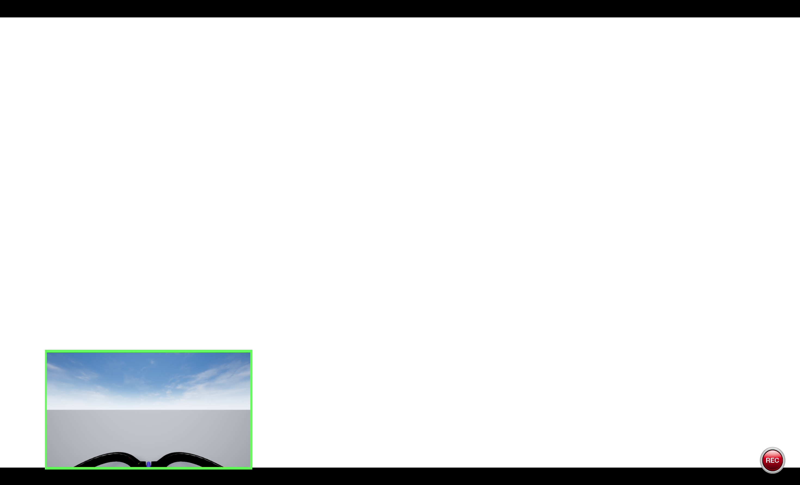
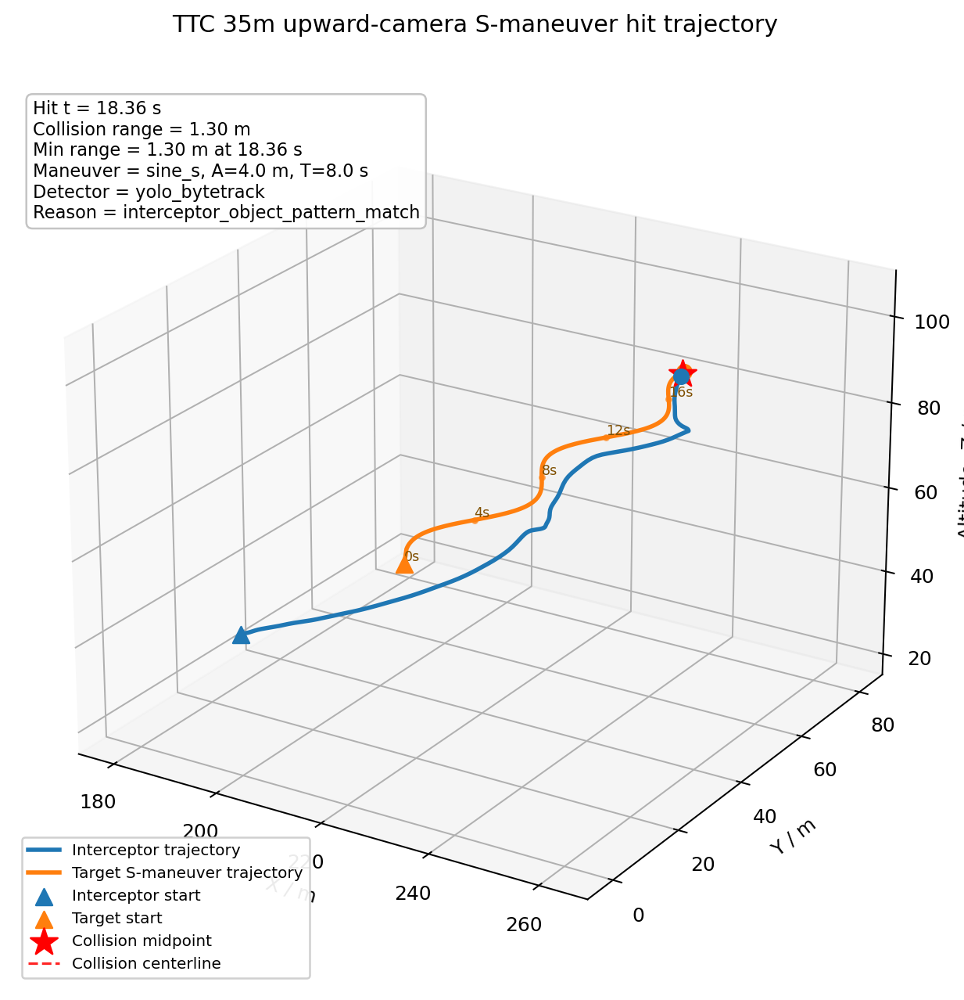
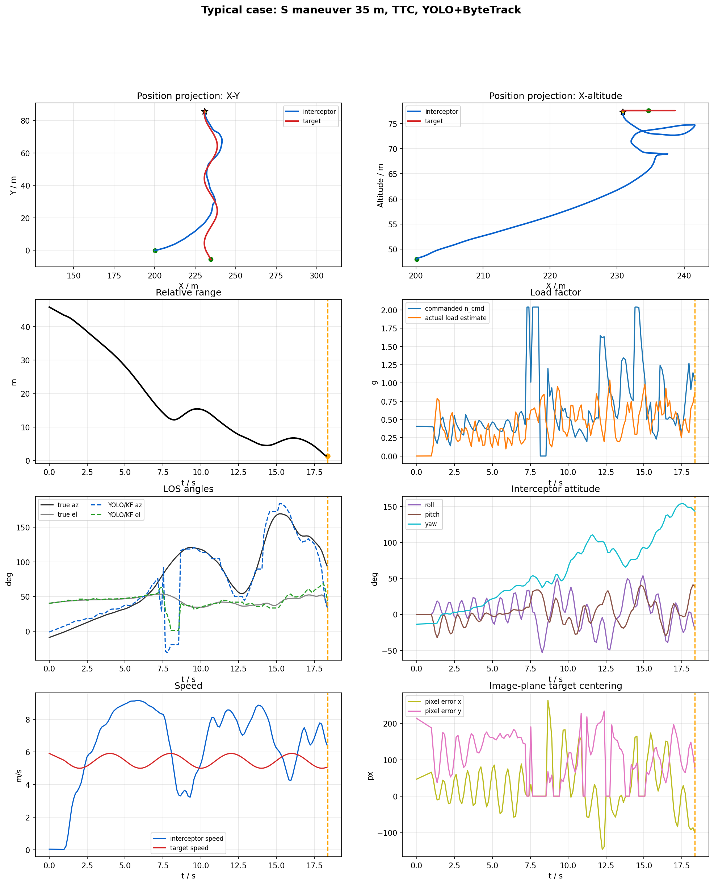
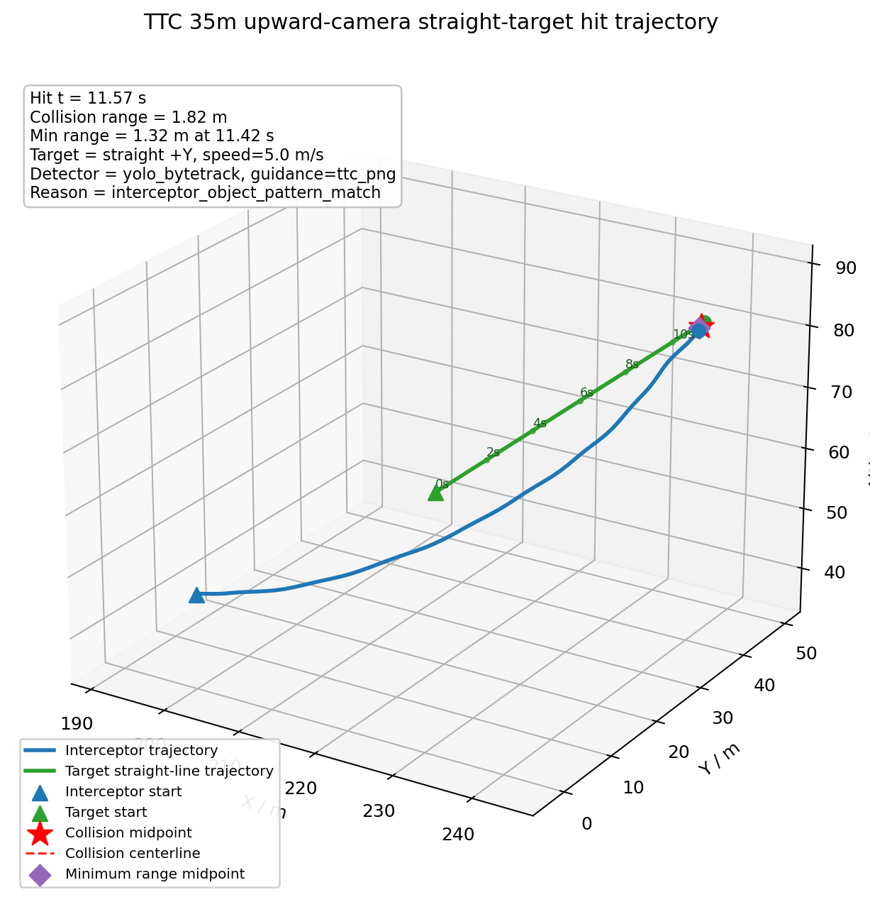

# YOLO+ByteTrack 上视相机 PNG 仿真结果汇总报告

## 1. 仿真场景说明

本轮仿真在 AirSim Blocks + PX4 SITL + Python 视觉导引工作区中搭建。AirSim 提供三维场景、碰撞判定、相机图像和目标 actor；PX4 SITL 负责拦截无人机底层姿态/角速度控制；Python 侧完成 YOLOv8 检测、ByteTrack 单目标跟踪、LOS 滤波、TTC/固定 `V_m` 比例导引、上视相机视场保持、末端盲区外推和实验日志记录。

该环境能够仿真固定上视相机纯视觉闭环拦截，包含目标直线飞行、多距离/侧向/高度差/速度组合，以及目标 S 型机动。成功判据采用 AirSim collision；near-hit 只作为诊断指标，不计入命中。

## 2. 仿真条件设置

| 类别 | 参数 | 设置 |
| --- | --- | --- |
| 场景 | AirSim settings | `config/airsim_blocks_px4_actor_upward_camera_settings.json` |
| 拦截机 | 控制链路 | PX4 SITL，`mavlink_body_rate`，`accel_body_rate` 输出 |
| 拦截机 | PNG 输出 | 需用加速度 -> 机体系 `p/q/r` 角速度 + thrust |
| 拦截机 | 最大导引加速度 | `20.0 m/s^2` |
| 拦截机 | body-rate 限制 | roll/pitch 角速度 `120 deg/s`，最大倾角 `35 deg` |
| 目标 | 模型 | `IntruderActor`，asset `Quadrotor1`，scale `1.5` |
| 目标 | 基准速度 | S 机动 `5 m/s`；matrix15 为 `3/5/7 m/s` |
| 目标 | S 机动 | `sine_s`，幅值 `4.0 m`，周期 `8.0 s`，相位 `0 deg` |
| 几何 | S 机动距离 | `30/35/40/45/50 m`，侧向 `-10 m`，高度差 `30 m` |
| 几何 | matrix15 | 距离 `25-55 m`，侧向 `-20-20 m`，高度差 `20-40 m` |
| 视觉 | 检测/跟踪 | YOLOv8 `vision_guidance/best.pt` + `bytetrack.yaml` |
| 视觉 | 参数 | conf `0.05`，IoU `0.7`，imgsz `640`，单目标跟踪 |
| 相机 | 上视固定相机 | FOV `120 deg`，分辨率 `640x480`，相机 pitch `-90 deg` |
| LOS | 滤波 | `q_lambda=0.0005`，`q_lambda_dot=0.02`，`r=0.008` |
| 导引 | TTC | `ttc_png`，TTC 用于增益调度并保留 LOS/`V_m` soft guidance |
| 导引 | VM | `fixed_vm_png`，固定 `N * V_m`，不使用 TTC |

## 3. 仿真结果汇总说明

数据来源为 `YOLO_ByteTrack_upward_matrix15_多工况性能测试报告.md` 和 `YOLO_ByteTrack_upward_baseline_S机动_30_50测试报告.md`。合并后的机器可读指标见 `assets/YOLO_ByteTrack_upward_仿真结果汇总报告/combined_metrics.csv`。

### 3.1 总体结果

| 场景 | 算法 | 工况数 | 碰撞命中 | 脱靶量范围/m | 命中时间范围/s | 最大需用过载/g | 平均检测率 |
| --- | --- | ---: | ---: | ---: | ---: | ---: | ---: |
| S-maneuver 30-50m | TTC | 5 | 2/5 | 1.30-11.90 | 18.36-19.40 | 2.04 | 60.3% |
| S-maneuver 30-50m | VM | 5 | 0/5 | 3.01-5.60 | - | 2.04 | 30.3% |
| matrix15 | TTC | 15 | 12/15 | 0.95-58.43 | 10.25-17.89 | 2.04 | 82.0% |
| matrix15 | VM | 15 | 5/15 | 1.19-9.42 | 10.71-16.26 | 2.04 | 61.9% |

### 3.2 S 机动 30-50m 明细

| 工况 | 算法 | 结果 | 脱靶量/m | 命中时间/s | 最大需用过载/g | 最大实际过载/g | 检测率 |
| --- | --- | --- | ---: | ---: | ---: | ---: | ---: |
| S型 30m | TTC | 命中 | 1.58 | 19.40 | 2.04 | 1.07 | 95.3% |
| S型 30m | VM | 未命中 | 4.94 | - | 2.04 | 0.90 | 26.5% |
| S型 35m | TTC | 命中 | 1.30 | 18.36 | 2.04 | 1.04 | 81.3% |
| S型 35m | VM | 未命中 | 5.60 | - | 2.04 | 0.99 | 28.0% |
| S型 40m | TTC | 未命中 | 11.90 | - | 2.04 | 0.92 | 21.5% |
| S型 40m | VM | 未命中 | 3.93 | - | 2.04 | 0.83 | 29.5% |
| S型 45m | TTC | 未命中 | 2.78 | - | 2.04 | 1.11 | 60.2% |
| S型 45m | VM | 未命中 | 4.22 | - | 2.04 | 0.93 | 35.6% |
| S型 50m | TTC | 未命中 | 2.54 | - | 2.04 | 0.96 | 43.0% |
| S型 50m | VM | 未命中 | 3.01 | - | 1.78 | 0.80 | 31.8% |

### 3.3 matrix15 多工况明细

| 工况 | 算法 | 结果 | 脱靶量/m | 命中时间/s | 最大需用过载/g | 最大实际过载/g | 检测率 |
| --- | --- | --- | ---: | ---: | ---: | ---: | ---: |
| M01: 距离40 / 侧向-10 / 高差30 / 速度5.0 | TTC | 命中 | 1.66 | 11.18 | 2.04 | 0.84 | 100.0% |
| M01: 距离40 / 侧向-10 / 高差30 / 速度5.0 | VM | 命中 | 1.85 | 10.71 | 0.68 | 0.81 | 96.3% |
| M02: 距离25 / 侧向-10 / 高差30 / 速度5.0 | TTC | 命中 | 1.47 | 10.25 | 2.04 | 0.81 | 94.8% |
| M02: 距离25 / 侧向-10 / 高差30 / 速度5.0 | VM | 未命中 | 2.50 | - | 2.04 | 1.11 | 97.1% |
| M03: 距离55 / 侧向-10 / 高差30 / 速度5.0 | TTC | 命中 | 1.16 | 14.09 | 2.04 | 0.86 | 86.1% |
| M03: 距离55 / 侧向-10 / 高差30 / 速度5.0 | VM | 未命中 | 6.72 | - | 1.21 | 0.90 | 22.8% |
| M04: 距离40 / 侧向0 / 高差30 / 速度5.0 | TTC | 命中 | 1.35 | 11.93 | 2.04 | 0.81 | 96.7% |
| M04: 距离40 / 侧向0 / 高差30 / 速度5.0 | VM | 未命中 | 4.92 | - | 2.04 | 1.02 | 40.2% |
| M05: 距离40 / 侧向-20 / 高差30 / 速度5.0 | TTC | 未命中 | 1.76 | - | 2.04 | 0.87 | 28.0% |
| M05: 距离40 / 侧向-20 / 高差30 / 速度5.0 | VM | 命中 | 1.82 | 11.10 | 2.04 | 0.96 | 90.2% |
| M06: 距离40 / 侧向20 / 高差30 / 速度5.0 | TTC | 命中 | 1.05 | 17.89 | 2.04 | 1.00 | 88.2% |
| M06: 距离40 / 侧向20 / 高差30 / 速度5.0 | VM | 未命中 | 4.05 | - | 2.04 | 1.02 | 34.5% |
| M07: 距离40 / 侧向-10 / 高差20 / 速度5.0 | TTC | 命中 | 1.23 | 14.11 | 2.04 | 0.99 | 78.3% |
| M07: 距离40 / 侧向-10 / 高差20 / 速度5.0 | VM | 未命中 | 3.00 | - | 2.04 | 0.76 | 14.1% |
| M08: 距离40 / 侧向-10 / 高差40 / 速度5.0 | TTC | 命中 | 1.66 | 13.29 | 2.04 | 0.85 | 98.0% |
| M08: 距离40 / 侧向-10 / 高差40 / 速度5.0 | VM | 未命中 | 1.56 | - | 2.04 | 0.94 | 43.9% |
| M09: 距离30 / 侧向-10 / 高差30 / 速度3.0 | TTC | 命中 | 1.51 | 12.49 | 2.04 | 0.76 | 89.1% |
| M09: 距离30 / 侧向-10 / 高差30 / 速度3.0 | VM | 命中 | 1.20 | 12.20 | 2.04 | 0.71 | 94.2% |
| M10: 距离30 / 侧向-10 / 高差30 / 速度7.0 | TTC | 未命中 | 1.90 | - | 2.04 | 1.14 | 84.2% |
| M10: 距离30 / 侧向-10 / 高差30 / 速度7.0 | VM | 未命中 | 2.99 | - | 2.04 | 1.17 | 82.0% |
| M11: 距离50 / 侧向-10 / 高差30 / 速度3.0 | TTC | 命中 | 1.28 | 14.77 | 1.17 | 0.76 | 94.7% |
| M11: 距离50 / 侧向-10 / 高差30 / 速度3.0 | VM | 命中 | 1.19 | 16.26 | 2.04 | 0.80 | 88.8% |
| M12: 距离50 / 侧向-10 / 高差30 / 速度7.0 | TTC | 命中 | 1.72 | 12.56 | 1.28 | 0.67 | 96.8% |
| M12: 距离50 / 侧向-10 / 高差30 / 速度7.0 | VM | 未命中 | 3.30 | - | 2.04 | 1.22 | 54.2% |
| M13: 距离45 / 侧向-20 / 高差40 / 速度7.0 | TTC | 命中 | 0.95 | 14.29 | 2.04 | 0.98 | 95.4% |
| M13: 距离45 / 侧向-20 / 高差40 / 速度7.0 | VM | 未命中 | 3.64 | - | 2.04 | 1.51 | 60.7% |
| M14: 距离55 / 侧向15 / 高差20 / 速度7.0 | TTC | 未命中 | 58.43 | - | 2.04 | 0.83 | 3.6% |
| M14: 距离55 / 侧向15 / 高差20 / 速度7.0 | VM | 未命中 | 9.42 | - | 2.04 | 1.22 | 12.8% |
| M15: 距离25 / 侧向20 / 高差40 / 速度3.0 | TTC | 命中 | 1.18 | 15.10 | 2.04 | 0.72 | 96.4% |
| M15: 距离25 / 侧向20 / 高差40 / 速度3.0 | VM | 命中 | 1.29 | 15.20 | 2.04 | 0.73 | 96.4% |

## 4. 典型仿真试验展示

下面选取一个 S 型 35m 和一个直线 35m 展示。S 型 35m 来自 `YOLO_ByteTrack_upward_baseline_S机动_30_50测试报告`；直线 35m 用同一 upward-camera YOLO+ByteTrack 链路的历史成功日志补充展示，因为 matrix15 中没有 35m 直线工况。总体统计结论仍以上述两个指定报告为准。

### 4.1 AirSim 场景图像

该图显示 AirSim Blocks 场景中的外部视角和第一人称上视相机小窗。拦截无人机固定上视相机通过图像中的目标框进入 YOLO+ByteTrack 链路，场景记录时同时保留碰撞状态和录制窗口信息。

### 4.2 S 型 35m 典型案例

S 型 35m 工况采用 TTC 导引，目标速度 `5 m/s`，高度差 `30 m`，侧向 `-10 m`，目标横向 S 机动幅值 `4 m`、周期 `8 s`。碰撞时间为 `18.363 s`，最小中心距离为 `1.303 m`。三维轨迹显示目标在横向持续摆动，拦截机需要同时完成追近、横向修正和上视相机视场保持。

相对距离曲线在末端快速收敛，碰撞前没有长时间停滞。需用过载最高约 `2.04 g`，但实际速度差分估计的最大过载约 `1.04 g`，说明导引需求受到 PX4 姿态/推力和 body-rate 限幅约束。LOS 曲线中真实 LOS 与 YOLO/KF LOS 在中段存在偏差，主要来自目标 S 机动、检测帧率和 LOS 滤波延迟；末端仍保持可用导引，因此触发 collision。姿态曲线显示 roll/pitch/yaw 在末端有明显调节，速度曲线显示拦截机速度随终端捕获阶段变化，目标速度基本围绕设定速度变化。

### 4.3 直线 35m 典型案例

直线 35m 工况同样使用 YOLO+ByteTrack 上视相机闭环和 TTC 导引。碰撞时间为 `11.568 s`，最小中心距离为 `1.324 m`。与 S 机动相比，目标横向扰动更小，LOS 变化更平滑，拦截所需时间明显缩短。

直线工况的需用过载峰值约 `0.73 g`，实际过载峰值约 `1.06 g`。由于目标不做周期横向机动，LOS 角变化主要由接近几何决定，YOLO/KF LOS 与真值 LOS 的差异较小。姿态变化也更连续，说明直线条件下主要难点不是控制权限，而是末端检测连续性和相机视场保持。

## 5. 仿真结果总结

TTC 在本批数据中显著优于固定 `V_m` 导引。matrix15 中 TTC 碰撞命中 `12/15`，VM 为 `5/15`；S 机动 30-50m 中 TTC 命中 `2/5`，VM 为 `0/5`。这说明在视觉帧率约 6-10 FPS、上视固定相机和末端遮挡/裁切存在的条件下，TTC 增益调度和 soft guidance 对末端收敛更有利。

S 机动明显压缩了可拦截边界。TTC 在 30m、35m 可以命中，但 40m 后检测连续性下降，40m 工况最近距离扩大到 `11.90 m`；45m 和 50m 虽接近到 `2.78 m`、`2.54 m`，但未触发 collision。这里的主要限制不是单纯 PNG 公式，而是目标出视场、YOLO/ByteTrack 丢检、LOS/KF 外推误差和 PX4 实际过载无法完全跟随需用过载。

matrix15 的失败工况也与检测连续性强相关。典型失效如 M14，TTC 检测率仅 `3.6%`，脱靶量达到 `58.43 m`；VM 多数失败工况检测率低于 TTC，且固定增益对速度、高度差和侧向偏置的适应性较弱。

后续优化优先级建议如下：第一，继续优化末端视场保持和盲区外推，特别是 bbox 底部裁切、目标短时丢失和图像 KF 接管条件；第二，对 body-rate v2 控制链路做系统复测，降低需用过载与实际过载之间的差距；第三，针对 S 机动增加目标横向速度/加速度估计，把 LOS 外推从恒速图像模型升级为带横向机动项的短时预测；第四，在报告中单独区分 collision、near-hit 和最小距离，避免把近距擦过误判为有效命中。

## 文件索引

| 文件 | 说明 |
| --- | --- |
| `完整方案/YOLO_ByteTrack_upward_matrix15_多工况性能测试报告.md` | matrix15 源报告 |
| `完整方案/YOLO_ByteTrack_upward_baseline_S机动_30_50测试报告.md` | S 机动源报告 |
| `完整方案/assets/YOLO_ByteTrack_upward_仿真结果汇总报告/combined_metrics.csv` | 本报告合并指标 |
| `完整方案/assets/YOLO_ByteTrack_upward_仿真结果汇总报告/typical_s_maneuver_35m_curves.png` | S 35m 典型曲线 |
| `完整方案/assets/YOLO_ByteTrack_upward_仿真结果汇总报告/typical_straight_35m_curves.png` | 直线 35m 典型曲线 |
| `完整方案/assets/YOLO_ByteTrack_upward_仿真结果汇总报告/airsim_scene_recording_view.png` | AirSim 场景截图 |
| `logs/yolo_sitl_ttc_vm/yolo_sitl_TTC_upward_baseline_s_maneuver_30_50_20260701_231523_r35_h30.csv` | S 35m TTC 日志 |
| `logs/yolo_sitl_ttc_vm/yolo_sitl_TTC_upward_final_yolo_35_40_20260628_173525_r35_h30.csv` | 直线 35m TTC 展示日志 |
