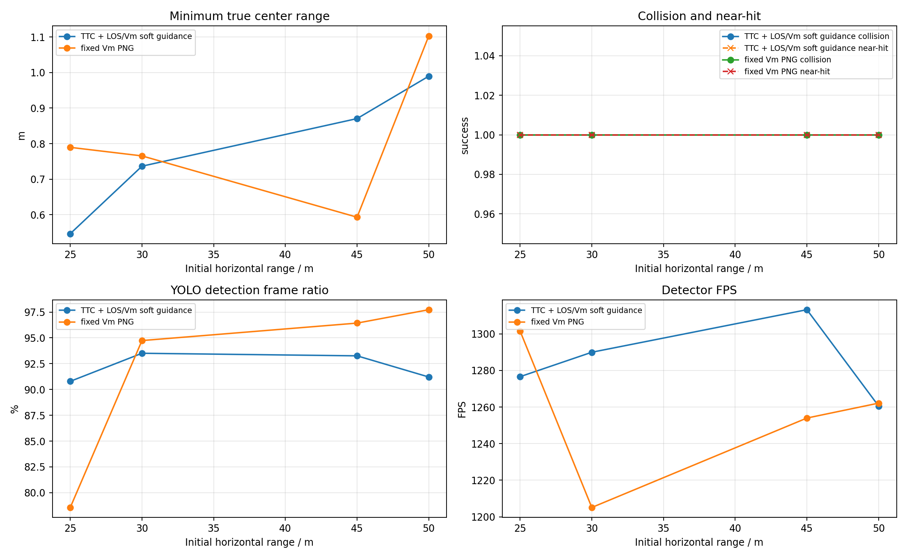
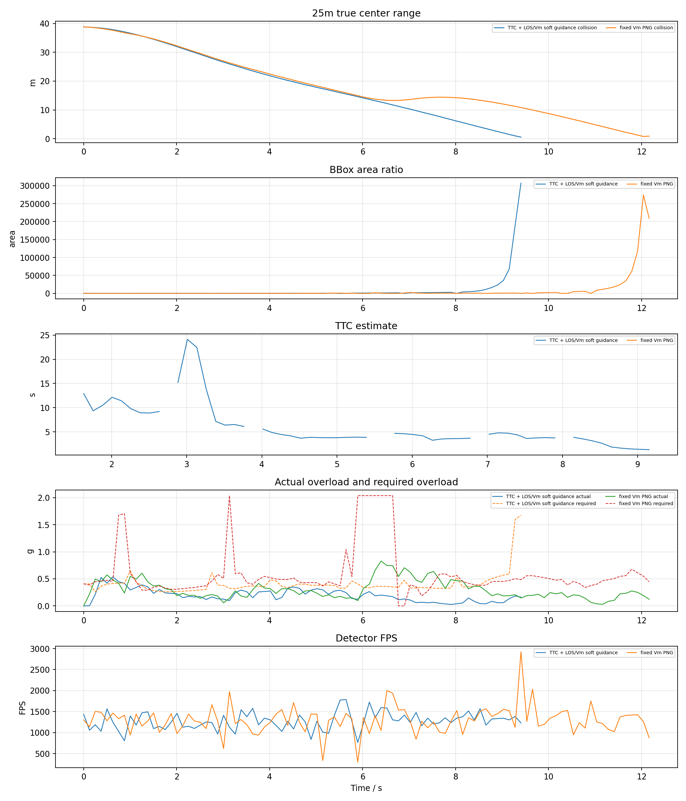
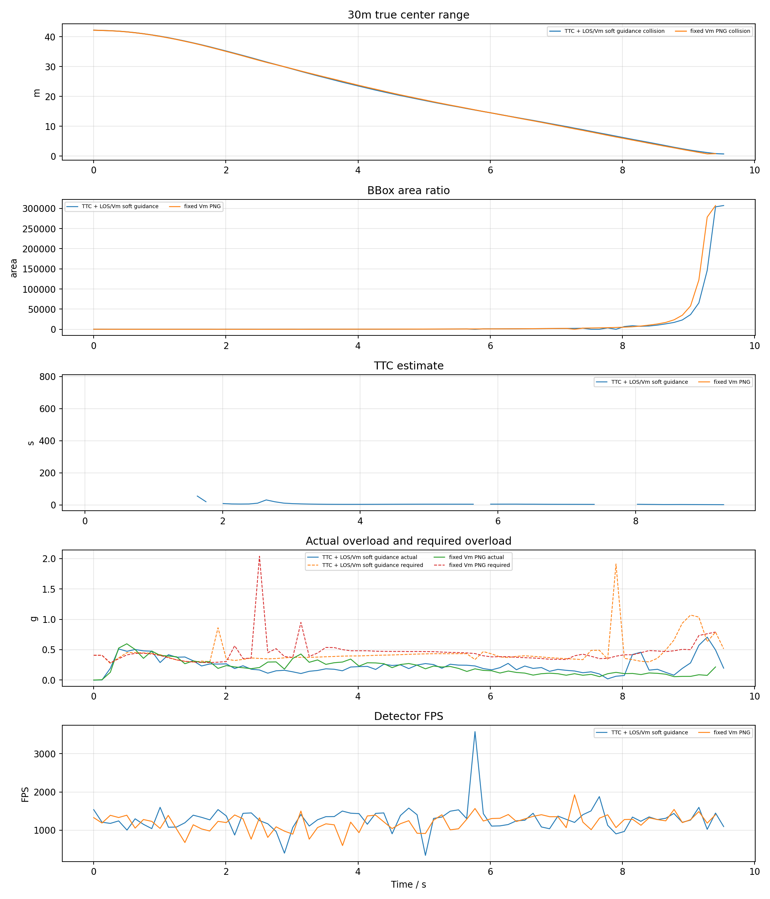
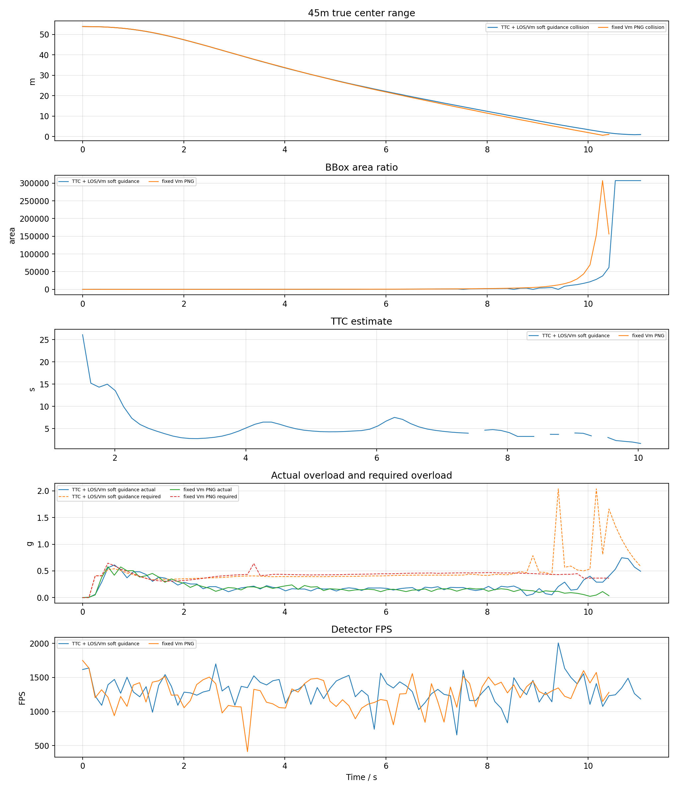
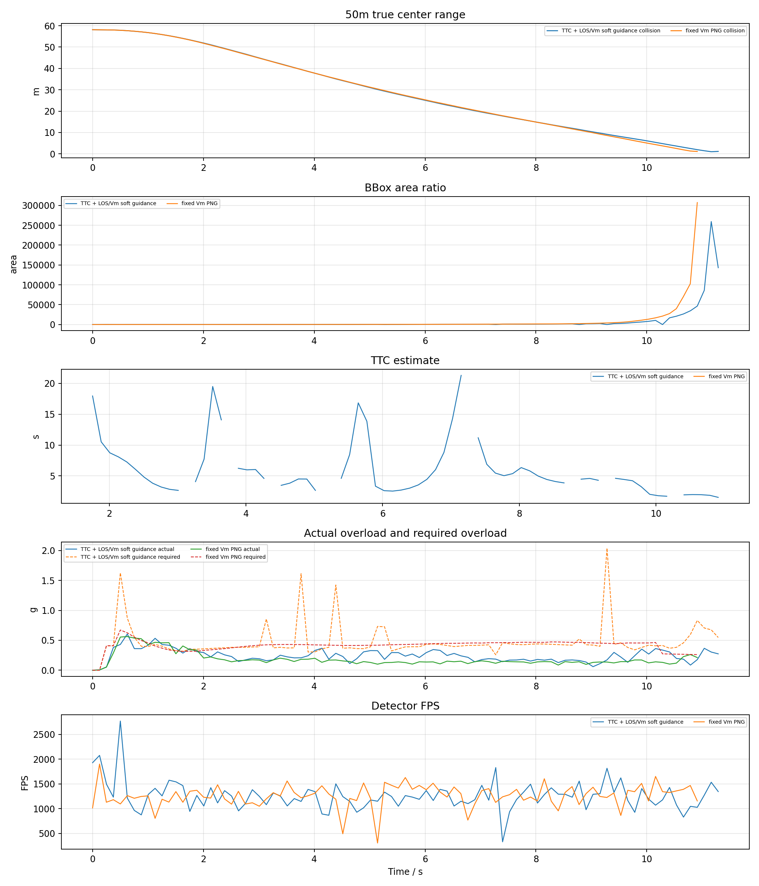
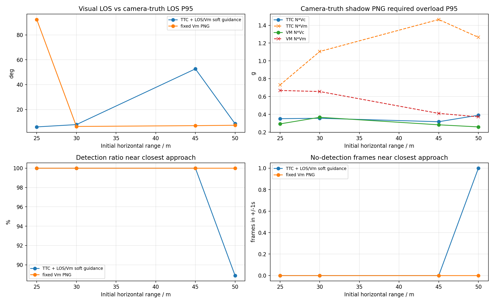

# YOLO + ByteTrack PX4 SITL upward-camera body-rate TTC / V_m 20-30m smoke report

## 1. 实验目的

按照此前已命中的 YOLO 案例配置，改用真正 PX4 SITL actor 场景，比较两种捷联视觉比例导引。本报告优先使用 `n_cmd_g` 作为需用过载；旧日志没有该字段时才回退到 `g_eval` 等效过载。

- `TTC` 组：`ttc_png`，TTC 只参与增益调度，并保留 LOS/Vm soft guidance。
- `VM` 组：`fixed_vm_png`，不使用 TTC，固定 `N * V_m` 导引增益。
- `accel_integral` 输出模式：导引律先计算 `a_cmd` / `n_cmd_g`，再按当前仿真步长积分为速度 setpoint；这不是直接向 PX4 发送加速度 setpoint。
- `accel_body_rate` 输出模式：导引律先计算 PNG 需用加速度，再转换为 PX4 `SET_ATTITUDE_TARGET` 机体系角速度 `p/q/r` 和 thrust；速度只作为沿 LOS 保速参考，不再把 PNG 横向修正直接加到速度指令上。
- `accel_attitude` 输出模式：导引律先计算 PNG 需用加速度，再转换为 PX4 `SET_ATTITUDE_TARGET` 姿态四元数和 thrust；速度只作为沿 LOS 保速参考。

Upward fixed camera smoke test: TTC and V_m each run 20m and 30m horizontal range, 30m altitude offset, -10m lateral offset, legacy body-rate control with near-hit diagnostics.

## 2. 基准条件

|参数|值|
|---|---|
|stamp|`upward_final_detect_more_20260628_172443`|
|settings|`/home/linux/Documents/PNG-px4-upward-camera/config/airsim_blocks_px4_actor_upward_camera_settings.json`|
|拦截机|`PX4 SITL / mavlink_body_rate`|
|目标 actor|`IntruderActor`|
|actor asset|`Quadrotor1`|
|actor scale|`1.5`|
|检测源|`airsim`|
|YOLO model|`vision_guidance/best.pt`|
|YOLO device|`0` runtime ``|
|YOLO conf / iou / imgsz|`0.05` / `0.7` / `640`|
|tracker|`bytetrack.yaml`，single target `True`|
|相机外参|`x=0.0, y=0.0, z=0.0`|
|upward centering|`True`, gain `8.0`, max accel `4.0 m/s^2`|
|near-hit radius|`1.5 m`|
|FOV / resolution|`120.0 deg`, `640x480`|
|高度差|`30.0 m`|
|目标速度 / speed ratio|`5.0 m/s` / `2.0`|
|rate_hz|`8.0`|
|guidance output|`accel_body_rate`|
|max guidance accel|`20.0 m/s^2`|
|min speed ratio|`0.6`|
|thrust model|`empirical`, mass `1.0 kg`, max total thrust `16.717785072 N`|
|body-rate tilt / attitude P|`35.0 deg` / `4.0`|
|body-rate roll/pitch max rate|`120.0` / `120.0 deg/s`|
|body-rate profile|`legacy`|
|body-rate v2 Kp roll/pitch/yaw|`5.0` / `5.0` / `3.0`|
|body-rate v2 max pq / slew pq-r|`120.0 deg/s` / `720.0`-`540.0 deg/s^2`|
|body-rate v2 thrust reserve / guard|`0.15` / error `0.55`, PNG scale `0.6`, speed-hold scale `0.45`|
|body-rate thrust|min/hover/max `0.25` / `0.5` / `0.85`|
|body-rate speed hold|gain `1.2`, max accel `8.0 m/s^2`, total limit `28.0 m/s^2`|
|attitude tilt / yaw lookahead|`25.0 deg` / `0.25 s`|
|attitude thrust|min/hover/max `0.25` / `0.5865998371` / `0.95`|
|attitude speed hold|gain `1.2`, max accel `6.0 m/s^2`, total limit `18.0 m/s^2`|
|LOS filter|`1`|
|LOS KF q lambda / lambda_dot|`0.0005` / `0.02`|
|LOS KF r / innovation gate|`0.008` / `0.75`|
|LOS terminal gate / delay|`1.2` / `0.18 s`|
|terminal image KF|predict `1.0 s`, reject `0.35 rad`, soft reject `1`|
|terminal image KF dynamics|accel noise `8.0 rad/s^2`, max rate `12.0 rad/s`|
|terminal velocity blind-push|`False`|
|terminal blind requires visual loss|`1`|
|terminal accel hold|`True`, window `0.35 s`, decay `0.6 s`, max `20.0 m/s^2`|
|frame_guard|`True`|
|bbox noise|`0`|

## 3. 总览图



## 4. 汇总表

|组别|碰撞命中|近距命中|碰撞距离m|近距距离m|未命中距离m|最小中心距离m|检测帧/总帧|有效帧/总帧|平均检测FPS|
|---|---:|---:|---|---|---|---:|---:|---:|---:|
|TTC|4/4|4/4|25, 30, 45, 50|25, 30, 45, 50|-|0.547|307/333|316/333|1285.07|
|VM|4/4|4/4|25, 30, 45, 50|25, 30, 45, 50|-|0.593|316/346|329/346|1255.69|

## 5. 明细表

|组别|距离m|碰撞|近距|碰撞时间s|近距时间s|近距距离m|最小距离m|终点距离m|检测帧率|有效帧率|YOLO FPS|sim FPS|实际过载max g|速度指令差分P95 g|需用过载P95 g|
|---|---:|---:|---:|---:|---:|---:|---:|---:|---:|---:|---:|---:|---:|---:|---:|
|TTC|25|1|1|9.41|9.15|1.482|0.547|0.547|90.8%|100.0%|1276.59|7.98|0.54|0.76|0.60|
|VM|25|1|1|12.16|11.91|1.263|0.790|0.909|78.6%|86.7%|1301.51|7.98|0.83|1.31|2.04|
|TTC|30|1|1|9.53|9.28|1.192|0.737|0.737|93.5%|97.4%|1289.94|7.97|0.71|0.78|0.88|
|VM|30|1|1|9.41|9.16|1.261|0.766|0.820|94.7%|100.0%|1205.13|7.97|0.60|0.92|0.74|
|TTC|45|1|1|11.04|10.54|1.400|0.870|0.948|93.3%|89.9%|1313.18|7.97|0.75|1.12|1.01|
|VM|45|1|1|10.41|10.16|1.177|0.593|1.027|96.4%|97.6%|1253.98|7.97|0.58|0.75|0.49|
|TTC|50|1|1|11.29|11.04|1.447|0.990|1.129|91.2%|93.4%|1260.56|7.97|0.61|1.19|0.86|
|VM|50|1|1|10.91|10.79|1.316|1.103|1.103|97.7%|97.7%|1262.13|7.97|0.56|0.72|0.47|

## 6. 分距离曲线

每个距离一张图，包含真实中心距离、bbox 面积、TTC 估计、实际过载/需用过载和 YOLO 检测 FPS。






## 7. LOS KF 与失败原因诊断

|组别|距离m|最近距离m|最近点状态|主要失败/降级原因|检测率|有效率|
|---|---:|---:|---|---|---:|---:|
|TTC|25|0.547|`bbox_bottom_clipped`|valid:55, area_not_expanding:12, image_kf_predict:7, bbox_bottom_clipped:2|90.8%|100.0%|
|VM|25|0.790|`terminal_lost`|valid:71, image_kf_predict:12, terminal_lost:11, bbox_bottom_clipped:3|78.6%|86.7%|
|TTC|30|0.737|`terminal_lost`|valid:57, area_not_expanding:12, image_kf_predict:5, terminal_lost:2|93.5%|97.4%|
|VM|30|0.766|`bbox_bottom_clipped`|valid:69, image_kf_predict:4, bbox_bottom_clipped:3|94.7%|100.0%|
|TTC|45|0.870|`terminal_lost`|valid:65, area_not_expanding:10, terminal_lost:7, image_kf_predict:4|93.3%|89.9%|
|VM|45|0.593|`bbox_bottom_clipped`|valid:76, bbox_bottom_clipped:5, no_detection:2, image_kf_predict:1|96.4%|97.6%|
|TTC|50|0.990|`terminal_lost`|valid:65, area_not_expanding:11, image_kf_predict:5, bbox_bottom_clipped:4|91.2%|93.4%|
|VM|50|1.103|`bbox_bottom_clipped`|valid:80, bbox_bottom_clipped:6, no_detection:2|97.7%|97.7%|

- LOS KF 参数：`q_lambda=0.0005`、`q_lambda_dot=0.02`、`r=0.008`、`innovation_reject=0.75`、`terminal_reject=1.2`。
- 本轮平均实际过载峰值约 `0.65 g`，平均需用过载 P95 约 `0.89 g`。两者不是同一个量：`n_cmd_g` 是导引层需求，实际过载还受 PX4 姿态/推力限制、YOLO 约 9 FPS 采样和 frame centering 限速影响。

## 8. 相机光心真值影子测试诊断



影子测试不参与导引，只用日志中的相机光心 `camera_world_*` 与目标真值位置离线计算经典 `N*Vc` 和固定 `N*Vm` PNG 理论需用过载，并和视觉 LOS、检测连续性对齐。

|组别|距离m|碰撞|最小距离m|最近点检测率|最近点无检测帧|视觉LOS误差P95|影子N*Vc P95 g|影子N*Vm P95 g|视觉需用P95 g|实际过载max g|
|---|---:|---:|---:|---:|---:|---:|---:|---:|---:|---:|
|TTC|25|1|0.547|100.0%|0/8|19.7|0.35|0.73|0.60|0.54|
|VM|25|1|0.790|100.0%|0/9|17.1|0.29|0.67|2.04|0.83|
|TTC|30|1|0.737|100.0%|0/8|12.5|0.36|1.11|0.88|0.71|
|VM|30|1|0.766|100.0%|0/9|34.2|0.37|0.66|0.74|0.60|
|TTC|45|1|0.870|100.0%|0/9|62.1|0.32|1.46|1.01|0.75|
|VM|45|1|0.593|100.0%|0/9|23.3|0.28|0.41|0.49|0.58|
|TTC|50|1|0.990|88.9%|1/9|23.8|0.39|1.27|0.86|0.61|
|VM|50|1|1.103|100.0%|0/8|29.5|0.26|0.37|0.47|0.56|

- 如果影子 `N*Vc` P95 很低但视觉 LOS 误差和无检测帧较高，优先定位检测连续性、LOS KF/外推和 frame-centering。
- 如果视觉需用过载高而实际过载低，优先定位 PX4 姿态/推力响应、倾角限制和 speed-hold 混合项。

## 9. body-rate 控制诊断

|组别|距离m|最近距离m|frame-centering激活|推力饱和|p/q/r峰值deg/s|roll/pitch指令峰值deg|thrust min/max|
|---|---:|---:|---:|---:|---|---|---|
|TTC|25|0.547|28.9%|2.6%|120.0/120.0/30.8|35.0/35.0|0.58/0.85|
|VM|25|0.790|54.1%|12.2%|120.0/120.0/60.0|35.0/35.0|0.25/0.85|
|TTC|30|0.737|72.7%|1.3%|120.0/120.0/60.0|35.0/35.0|0.38/0.85|
|VM|30|0.766|59.2%|1.3%|120.0/120.0/29.8|35.0/35.0|0.25/0.84|
|TTC|45|0.870|97.8%|2.2%|120.0/120.0/60.0|35.0/35.0|0.25/0.75|
|VM|45|0.593|97.6%|0.0%|37.0/120.0/44.5|13.1/35.0|0.50/0.76|
|TTC|50|0.990|95.6%|3.3%|120.0/120.0/49.2|35.0/35.0|0.25/0.85|
|VM|50|1.103|97.7%|0.0%|58.4/120.0/60.0|12.6/35.0|0.50/0.75|

- 本轮 `body_rate_control_profile=legacy`。legacy body-rate 使用欧拉角误差比例环，没有 v2 的 frame guard 降权和 slew rate limit。
- `frame-centering激活` 表示固定上视相机进入视场保持/末端捕获/丢失保持状态的比例；比例高时，命中结果更受视场保持策略和 yaw 丢失外推影响。
- `推力饱和` 与 `thrust min/max` 用于判断末端是否被垂向机动和总推力限制约束；若饱和高，应优先放宽 thrust、tilt 或垂向速度上限。

## 10. PNG 到过载、姿态和角速度的控制流程

本轮实际使用 `guidance_output=accel_body_rate`、`px4_command_mode=mavlink_body_rate`、`body_rate_control_profile=legacy`。因此控制链路是“PNG 需用加速度 -> 合成控制加速度 -> PX4 `SET_ATTITUDE_TARGET` 机体系 `p/q/r` 角速度 + thrust”。

### 10.1 视觉量到 6D LOS

YOLOv8 + ByteTrack 输出 `bbox center=(u,v)`、`bbox area`、`track_id` 和置信度。bbox 中心先通过相机内参转换成相机坐标系单位射线：

```text
x_n = (u - cx) / fx
y_n = (v - cy) / fy
lambda_C = normalize([x_n, y_n, 1])
```

再使用相机外参和机体姿态转到惯性系：

```text
lambda_I = normalize(R_IB * R_BC * lambda_C)
```

其中 `R_BC` 是相机到机体的固定安装旋转，`R_IB` 是机体到惯性系的姿态。LOS 角速度由相邻 LOS 差分并投影到垂直 LOS 的平面得到：

```text
lambda_dot = project_perpendicular((lambda_I[k] - lambda_I[k-1]) / dt, lambda_I[k])
omega_LOS = lambda_I x lambda_dot
```

启用 LOS KF 时，滤波器输出平滑后的 `lambda_I` 和 `omega_LOS`；末端允许更松的 innovation gate，避免目标仍在检测框内时 PNG 加速度被过早清零。

### 10.2 PNG 生成需用加速度和需用过载

两种导引的共同输出都是导引层需用加速度 `a_cmd`：

```text
a_cmd = guidance_gain * (omega_LOS x lambda_I)
a_cmd = clip_norm(a_cmd, max_guidance_accel_mps2)
n_cmd_g = ||a_cmd|| / g
```

`omega_LOS x lambda_I` 给出垂直于视线的修正方向；`n_cmd_g` 是导引层需用过载，只表示 PNG 希望产生的机动强度。它不等于无人机真实过载，真实过载还受 PX4 姿态控制、推力限制、速度保持项、视觉帧率和 frame centering 限速影响。

TTC 组使用 bbox 面积扩张估计 `TTC ~= A / A_dot`，当前只把 TTC 用作增益调度和末端触发；当 TTC 无效但 LOS 有效时，仍保留 LOS/V_m soft guidance。V_m 组不使用 TTC，直接采用固定：

```text
guidance_gain = N * V_m
V_m = speed_ratio * intruder_speed
```

### 10.3 与速度保持项合成

在 `accel_attitude` 和 `accel_body_rate` 中，PNG 横向修正不再积分成速度指令。速度只作为沿 LOS 的保速参考：

```text
v_ref = speed_cap * lambda_I
a_speed_hold = K_v * (v_ref - v_current)
a_control_I = clip_norm(a_cmd + a_speed_hold, total_accel_limit)
```

`a_cmd` 是纯 PNG 需用加速度；`a_speed_hold` 是工程闭环项，用于避免飞机速度掉到无法追击或过度横向漂移。报告中的 `n_cmd_g` 仍来自 `a_cmd`，而 `attitude_control_accel_*` / `body_rate_control_accel_*` 记录合成后的控制加速度。

### 10.4 加速度到姿态四元数链路

在 `accel_attitude + mavlink_attitude` 下，程序先由图像中心误差和 LOS 水平投影得到期望航向：

```text
yaw_sp = current_yaw + yaw_rate_cmd * attitude_yaw_lookahead_s
```

随后把惯性系合成加速度旋转到期望 yaw 对应的水平坐标系，得到 roll/pitch setpoint，并发送姿态四元数和 thrust。

### 10.5 加速度到机体系角速度链路

在 `accel_body_rate + mavlink_body_rate` 下，程序先把 `a_control_I` 转到机体系：

```text
a_control_B = R_BI * a_control_I
```

再得到期望 roll/pitch。legacy 用欧拉角误差比例环：

```text
p_cmd = K_att * (roll_sp  - roll)
q_cmd = K_att * (pitch_sp - pitch)
r_cmd = yaw_rate_cmd
```

body-rate v2 使用四元数误差：

```text
q_err = inverse(q_current) * q_desired
e_att = 2 * q_err.xyz
p_raw = Kp_roll  * e_att.x
q_raw = Kp_pitch * e_att.y
r_raw = Kp_yaw   * e_att.z + yaw_rate_cmd
```

随后做角速度限幅和斜率限制。v2 不增加一阶 LPF，只保留 slew rate limit，避免末端视觉闭环额外相位滞后。MAVLink 仍使用 `SET_ATTITUDE_TARGET`，但 `type_mask` 忽略姿态四元数，只让 PX4 接收 `body_roll_rate/body_pitch_rate/body_yaw_rate` 和 thrust。

v2 的 thrust 使用向量投影法，并通过 `body_rate_v2_thrust_reserve` 预留电机差速余量：

```text
z_B_I = R_IB * [0, 0, 1]^T
required_specific_force_I = [-a_control_I.x, -a_control_I.y, g - a_control_I.z]
thrust_raw = mass * dot(required_specific_force_I, z_B_I) / max_total_thrust
```

### 10.6 本报告中过载曲线的含义

- `需用过载 n_cmd_g`：由 PNG 的 `a_cmd` 直接换算，是导引层希望产生的过载。
- `实际过载 max g`：由拦截机真实速度差分估计，体现 PX4 和 AirSim 动力学真正实现出的机动。
- `速度指令差分 P95 g`：兼容旧速度输出模式的指标；在 `accel_body_rate` 和 `accel_attitude` 下主要作为参考，不代表直接发送给 PX4 的控制量。

因此，若 `n_cmd_g` 很平滑但实际过载不足，问题通常在姿态/推力响应、速度保持、限幅或视觉低帧率；若 `n_cmd_g` 本身突变，则应优先检查 LOS/KF、bbox 裁切、丢检外推和 frame guard 状态切换。

## 11. 结论

- TTC: 命中 `4/4`，命中距离 `25m, 30m, 45m, 50m`，未命中 `-`，检测帧比例 `92.2%`，有效导引帧比例 `94.9%`，平均检测 FPS `1285.07`。
- VM: 命中 `4/4`，命中距离 `25m, 30m, 45m, 50m`，未命中 `-`，检测帧比例 `91.3%`，有效导引帧比例 `95.1%`，平均检测 FPS `1255.69`。
- 本轮使用真实 YOLOv8 + ByteTrack，因此检测连续性和 GPU 推理速度会直接进入闭环；结果不能和 AirSim detect 函数的理想 bbox 直接等价比较。
- `accel_integral` 模式的 `n_cmd_g` 来自导引层 `a_cmd`，底层仍通过 PX4/AirSim 速度 setpoint 闭环；实际过载由真实速度差分估计，因此会同时受 PX4 响应、速度限幅和视觉帧率影响。
- `accel_body_rate` 模式下 `n_cmd_g` 仍表示纯 PNG 需用过载；实际发送给 PX4 的是 `SET_ATTITUDE_TARGET` 机体系 `p/q/r` 角速度和归一化 thrust，日志中的 `body_rate_control_accel_*` 额外包含沿 LOS 的速度保持加速度。
- `accel_attitude` 模式下 `n_cmd_g` 同样表示纯 PNG 需用过载；实际发送给 PX4 的是 `SET_ATTITUDE_TARGET` 姿态四元数和归一化 thrust，日志中的 `attitude_control_accel_*` 记录姿态指令生成前的合成加速度。
