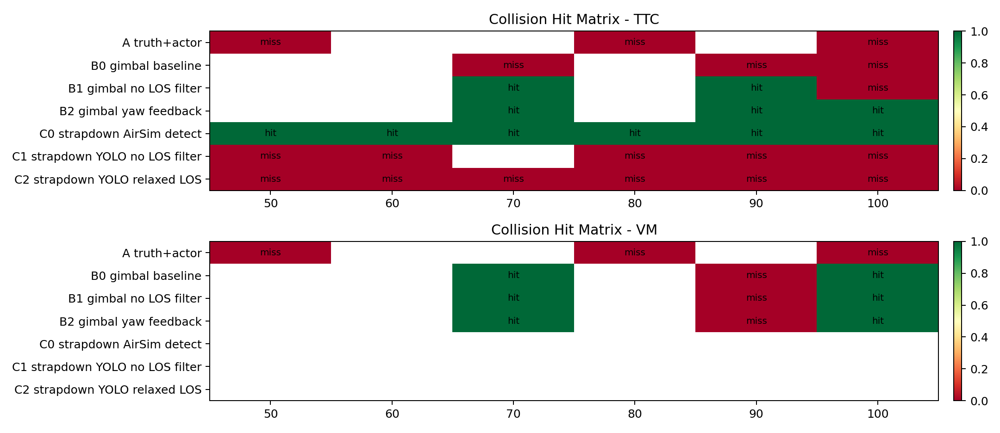
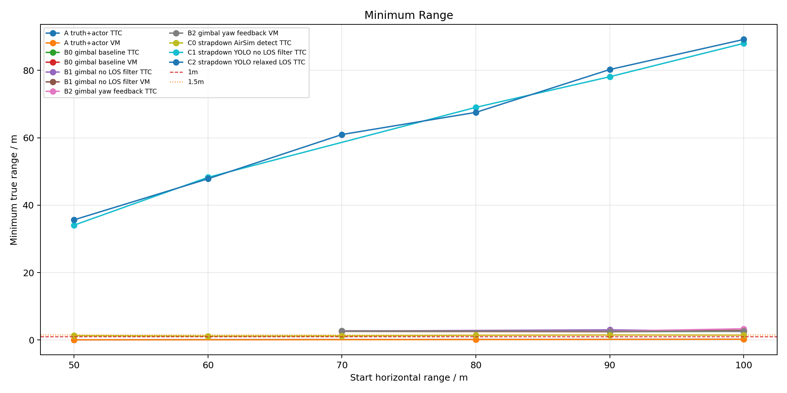
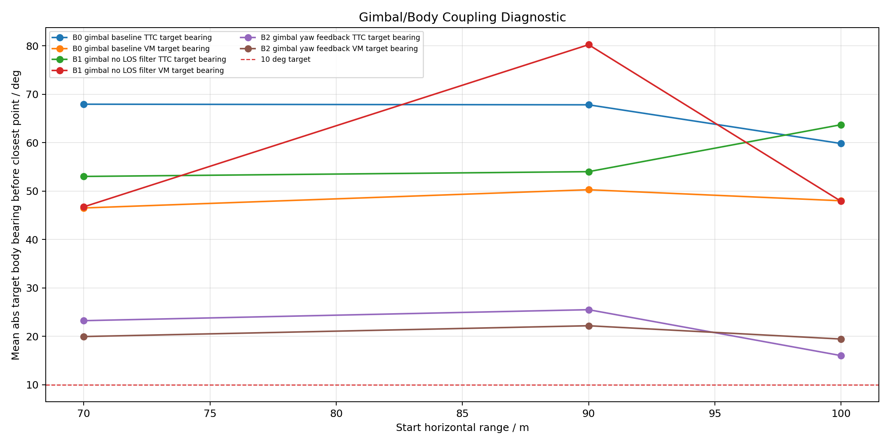
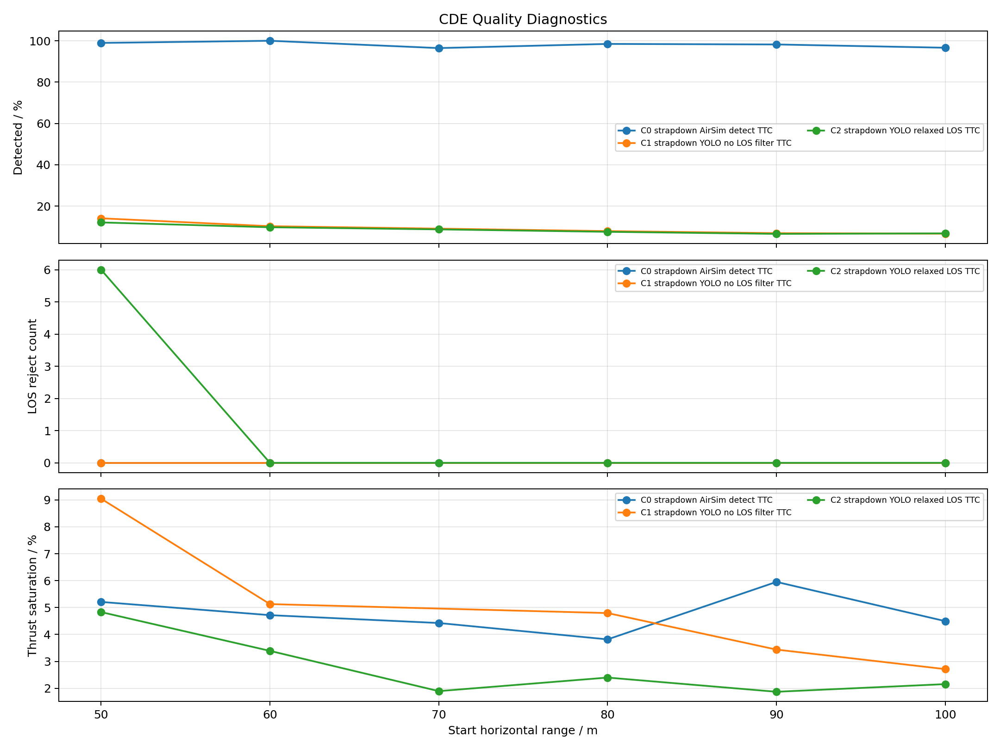

# BodyRate 三问题线实施实验报告

- stamp: `body_rate_three_20260628_075242`
- trajectory_dir: `/home/linux/Documents/PNG/logs/body_rate_three_lines`
- cases: `41`

## 1. 总览结论

- `A_truth_actor` A truth+actor: collision `0/6`, geometric<1.5m `6/6`, LOS reject `0`, mean thrust saturation `2.2%`.
- `B0` B0 gimbal baseline: collision `2/6`, geometric<1.5m `0/6`, LOS reject `7`, mean thrust saturation `0.1%`.
- `B1` B1 gimbal no LOS filter: collision `4/6`, geometric<1.5m `0/6`, LOS reject `0`, mean thrust saturation `18.6%`.
- `B2` B2 gimbal yaw feedback: collision `5/6`, geometric<1.5m `0/6`, LOS reject `0`, mean thrust saturation `18.1%`.
- `C0` C0 strapdown AirSim detect: collision `6/6`, geometric<1.5m `6/6`, LOS reject `0`, mean thrust saturation `4.8%`.
- `C1` C1 strapdown YOLO no LOS filter: collision `0/5`, geometric<1.5m `0/5`, LOS reject `0`, mean thrust saturation `5.0%`.
- `C2` C2 strapdown YOLO relaxed LOS: collision `0/6`, geometric<1.5m `0/6`, LOS reject `6`, mean thrust saturation `2.8%`.

## 2. 汇总图

## 3. 实验明细

|实验|导引|距离m|collision|geom<1m|geom<1.5m|geom<2m|min m|final m|检测率|有效率|body-rate率|推力饱和|LOS拒绝|最近点前body bearing|最近点状态|CSV|
|---|---:|---:|---:|---:|---:|---:|---:|---:|---:|---:|---:|---:|---:|---:|---|---|
|A truth+actor|TTC|50|0|1|1|1|0.06|6.89|100.0%|65.4%|100.0%|1.5%|0|||`body_rate_three_A_truth_actor_TTC_body_rate_three_20260628_075242_r50_h20.csv`|
|A truth+actor|TTC|80|0|1|1|1|0.17|0.66|100.0%|75.1%|100.0%|1.4%|0|||`body_rate_three_A_truth_actor_TTC_body_rate_three_20260628_075242_r80_h20.csv`|
|A truth+actor|TTC|100|0|1|1|1|0.22|5.70|100.0%|74.5%|100.0%|0.9%|0||not_closing|`body_rate_three_A_truth_actor_TTC_body_rate_three_20260628_075242_r100_h20.csv`|
|A truth+actor|VM|50|0|1|1|1|0.05|0.67|100.0%|72.1%|100.0%|6.4%|0||not_closing|`body_rate_three_A_truth_actor_VM_body_rate_three_20260628_075242_r50_h20.csv`|
|A truth+actor|VM|80|0|1|1|1|0.11|5.99|100.0%|68.2%|100.0%|2.4%|0||not_closing|`body_rate_three_A_truth_actor_VM_body_rate_three_20260628_075242_r80_h20.csv`|
|A truth+actor|VM|100|0|1|1|1|0.21|2.25|100.0%|70.6%|100.0%|0.9%|0||not_closing|`body_rate_three_A_truth_actor_VM_body_rate_three_20260628_075242_r100_h20.csv`|
|B0 gimbal baseline|TTC|70|0|0|0|0|2.55|159.15|31.6%|30.5%|100.0%|0.0%|1|67.9|BlindPush/bbox_area_large|`body_rate_three_B0_TTC_body_rate_three_20260628_075242_r70_h20.csv`|
|B0 gimbal baseline|TTC|90|0|0|0|0|2.45|177.88|32.8%|31.9%|100.0%|0.0%|1|67.8|BlindPush/bbox_area_large|`body_rate_three_B0_TTC_body_rate_three_20260628_075242_r90_h20.csv`|
|B0 gimbal baseline|TTC|100|0|0|0|0|2.56|175.74|34.8%|34.2%|100.0%|0.3%|1|59.8|BlindPush/bbox_area_large|`body_rate_three_B0_TTC_body_rate_three_20260628_075242_r100_h20.csv`|
|B0 gimbal baseline|VM|70|1|0|0|0|2.60|2.60|98.8%|95.2%|98.8%|0.0%|1|46.5|BlindPush/bbox_area_large|`body_rate_three_B0_VM_body_rate_three_20260628_075242_r70_h20.csv`|
|B0 gimbal baseline|VM|90|0|0|0|0|2.48|199.23|31.9%|31.3%|100.0%|0.3%|1|50.3|BlindPush/bbox_area_large|`body_rate_three_B0_VM_body_rate_three_20260628_075242_r90_h20.csv`|
|B0 gimbal baseline|VM|100|1|0|0|0|2.79|2.79|99.1%|97.4%|99.1%|0.0%|2|48.0|TerminalVisual/los_innovation_reject|`body_rate_three_B0_VM_body_rate_three_20260628_075242_r100_h20.csv`|
|B1 gimbal no LOS filter|TTC|70|1|0|0|0|2.63|2.63|98.8%|98.8%|98.8%|2.4%|0|53.0|BlindPush/bbox_top_clipped|`body_rate_three_B1_TTC_body_rate_three_20260628_075242_r70_h20.csv`|
|B1 gimbal no LOS filter|TTC|90|1|0|0|0|3.01|3.01|97.2%|97.2%|99.1%|3.8%|0|54.0|BlindPush/bbox_right_clipped|`body_rate_three_B1_TTC_body_rate_three_20260628_075242_r90_h20.csv`|
|B1 gimbal no LOS filter|TTC|100|0|0|0|0|2.52|277.52|34.5%|34.5%|100.0%|1.2%|0|63.7|BlindPush/bbox_top_clipped|`body_rate_three_B1_TTC_body_rate_three_20260628_075242_r100_h20.csv`|
|B1 gimbal no LOS filter|VM|70|1|0|0|0|2.67|2.67|98.9%|98.9%|98.9%|62.6%|0|46.7|BlindPush/bbox_area_large|`body_rate_three_B1_VM_body_rate_three_20260628_075242_r70_h20.csv`|
|B1 gimbal no LOS filter|VM|90|0|0|0|0|2.63|142.06|41.5%|41.5%|100.0%|38.1%|0|80.2|TerminalVisual/no_detection|`body_rate_three_B1_VM_body_rate_three_20260628_075242_r90_h20.csv`|
|B1 gimbal no LOS filter|VM|100|1|0|0|0|2.83|2.83|99.1%|99.1%|99.1%|3.5%|0|47.9|BlindPush/bbox_area_large|`body_rate_three_B1_VM_body_rate_three_20260628_075242_r100_h20.csv`|
|B2 gimbal yaw feedback|TTC|70|1|0|0|0|2.67|2.67|100.0%|100.0%|98.8%|3.6%|0|23.2|BlindPush/bbox_top_clipped|`body_rate_three_B2_TTC_body_rate_three_20260628_075242_r70_h20.csv`|
|B2 gimbal yaw feedback|TTC|90|1|0|0|0|2.61|2.61|95.4%|95.4%|99.1%|3.7%|0|25.5|BlindPush/bbox_top_clipped|`body_rate_three_B2_TTC_body_rate_three_20260628_075242_r90_h20.csv`|
|B2 gimbal yaw feedback|TTC|100|1|0|0|0|3.32|3.32|99.1%|99.1%|99.1%|45.3%|0|16.0|Tracking|`body_rate_three_B2_TTC_body_rate_three_20260628_075242_r100_h20.csv`|
|B2 gimbal yaw feedback|VM|70|1|0|0|0|2.71|2.71|100.0%|100.0%|98.8%|40.5%|0|20.0|BlindPush/bbox_area_large|`body_rate_three_B2_VM_body_rate_three_20260628_075242_r70_h20.csv`|
|B2 gimbal yaw feedback|VM|90|0|0|0|0|2.55|19.86|76.8%|76.8%|100.0%|5.9%|0|22.2|TerminalVisual/no_detection|`body_rate_three_B2_VM_body_rate_three_20260628_075242_r90_h20.csv`|
|B2 gimbal yaw feedback|VM|100|1|0|0|0|2.60|4.03|80.2%|80.2%|99.7%|9.4%|0|19.4|BlindPush/bbox_area_large|`body_rate_three_B2_VM_body_rate_three_20260628_075242_r100_h20.csv`|
|C0 strapdown AirSim detect|TTC|50|1|0|1|1|1.30|1.30|99.0%|100.0%|100.0%|5.2%|0|4.1|Tracking|`body_rate_three_C0_TTC_body_rate_three_20260628_075242_r50_h20.csv`|
|C0 strapdown AirSim detect|TTC|60|1|0|1|1|1.15|1.27|100.0%|100.0%|100.0%|4.7%|0|4.3|Tracking|`body_rate_three_C0_TTC_body_rate_three_20260628_075242_r60_h20.csv`|
|C0 strapdown AirSim detect|TTC|70|1|0|1|1|1.22|1.32|96.5%|100.0%|100.0%|4.4%|0|7.7|Tracking/bbox_area_jump|`body_rate_three_C0_TTC_body_rate_three_20260628_075242_r70_h20.csv`|
|C0 strapdown AirSim detect|TTC|80|1|0|1|1|1.38|1.38|98.5%|100.0%|100.0%|3.8%|0|3.6|Tracking|`body_rate_three_C0_TTC_body_rate_three_20260628_075242_r80_h20.csv`|
|C0 strapdown AirSim detect|TTC|90|1|0|1|1|1.47|1.47|98.2%|100.0%|100.0%|6.0%|0|4.1|Tracking|`body_rate_three_C0_TTC_body_rate_three_20260628_075242_r90_h20.csv`|
|C0 strapdown AirSim detect|TTC|100|1|0|1|1|1.43|1.43|96.6%|100.0%|100.0%|4.5%|0|2.0|Tracking|`body_rate_three_C0_TTC_body_rate_three_20260628_075242_r100_h20.csv`|
|C1 strapdown YOLO no LOS filter|TTC|50|0|0|0|0|34.07|136.24|14.1%|16.1%|100.0%|9.0%|0|103.9|Tracking/area_not_expanding|`body_rate_three_C1_TTC_body_rate_three_20260628_075242_r50_h20.csv`|
|C1 strapdown YOLO no LOS filter|TTC|60|0|0|0|0|48.26|213.54|10.3%|12.4%|100.0%|5.1%|0|123.7|LossHold/no_detection|`body_rate_three_C1_TTC_body_rate_three_20260628_075242_r60_h20.csv`|
|C1 strapdown YOLO no LOS filter|TTC|80|0|0|0|0|69.02|209.70|7.9%|9.9%|100.0%|4.8%|0|153.1|LossHold/no_detection|`body_rate_three_C1_TTC_body_rate_three_20260628_075242_r80_h20.csv`|
|C1 strapdown YOLO no LOS filter|TTC|90|0|0|0|0|78.10|291.64|6.9%|7.8%|100.0%|3.4%|0|143.2|LossHold/no_detection|`body_rate_three_C1_TTC_body_rate_three_20260628_075242_r90_h20.csv`|
|C1 strapdown YOLO no LOS filter|TTC|100|0|0|0|0|88.01|293.01|6.6%|7.2%|100.0%|2.7%|0|145.6|LossHold/no_detection|`body_rate_three_C1_TTC_body_rate_three_20260628_075242_r100_h20.csv`|
|C2 strapdown YOLO relaxed LOS|TTC|50|0|0|0|0|35.65|115.33|12.1%|10.1%|100.0%|4.8%|6|116.0|LossHold/no_detection|`body_rate_three_C2_TTC_body_rate_three_20260628_075242_r50_h20.csv`|
|C2 strapdown YOLO relaxed LOS|TTC|60|0|0|0|0|47.82|157.76|9.7%|10.6%|100.0%|3.4%|0|134.9|LossHold/no_detection|`body_rate_three_C2_TTC_body_rate_three_20260628_075242_r60_h20.csv`|
|C2 strapdown YOLO relaxed LOS|TTC|70|0|0|0|0|60.96|229.60|8.7%|9.5%|100.0%|1.9%|0|130.5|LossHold/no_detection|`body_rate_three_C2_TTC_body_rate_three_20260628_075242_r70_h20.csv`|
|C2 strapdown YOLO relaxed LOS|TTC|80|0|0|0|0|67.53|211.31|7.5%|8.2%|100.0%|2.4%|0|133.0|LossHold/no_detection|`body_rate_three_C2_TTC_body_rate_three_20260628_075242_r80_h20.csv`|
|C2 strapdown YOLO relaxed LOS|TTC|90|0|0|0|0|80.24|234.17|6.5%|7.2%|100.0%|1.9%|0|129.0|LossHold/no_detection|`body_rate_three_C2_TTC_body_rate_three_20260628_075242_r90_h20.csv`|
|C2 strapdown YOLO relaxed LOS|TTC|100|0|0|0|0|89.16|272.39|6.8%|7.4%|100.0%|2.2%|0|129.6|LossHold/no_detection|`body_rate_three_C2_TTC_body_rate_three_20260628_075242_r100_h20.csv`|

## 4. 判读口径

- `collision` 仍然是 AirSim collision 判据。
- `geom<1m/1.5m/2m` 是独立几何评价，不改写 `hit`。
- B 线重点看最近点前 `target_body_bearing_deg` 是否压到 `10deg` 内。
- CDE 线重点看检测率、LOS reject 和推力饱和是否与未命中同步出现。
