# Body-rate 五组诊断实验报告

- 数据批次：`body_rate_diag_20260627_085646`
- CSV 目录：`/home/linux/Documents/PNG/logs/body_rate_diagnostic`
- 总工况：60
- 碰撞成功：32/60

## 实验组定义

- A：使用目标真实位置计算 PNG，只检验 body-rate 控制链路是否跑通。
- B：云台相机持续锁定目标，AirSim detect 提供检测框，检验是否主要由捷联视场丢失造成。
- C：捷联相机基线，AirSim detect 提供理论检测框，隔离 YOLO 识别断续影响。
- D：在 C 基础上提高 PX4 速度、加速度、倾角与 body-rate 权限，检验控制权限瓶颈。
- E：在 D 基础上提升控制循环到 20Hz，检验仿真/控制刷新率瓶颈。

## 总览图

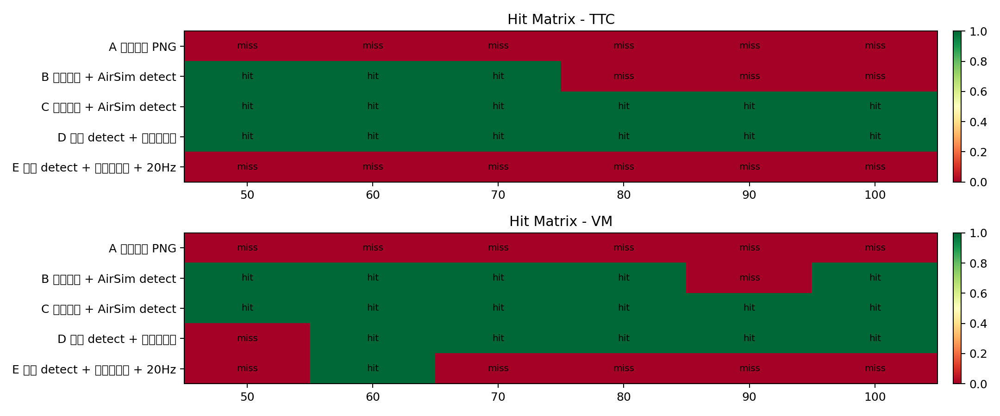

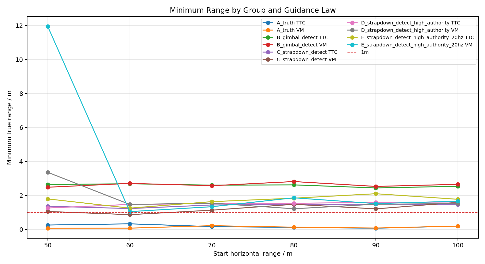

## 结果表

|组别|导引|距离/m|是否碰撞|碰撞时刻/s|最小距离/m|最终距离/m|检测率|有效率|body-rate有效率|平均FPS|仿真采样FPS|最大指令过载/g|最大实际过载/g|推力饱和率|CSV|
|---|---:|---:|---:|---:|---:|---:|---:|---:|---:|---:|---:|---:|---:|---:|---|
|A 真值位置 PNG|TTC|50|否||0.26|10.04|100.0%|63.7%|100.0%|7.8|7.8|1.53|0.57|0.5%|`body_rate_diag_A_truth_TTC_body_rate_diag_20260627_085646_r50_h20.csv`|
|A 真值位置 PNG|TTC|60|否||0.33|2.13|100.0%|67.0%|100.0%|7.8|7.8|1.53|0.56|0.0%|`body_rate_diag_A_truth_TTC_body_rate_diag_20260627_085646_r60_h20.csv`|
|A 真值位置 PNG|TTC|70|否||0.17|8.97|100.0%|70.1%|100.0%|7.8|7.8|1.53|0.60|1.9%|`body_rate_diag_A_truth_TTC_body_rate_diag_20260627_085646_r70_h20.csv`|
|A 真值位置 PNG|TTC|80|否||0.12|2.29|100.0%|73.7%|100.0%|7.8|7.8|1.53|0.57|1.7%|`body_rate_diag_A_truth_TTC_body_rate_diag_20260627_085646_r80_h20.csv`|
|A 真值位置 PNG|TTC|90|否||0.07|2.00|100.0%|73.0%|100.0%|7.8|7.8|1.53|0.59|0.9%|`body_rate_diag_A_truth_TTC_body_rate_diag_20260627_085646_r90_h20.csv`|
|A 真值位置 PNG|TTC|100|否||0.20|14.45|100.0%|70.6%|100.0%|7.8|7.8|1.53|0.56|0.9%|`body_rate_diag_A_truth_TTC_body_rate_diag_20260627_085646_r100_h20.csv`|
|A 真值位置 PNG|VM|50|否||0.07|3.75|100.0%|70.6%|100.0%|7.8|7.8|1.53|0.64|2.9%|`body_rate_diag_A_truth_VM_body_rate_diag_20260627_085646_r50_h20.csv`|
|A 真值位置 PNG|VM|60|否||0.08|1.03|100.0%|69.0%|100.0%|7.8|7.8|1.53|0.56|1.7%|`body_rate_diag_A_truth_VM_body_rate_diag_20260627_085646_r60_h20.csv`|
|A 真值位置 PNG|VM|70|否||0.22|9.70|100.0%|64.8%|100.0%|7.8|7.8|1.53|0.62|0.0%|`body_rate_diag_A_truth_VM_body_rate_diag_20260627_085646_r70_h20.csv`|
|A 真值位置 PNG|VM|80|否||0.14|3.66|100.0%|72.0%|100.0%|7.8|7.8|1.53|0.61|1.7%|`body_rate_diag_A_truth_VM_body_rate_diag_20260627_085646_r80_h20.csv`|
|A 真值位置 PNG|VM|90|否||0.08|2.81|100.0%|76.3%|100.0%|7.8|7.8|1.53|0.58|3.2%|`body_rate_diag_A_truth_VM_body_rate_diag_20260627_085646_r90_h20.csv`|
|A 真值位置 PNG|VM|100|否||0.20|0.88|100.0%|72.4%|100.0%|7.8|7.8|1.53|0.71|1.8%|`body_rate_diag_A_truth_VM_body_rate_diag_20260627_085646_r100_h20.csv`|
|B 云台相机 + AirSim detect|TTC|50|是|7.89|2.64|2.67|100.0%|100.0%|98.4%|7.9|8.0|0.67|0.57|3.1%|`body_rate_diag_B_gimbal_detect_TTC_body_rate_diag_20260627_085646_r50_h20.csv`|
|B 云台相机 + AirSim detect|TTC|60|是|9.14|2.69|2.69|98.6%|98.6%|98.6%|7.9|8.0|1.42|0.53|0.0%|`body_rate_diag_B_gimbal_detect_TTC_body_rate_diag_20260627_085646_r60_h20.csv`|
|B 云台相机 + AirSim detect|TTC|70|是|10.64|2.61|2.88|96.5%|95.3%|98.8%|7.9|8.0|0.87|0.57|2.3%|`body_rate_diag_B_gimbal_detect_TTC_body_rate_diag_20260627_085646_r70_h20.csv`|
|B 云台相机 + AirSim detect|TTC|80|否||2.62|166.85|32.3%|32.0%|100.0%|8.0|8.0|1.03|0.43|1.0%|`body_rate_diag_B_gimbal_detect_TTC_body_rate_diag_20260627_085646_r80_h20.csv`|
|B 云台相机 + AirSim detect|TTC|90|否||2.44|170.82|32.5%|31.9%|100.0%|8.0|8.0|0.74|0.57|0.3%|`body_rate_diag_B_gimbal_detect_TTC_body_rate_diag_20260627_085646_r90_h20.csv`|
|B 云台相机 + AirSim detect|TTC|100|否||2.54|174.44|34.5%|33.9%|100.0%|8.0|8.0|0.56|0.62|0.3%|`body_rate_diag_B_gimbal_detect_TTC_body_rate_diag_20260627_085646_r100_h20.csv`|
|B 云台相机 + AirSim detect|VM|50|是|7.76|2.48|2.71|98.4%|93.7%|98.4%|7.9|8.0|0.47|0.57|0.0%|`body_rate_diag_B_gimbal_detect_VM_body_rate_diag_20260627_085646_r50_h20.csv`|
|B 云台相机 + AirSim detect|VM|60|是|8.89|2.71|2.78|100.0%|98.6%|98.6%|7.9|8.0|1.44|0.44|0.0%|`body_rate_diag_B_gimbal_detect_VM_body_rate_diag_20260627_085646_r60_h20.csv`|
|B 云台相机 + AirSim detect|VM|70|是|10.27|2.57|2.57|97.6%|95.2%|98.8%|7.9|8.0|0.80|0.60|0.0%|`body_rate_diag_B_gimbal_detect_VM_body_rate_diag_20260627_085646_r70_h20.csv`|
|B 云台相机 + AirSim detect|VM|80|是|11.39|2.82|2.82|100.0%|100.0%|98.9%|7.9|8.0|0.55|0.53|0.0%|`body_rate_diag_B_gimbal_detect_VM_body_rate_diag_20260627_085646_r80_h20.csv`|
|B 云台相机 + AirSim detect|VM|90|否||2.53|194.61|31.3%|31.0%|100.0%|8.0|8.0|0.81|0.70|0.3%|`body_rate_diag_B_gimbal_detect_VM_body_rate_diag_20260627_085646_r90_h20.csv`|
|B 云台相机 + AirSim detect|VM|100|是|14.27|2.66|2.66|99.1%|98.3%|99.1%|7.9|8.0|0.84|0.56|0.9%|`body_rate_diag_B_gimbal_detect_VM_body_rate_diag_20260627_085646_r100_h20.csv`|
|C 捷联相机 + AirSim detect|TTC|50|是|11.78|1.37|1.37|98.9%|100.0%|100.0%|7.9|8.0|1.53|0.55|10.5%|`body_rate_diag_C_strapdown_detect_TTC_body_rate_diag_20260627_085646_r50_h20.csv`|
|C 捷联相机 + AirSim detect|TTC|60|是|13.03|1.23|1.50|99.0%|100.0%|100.0%|7.9|8.0|1.53|0.62|4.8%|`body_rate_diag_C_strapdown_detect_TTC_body_rate_diag_20260627_085646_r60_h20.csv`|
|C 捷联相机 + AirSim detect|TTC|70|是|14.28|1.44|1.44|100.0%|100.0%|100.0%|7.9|8.0|1.32|0.53|2.6%|`body_rate_diag_C_strapdown_detect_TTC_body_rate_diag_20260627_085646_r70_h20.csv`|
|C 捷联相机 + AirSim detect|TTC|80|是|16.41|1.46|1.47|99.2%|100.0%|100.0%|7.9|8.0|1.53|0.64|3.0%|`body_rate_diag_C_strapdown_detect_TTC_body_rate_diag_20260627_085646_r80_h20.csv`|
|C 捷联相机 + AirSim detect|TTC|90|是|20.55|1.49|1.49|96.4%|100.0%|100.0%|7.9|8.0|1.53|0.59|11.5%|`body_rate_diag_C_strapdown_detect_TTC_body_rate_diag_20260627_085646_r90_h20.csv`|
|C 捷联相机 + AirSim detect|TTC|100|是|21.80|1.46|1.46|98.9%|100.0%|100.0%|7.9|8.0|1.53|0.50|2.9%|`body_rate_diag_C_strapdown_detect_TTC_body_rate_diag_20260627_085646_r100_h20.csv`|
|C 捷联相机 + AirSim detect|VM|50|是|10.90|1.06|1.47|100.0%|100.0%|100.0%|7.9|8.0|1.53|0.51|13.6%|`body_rate_diag_C_strapdown_detect_VM_body_rate_diag_20260627_085646_r50_h20.csv`|
|C 捷联相机 + AirSim detect|VM|60|是|12.28|0.87|1.14|97.0%|100.0%|100.0%|7.9|8.0|1.53|0.67|9.1%|`body_rate_diag_C_strapdown_detect_VM_body_rate_diag_20260627_085646_r60_h20.csv`|
|C 捷联相机 + AirSim detect|VM|70|是|13.78|1.14|1.14|98.2%|100.0%|100.0%|7.9|8.0|1.53|0.59|5.4%|`body_rate_diag_C_strapdown_detect_VM_body_rate_diag_20260627_085646_r70_h20.csv`|
|C 捷联相机 + AirSim detect|VM|80|是|14.91|1.48|1.48|100.0%|100.0%|100.0%|7.9|8.0|1.53|0.59|6.7%|`body_rate_diag_C_strapdown_detect_VM_body_rate_diag_20260627_085646_r80_h20.csv`|
|C 捷联相机 + AirSim detect|VM|90|是|17.17|1.21|1.36|99.3%|100.0%|100.0%|7.9|8.0|1.53|0.61|10.1%|`body_rate_diag_C_strapdown_detect_VM_body_rate_diag_20260627_085646_r90_h20.csv`|
|C 捷联相机 + AirSim detect|VM|100|是|18.41|1.60|1.60|99.3%|100.0%|100.0%|7.9|8.0|1.53|0.62|6.1%|`body_rate_diag_C_strapdown_detect_VM_body_rate_diag_20260627_085646_r100_h20.csv`|
|D 捷联 detect + 高控制权限|TTC|50|是|14.16|1.26|1.49|96.5%|100.0%|100.0%|7.9|8.0|1.53|0.71|11.4%|`body_rate_diag_D_strapdown_detect_high_authority_TTC_body_rate_diag_20260627_085646_r50_h20.csv`|
|D 捷联 detect + 高控制权限|TTC|60|是|12.65|1.47|1.47|97.1%|100.0%|100.0%|7.9|8.0|1.53|0.75|10.8%|`body_rate_diag_D_strapdown_detect_high_authority_TTC_body_rate_diag_20260627_085646_r60_h20.csv`|
|D 捷联 detect + 高控制权限|TTC|70|是|19.42|1.52|1.54|99.4%|100.0%|100.0%|7.9|8.0|1.53|0.68|13.5%|`body_rate_diag_D_strapdown_detect_high_authority_TTC_body_rate_diag_20260627_085646_r70_h20.csv`|
|D 捷联 detect + 高控制权限|TTC|80|是|21.92|1.54|1.62|100.0%|100.0%|100.0%|7.9|8.0|1.53|0.62|5.1%|`body_rate_diag_D_strapdown_detect_high_authority_TTC_body_rate_diag_20260627_085646_r80_h20.csv`|
|D 捷联 detect + 高控制权限|TTC|90|是|19.92|1.59|1.59|97.5%|100.0%|100.0%|7.9|8.0|1.53|0.58|5.6%|`body_rate_diag_D_strapdown_detect_high_authority_TTC_body_rate_diag_20260627_085646_r90_h20.csv`|
|D 捷联 detect + 高控制权限|TTC|100|是|21.55|1.62|1.62|98.3%|100.0%|100.0%|7.9|8.0|1.53|0.61|3.5%|`body_rate_diag_D_strapdown_detect_high_authority_TTC_body_rate_diag_20260627_085646_r100_h20.csv`|
|D 捷联 detect + 高控制权限|VM|50|否||3.36|3.36|98.6%|100.0%|100.0%|7.9|8.0|1.53|0.57|98.6%|`body_rate_diag_D_strapdown_detect_high_authority_VM_body_rate_diag_20260627_085646_r50_h20.csv`|
|D 捷联 detect + 高控制权限|VM|60|是|12.28|1.47|1.53|99.0%|100.0%|100.0%|7.9|8.0|1.53|0.73|26.3%|`body_rate_diag_D_strapdown_detect_high_authority_VM_body_rate_diag_20260627_085646_r60_h20.csv`|
|D 捷联 detect + 高控制权限|VM|70|是|13.15|1.55|1.59|98.1%|100.0%|100.0%|7.9|8.0|1.53|0.62|19.8%|`body_rate_diag_D_strapdown_detect_high_authority_VM_body_rate_diag_20260627_085646_r70_h20.csv`|
|D 捷联 detect + 高控制权限|VM|80|是|15.16|1.22|1.37|100.0%|100.0%|100.0%|7.9|8.0|1.53|0.67|9.8%|`body_rate_diag_D_strapdown_detect_high_authority_VM_body_rate_diag_20260627_085646_r80_h20.csv`|
|D 捷联 detect + 高控制权限|VM|90|是|19.42|1.49|1.49|98.1%|100.0%|100.0%|7.9|8.0|1.53|0.88|39.1%|`body_rate_diag_D_strapdown_detect_high_authority_VM_body_rate_diag_20260627_085646_r90_h20.csv`|
|D 捷联 detect + 高控制权限|VM|100|是|21.17|1.52|1.52|98.8%|100.0%|100.0%|7.9|8.0|1.53|0.77|28.2%|`body_rate_diag_D_strapdown_detect_high_authority_VM_body_rate_diag_20260627_085646_r100_h20.csv`|
|E 捷联 detect + 高控制权限 + 20Hz|TTC|50|否||1.80|2.01|99.2%|100.0%|100.0%|19.8|19.9|1.53|0.78|23.2%|`body_rate_diag_E_strapdown_detect_high_authority_20hz_TTC_body_rate_diag_20260627_085646_r50_h20.csv`|
|E 捷联 detect + 高控制权限 + 20Hz|TTC|60|否||1.26|2.47|99.2%|100.0%|100.0%|19.9|19.9|1.53|0.80|35.8%|`body_rate_diag_E_strapdown_detect_high_authority_20hz_TTC_body_rate_diag_20260627_085646_r60_h20.csv`|
|E 捷联 detect + 高控制权限 + 20Hz|TTC|70|否||1.64|2.20|99.4%|100.0%|100.0%|19.9|19.9|1.53|0.84|25.0%|`body_rate_diag_E_strapdown_detect_high_authority_20hz_TTC_body_rate_diag_20260627_085646_r70_h20.csv`|
|E 捷联 detect + 高控制权限 + 20Hz|TTC|80|否||1.84|2.33|99.5%|100.0%|100.0%|19.9|19.9|1.53|0.96|31.1%|`body_rate_diag_E_strapdown_detect_high_authority_20hz_TTC_body_rate_diag_20260627_085646_r80_h20.csv`|
|E 捷联 detect + 高控制权限 + 20Hz|TTC|90|否||2.10|3.12|99.1%|100.0%|100.0%|19.9|19.9|1.53|1.06|51.6%|`body_rate_diag_E_strapdown_detect_high_authority_20hz_TTC_body_rate_diag_20260627_085646_r90_h20.csv`|
|E 捷联 detect + 高控制权限 + 20Hz|TTC|100|否||1.77|2.19|99.4%|100.0%|100.0%|19.9|19.9|1.53|0.83|20.3%|`body_rate_diag_E_strapdown_detect_high_authority_20hz_TTC_body_rate_diag_20260627_085646_r100_h20.csv`|
|E 捷联 detect + 高控制权限 + 20Hz|VM|50|否||11.94|11.94|98.5%|100.0%|100.0%|19.8|19.9|1.53|0.63|78.8%|`body_rate_diag_E_strapdown_detect_high_authority_20hz_VM_body_rate_diag_20260627_085646_r50_h20.csv`|
|E 捷联 detect + 高控制权限 + 20Hz|VM|60|是|16.39|1.05|1.05|98.8%|100.0%|100.0%|19.8|19.9|1.53|0.91|39.4%|`body_rate_diag_E_strapdown_detect_high_authority_20hz_VM_body_rate_diag_20260627_085646_r60_h20.csv`|
|E 捷联 detect + 高控制权限 + 20Hz|VM|70|否||1.34|2.10|98.6%|100.0%|100.0%|19.9|19.9|1.53|0.81|41.6%|`body_rate_diag_E_strapdown_detect_high_authority_20hz_VM_body_rate_diag_20260627_085646_r70_h20.csv`|
|E 捷联 detect + 高控制权限 + 20Hz|VM|80|否||1.86|2.22|98.6%|100.0%|100.0%|19.9|19.9|1.53|0.85|37.2%|`body_rate_diag_E_strapdown_detect_high_authority_20hz_VM_body_rate_diag_20260627_085646_r80_h20.csv`|
|E 捷联 detect + 高控制权限 + 20Hz|VM|90|否||1.52|2.52|99.0%|100.0%|100.0%|19.9|19.9|1.53|0.80|36.3%|`body_rate_diag_E_strapdown_detect_high_authority_20hz_VM_body_rate_diag_20260627_085646_r90_h20.csv`|
|E 捷联 detect + 高控制权限 + 20Hz|VM|100|否||1.66|2.39|98.9%|100.0%|100.0%|19.9|19.9|1.53|0.84|34.9%|`body_rate_diag_E_strapdown_detect_high_authority_20hz_VM_body_rate_diag_20260627_085646_r100_h20.csv`|

## 原因分析与 baseline 对比

本节使用两个 baseline 概念：

- 本报告内部 baseline：`C 捷联相机 + AirSim detect`。它保留捷联相机、AirSim actor、PX4 SITL 和 `mavlink_body_rate` 控制链路，只把识别替换成 AirSim detect，并关闭 LOS 滤波。因此它主要回答“在理论检测框和无 LOS 滤波条件下，当前 body-rate 控制链路能不能完成拦截”。
- 历史 YOLO body-rate baseline：`TTC_accel_body_rate_loskf_relaxed_20260623_073738`，见 `完整方案/mavlink_body_rate_TTC_relaxed_baseline_README.md`。它使用 `YOLOv8 + ByteTrack`、relaxed LOS KF、`accel_body_rate + mavlink_body_rate`，TTC 结果为 `4/6`。

### 1. 汇总对比

|对象|导引|命中|平均最小距离/m|平均检测率|平均有效率|平均实际最大过载/g|平均推力饱和率|主要结论|
|---|---:|---:|---:|---:|---:|---:|---:|---|
|历史 YOLO body-rate baseline|TTC|4/6|1.67|75.8%|77.9%|0.64|未统一统计|YOLO/跟踪/LOS KF 仍会造成感知断续和导引失效。|
|历史 YOLO body-rate baseline|VM|1/6|2.09|75.6%|82.7%|0.74|未统一统计|固定 Vm 在真实识别断续下更容易错过末端窗口。|
|A 真值位置 PNG|TTC|0/6|0.19|100.0%|69.7%|0.58|1.0%|距离收敛到厘米级但未触发目标碰撞，不能按碰撞率评价控制优劣。|
|A 真值位置 PNG|VM|0/6|0.13|100.0%|70.8%|0.62|1.9%|同上，适合作为 miss-distance 诊断，不适合作为 actor 碰撞评价。|
|B 云台相机 + AirSim detect|TTC|3/6|2.59|65.8%|65.3%|0.55|1.2%|中远距末端丢检后飞离，说明“看住目标”还不足以保证撞上。|
|B 云台相机 + AirSim detect|VM|5/6|2.63|87.7%|86.1%|0.57|0.2%|VM 对 TTC 面积通道失败更不敏感，但 90m 仍发生末端丢检。|
|C 捷联相机 + AirSim detect|TTC|6/6|1.41|98.7%|100.0%|0.57|5.9%|内部 baseline，全命中。理论检测框 + 无 LOS 滤波时链路可跑通。|
|C 捷联相机 + AirSim detect|VM|6/6|1.23|99.0%|100.0%|0.60|8.5%|内部 baseline，全命中；VM 最小距离略小。|
|D 高控制权限|TTC|6/6|1.50|98.1%|100.0%|0.66|8.3%|TTC 保持全命中，但并未优于 C。|
|D 高控制权限|VM|5/6|1.77|98.8%|100.0%|0.71|37.0%|高权限导致推力饱和显著增加，50m 反而失效。|
|E 高控制权限 + 20Hz|TTC|0/6|1.73|99.3%|100.0%|0.88|31.2%|提高控制频率没有提升命中，反而放大末端相位/饱和问题。|
|E 高控制权限 + 20Hz|VM|1/6|3.23|98.7%|100.0%|0.81|44.7%|除 60m 外均未命中，20Hz 设置不是当前解法。|

### 2. 与历史 YOLO baseline 的差异

历史 TTC body-rate baseline 只命中 `4/6`，而本报告 C 组 TTC 命中 `6/6`。两者控制链路都是 `accel_body_rate + mavlink_body_rate`，主要差异在感知和 LOS 处理：

- 历史 baseline 使用 `YOLOv8 + ByteTrack`，总检测率约 `75.8%`，有效导引帧率约 `77.9%`。
- C 组使用 AirSim detect，检测率约 `98.7%`，有效导引帧率为 `100.0%`。
- 历史 baseline 开启 relaxed LOS KF；C 组显式 `--no-los-filter`。这去掉了末端创新门限、相位滞后和 KF invalid 造成的导引清零风险。
- C 组的命中说明：在识别连续、LOS 不被滤波门限打断时，当前 body-rate 链路可以在 `50-100m` 全部完成拦截。
- 历史 baseline 的 `4/6` 说明：真实 YOLO + ByteTrack + LOS KF 场景下，主要瓶颈不是 PNG 公式本身，而是末端识别连续性、LOS 有效性门控和固定相机视场保持。

因此，C 组不能替代真实 YOLO baseline，但它把问题边界收窄了：当前要优先解决“真实识别与 LOS/KF 不中断”以及“末端视场保持”，而不是继续怀疑 PNG 加速度到 body-rate 的基本链路完全不通。

### 3. A 组为什么真值位置反而没有碰撞

A 组使用目标真实位置，理论上应该是上限实验。但本批次 A 组所有工况都未触发 AirSim 成功碰撞，同时最小距离非常小：TTC 平均 `0.19m`，VM 平均 `0.13m`，单次最小距离低至 `0.07m`。这说明 A 组不是“导引完全偏离”，而是“碰撞评价不等价”。

从日志看，A 组最小距离帧附近没有记录到目标碰撞，碰撞对象字段仍为 `Ground` 或为空。结合本批次共同参数使用了 `--intruder-actor --intruder-actor-name IntruderActor --intruder-actor-asset Quadrotor1`，更可能的原因是：

- truth PNG 脚本的目标位置/碰撞检查路径与 actor 目标路径不完全一致；
- A 组更适合评估几何最小距离和控制收敛，不适合直接用 actor 碰撞事件作为成功判据；
- 最小距离已经远小于 B/C/D/E 的碰撞距离，说明 A 组的“未命中”不能简单解释为 body-rate 控制失效。

后续如果要把 A 组作为严格上限，应统一 truth 目标、actor 目标和碰撞对象：要么 truth PNG 也显式检查 `IntruderActor` 的碰撞，要么对 A 组使用同一目标实体的中心距离阈值作为辅助成功判据。

### 4. B 组为什么没有达到内部 baseline

B 组云台持续尝试看住目标，但不是内部最佳组。TTC 只命中 `3/6`，VM 命中 `5/6`。失败工况的共同特征是：

- 失败前最小距离约 `2.44-2.62m`，已经接近但未触发碰撞；
- 失败后最终距离迅速扩大到 `166-195m`；
- TTC 失败工况检测率只有约 `32-35%`，主要失败原因集中在 `no_detection` 和 `terminal_lost`；
- 云台组没有捷联 `frame_centering` 状态机的强约束，云台能转向目标不等于机体轨迹一定能把目标撞上。

这说明 B 组的核心问题不是识别模型噪声，而是末端几何和控制策略：在最近点未发生碰撞后，目标很快越过或离开有效检测范围，导引进入丢检/终端丢失。VM 比 TTC 好，是因为 VM 不依赖 bbox 面积扩张质量，面积通道失败时仍可继续使用 LOS 角速度生成导引。

### 5. C 组为什么可以作为当前内部 baseline

C 组是本报告中最有诊断价值的组。它的设置是：

- 捷联固定相机；
- AirSim detect 理论检测框；
- `--no-los-filter`；
- `mavlink_body_rate`；
- 原始控制权限和约 `8Hz` 控制循环。

结果是 TTC 和 VM 均 `6/6` 命中。检测率约 `99%`，有效导引率 `100%`，body-rate 控制有效率 `100%`。这表明：

- 固定相机方案本身不是必然失败；
- body-rate 指令能够通过 PX4 SITL 形成有效机动；
- 之前 YOLO baseline 的未命中，大概率来自真实检测/跟踪断续和 LOS/KF 门控，而不是 AirSim detect 条件下的纯控制链路。

同时 C 组推力饱和率只有 `5.9-8.5%`，明显低于 D/E 的高权限组，说明在当前速度和距离下，保守权限反而更稳定。

### 6. D 组高控制权限为什么没有稳定提升

D 组在 C 组基础上提高速度、加速度、倾角和 body-rate 权限。TTC 仍然 `6/6`，但平均最小距离从 C 的 `1.41m` 变为 `1.50m`，没有明显改善；VM 则从 C 的 `6/6` 降到 `5/6`。

最明显的问题是推力饱和。D 组 VM 平均推力饱和率达到 `37.0%`，其中 50m VM 未命中工况推力饱和率约 `98.6%`，最小距离 `3.36m`。这说明高权限让控制器更频繁打到推力边界，角速度控制余量被吃掉，反而降低了末端修正能力。

结论是：高控制权限不能简单理解为“更强就更好”。在 body-rate 链路里，推力、倾角、速度保持和角速度控制共享执行器余量。过大的加速度/速度保持请求会造成饱和，使 PX4 没有足够余量执行滚转/俯仰角速度。

### 7. E 组 20Hz 为什么变差

E 组把 D 组控制循环提高到约 `20Hz`，并缩短命令保持时间。结果 TTC `0/6`，VM `1/6`，明显差于 C/D。这个结果说明当前瓶颈不是“采样频率不够”。

E 组的诊断特征是：

- 检测率仍接近 `99%`，有效导引率 `100%`，所以失败不是检测断续造成的；
- TTC 平均推力饱和率升到 `31.2%`，VM 升到 `44.7%`；
- frame centering/terminal capture 状态占比更高，说明目标已经进入末端高角速度区域，但控制并没有把最近点压进碰撞区域；
- 平均实际最大过载从 C 组约 `0.57-0.60g` 增大到 `0.81-0.88g`，但命中率下降，说明“更大实际过载”没有转化为更小脱靶量。

可能机制是：更高频率配合更短命令持续时间后，PX4/仿真/Offboard body-rate 链路暴露出相位滞后和执行器饱和。末端需要的是低滞后、不过饱和、方向正确的修正；如果命令频繁变化而 PX4 响应跟不上，实际轨迹会在最近点附近产生偏差，最终从目标旁边掠过。

### 8. 当前判断

本批次最重要的结论是：

- `C 捷联相机 + AirSim detect + no LOS filter + 8Hz + 原始权限` 是当前最稳定的内部 baseline，TTC/VM 均 `6/6`。
- 历史 YOLO body-rate baseline 的 TTC `4/6` 与 C 组 `6/6` 的差距，主要来自真实识别连续性和 LOS/KF 门控。
- 高权限和 20Hz 不是直接改进方向，尤其 20Hz 在本批次中明确变差。
- A 组最小距离很小但无碰撞，说明 truth PNG 的 actor 碰撞评价需要修正，不能用 A 组碰撞率直接否定控制链路。

下一步建议以 C 组为内部基准，逐项加回真实复杂度：先加 YOLO 但关闭 LOS KF，再加 relaxed LOS KF，再测试必要的末端外推。每次只改一个变量，并以 C 组 `6/6` 和历史 YOLO TTC `4/6` 同时作为参照。

## 分组曲线

### `A_truth_TTC`

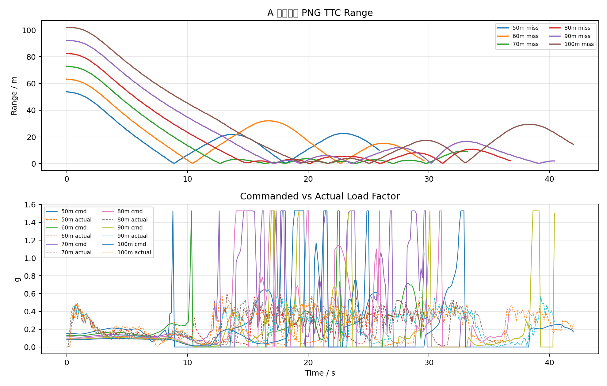

### `A_truth_VM`

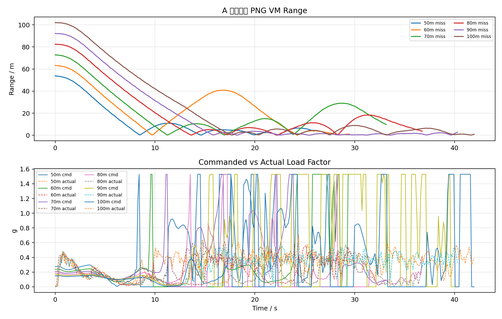

### `B_gimbal_detect_TTC`

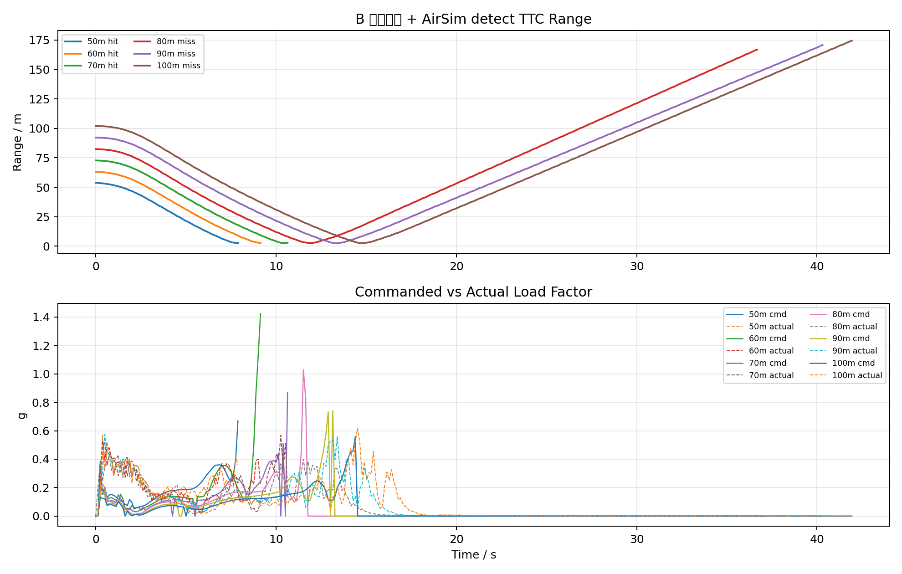

### `B_gimbal_detect_VM`

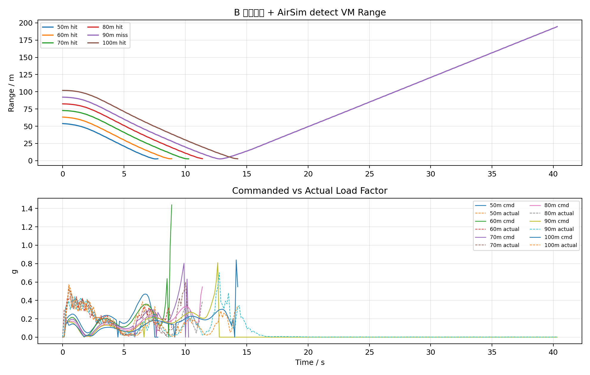

### `C_strapdown_detect_TTC`

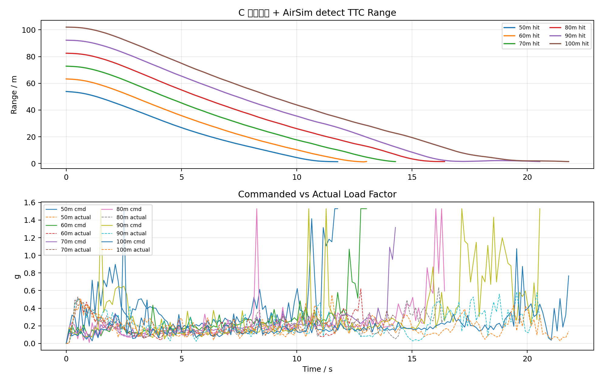

### `C_strapdown_detect_VM`

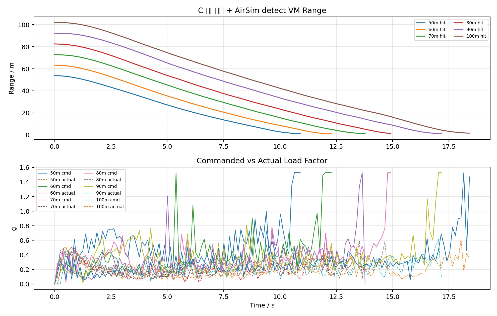

### `D_strapdown_detect_high_authority_TTC`

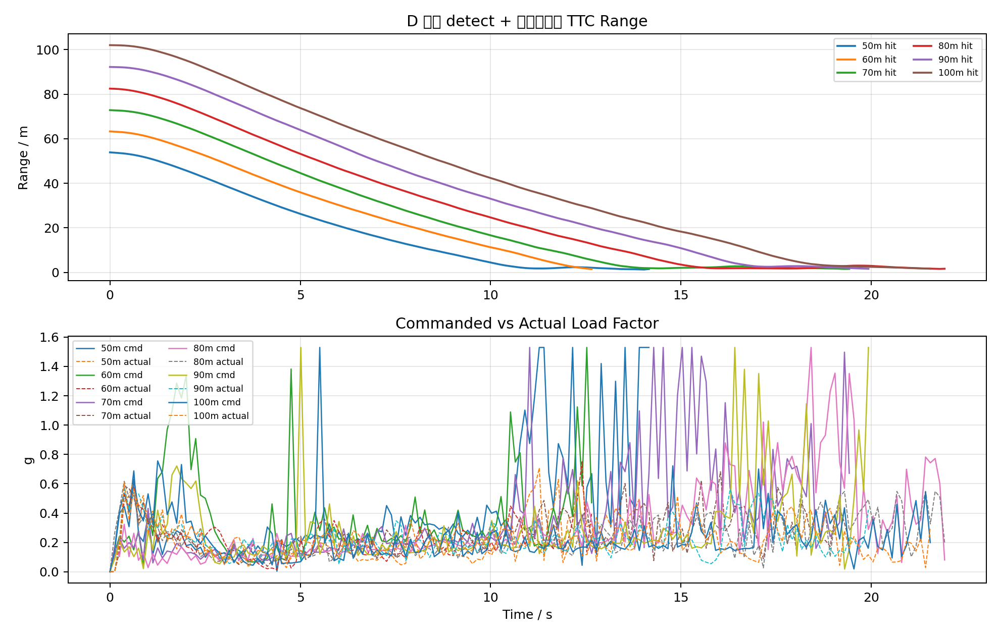

### `D_strapdown_detect_high_authority_VM`

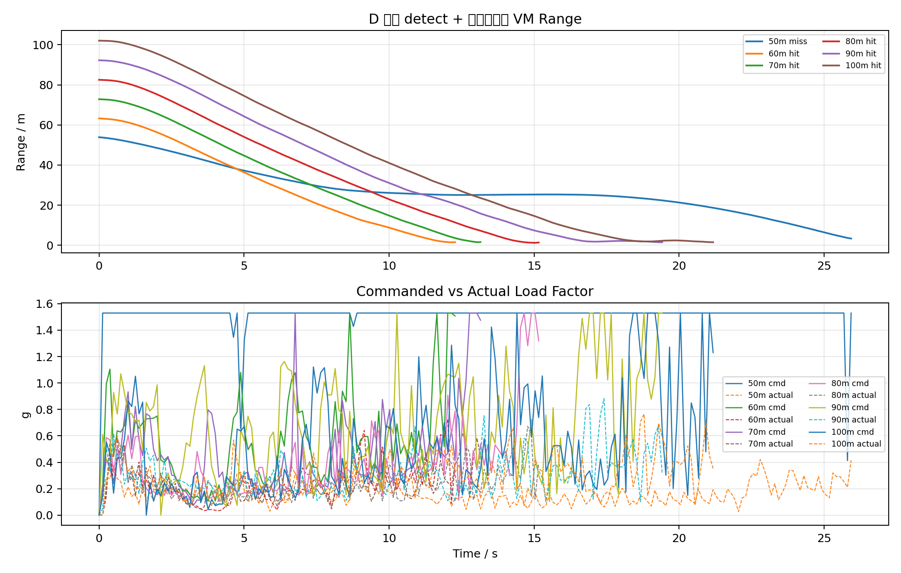

### `E_strapdown_detect_high_authority_20hz_TTC`

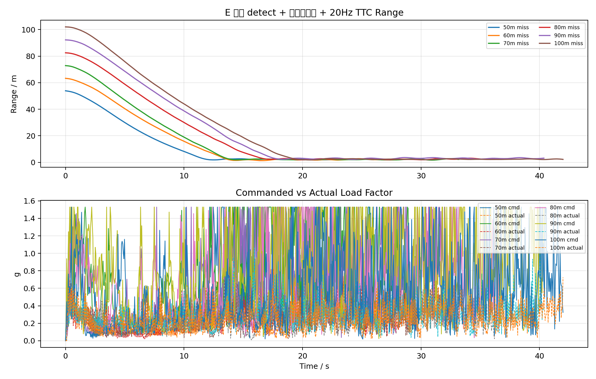

### `E_strapdown_detect_high_authority_20hz_VM`

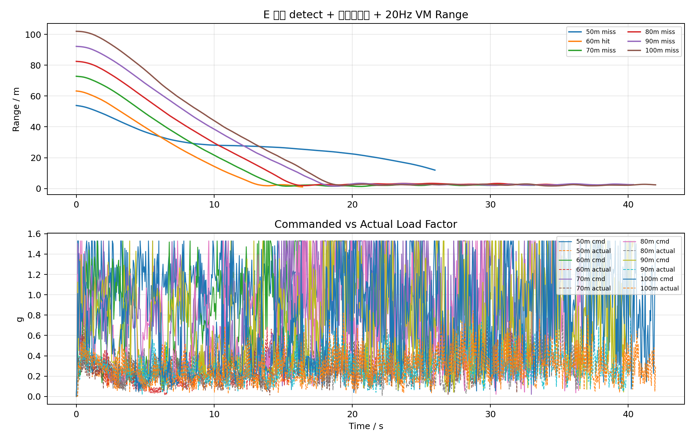

## 读数说明

- `最大指令过载/g` 来自 PNG 加速度指令 `n_cmd_g`，是真值/视觉导引给控制层的需用过载。
- `最大实际过载/g` 来自拦截机速度差分 `load_factor_fd_g`，反映 PX4/仿真实际响应。
- `body-rate有效率` 小于 100% 通常表示该工况存在未进入控制、碰撞后截断、检测/导引无效或脚本提前退出。
- B/C/D/E 使用 AirSim detect 时检测框是理论检测输出，若仍失败，优先检查视场保持、PX4 响应和 body-rate 控制映射。
