# J/K/L PX4 SITL 矩形目标噪声对比报告

## 1. 实验目的

本报告只比较 J/K/L 三组。三组均使用 PX4 SITL 拦截机、按轨迹移动的 `1m x 1m x 0.5m` Actor 目标、中心捷联相机、bbox 中等噪声、`ClockSpeed=1.0`、初始距离 `40-140m`、高度差 `20m`、目标速度 `5m/s`、拦截机速度上限 `10m/s`。

比较关系：

- J vs K：评估 LOS Kalman 滤波在传感器噪声存在时的收益和延迟代价。
- K vs L：评估关闭 IMU/GPS 噪声后，PX4 EKF/姿态/速度链路对拦截结果的影响。

## 2. 工况设置

|项目|J|K|L|
|---|---|---|---|
|LOS Kalman|开启|关闭|关闭|
|IMU/GPS 噪声|开启|开启|关闭|
|bbox center 噪声|`3.0px`|`3.0px`|`3.0px`|
|bbox area 噪声|`8.0%`|`8.0%`|`8.0%`|
|bbox 随机种子|`20260617`|`20260617`|`20260617`|
|Actor 资源|`1M_Cube_Chamfer`|`1M_Cube_Chamfer`|`1M_Cube_Chamfer`|
|Actor 缩放|`1, 1, 0.5`|`1, 1, 0.5`|`1, 1, 0.5`|
|Actor 名义尺寸|`1m x 1m x 0.5m`|`1m x 1m x 0.5m`|`1m x 1m x 0.5m`|
|AirSim settings|`config/airsim_blocks_px4_actor_sensor_noise_settings.json`|`config/airsim_blocks_px4_actor_sensor_noise_settings.json`|`config/airsim_blocks_px4_actor_settings.json`|
|实验 stamp|`strict_reset_20260618_0528`|`strict_reset_20260618_0528`|`strict_reset_20260618_0528`|

J/K 的 IMU/GPS 噪声参数：

|传感器|参数|值|
|---|---|---:|
|IMU|`AngularRandomWalk`|`0.6`|
|IMU|`VelocityRandomWalk`|`0.35`|
|IMU|`GyroBiasStabilityTau`|`500`|
|IMU|`GyroBiasStability`|`8.0`|
|IMU|`AccelBiasStabilityTau`|`800`|
|IMU|`AccelBiasStability`|`50.0`|
|GPS|`EphInitial`|`8.0`|
|GPS|`EpvInitial`|`10.0`|
|GPS|`EphFinal`|`2.5`|
|GPS|`EpvFinal`|`4.0`|
|GPS|`EphMin3d`|`3.0`|
|GPS|`EphMin2d`|`4.0`|
|GPS|`EphTimeConstant`|`0.9`|
|GPS|`EpvTimeConstant`|`0.9`|
|GPS|`UpdateLatency`|`0.2`|
|GPS|`UpdateFrequency`|`10`|
|GPS|`StartupDelay`|`1`|

## 3. 坐标与评价口径

本轮 J/K/L 全部采用严格重置流程：每个距离、每个工况都重新启动 PX4 SITL 和 Blocks，避免 PX4 SITL 热运行时的坐标重置、上一轮末端位置残留或 EKF 局部坐标漂移污染下一轮 Actor 目标摆放。

- PNG 控制链路：拦截机速度、姿态、航向仍使用 PX4 `getMultirotorState().kinematics_estimated`，保持 SITL 闭环真实性。
- 目标摆放与评价链路：Actor 目标位置、拦截机真实位置、中心距离和碰撞距离使用 AirSim `simGetObjectPose()` 的物理对象 pose。
- 每轮拦截开始前，脚本重新设置 Actor 初始位置、拦截机起飞高度和初始航向；70m 工况 t=0 中心距在 J/K/L 中分别为约 72.80m、72.79m、72.75m，残余差异来自 PX4 起飞悬停后的厘米级位置偏差。
- 命中判据优先采用 AirSim collision；中心距离用于解释近失、目标碰撞体尺寸和末端误差。

## 4. LOS Kalman 等效延迟

当前 LOS Kalman 使用 `vision_guidance/los_filter.py` 的 6D 常速度模型，默认参数为：

|参数|值|
|---|---:|
|`process_lambda`|`1e-4`|
|`process_lambda_dot`|`5e-3`|
|`measurement_noise`|`5e-3`|
|`innovation_reject`|`0.25`|

按 20Hz 采样、滤波器稳态后输入 LOS 阶跃估算，等效延迟为：

|响应比例|时间|帧数@20Hz|
|---|---:|---:|
|50%|`0.10s`|`2.0`|
|63%|`0.15s`|`3.0`|
|90%|`0.25s`|`5.0`|
|95%|`0.25s`|`5.0`|

工程解释：LOS 方向量的主要滞后约 `0.10-0.15s`，到 90% 响应约 `0.25s`。这只是滤波器本身，不包括 AirSim detection、PX4 EKF、Offboard 速度/航向响应和机体动力学延迟。

## 5. 总览图

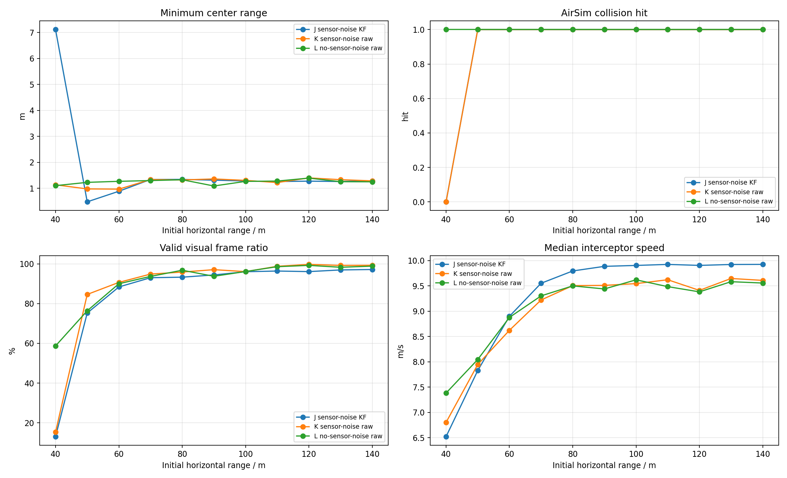

## 6. 命中汇总

|工况|命中数|命中距离m|未命中距离m|最小中心距离m|中位实际速度m/s|有效帧/总帧|
|---|---:|---|---|---:|---:|---:|
|J|10/11|50, 60, 70, 80, 90, 100, 110, 120, 130, 140|40|0.481|9.82|2656/3434|
|K|10/11|50, 60, 70, 80, 90, 100, 110, 120, 130, 140|40|0.970|9.36|2962/3654|
|L|11/11|40, 50, 60, 70, 80, 90, 100, 110, 120, 130, 140|-|1.091|9.43|3062/3285|

## 7. 明细表

|工况|距离m|碰撞|碰撞时间s|最小中心距离m|终点距离m|检测帧/总帧|有效帧|实际过载max g|视觉指令P95 g|真值PNG P95 g|LOS误差P95 deg|sim FPS|
|---|---:|---:|---:|---:|---:|---:|---:|---:|---:|---:|---:|---:|
|J|40|0|-|7.111|110.269|96/697|91|1.29|0.42|0.52|131.66|19.92|
|K|40|0|-|1.138|66.353|150/698|107|1.27|5.05|0.52|166.73|19.93|
|L|40|1|10.08|1.104|1.112|148/201|118|1.39|8.03|0.62|15.79|19.89|
|J|50|1|9.93|0.481|0.481|179/198|149|1.60|1.12|0.63|15.18|19.89|
|K|50|1|9.77|0.978|0.978|176/195|165|1.54|9.61|0.61|7.84|19.89|
|L|50|1|9.98|1.231|1.231|170/199|152|1.56|10.81|0.55|7.57|19.89|
|J|60|1|9.93|0.889|0.889|181/198|175|1.53|0.81|0.42|7.65|19.89|
|K|60|1|10.19|0.970|0.970|190/204|185|1.39|12.99|0.44|7.86|19.93|
|L|60|1|10.03|1.271|1.271|180/200|180|1.50|10.66|0.42|7.23|19.89|
|J|70|1|10.08|1.342|1.342|189/201|187|1.75|0.70|0.45|7.54|19.89|
|K|70|1|10.70|1.340|1.340|204/214|203|1.68|9.99|0.44|7.50|19.93|
|L|70|1|11.09|1.300|1.300|208/222|208|1.58|9.50|0.52|7.31|19.93|
|J|80|1|11.23|1.344|1.344|210/224|209|1.59|0.72|0.51|7.36|19.90|
|K|80|1|12.10|1.324|1.324|232/242|232|1.60|9.32|0.51|7.35|19.93|
|L|80|1|12.54|1.332|1.332|243/250|242|1.39|10.72|0.46|7.05|19.89|
|J|90|1|12.59|1.316|1.316|237/251|237|1.62|0.83|0.43|7.20|19.90|
|K|90|1|13.76|1.362|1.362|267/275|267|1.22|11.04|0.41|7.57|19.93|
|L|90|1|15.25|1.091|1.091|295/304|285|1.45|9.70|0.69|8.13|19.90|
|J|100|1|13.91|1.284|1.284|267/278|267|1.63|0.84|0.39|7.15|19.93|
|K|100|1|15.40|1.307|1.307|295/307|295|1.54|10.41|0.38|8.31|19.90|
|L|100|1|15.62|1.269|1.269|302/312|300|1.17|10.39|0.31|7.04|19.93|
|J|110|1|15.26|1.262|1.262|294/305|294|1.31|0.82|0.35|7.06|19.93|
|K|110|1|16.52|1.224|1.224|326/330|326|1.27|11.37|0.31|7.62|19.93|
|L|110|1|17.71|1.281|1.281|348/353|348|0.97|10.42|0.34|7.44|19.91|
|J|120|1|16.72|1.278|1.278|322/334|321|1.17|0.72|0.32|7.00|19.93|
|K|120|1|19.03|1.402|1.402|379/380|379|1.21|10.00|0.35|8.38|19.93|
|L|120|1|19.68|1.395|1.395|390/393|390|1.65|10.78|0.43|7.63|19.93|
|J|130|1|18.06|1.264|1.264|349/360|349|1.46|0.57|0.29|7.04|19.91|
|K|130|1|19.47|1.334|1.334|385/388|385|1.27|10.39|0.36|7.58|19.91|
|L|130|1|20.57|1.256|1.256|403/410|403|1.07|10.24|0.25|7.51|19.91|
|J|140|1|19.43|1.290|1.290|377/388|377|1.44|0.58|0.25|7.01|19.93|
|K|140|1|21.13|1.289|1.289|418/421|418|1.02|9.51|0.23|7.57|19.91|
|L|140|1|22.13|1.253|1.253|436/441|436|0.99|10.59|0.21|7.27|19.91|

## 8. 单距离曲线

每个距离一张图。过载子图只绘制 J/K/L 三组实际过载曲线；其余子图包含 LOS 误差、TTC、中心距离和 PX4 航向误差。

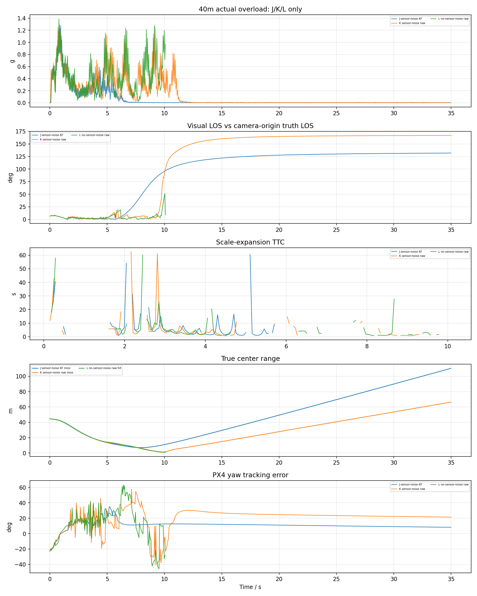
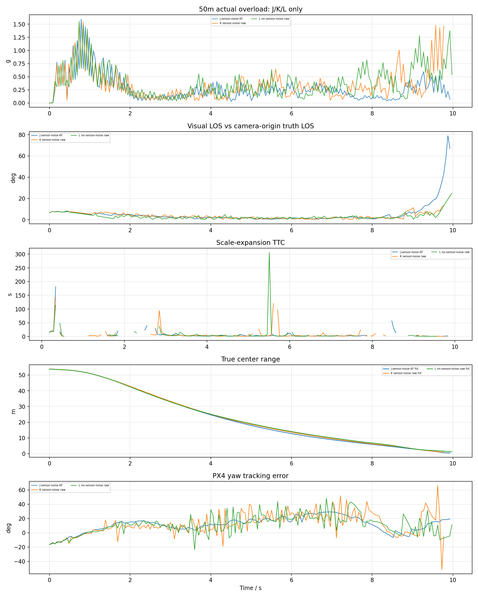
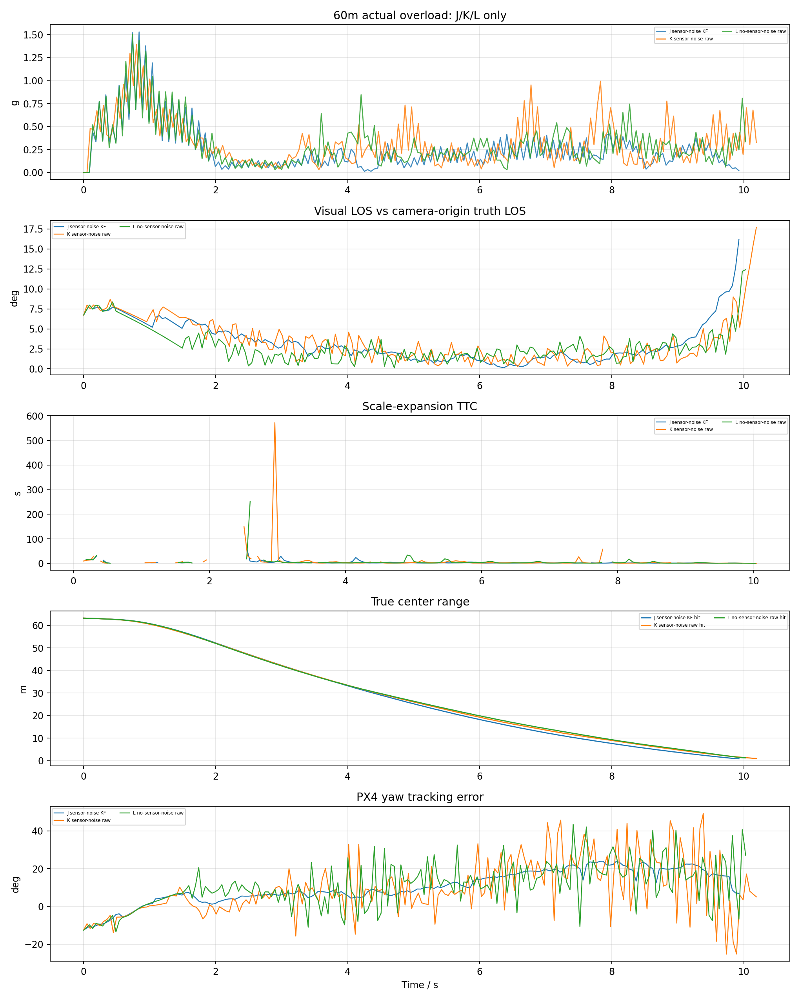
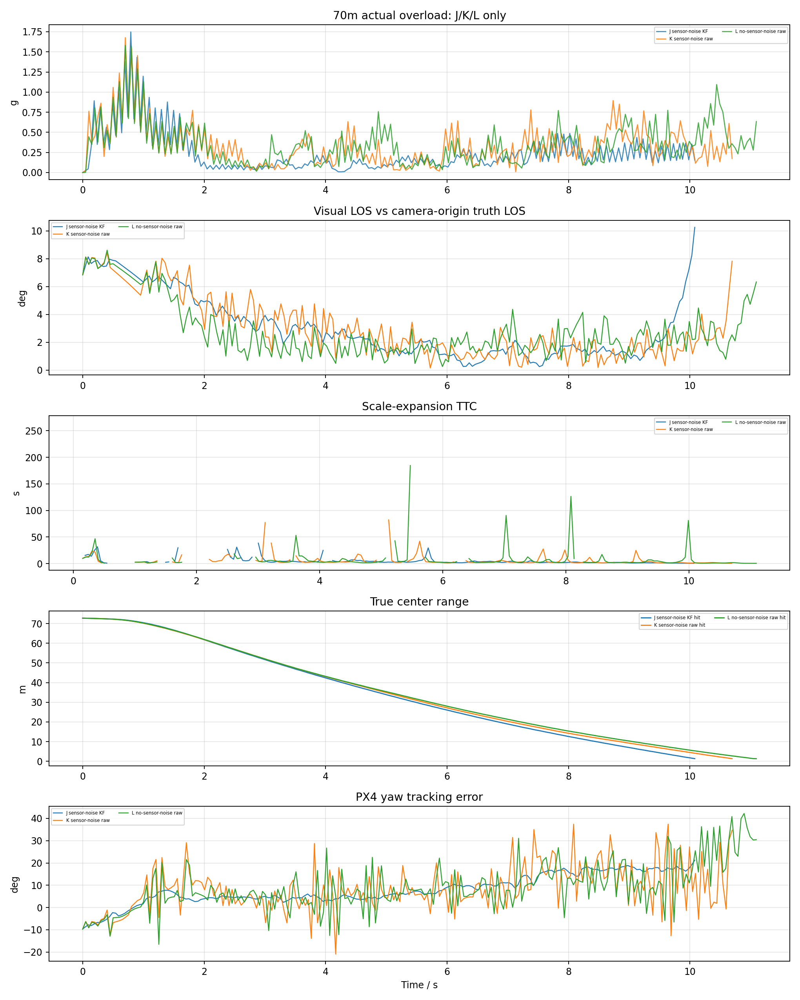
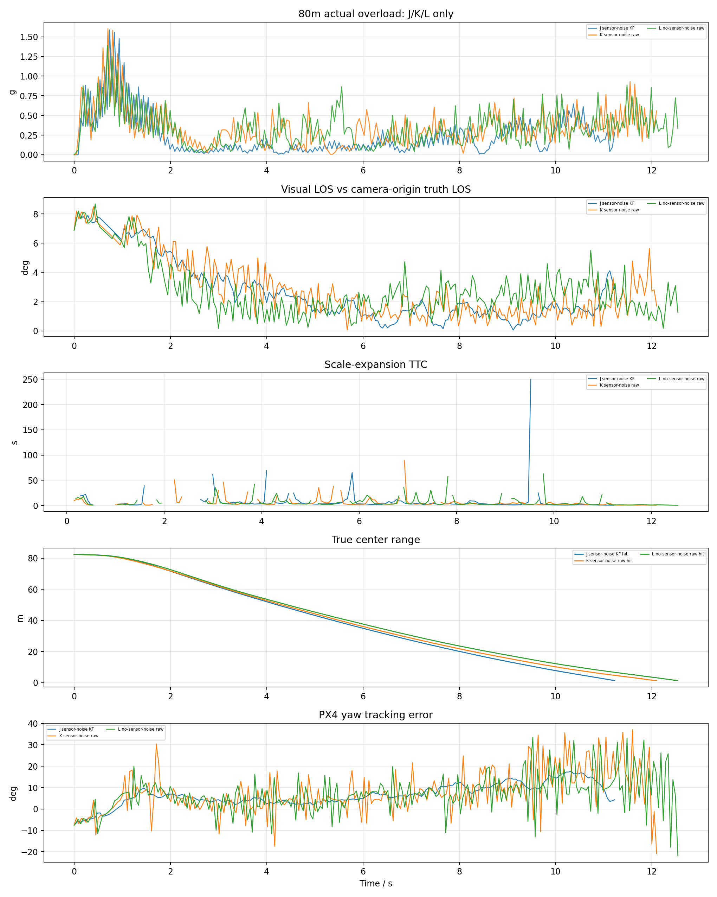
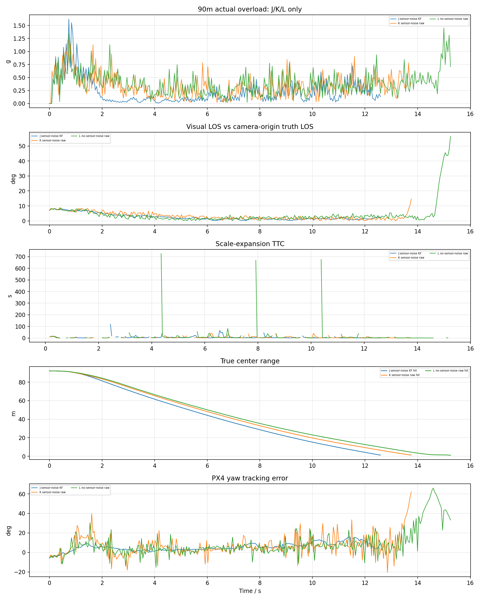
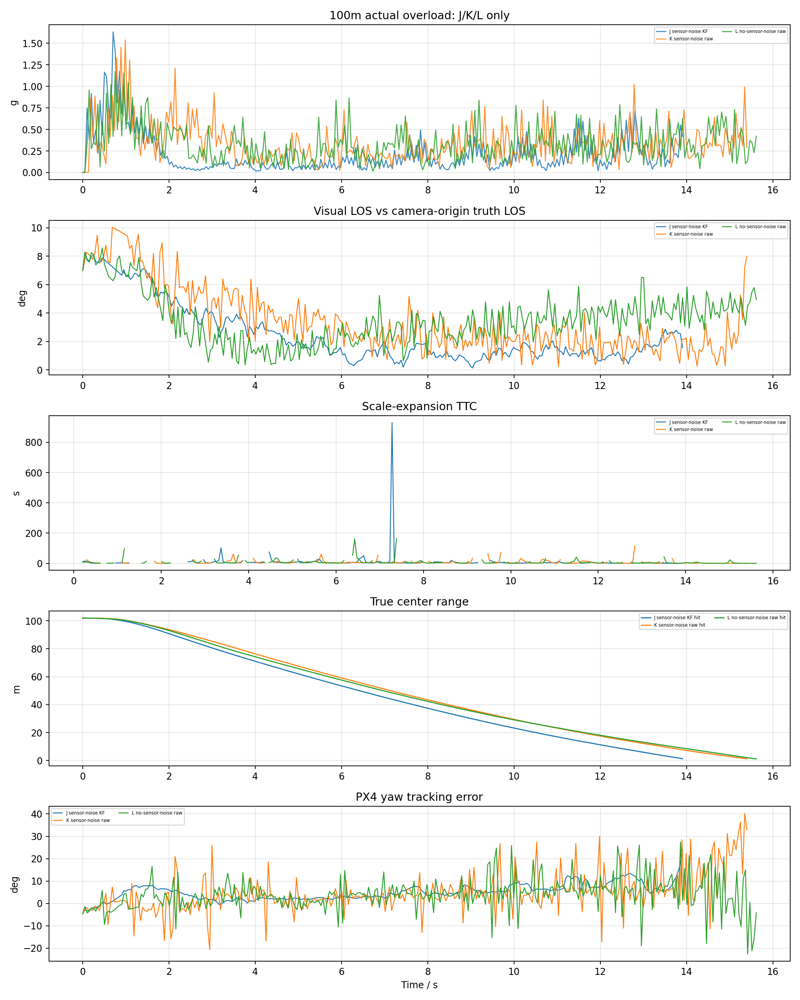
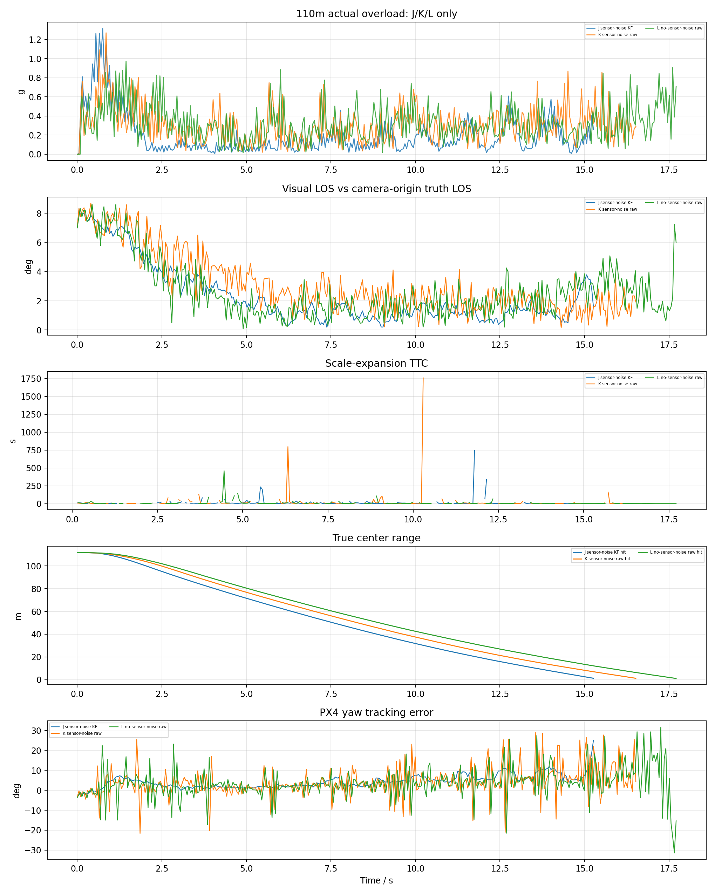
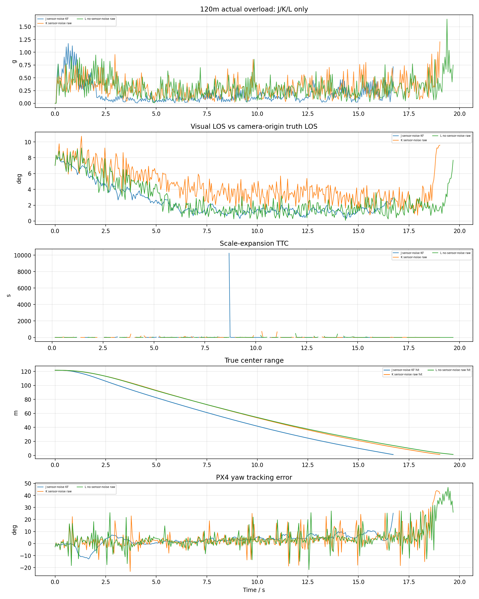
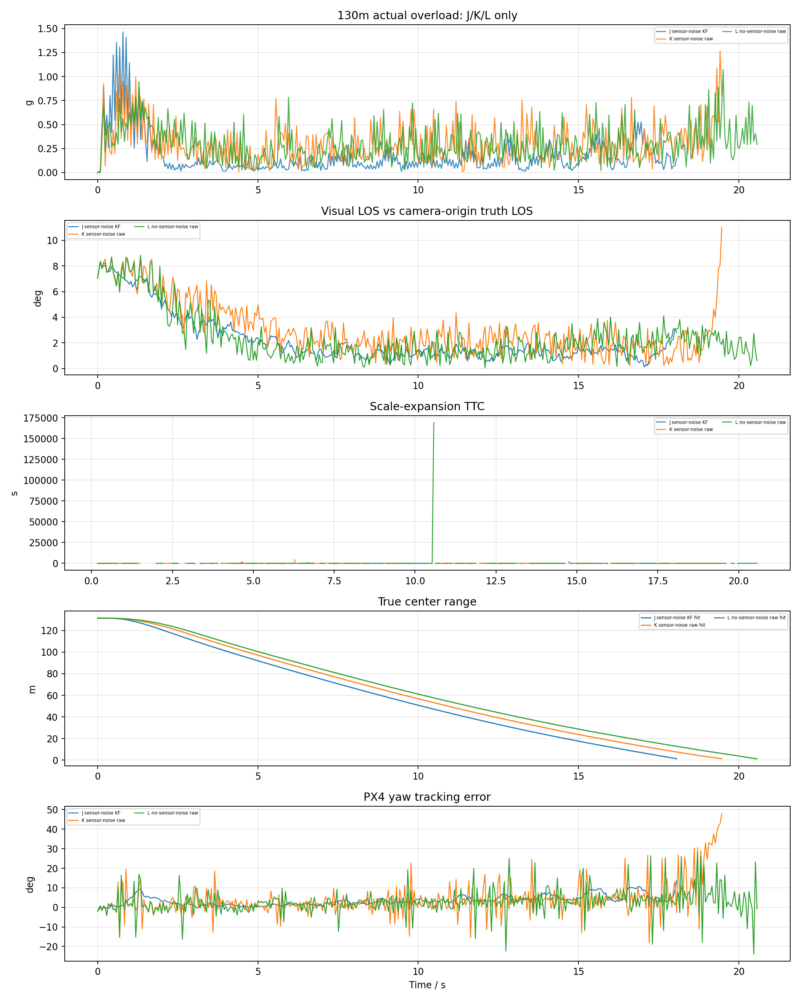
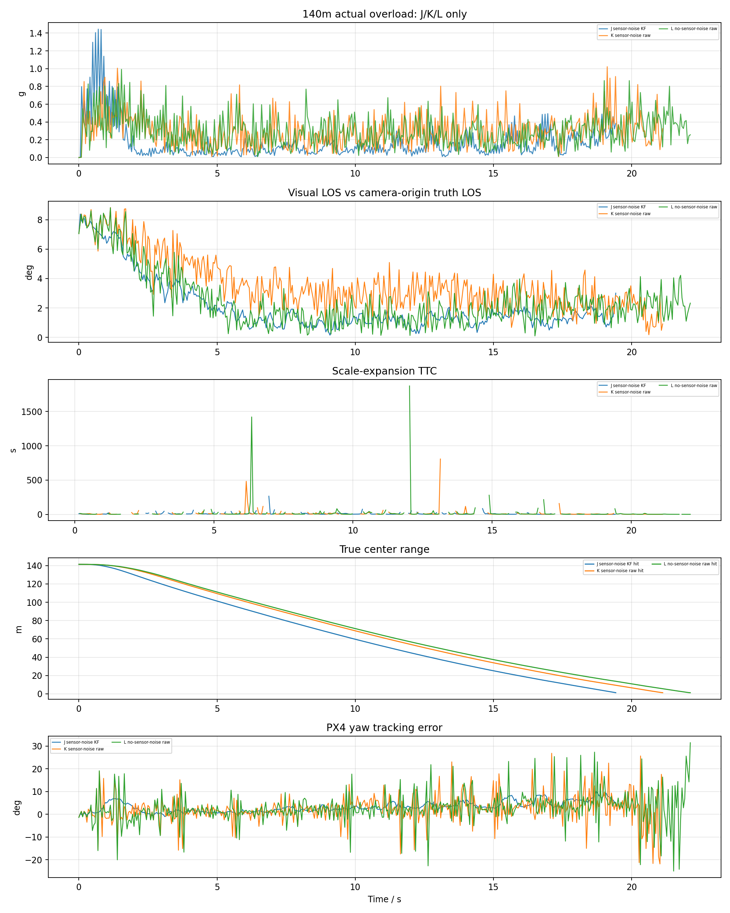

## 9. 结论

- J 组命中 `10/11`，命中距离 `50m, 60m, 70m, 80m, 90m, 100m, 110m, 120m, 130m, 140m`，最小中心距离 `0.481m`，有效视觉帧比例 `77.3%`，无检测比例 `21.0%`，航向误差 P95 `17.8deg`。
- K 组命中 `10/11`，命中距离 `50m, 60m, 70m, 80m, 90m, 100m, 110m, 120m, 130m, 140m`，最小中心距离 `0.970m`，有效视觉帧比例 `81.1%`，无检测比例 `16.5%`，航向误差 P95 `29.7deg`。
- L 组命中 `11/11`，命中距离 `40m, 50m, 60m, 70m, 80m, 90m, 100m, 110m, 120m, 130m, 140m`，最小中心距离 `1.091m`，有效视觉帧比例 `93.2%`，无检测比例 `4.1%`，航向误差 P95 `27.6deg`。
- 对比重点：J 与 K 的差别主要是 LOS Kalman；K 与 L 的差别主要是 IMU/GPS 噪声。如果 L 明显优于 K，说明传感器噪声经 PX4 EKF/姿态链路放大后影响拦截；如果 J 优于 K，说明当前 bbox 噪声下 LOS 滤波虽有约 0.1-0.25s 延迟，但总体提升了视线稳定性。
- 命中判据仍是 AirSim collision；报告同时列出最小中心距离。对于 1m x 1m x 0.5m 小目标，最小中心距离进入 1-3m 但没有 collision 的情况，应视为近失而非命中。
