# M/N/P PX4 SITL 固定 Vm 比例导引识别对比报告

## 1. 实验目的

本报告只比较 M/N/P 三组。三组均使用 PX4 SITL 拦截机、按轨迹移动的 `1m x 1m x 0.5m` Actor 目标、中心捷联相机、bbox 中等噪声、`ClockSpeed=1.0`、初始距离 `40-140m`、高度差 `20m`、目标速度 `5m/s`、拦截机速度上限 `10m/s`。

本轮算法层面不使用 TTC。导引律为固定 `V_m` 型比例导引：`a_req = N * V_m * (omega_LOS x lambda)`，其中 `N=3`、`V_m=10m/s`。在 AirSim/PX4 速度控制实现中，该加速度需求映射为现有速度指令修正，并保留横向/纵向限幅与末端外推状态机。

## 2. 工况设置

|项目|M|N|P|
|---|---|---|---|
|对应 J/K/L|J|K|L|
|LOS Kalman|开启|关闭|关闭|
|IMU/GPS 噪声|开启|开启|关闭|
|导引模式|`fixed_vm_png`|`fixed_vm_png`|`fixed_vm_png`|
|导航比 N|`3`|`3`|`3`|
|Vm|`10 m/s`|`10 m/s`|`10 m/s`|
|固定增益 N*Vm|`30`|`30`|`30`|
|TTC|禁用|禁用|禁用|
|bbox center 噪声|`3.0px`|`3.0px`|`3.0px`|
|bbox area 噪声|`8.0%`|`8.0%`|`8.0%`|
|Actor 名义尺寸|`1m x 1m x 0.5m`|`1m x 1m x 0.5m`|`1m x 1m x 0.5m`|
|实验 stamp|`mnp_fixed_vm_20260618_0636`|`mnp_fixed_vm_20260618_0636`|`mnp_fixed_vm_20260618_0636`|

## 3. TTC 禁用核查

- 总帧数 `15543`，TTC 导引帧数 `0`。
- `guidance_law` 分布：`fixed_vm_png`=15543。
- `guidance_mode` 分布：`blind_push`=30, `fixed_vm_png`=12830, `invalid`=2683。

## 4. 总览图

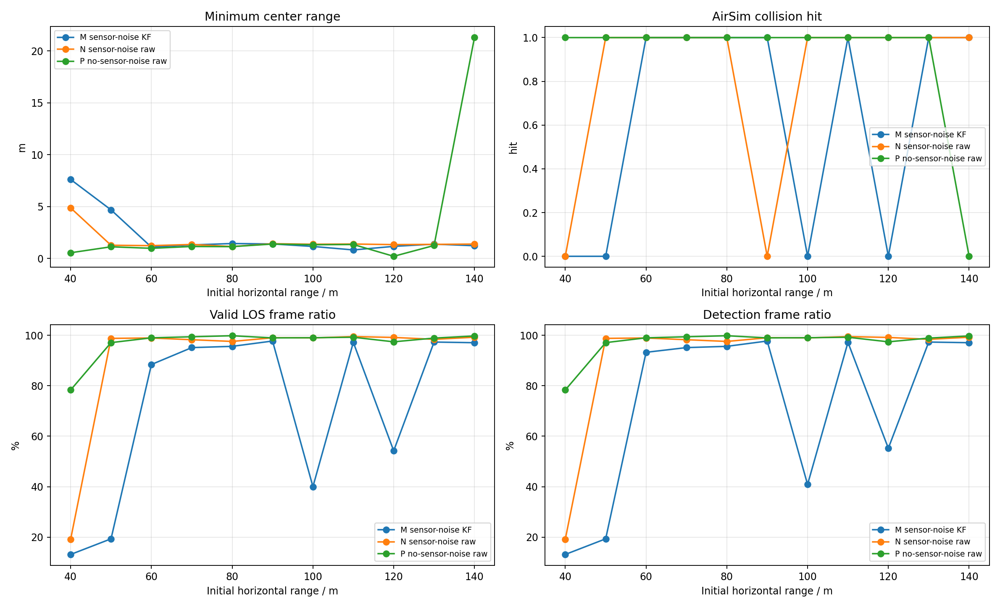

## 5. 命中汇总

|工况|命中数|命中距离m|未命中距离m|最小中心距离m|有效帧/总帧|检测帧/总帧|
|---|---:|---|---|---:|---:|---:|
|M|7/11|60, 70, 80, 90, 110, 130, 140|40, 50, 100, 120|0.816|2796/4782|2819/4782|
|N|9/11|50, 60, 70, 80, 100, 110, 120, 130, 140|40, 90|1.144|4978/5598|4978/5598|
|P|10/11|40, 50, 60, 70, 80, 90, 100, 110, 120, 130|140|0.201|5059/5163|5059/5163|

## 6. 明细表

|工况|距离m|碰撞|碰撞时间s|最小中心距离m|终点距离m|检测帧/总帧|有效帧|实际过载max g|速度指令P95 g|固定Vm理论P95 g|LOS误差P95 deg|sim FPS|
|---|---:|---:|---:|---:|---:|---:|---:|---:|---:|---:|---:|---:|
|M|40|0|-|7.606|177.273|92/698|92|1.52|0.97|0.40|130.31|19.93|
|N|40|0|-|4.865|112.258|134/697|134|0.85|13.48|2.33|142.58|19.92|
|P|40|1|11.30|0.544|0.544|177/226|177|1.33|16.31|7.48|14.41|19.93|
|M|50|0|-|4.677|150.014|135/697|135|1.53|1.22|0.42|135.70|19.92|
|N|50|1|12.09|1.266|1.266|238/241|238|1.28|15.90|4.42|7.70|19.90|
|P|50|1|11.99|1.119|1.119|232/239|232|0.91|15.72|4.36|7.61|19.90|
|M|60|1|10.38|1.087|1.146|193/207|183|1.49|4.41|1.26|14.46|19.90|
|N|60|1|13.69|1.228|1.228|270/273|270|0.85|15.87|3.70|7.77|19.90|
|P|60|1|14.65|0.971|0.995|289/292|289|1.17|15.84|4.51|7.93|19.90|
|M|70|1|10.19|1.299|1.310|194/204|194|1.38|3.38|0.66|7.35|19.93|
|N|70|1|19.73|1.341|1.341|387/394|387|0.97|16.12|3.49|8.10|19.93|
|P|70|1|16.60|1.147|1.147|329/331|329|1.04|15.75|3.44|7.59|19.91|
|M|80|1|11.38|1.432|1.432|217/227|217|1.57|3.00|0.77|7.37|19.89|
|N|80|1|16.31|1.144|1.217|317/325|317|1.08|16.02|3.81|8.14|19.90|
|P|80|1|24.59|1.133|1.133|489/490|489|0.95|16.16|3.71|8.15|19.91|
|M|90|1|13.05|1.392|1.392|255/261|255|1.34|3.09|0.57|7.50|19.93|
|N|90|0|-|1.416|3.413|690/697|690|1.01|16.14|4.12|7.65|19.92|
|P|90|1|28.66|1.384|1.384|565/571|565|0.96|16.47|3.41|7.75|19.92|
|M|100|0|-|1.150|136.952|285/697|279|1.32|2.28|0.34|152.77|19.92|
|N|100|1|23.60|1.363|1.363|466/471|466|1.25|16.30|3.40|8.24|19.93|
|P|100|1|25.44|1.315|1.315|502/507|502|0.88|16.25|3.38|7.73|19.91|
|M|110|1|16.01|0.816|0.816|310/319|310|1.24|2.87|0.59|7.54|19.90|
|N|110|1|28.16|1.384|1.384|558/561|558|0.99|16.32|3.24|7.77|19.91|
|P|110|1|25.11|1.339|1.339|497/501|497|0.98|16.28|3.41|8.10|19.93|
|M|120|0|-|1.158|103.025|385/697|378|1.78|2.72|1.87|162.89|19.92|
|N|120|1|34.53|1.329|1.329|682/688|682|0.94|16.67|3.44|8.05|19.92|
|P|120|1|34.55|0.201|0.201|671/689|671|0.98|16.82|3.94|8.14|19.93|
|M|130|1|18.53|1.375|1.375|360/370|360|1.46|2.92|0.89|7.29|19.93|
|N|130|1|30.97|1.351|1.351|607/617|607|1.10|16.82|3.22|8.24|19.92|
|P|130|1|31.12|1.243|1.243|613/620|613|1.15|16.49|3.26|7.56|19.92|
|M|140|1|20.32|1.220|1.324|393/405|393|1.24|2.82|0.60|7.46|19.91|
|N|140|1|31.79|1.380|1.380|629/634|629|0.91|16.58|3.49|7.76|19.93|
|P|140|0|-|21.281|21.281|695/697|695|0.96|16.95|3.33|7.55|19.92|

## 7. 单距离曲线

每个距离一张图。过载子图包含实际过载和固定 `V_m` PNG 理论加速度需求；报告不绘制 TTC 曲线。

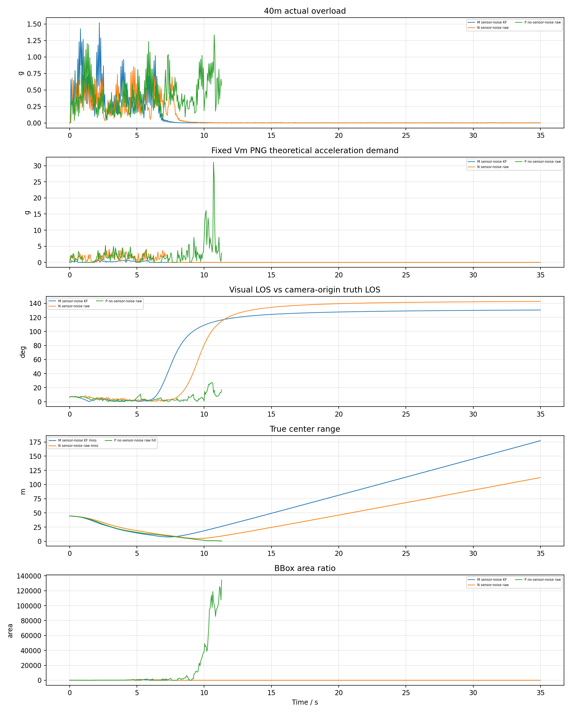
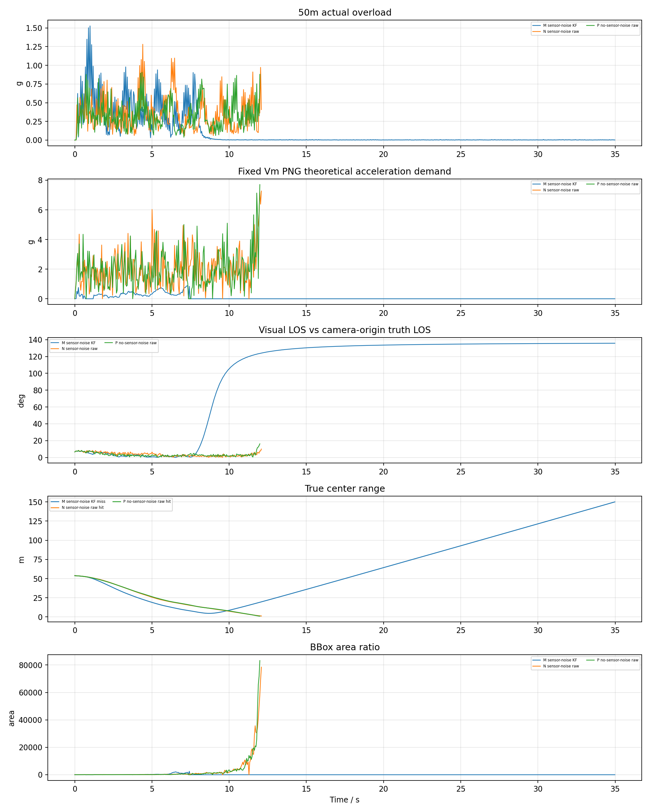
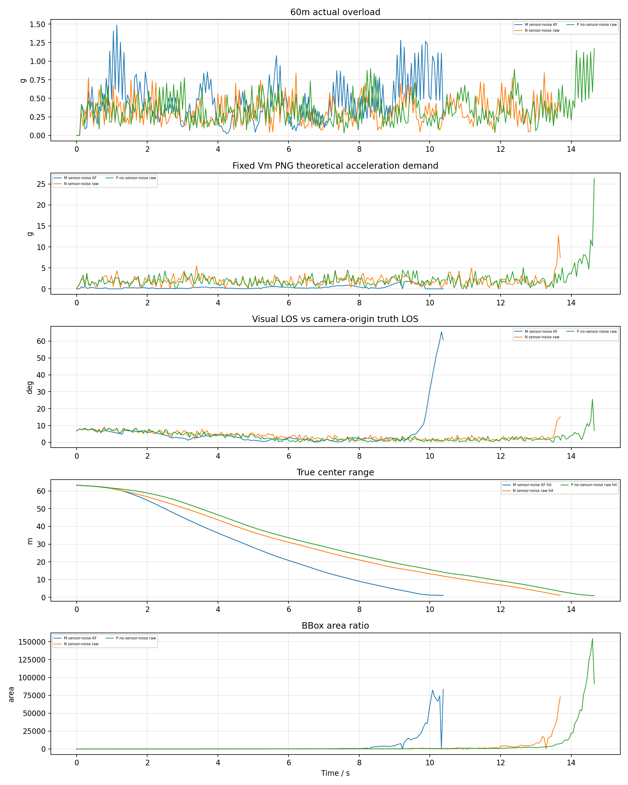
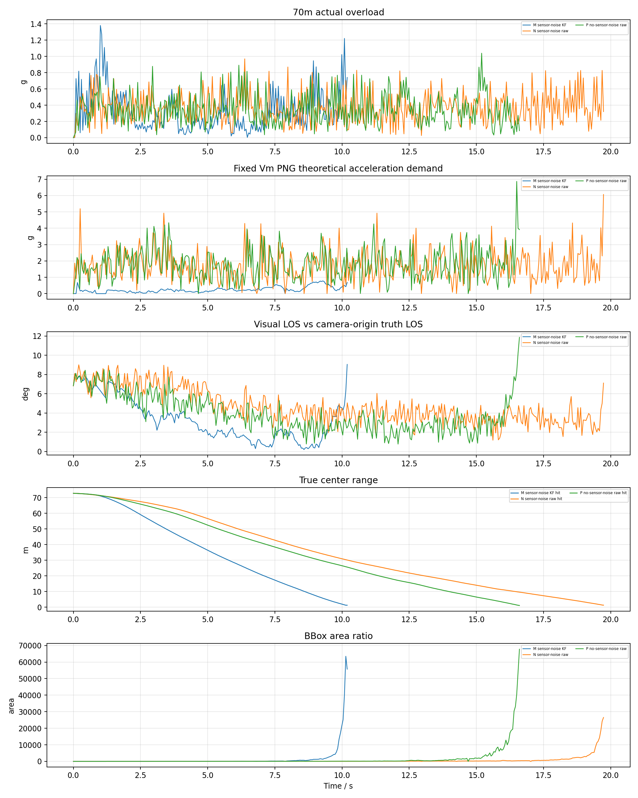
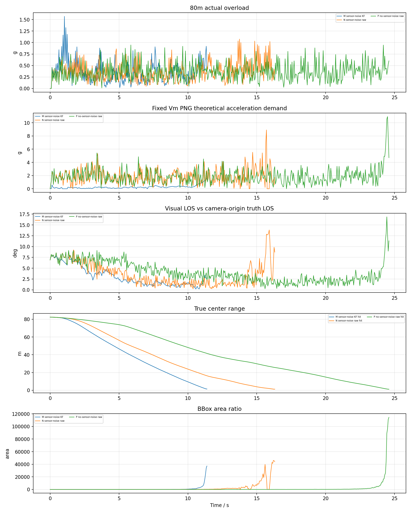
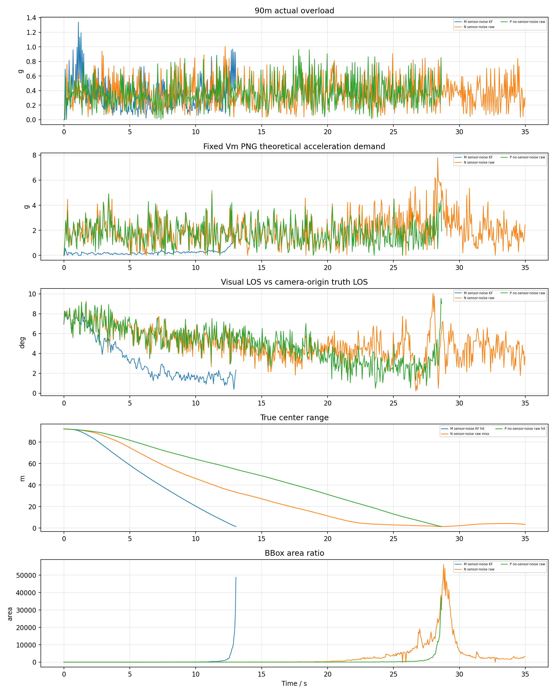
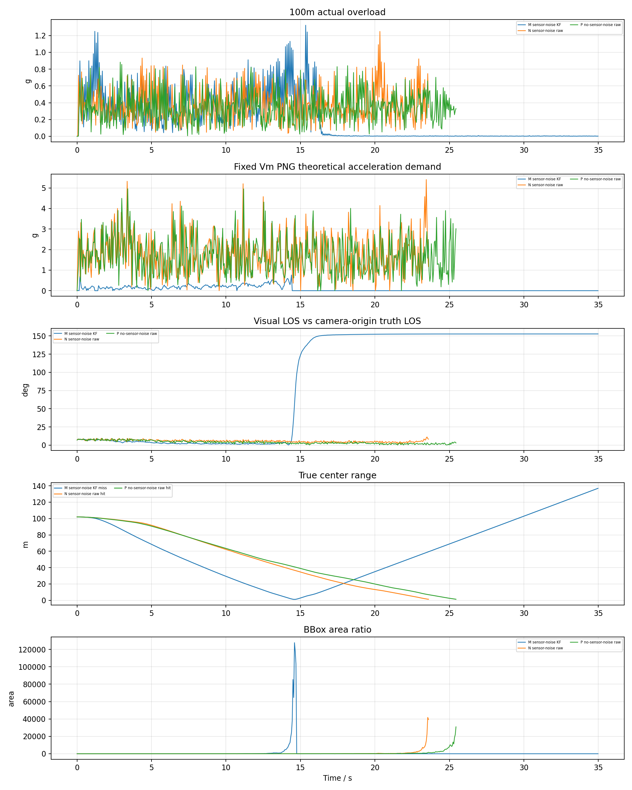
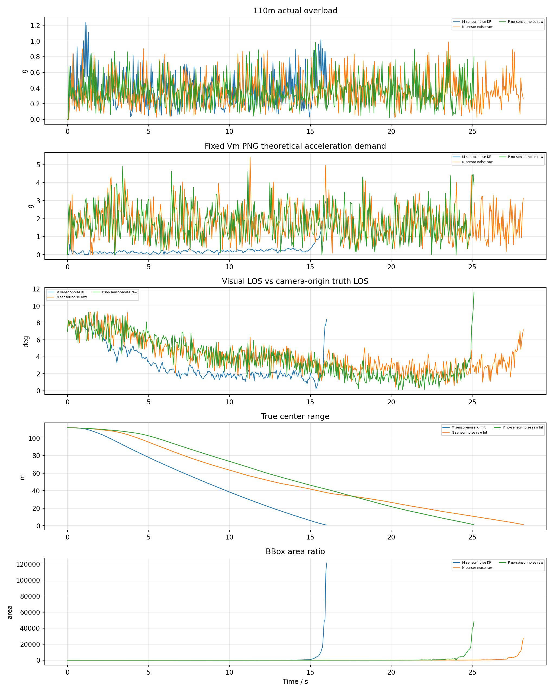
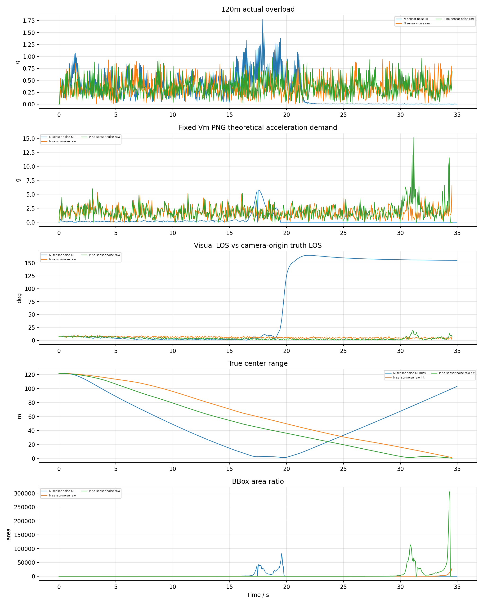
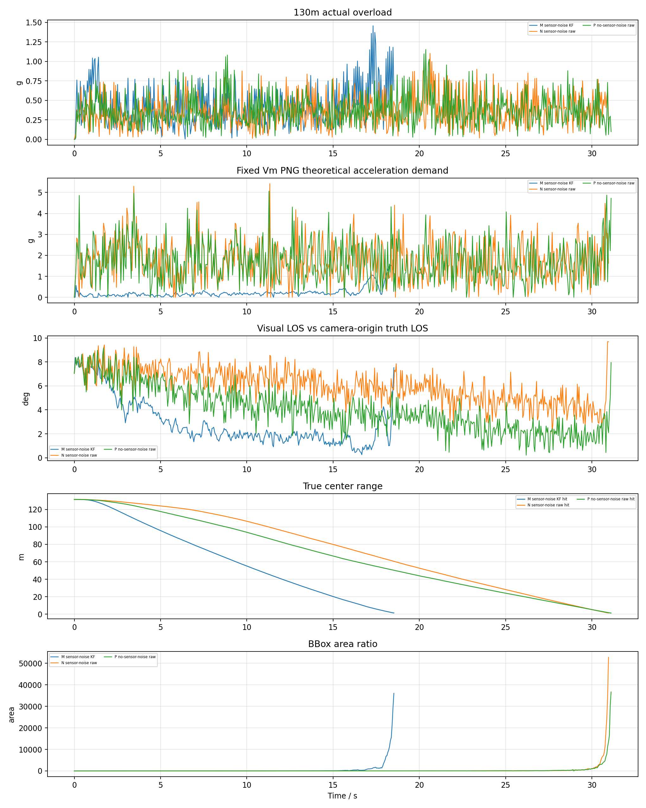
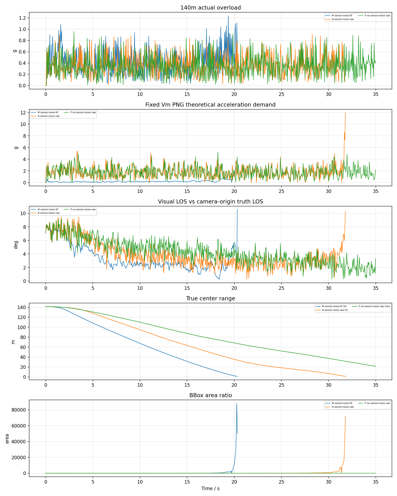

## 8. 结论

- M 组命中 `7/11`，命中距离 `60m, 70m, 80m, 90m, 110m, 130m, 140m`，未命中距离 `40m, 50m, 100m, 120m`，检测帧比例 `59.0%`，有效 LOS 帧比例 `58.5%`，固定 Vm 理论过载 P95 `0.57g`，LOS 误差 P95 `155.43deg`。
- N 组命中 `9/11`，命中距离 `50m, 60m, 70m, 80m, 100m, 110m, 120m, 130m, 140m`，未命中距离 `40m, 90m`，检测帧比例 `88.9%`，有效 LOS 帧比例 `88.9%`，固定 Vm 理论过载 P95 `3.51g`，LOS 误差 P95 `139.95deg`。
- P 组命中 `10/11`，命中距离 `40m, 50m, 60m, 70m, 80m, 90m, 100m, 110m, 120m, 130m`，未命中距离 `140m`，检测帧比例 `98.0%`，有效 LOS 帧比例 `98.0%`，固定 Vm 理论过载 P95 `3.64g`，LOS 误差 P95 `7.91deg`。
- 本轮实验的主要目的不是替代 J/K/L，而是隔离 TTC 面积通道。若 M/N/P 的检测帧比例足够高但命中率下降，问题更可能来自固定 Vm 导引强度、PX4 速度响应或末端 LOS 几何，而不是 TTC 估计。
- 若 M 明显优于 N，说明 bbox 噪声下 LOS Kalman 对固定 Vm PNG 有帮助；若 P 明显优于 N，说明 IMU/GPS 噪声经 PX4 EKF 和姿态链路影响了捷联视觉导引。
