# YOLO + ByteTrack PX4 SITL legacy frame_centering_tuned 50-100m 测试报告

## 1. 实验目的

按照此前已命中的 YOLO 案例配置，改用真正 PX4 SITL actor 场景，比较两种捷联视觉比例导引。本报告优先使用 `n_cmd_g` 作为需用过载；旧日志没有该字段时才回退到 `g_eval` 等效过载。

- `TTC` 组：`ttc_png`，TTC 只参与增益调度，并保留 LOS/Vm soft guidance。
- `VM` 组：`fixed_vm_png`，不使用 TTC，固定 `N * V_m` 导引增益。
- `accel_integral` 输出模式：导引律先计算 `a_cmd` / `n_cmd_g`，再按当前仿真步长积分为速度 setpoint；这不是直接向 PX4 发送加速度 setpoint。
- `accel_body_rate` 输出模式：导引律先计算 PNG 需用加速度，再转换为 PX4 `SET_ATTITUDE_TARGET` 机体系角速度 `p/q/r` 和 thrust；速度只作为沿 LOS 保速参考，不再把 PNG 横向修正直接加到速度指令上。
- `accel_attitude` 输出模式：导引律先计算 PNG 需用加速度，再转换为 PX4 `SET_ATTITUDE_TARGET` 姿态四元数和 thrust；速度只作为沿 LOS 保速参考。

两组均测试 50m、60m、70m、80m、90m、100m，每个工况重启 PX4 SITL 和 Blocks。

## 2. 基准条件

|参数|值|
|---|---|
|stamp|`legacy_retest_20260625_005552`|
|settings|`/home/linux/Documents/PNG/config/airsim_blocks_px4_actor_clock0p2_settings.json`|
|拦截机|`PX4 SITL / velocity_yaw_rate`|
|目标 actor|`IntruderActor`|
|actor asset|`Quadrotor1`|
|actor scale|`1.0`|
|检测源|`yolo_bytetrack`|
|YOLO model|`vision_guidance/best.pt`|
|YOLO device|`0` runtime `cuda:0`|
|YOLO conf / iou / imgsz|`0.1` / `0.7` / `640`|
|tracker|`bytetrack.yaml`，single target `1`|
|相机外参|`x=0.5, y=0.0, z=0.0`|
|FOV / resolution|`120.0 deg`, `640x480`|
|高度差|`20.0 m`|
|目标速度 / speed ratio|`5.0 m/s` / `2.0`|
|rate_hz|`8.0`|
|guidance output|`velocity_bias`|
|max guidance accel|`15.0 m/s^2`|
|min speed ratio|`0.6`|
|thrust model|`airsim_generic_quad`, mass `1.0 kg`, max total thrust `16.717785072 N`|
|body-rate tilt / attitude P|`20.0 deg` / `4.0`|
|body-rate roll/pitch max rate|`60.0` / `60.0 deg/s`|
|body-rate thrust|min/hover/max `0.25` / `0.5865998371` / `0.95`|
|body-rate speed hold|gain `1.2`, max accel `6.0 m/s^2`, total limit `18.0 m/s^2`|
|attitude tilt / yaw lookahead|`25.0 deg` / `0.25 s`|
|attitude thrust|min/hover/max `0.25` / `0.5865998371` / `0.95`|
|attitude speed hold|gain `1.2`, max accel `6.0 m/s^2`, total limit `18.0 m/s^2`|
|LOS filter|`1`|
|LOS KF q lambda / lambda_dot|`0.0001` / `0.005`|
|LOS KF r / innovation gate|`0.005` / `0.25`|
|LOS terminal gate / delay|`1.2` / `0.0 s`|
|terminal image KF|predict `0.35 s`, reject `0.2 rad`, soft reject `0`|
|terminal image KF dynamics|accel noise `8.0 rad/s^2`, max rate `8.0 rad/s`|
|frame_guard|`True`|
|bbox noise|`0`|

## 3. 姿态角对比

本批 `legacy_retest_20260625_005552` 日志里记录了 `attitude_roll_sp_deg`、`attitude_pitch_sp_deg`、`attitude_yaw_sp_deg` 以及实际姿态 `roll_deg`、`pitch_deg`、`body_yaw_deg`。其中 `attitude_control_active=0`、`body_rate_control_active=0`，说明这批实验最终走的是 `velocity_yaw_rate + velocity_bias` 链路，`attitude_*_sp` 更像内部参考量，实际有效控制主要体现为 `yaw_rate_cmd_deg_s` 和机体真实姿态响应。

### 3.1 实时曲线

每个距离一张图，上排 `TTC`，下排 `VM`，分别给出 roll / pitch / yaw 的期望与实际实时曲线。当前批次里 roll / pitch 期望值保持为 0，是日志本身的记录结果，不是绘图遗漏。

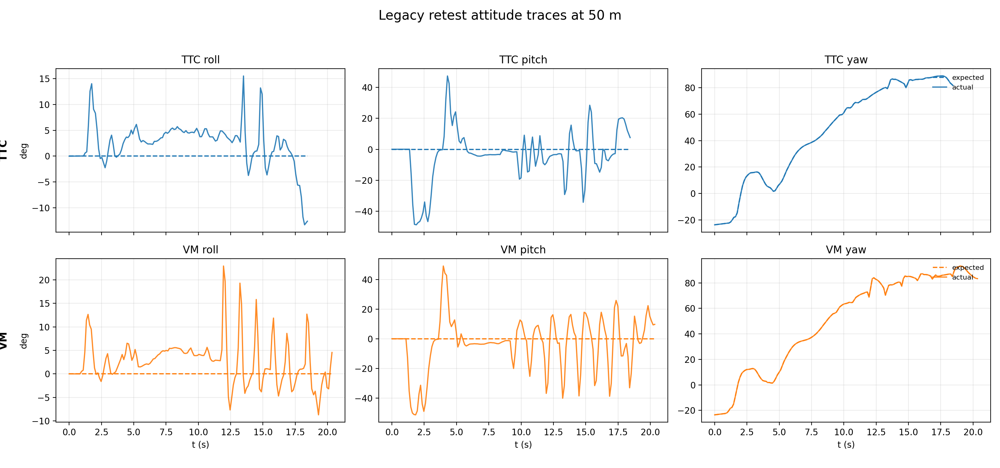
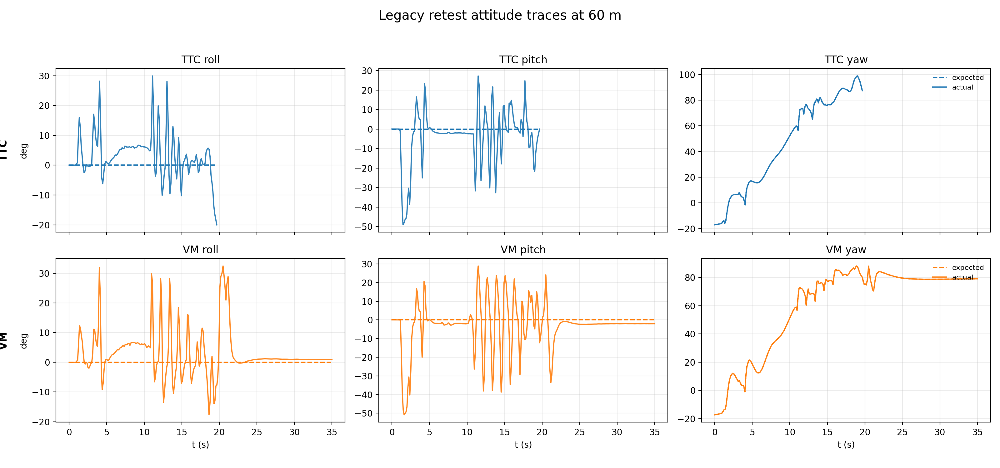
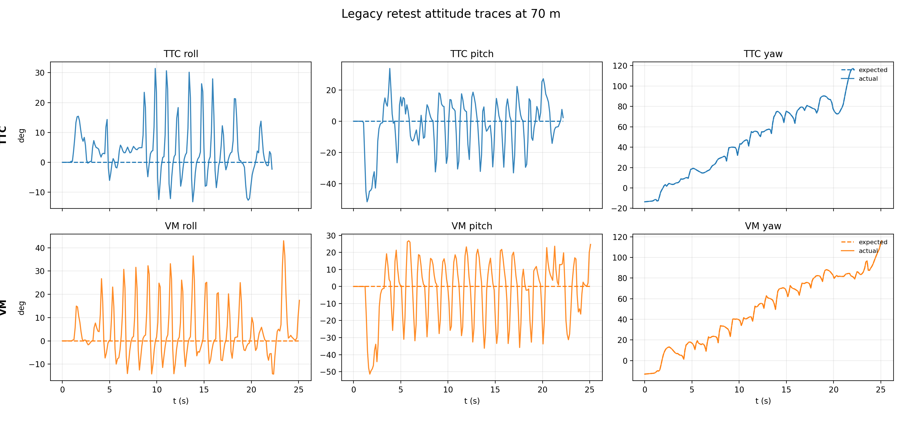
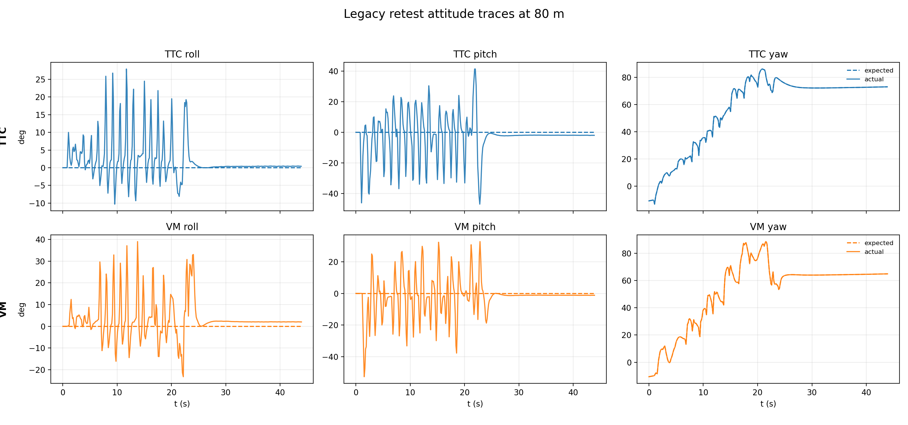
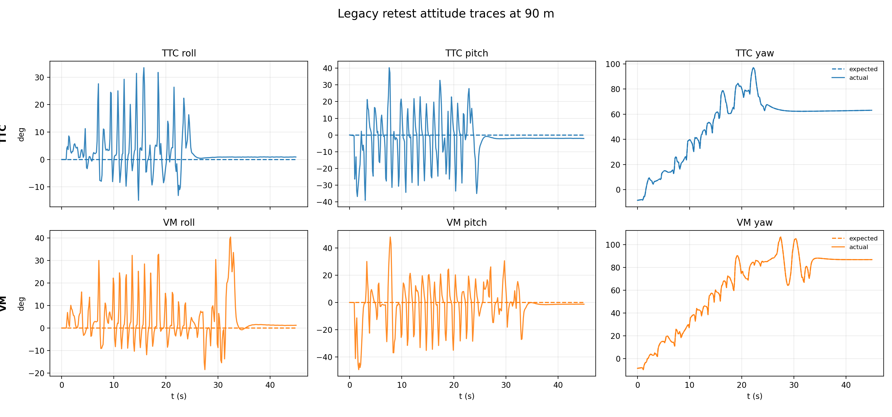
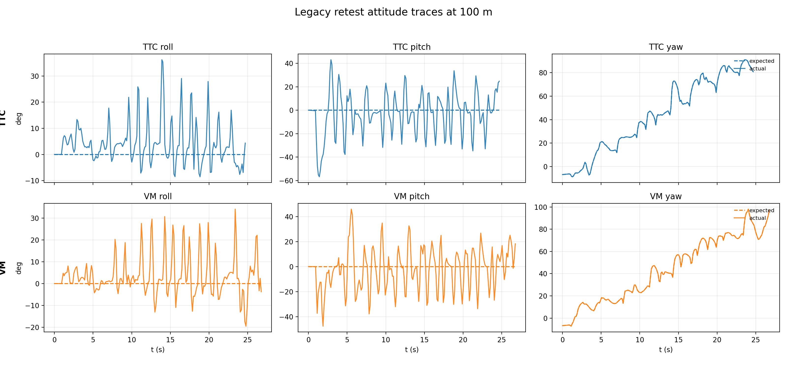

### 3.2 P95 汇总

|组别|距离m|期望roll p95|实际roll p95|期望pitch p95|实际pitch p95|期望yaw p95|实际yaw p95|yaw误差p95|yaw_rate_cmd p95|
|---|---:|---:|---:|---:|---:|---:|---:|---:|---:|
|TTC|50|0.000|11.852|0.000|43.598|88.119|88.119|0.000|36.215|
|TTC|60|0.000|16.899|0.000|34.391|92.851|92.851|0.000|27.515|
|TTC|70|0.000|22.816|0.000|34.083|90.229|90.229|0.000|45.000|
|TTC|80|0.000|16.563|0.000|31.566|79.838|79.838|0.000|12.101|
|TTC|90|0.000|17.492|0.000|28.518|81.552|81.552|0.000|21.783|
|TTC|100|0.000|21.840|0.000|37.496|85.804|85.804|0.000|29.184|
|VM|50|0.000|11.539|0.000|44.141|88.929|88.929|0.000|31.874|
|VM|60|0.000|23.297|0.000|31.013|84.822|84.822|0.000|27.214|
|VM|70|0.000|26.676|0.000|35.533|93.308|93.308|0.000|43.289|
|VM|80|0.000|24.118|0.000|26.928|82.701|82.701|0.000|27.032|
|VM|90|0.000|24.324|0.000|31.599|93.325|93.325|0.000|45.000|
|VM|100|0.000|22.963|0.000|32.630|85.937|85.937|0.000|36.028|

### 3.3 真正姿态控制批次

上面的 legacy 批次 `attitude_control_active=0`，它走的是 `velocity_yaw_rate + velocity_bias`，不是姿态四元数下发。这里补一组真正进入姿态通道的参考实验：`yolo_sitl_*_attitude_ttc_vm_20260623_092510_r{50..100}_h20.csv`。这批日志为 `guidance_output_mode=accel_attitude`、`px4_command_mode=mavlink_attitude`，且 `attitude_control_active=1`。

|组别|距离m|碰撞|碰撞时间s|最小距离m|终点距离m|roll sp P95|roll误差P95|pitch sp P95|pitch误差P95|yaw sp P95|yaw误差P95|需用过载P95 g|
|---|---:|---:|---:|---:|---:|---:|---:|---:|---:|---:|---:|---:|
|TTC|50|0|-|2.094|49.404|25.00|19.45|22.88|18.00|101.95|11.25|0.69|
|VM|50|0|-|3.552|10.340|25.00|33.40|25.00|21.35|107.90|11.25|1.30|
|TTC|60|1|18.82|1.551|1.551|25.00|16.81|25.00|23.07|83.19|11.25|0.41|
|VM|60|0|-|2.823|3.928|25.00|40.21|25.00|25.30|102.13|11.25|1.53|
|TTC|70|0|-|1.727|122.933|20.64|16.47|23.57|23.91|78.85|11.25|0.29|
|VM|70|0|-|2.916|159.762|25.00|23.83|25.00|23.80|67.47|11.25|1.02|
|TTC|80|0|-|2.819|3.445|25.00|37.74|25.00|24.98|103.12|11.25|1.53|
|VM|80|0|-|2.523|64.349|25.00|20.61|25.00|24.21|115.29|11.25|0.44|
|TTC|90|1|26.92|1.675|1.675|25.00|19.36|25.00|25.07|82.89|11.25|0.72|
|VM|90|0|-|1.531|9.861|25.00|31.41|25.00|27.12|112.63|11.25|1.53|
|TTC|100|0|-|1.821|84.253|22.25|11.95|22.96|26.68|115.59|11.25|0.23|
|VM|100|1|28.17|1.677|1.677|22.04|16.84|25.00|27.79|79.62|11.25|0.62|

每个距离一张图，上排 `TTC`，下排 `VM`，分别给出 roll / pitch / yaw 的姿态 setpoint 与实际姿态。

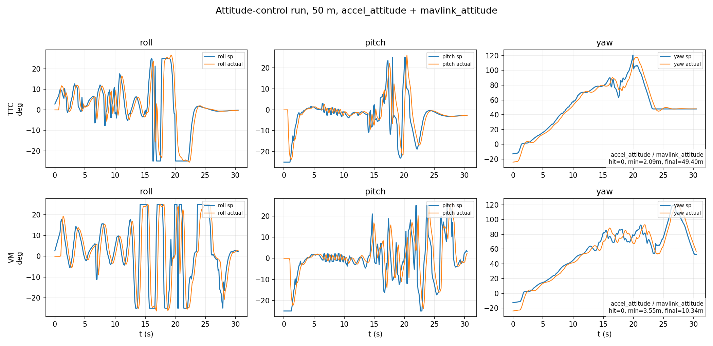
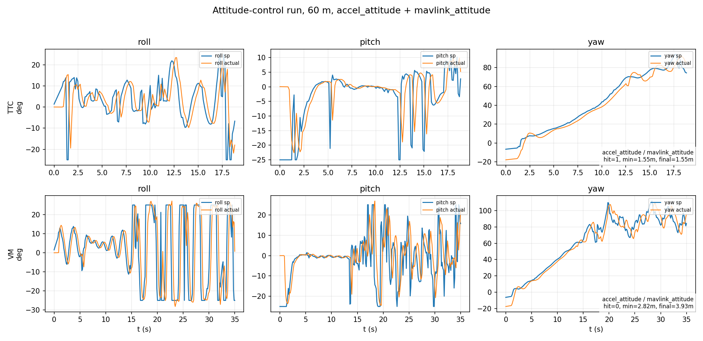
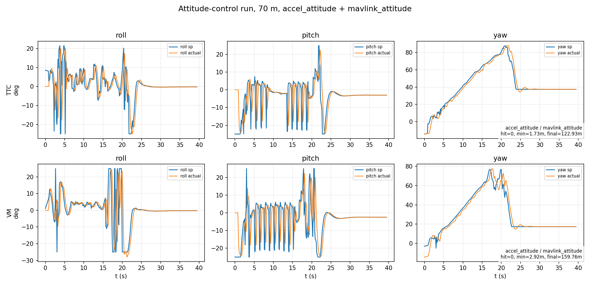
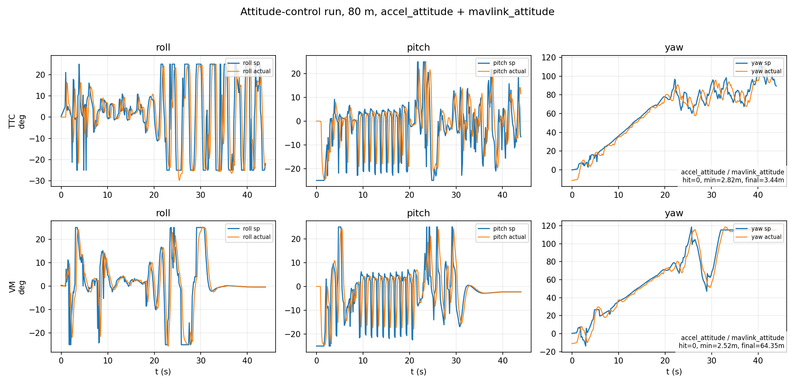
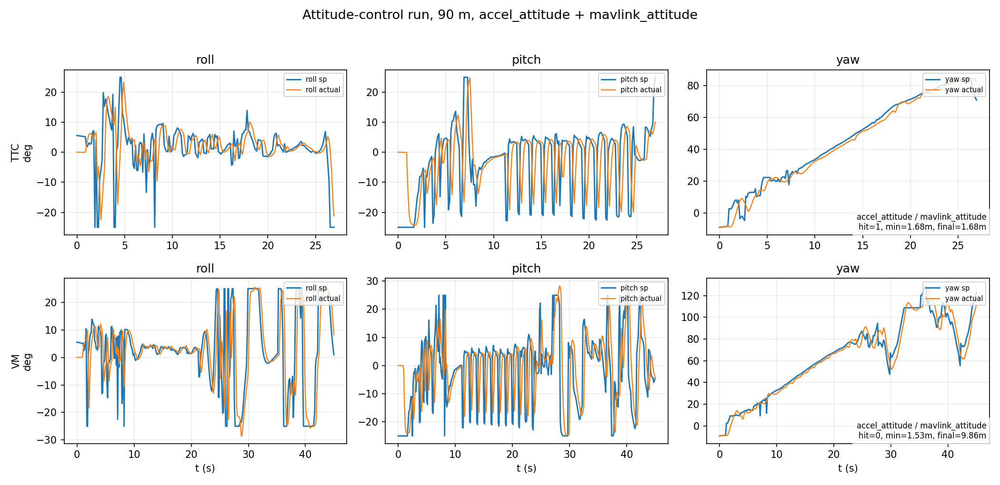
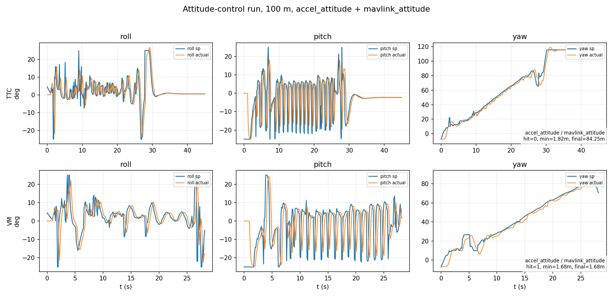

这组数据说明：真正姿态控制时 roll/pitch setpoint 明显非零，且实际姿态存在可见跟踪滞后和限幅；上一批 roll/pitch 期望为 0 的根因是控制链路没有进入姿态下发，而不是绘图或日志字段缺失。

## 4. 总览图

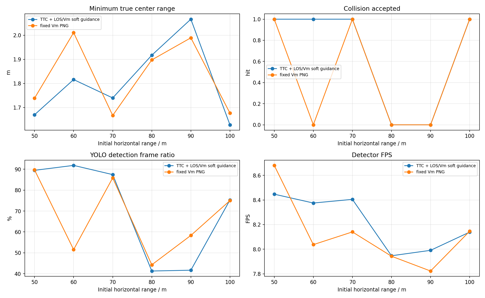

## 5. 汇总表

|组别|命中数|命中距离m|未命中距离m|最小中心距离m|检测帧/总帧|有效帧/总帧|平均检测FPS|
|---|---:|---|---|---:|---:|---:|---:|
|TTC|4/6|50, 60, 70, 100|80, 90|1.628|808/1282|888/1282|8.22|
|VM|3/6|50, 70, 100|60, 80, 90|1.667|909/1440|1008/1440|8.13|

## 6. 明细表

|组别|距离m|碰撞|碰撞时间s|最小距离m|终点距离m|检测帧率|有效帧率|YOLO FPS|sim FPS|实际过载max g|速度指令差分P95 g|需用过载P95 g|
|---|---:|---:|---:|---:|---:|---:|---:|---:|---:|---:|---:|---:|
|TTC|50|1|18.44|1.670|2.126|89.5%|92.5%|8.45|7.62|1.03|1.49|0.50|
|VM|50|1|20.34|1.739|1.739|89.7%|93.5%|8.68|7.81|0.99|2.85|0.48|
|TTC|60|1|19.66|1.816|2.303|91.8%|91.8%|8.38|7.71|0.98|2.32|0.75|
|VM|60|0|-|2.011|71.320|51.6%|55.0%|8.04|7.54|0.85|2.50|0.46|
|TTC|70|1|22.19|1.740|1.740|87.4%|89.2%|8.40|7.70|0.86|3.35|0.81|
|VM|70|1|25.09|1.667|1.714|85.9%|89.7%|8.14|7.57|0.86|3.34|0.40|
|TTC|80|0|-|1.917|107.710|41.3%|48.1%|7.95|7.48|0.95|2.41|0.29|
|VM|80|0|-|1.898|121.158|44.3%|51.1%|7.94|7.50|0.96|2.74|0.37|
|TTC|90|0|-|2.067|97.605|41.7%|49.5%|7.99|7.51|0.88|2.61|0.31|
|VM|90|0|-|1.989|73.017|58.3%|62.7%|7.82|7.37|1.08|2.83|1.47|
|TTC|100|1|24.68|1.628|1.641|75.3%|89.0%|8.14|7.58|1.24|3.01|0.83|
|VM|100|1|26.75|1.677|1.698|75.0%|95.9%|8.15|7.55|0.97|3.29|1.15|

## 7. 分距离曲线

每个距离一张图，包含真实中心距离、bbox 面积、TTC 估计、实际过载/需用过载和 YOLO 检测 FPS。

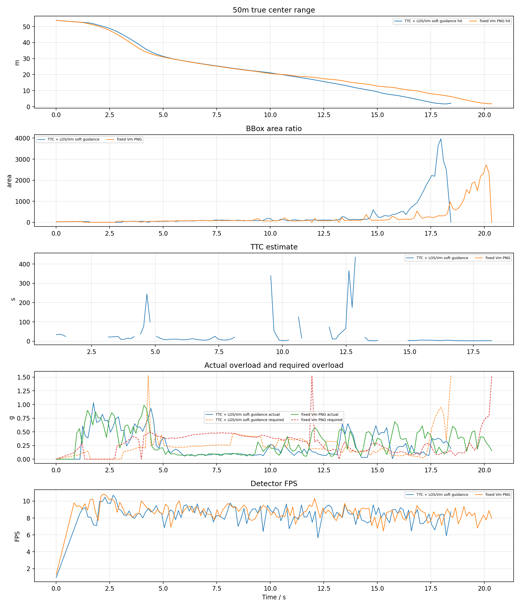
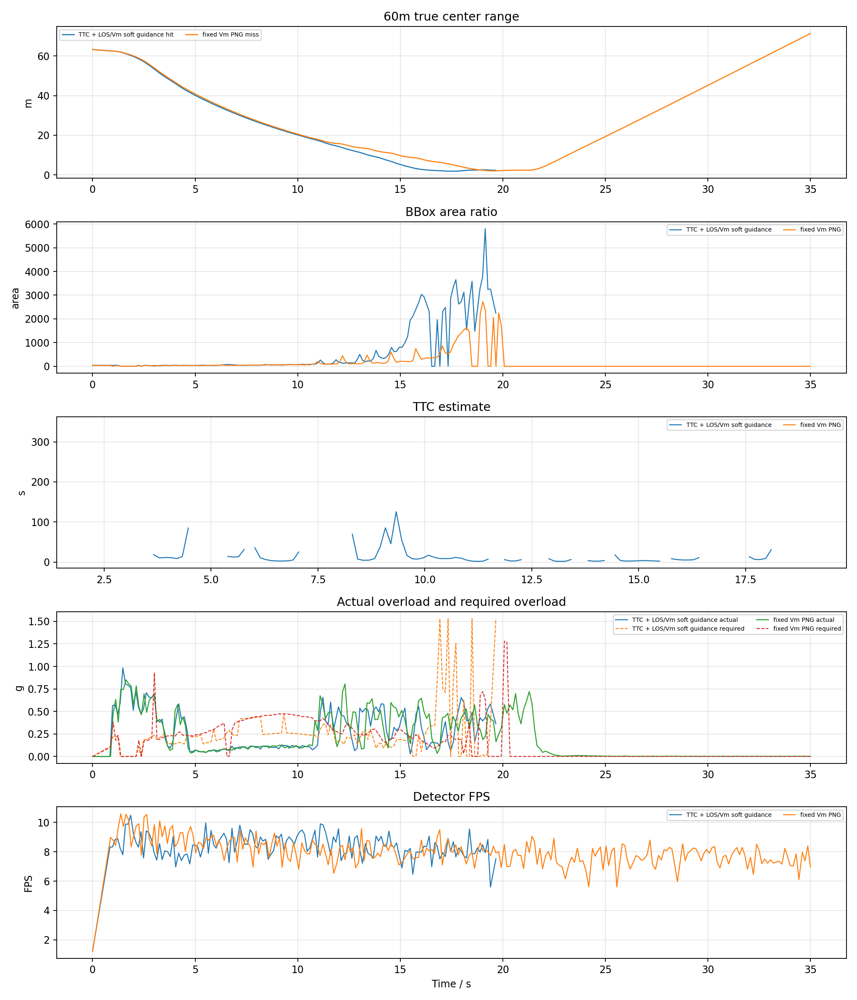
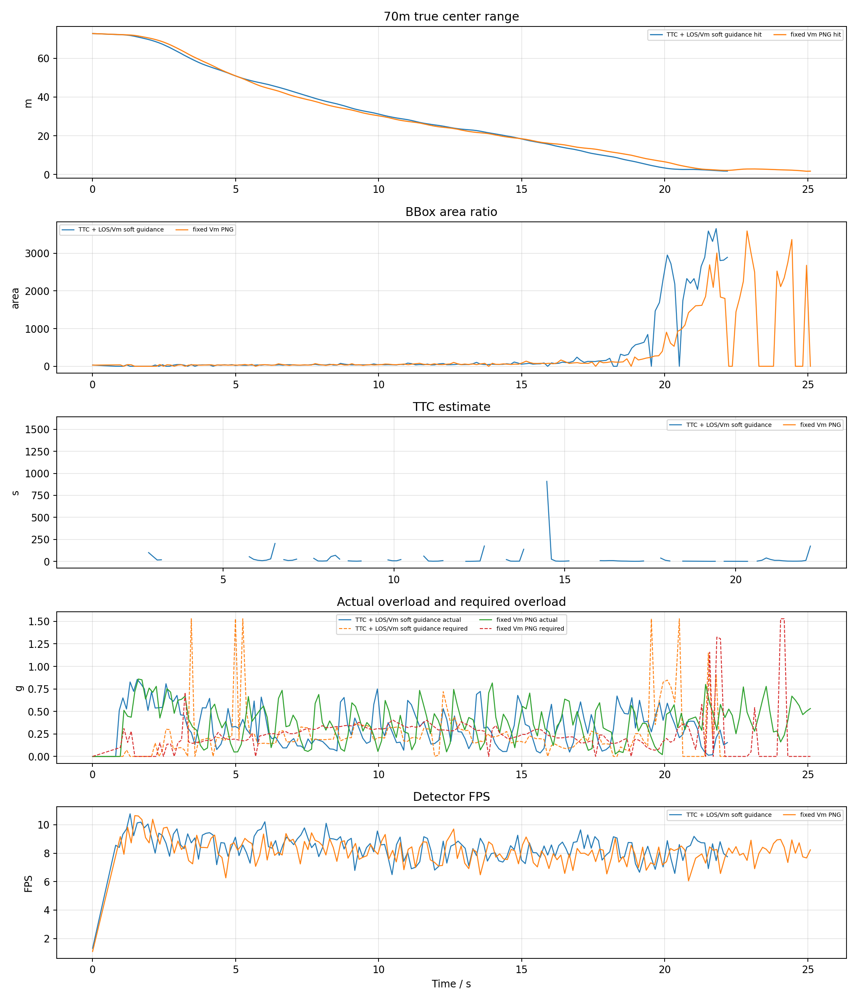
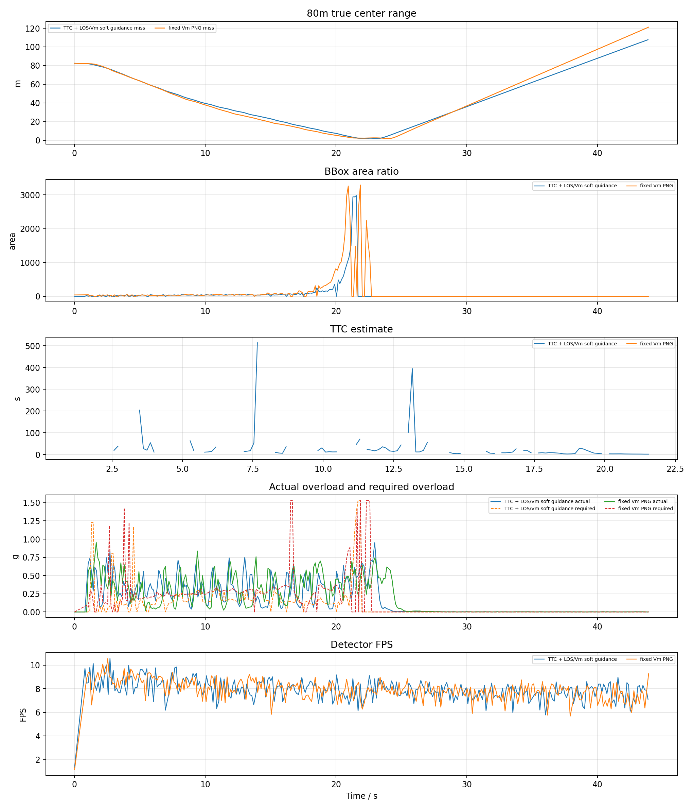
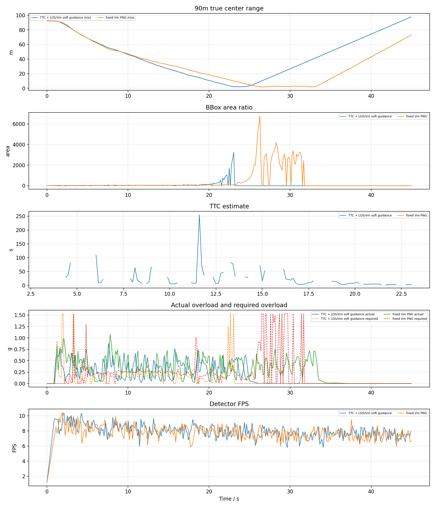
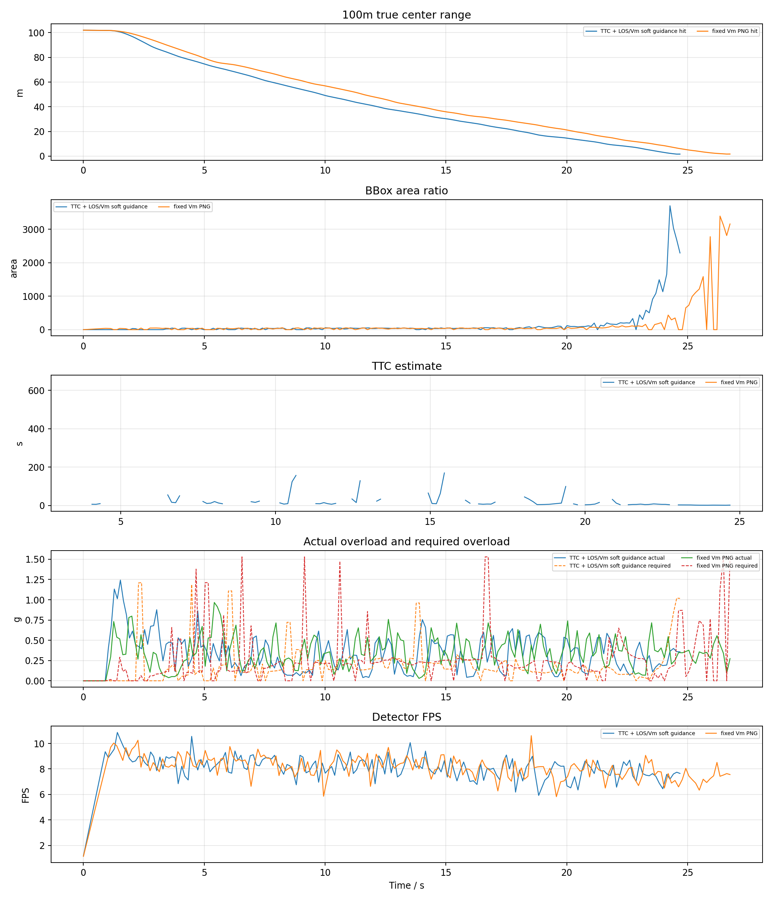

## 8. LOS KF 与失败原因诊断

|组别|距离m|最近距离m|最近点状态|主要失败/降级原因|检测率|有效率|
|---|---:|---:|---|---|---:|---:|
|TTC|50|1.670|`valid`|valid:84, area_not_expanding:28, no_detection:10, ttc_out_of_range:6|89.5%|92.5%|
|VM|50|1.739|`image_kf_predict`|valid:139, no_detection:10, image_kf_predict:6|89.7%|93.5%|
|TTC|60|1.816|`valid`|valid:78, area_not_expanding:48, image_kf_predict:7, los_innovation_reject:7|91.8%|91.8%|
|VM|60|2.011|`los_innovation_reject`|valid:130, no_detection:113, image_kf_predict:12, los_innovation_reject:3|51.6%|55.0%|
|TTC|70|1.740|`los_innovation_reject`|valid:81, area_not_expanding:47, image_kf_predict:13, los_innovation_reject:10|87.4%|89.2%|
|VM|70|1.667|`los_innovation_reject`|valid:148, image_kf_predict:17, los_innovation_reject:10, no_detection:9|85.9%|89.7%|
|TTC|80|1.917|`no_detection`|no_detection:167, valid:94, area_not_expanding:36, image_kf_predict:22|41.3%|48.1%|
|VM|80|1.898|`no_detection`|no_detection:156, valid:141, image_kf_predict:24, los_innovation_reject:2|44.3%|51.1%|
|TTC|90|2.067|`no_detection`|no_detection:167, valid:86, area_not_expanding:49, image_kf_predict:26|41.7%|49.5%|
|VM|90|1.989|`no_detection`|valid:177, no_detection:109, image_kf_predict:26, los_innovation_reject:12|58.3%|62.7%|
|TTC|100|1.628|`valid`|valid:85, area_not_expanding:46, image_kf_predict:25, no_detection:20|75.3%|89.0%|
|VM|100|1.677|`los_innovation_reject`|valid:146, image_kf_predict:42, no_detection:7, los_innovation_reject:1|75.0%|95.9%|

- LOS KF 参数：`q_lambda=0.0001`、`q_lambda_dot=0.005`、`r=0.005`、`innovation_reject=0.25`、`terminal_reject=1.2`。
- 未命中但最近距离小于等于 3m 的工况：VM 60m(2.011m)，TTC 80m(1.917m)，VM 80m(1.898m)，TTC 90m(2.067m)，VM 90m(1.989m)。这些工况已接近目标，但没有触发 AirSim 碰撞判定，后续应重点看末端视场保持、外推和碰撞几何。
- 检测率低于 60% 的工况：VM 60m(51.6%)，TTC 80m(41.3%)，VM 80m(44.3%)，TTC 90m(41.7%)，VM 90m(58.3%)。这类失败优先归因于 YOLO/ByteTrack 连续性和固定相机视场保持，而不是导引律公式本身。
- 最近点处仍处于降级或无效状态的未命中工况：VM 60m:`los_innovation_reject`，TTC 80m:`no_detection`，VM 80m:`no_detection`，TTC 90m:`no_detection`，VM 90m:`no_detection`。这些样本说明末端质量门、视觉外推和 bbox 裁切处理仍会影响命中窗口。
- 本轮平均实际过载峰值约 `0.97 g`，平均需用过载 P95 约 `0.65 g`。两者不是同一个量：`n_cmd_g` 是导引层需求，实际过载还受 PX4 姿态/推力限制、YOLO 约 9 FPS 采样和 frame centering 限速影响。

## 9. 相机光心真值影子测试诊断

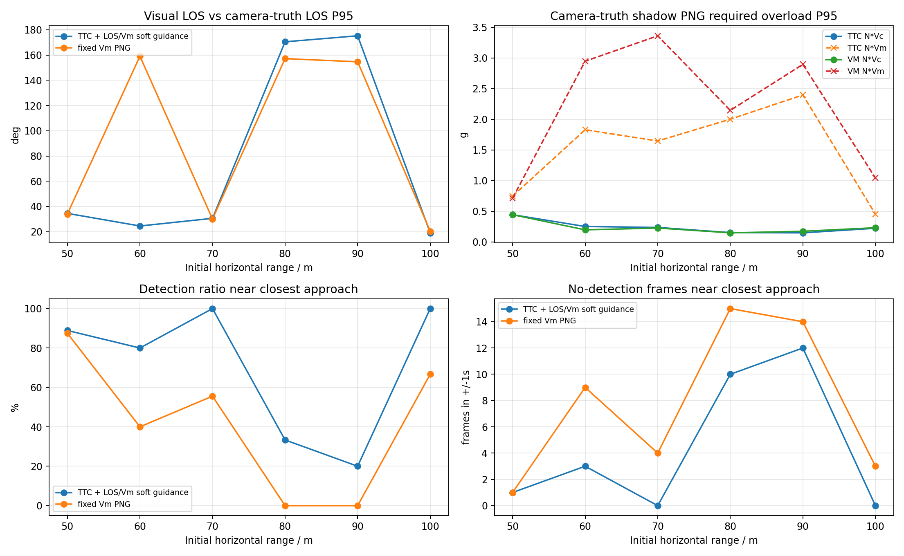

影子测试不参与导引，只用日志中的相机光心 `camera_world_*` 与目标真值位置离线计算经典 `N*Vc` 和固定 `N*Vm` PNG 理论需用过载，并和视觉 LOS、检测连续性对齐。

|组别|距离m|碰撞|最小距离m|最近点检测率|最近点无检测帧|视觉LOS误差P95|影子N*Vc P95 g|影子N*Vm P95 g|视觉需用P95 g|实际过载max g|
|---|---:|---:|---:|---:|---:|---:|---:|---:|---:|---:|
|TTC|50|1|1.670|88.9%|1/9|23.6|0.44|0.75|0.50|1.03|
|VM|50|1|1.739|87.5%|1/8|16.3|0.44|0.71|0.48|0.99|
|TTC|60|1|1.816|80.0%|3/15|28.0|0.25|1.83|0.75|0.98|
|VM|60|0|2.011|40.0%|9/15|35.6|0.20|2.95|0.46|0.85|
|TTC|70|1|1.740|100.0%|0/8|26.3|0.24|1.65|0.81|0.86|
|VM|70|1|1.667|55.6%|4/9|43.4|0.23|3.36|0.40|0.86|
|TTC|80|0|1.917|33.3%|10/15|54.0|0.15|2.00|0.29|0.95|
|VM|80|0|1.898|0.0%|15/15|141.7|0.15|2.15|0.37|0.96|
|TTC|90|0|2.067|20.0%|12/15|102.8|0.15|2.40|0.31|0.88|
|VM|90|0|1.989|0.0%|14/14|126.9|0.17|2.90|1.47|1.08|
|TTC|100|1|1.628|100.0%|0/9|21.7|0.22|0.45|0.83|1.24|
|VM|100|1|1.677|66.7%|3/9|17.7|0.23|1.04|1.15|0.97|

- 如果影子 `N*Vc` P95 很低但视觉 LOS 误差和无检测帧较高，优先定位检测连续性、LOS KF/外推和 frame-centering。
- 如果视觉需用过载高而实际过载低，优先定位 PX4 姿态/推力响应、倾角限制和 speed-hold 混合项。

## 10. PNG 到过载、姿态和角速度的控制流程

当前批测的日志文件名与 meta 显示为 `guidance_output_mode=velocity_bias`、`px4_command_mode=velocity_yaw_rate`。因此这批实验的实际控制链路不是“姿态四元数下发”，而是“PNG 速度修正 + yaw_rate 参考”。`attitude_*_sp` 在日志中有记录，但 `attitude_control_active=0`，不能当作真实下发姿态指令理解。项目里保留的 `accel_attitude + mavlink_attitude` 和 `accel_body_rate + mavlink_body_rate` 仍然是另一条完整链路。

### 10.1 视觉量到 6D LOS

YOLOv8 + ByteTrack 输出 `bbox center=(u,v)`、`bbox area`、`track_id` 和置信度。bbox 中心先通过相机内参转换成相机坐标系单位射线：

```text
x_n = (u - cx) / fx
y_n = (v - cy) / fy
lambda_C = normalize([x_n, y_n, 1])
```

再使用相机外参和机体姿态转到惯性系：

```text
lambda_I = normalize(R_IB * R_BC * lambda_C)
```

其中 `R_BC` 是相机到机体的固定安装旋转，`R_IB` 是机体到惯性系的姿态。LOS 角速度由相邻 LOS 差分并投影到垂直 LOS 的平面得到：

```text
lambda_dot = project_perpendicular((lambda_I[k] - lambda_I[k-1]) / dt, lambda_I[k])
omega_LOS = lambda_I x lambda_dot
```

启用 LOS KF 时，滤波器输出平滑后的 `lambda_I` 和 `omega_LOS`；末端允许更松的 innovation gate，避免目标仍在检测框内时 PNG 加速度被过早清零。

### 10.2 PNG 生成需用加速度和需用过载

两种导引的共同输出都是导引层需用加速度 `a_cmd`：

```text
a_cmd = guidance_gain * (omega_LOS x lambda_I)
a_cmd = clip_norm(a_cmd, max_guidance_accel_mps2)
n_cmd_g = ||a_cmd|| / g
```

`omega_LOS x lambda_I` 给出垂直于视线的修正方向；`n_cmd_g` 是导引层需用过载，只表示 PNG 希望产生的机动强度。它不等于无人机真实过载，真实过载还受 PX4 姿态控制、推力限制、速度保持项、视觉帧率和 frame centering 限速影响。

TTC 组使用 bbox 面积扩张估计 `TTC ~= A / A_dot`，当前只把 TTC 用作增益调度和末端触发；当 TTC 无效但 LOS 有效时，仍保留 LOS/V_m soft guidance。V_m 组不使用 TTC，直接采用固定：

```text
guidance_gain = N * V_m
V_m = speed_ratio * intruder_speed
```

### 10.3 与速度保持项合成

在 `accel_attitude` 和 `accel_body_rate` 中，PNG 横向修正不再积分成速度指令。速度只作为沿 LOS 的保速参考：

```text
v_ref = speed_cap * lambda_I
a_speed_hold = K_v * (v_ref - v_current)
a_control_I = clip_norm(a_cmd + a_speed_hold, total_accel_limit)
```

`a_cmd` 是纯 PNG 需用加速度；`a_speed_hold` 是工程闭环项，用于避免飞机速度掉到无法追击或过度横向漂移。报告中的 `n_cmd_g` 仍来自 `a_cmd`，而 `attitude_control_accel_*` / `body_rate_control_accel_*` 记录合成后的控制加速度。

### 10.4 加速度到姿态四元数，本轮默认链路

当前批测使用 `accel_attitude + mavlink_attitude`。程序先由图像中心误差和 LOS 水平投影得到期望航向：

```text
yaw_sp = current_yaw + yaw_rate_cmd * attitude_yaw_lookahead_s
```

随后把惯性系合成加速度旋转到期望 yaw 对应的水平坐标系：

```text
a_yaw_body = R_z(yaw_sp)^T * a_control_I
```

再用小角度近似得到姿态 setpoint：

```text
pitch_sp = -a_yaw_body.x / g
roll_sp  =  a_yaw_body.y / g
```

roll/pitch 按 `attitude_max_tilt_deg` 限幅，然后和 `yaw_sp` 合成为姿态四元数：

```text
R_sp = R_z(yaw_sp) * R_y(pitch_sp) * R_x(roll_sp)
q_sp = quat(R_sp)
```

垂向加速度通过 AirSim GenericQuad 质量和最大推力参数换算成归一化 thrust 的线性近似：

```text
thrust = hover_thrust + thrust_gain * (-a_control_I.z / g)
thrust = clamp(thrust, min_thrust, max_thrust)
```

最后通过 MAVLink `SET_ATTITUDE_TARGET` 发送：

```text
type_mask = BODY_ROLL_RATE_IGNORE | BODY_PITCH_RATE_IGNORE | BODY_YAW_RATE_IGNORE
q = q_sp
body rates = 0
thrust = thrust
```

PX4 在 Offboard 下跟踪姿态四元数和 thrust，内部姿态/角速度控制器再驱动电机模型。

### 10.5 加速度到机体系角速度，备用链路

若显式设置 `GUIDANCE_OUTPUT_MODE=accel_body_rate`、`PX4_COMMAND_MODE=mavlink_body_rate`，程序会先把 `a_control_I` 转到机体系：

```text
a_control_B = R_BI * a_control_I
```

再用小角度近似得到期望 roll/pitch：

```text
roll_sp  =  body_rate_roll_gain  * a_control_B.y / g
pitch_sp = -body_rate_pitch_gain * a_control_B.x / g
```

姿态误差通过比例环变成机体系角速度：

```text
p_cmd = K_att * (roll_sp  - roll)
q_cmd = K_att * (pitch_sp - pitch)
r_cmd = yaw_rate_cmd
```

再按最大 roll/pitch/yaw rate 限幅。MAVLink 发送仍使用 `SET_ATTITUDE_TARGET`，但 `type_mask` 忽略姿态四元数，只让 PX4 接收 `body_roll_rate/body_pitch_rate/body_yaw_rate` 和 thrust。

### 10.6 本报告中过载曲线的含义

- `需用过载 n_cmd_g`：由 PNG 的 `a_cmd` 直接换算，是导引层希望产生的过载。
- `实际过载 max g`：由拦截机真实速度差分估计，体现 PX4 和 AirSim 动力学真正实现出的机动。
- `速度指令差分 P95 g`：兼容旧速度输出模式的指标，本轮 `accel_attitude` 下主要作为参考，不代表直接发送给 PX4 的控制量。

因此，若 `n_cmd_g` 很平滑但实际过载不足，问题通常在姿态/推力响应、速度保持、限幅或视觉低帧率；若 `n_cmd_g` 本身突变，则应优先检查 LOS/KF、bbox 裁切、丢检外推和 frame guard 状态切换。

## 11. 结论

- TTC: 命中 `4/6`，命中距离 `50m, 60m, 70m, 100m`，未命中 `80m, 90m`，检测帧比例 `63.0%`，有效导引帧比例 `69.3%`，平均检测 FPS `8.22`。
- VM: 命中 `3/6`，命中距离 `50m, 70m, 100m`，未命中 `60m, 80m, 90m`，检测帧比例 `63.1%`，有效导引帧比例 `70.0%`，平均检测 FPS `8.13`。
- 本轮使用真实 YOLOv8 + ByteTrack，因此检测连续性和 GPU 推理速度会直接进入闭环；结果不能和 AirSim detect 函数的理想 bbox 直接等价比较。
- `accel_integral` 模式的 `n_cmd_g` 来自导引层 `a_cmd`，底层仍通过 PX4/AirSim 速度 setpoint 闭环；实际过载由真实速度差分估计，因此会同时受 PX4 响应、速度限幅和视觉帧率影响。
- `accel_body_rate` 模式下 `n_cmd_g` 仍表示纯 PNG 需用过载；实际发送给 PX4 的是 `SET_ATTITUDE_TARGET` 机体系 `p/q/r` 角速度和归一化 thrust，日志中的 `body_rate_control_accel_*` 额外包含沿 LOS 的速度保持加速度。
- `accel_attitude` 模式下 `n_cmd_g` 同样表示纯 PNG 需用过载；实际发送给 PX4 的是 `SET_ATTITUDE_TARGET` 姿态四元数和归一化 thrust，日志中的 `attitude_control_accel_*` 记录姿态指令生成前的合成加速度。
