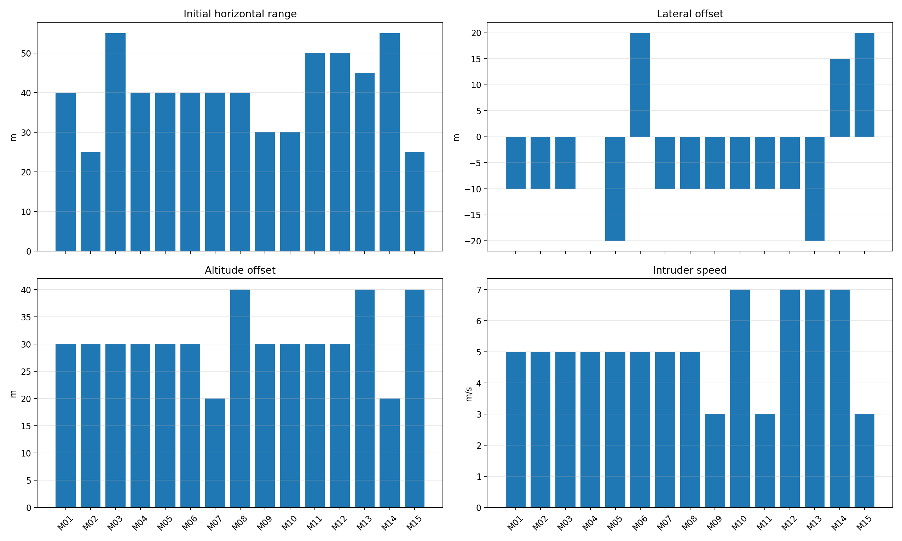
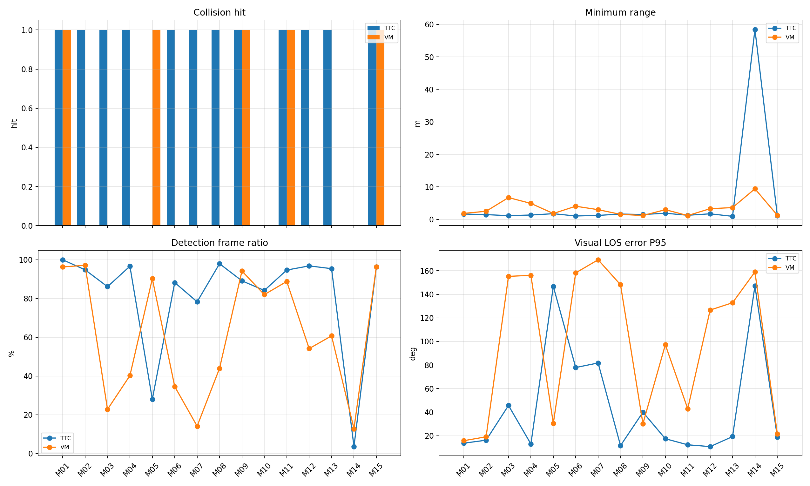

# YOLO+ByteTrack upward-camera matrix15 performance report

## 1. 实验目的

本轮测试 YOLO+ByteTrack 固定上视相机闭环在 15 个距离、侧向、高度差和目标速度组合下的拦截性能。每个工况分别运行 TTC 与 VM，共 30 个 case；AirSim detect shadow 关闭，collision 作为成功标准。

## 2. 工况矩阵

|case|距离m|侧向m|高度差m|目标速度m/s|speed ratio|stamp|status|
|---|---:|---:|---:|---:|---:|---|---|
|M01|40|-10|30|5.0|2.0|`upward_yolo_matrix15_20260701_202024_M01`|`ok`|
|M02|25|-10|30|5.0|2.0|`upward_yolo_matrix15_20260701_202024_M02`|`ok`|
|M03|55|-10|30|5.0|2.0|`upward_yolo_matrix15_20260701_202024_M03`|`ok`|
|M04|40|0|30|5.0|2.0|`upward_yolo_matrix15_20260701_202024_M04`|`ok`|
|M05|40|-20|30|5.0|2.0|`upward_yolo_matrix15_20260701_202024_M05`|`ok`|
|M06|40|20|30|5.0|2.0|`upward_yolo_matrix15_20260701_202024_M06`|`ok`|
|M07|40|-10|20|5.0|2.0|`upward_yolo_matrix15_20260701_202024_M07`|`ok`|
|M08|40|-10|40|5.0|2.0|`upward_yolo_matrix15_20260701_202024_M08`|`ok`|
|M09|30|-10|30|3.0|2.0|`upward_yolo_matrix15_20260701_202024_M09`|`ok`|
|M10|30|-10|30|7.0|2.0|`upward_yolo_matrix15_20260701_202024_M10`|`ok`|
|M11|50|-10|30|3.0|2.0|`upward_yolo_matrix15_20260701_202024_M11`|`ok`|
|M12|50|-10|30|7.0|2.0|`upward_yolo_matrix15_20260701_202024_M12`|`ok`|
|M13|45|-20|40|7.0|2.0|`upward_yolo_matrix15_20260701_202024_M13`|`ok`|
|M14|55|15|20|7.0|2.0|`upward_yolo_matrix15_20260701_202024_M14`|`ok`|
|M15|25|20|40|3.0|2.0|`upward_yolo_matrix15_20260701_202024_M15`|`ok`|

## 3. 总体结果

|算法|collision命中|near-hit|完全未命中|最小距离范围m|平均检测率|平均YOLO FPS|
|---|---:|---:|---:|---|---:|---:|
|TTC|12/15|8/15|3|0.95-58.43|70.5|9.27|
|VM|5/15|3/15|10|1.19-9.42|53.3|8.84|

## 4. 明细结果

|case|算法|距离|侧向|高度差|目标速度|碰撞|near|最小m|终点m|检测率|有效率|YOLO FPS|LOS P95 deg|需用P95 g|主要状态|
|---|---|---:|---:|---:|---:|---:|---:|---:|---:|---:|---:|---:|---:|---:|---|
|M01|TTC|40|-10|30|5.0|1|0|1.66|1.66|100.0%|98.8%|9.79|13.6|0.71|valid:58, area_not_expanding:23, bbox_bottom_clipped:1|
|M01|VM|40|-10|30|5.0|1|0|1.85|1.95|96.3%|98.8%|9.80|15.7|0.55|valid:77, image_kf_predict:3, bbox_bottom_clipped:1|
|M02|TTC|25|-10|30|5.0|1|1|1.47|1.47|94.8%|96.1%|9.79|16.2|1.58|valid:51, area_not_expanding:19, terminal_lost:5|
|M02|VM|25|-10|30|5.0|0|0|2.50|3.54|97.1%|96.4%|9.07|19.0|2.04|valid:251, terminal_lost:23, image_kf_predict:3|
|M03|TTC|55|-10|30|5.0|1|1|1.16|1.16|86.1%|94.4%|9.64|45.7|1.81|valid:71, area_not_expanding:17, image_kf_predict:9|
|M03|VM|55|-10|30|5.0|0|0|6.72|86.87|22.8%|20.6%|9.14|155.3|0.54|no_detection:215, valid:55, bbox_bottom_clipped:9|
|M04|TTC|40|0|30|5.0|1|1|1.35|1.35|96.7%|97.8%|9.75|12.9|0.56|valid:62, area_not_expanding:25, no_detection:2|
|M04|VM|40|0|30|5.0|0|0|4.92|69.72|40.2%|38.8%|9.20|156.1|0.65|no_detection:146, valid:101, terminal_lost:25|
|M05|TTC|40|-20|30|5.0|0|0|1.76|114.63|28.0%|27.2%|9.18|146.7|0.54|no_detection:187, valid:54, area_not_expanding:19|
|M05|VM|40|-20|30|5.0|1|0|1.82|1.82|90.2%|90.2%|8.77|30.4|1.98|valid:70, terminal_lost:9, bbox_bottom_clipped:1|
|M06|TTC|40|20|30|5.0|1|1|1.05|1.05|88.2%|91.2%|9.27|77.9|2.04|valid:82, area_not_expanding:31, terminal_lost:8|
|M06|VM|40|20|30|5.0|0|0|4.05|79.59|34.5%|36.0%|8.83|158.2|0.51|no_detection:174, valid:92, image_kf_predict:6|
|M07|TTC|40|-10|20|5.0|1|1|1.23|1.25|78.3%|88.7%|9.20|81.7|2.04|valid:57, area_not_expanding:16, image_kf_predict:13|
|M07|VM|40|-10|20|5.0|0|0|3.00|101.53|14.1%|11.9%|8.18|169.4|0.56|no_detection:229, valid:29, bbox_bottom_clipped:9|
|M08|TTC|40|-10|40|5.0|1|0|1.66|1.66|98.0%|99.0%|8.27|11.6|1.61|valid:74, area_not_expanding:17, terminal_lost:3|
|M08|VM|40|-10|40|5.0|0|0|1.56|183.88|43.9%|35.6%|8.02|148.2|0.86|no_detection:141, valid:92, terminal_lost:20|
|M09|TTC|30|-10|30|3.0|1|0|1.51|1.62|89.1%|93.5%|8.62|39.9|0.51|valid:55, area_not_expanding:19, terminal_lost:13|
|M09|VM|30|-10|30|3.0|1|1|1.20|1.20|94.2%|97.7%|8.29|30.2|1.57|valid:78, terminal_lost:4, image_kf_predict:3|
|M10|TTC|30|-10|30|7.0|0|0|1.90|61.42|84.2%|81.7%|8.82|17.4|2.02|valid:133, area_not_expanding:83, no_detection:42|
|M10|VM|30|-10|30|7.0|0|0|2.99|13.61|82.0%|76.3%|8.84|97.2|2.04|valid:207, terminal_lost:44, no_detection:27|
|M11|TTC|50|-10|30|3.0|1|1|1.28|1.28|94.7%|97.3%|9.35|12.3|0.41|valid:98, area_not_expanding:7, no_detection:3|
|M11|VM|50|-10|30|3.0|1|1|1.19|1.19|88.8%|92.8%|9.55|42.8|1.44|valid:105, no_detection:9, image_kf_predict:5|
|M12|TTC|50|-10|30|7.0|1|0|1.72|1.94|96.8%|96.8%|9.42|10.7|0.69|valid:73, area_not_expanding:16, no_detection:3|
|M12|VM|50|-10|30|7.0|0|0|3.30|64.38|54.2%|54.5%|8.66|126.7|1.90|valid:141, no_detection:110, terminal_lost:19|
|M13|TTC|45|-20|40|7.0|1|1|0.95|0.95|95.4%|98.2%|9.69|19.2|0.95|valid:90, area_not_expanding:11, image_kf_predict:3|
|M13|VM|45|-20|40|7.0|0|0|3.64|49.80|60.7%|59.6%|9.11|132.9|2.04|valid:160, no_detection:90, terminal_lost:28|
|M14|TTC|55|15|20|7.0|0|0|58.43|498.80|3.6%|4.3%|9.12|147.1|0.00|no_detection:269, area_not_expanding:5, valid:3|
|M14|VM|55|15|20|7.0|0|0|9.42|47.67|12.8%|14.2%|9.22|159.0|0.54|no_detection:239, valid:33, image_kf_predict:6|
|M15|TTC|25|20|40|3.0|1|1|1.18|1.18|96.4%|99.1%|8.17|18.9|0.93|valid:86, area_not_expanding:12, terminal_lost:5|
|M15|VM|25|20|40|3.0|1|1|1.29|1.41|96.4%|98.2%|8.27|21.5|0.68|valid:107, image_kf_predict:2, no_detection:2|

## 5. 验证

|检查项|结果|
|---|---|
|CSV 数量|`30/30`|
|detector_source|`yolo_bytetrack`|
|shadow enabled frames|`0`|
|YOLO raw frames|`3181`|
|YOLO selected frames|`3181`|

## 6. 诊断要点

- infrastructure failed case: `-`。
- near-hit but no collision: `-`。
- full miss: `M02-VM(2.50m), M03-VM(6.72m), M04-VM(4.92m), M05-TTC(1.76m), M06-VM(4.05m), M07-VM(3.00m), M08-VM(1.56m), M10-TTC(1.90m), M10-VM(2.99m), M12-VM(3.30m), M13-VM(3.64m), M14-TTC(58.43m), M14-VM(9.42m)`。
- 本轮 `shadow_airsim_enabled` 总帧数应为 0；若非 0，说明实验不满足“无影子测试”条件。
- 低检测率或 LOS P95 高的失败工况优先分析 YOLO/ByteTrack 连续性、frame-centering、terminal image KF 和末端 bbox 裁切。
