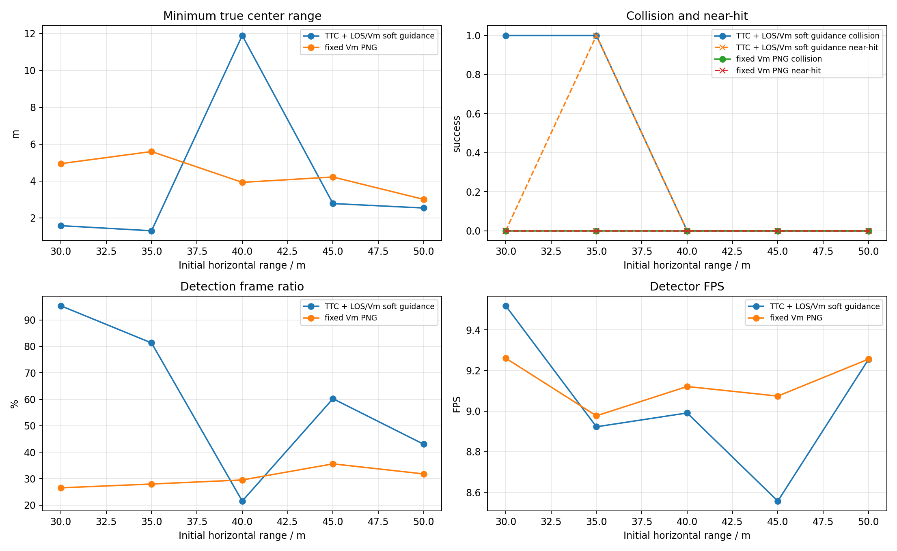
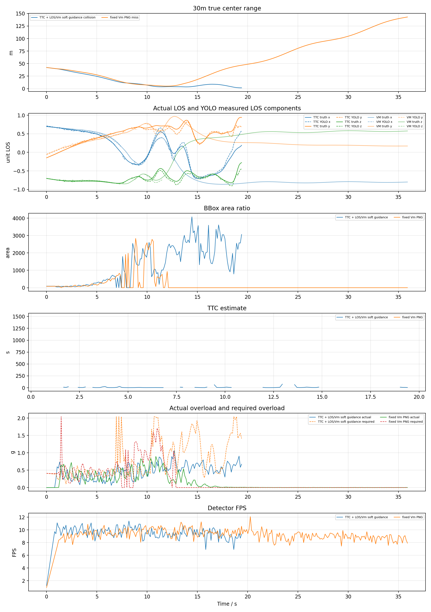
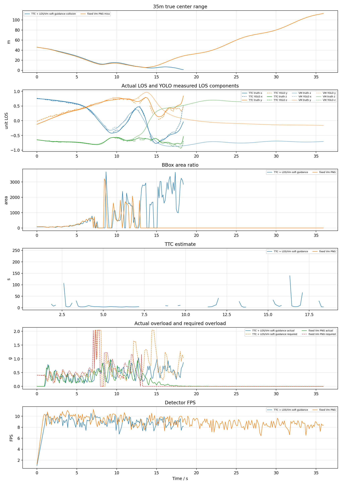
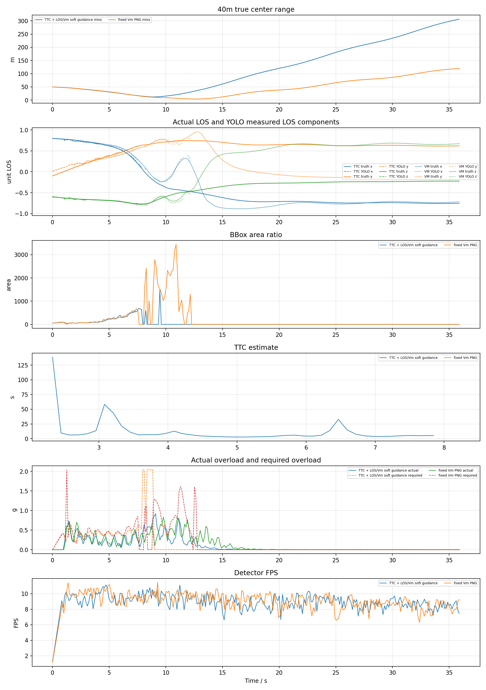
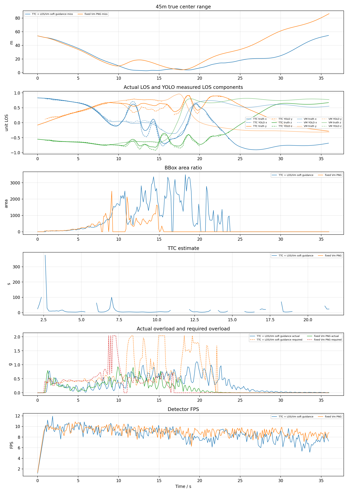
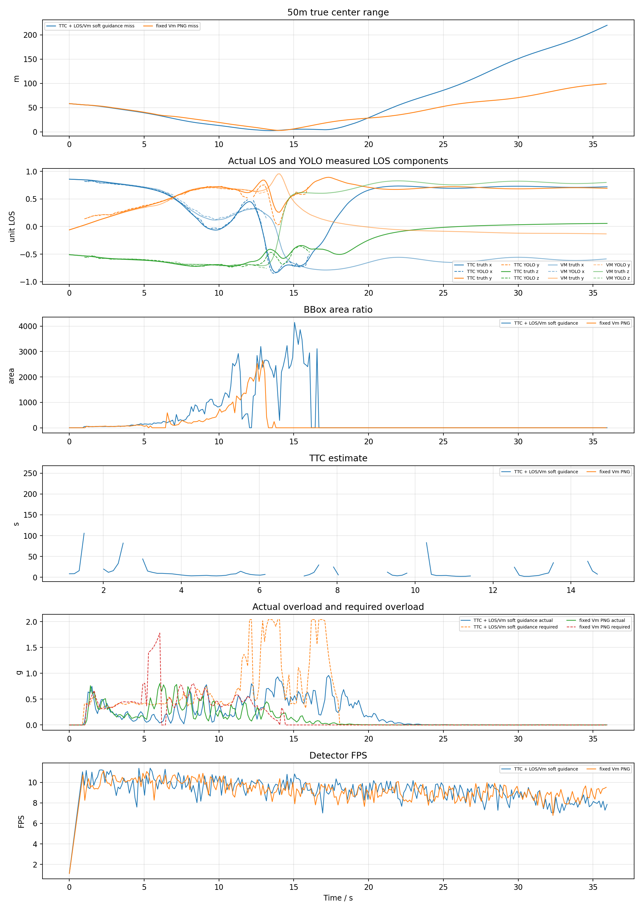
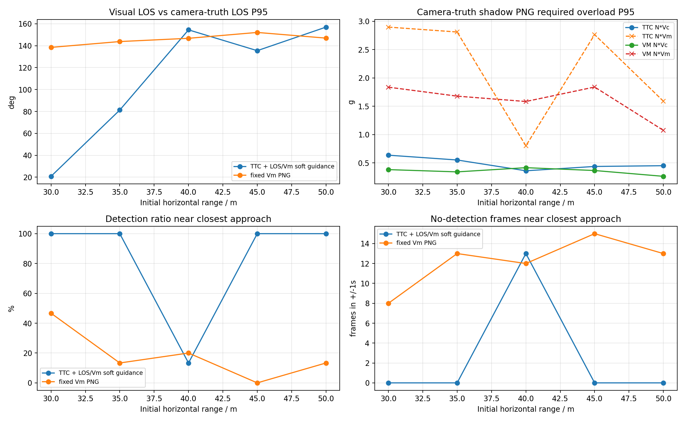

# YOLO+ByteTrack Upward-Camera 综合测试与理论边界分析报告

## 1. 合并说明

本文合并以下两份报告，并加入理论边界分析：

- `YOLO_ByteTrack_upward_baseline_S机动_30_50测试报告.md`
- `YOLO_ByteTrack_upward_matrix15_多工况性能测试报告.md`

两组实验均使用 YOLO+ByteTrack 固定上视相机闭环，collision 作为成功标准。matrix15 用于评估距离、侧向、高度差和速度变化下的总体性能；S 机动报告用于评估 baseline 条件下目标横向机动对拦截效率的影响。

## 2. 综合结论

|实验|算法|命中率|关键结论|
|---|---|---:|---|
|matrix15 多工况|TTC|12/15|对距离、高度和速度变化更鲁棒，但在低检测率、远距低高差和高速组合下失败。|
|matrix15 多工况|VM|5/15|对视觉连续性和末端外推更敏感，失败多集中在检测率低或 LOS P95 高的工况。|
|S 机动 30-50m|TTC|2/5|仅 `30/35 m` 命中，`40 m` 开始进入固定上视相机可观测性边界。|
|S 机动 30-50m|VM|0/5|`30-50 m` 全部未命中，说明 VM 对 S 机动和检测间断的容错不足。|

当前系统的主要限制不是 YOLO 推理速度，而是固定上视相机在目标横向机动时的有效视场、检测连续性和末端控制余量。TTC 的闭环鲁棒性明显优于 VM，但在 S 机动下的可用边界仍大约停在 `35 m` 附近。

## 3. 理论边界分析

当前 upward-camera 拦截边界不能只按初始距离判断，应拆成视场可观测性、目标机动、控制过载和检测连续性四层。

### 3.1 视场可观测性边界

固定上视相机 FOV 为 `120 deg`，半角约 `60 deg`。高度差 `H=30 m` 时，理想几何最大可见水平距离为：

```text
R_fov = H * tan(60 deg) ~= 52 m
```

但真实 YOLO+ByteTrack 闭环不能使用完整几何半角，边缘 bbox 裁切、目标姿态、tracking 丢失和 frame-centering 都会压缩有效视场。若取有效半角 `theta_eff ~= 52-55 deg`，并考虑 S 机动横向幅值 `A=4 m`，保守边界为：

```text
R + A <= H * tan(theta_eff)
R_max ~= 30 * tan(52-55 deg) - 4 ~= 34-39 m
```

这与实验吻合：S 机动下 TTC 在 `30/35 m` 命中，`40 m` 开始明显越界；VM 在 `30 m` 已经越界。

### 3.2 目标机动边界

S 机动参数为幅值 `A=4 m`、周期 `T=8 s`：

```text
omega = 2*pi/T = 0.785 rad/s
v_lateral_max = A*omega ~= 3.14 m/s
a_lateral_max = A*omega^2 ~= 2.47 m/s^2 ~= 0.25 g
v_target_max ~= sqrt(5^2 + 3.14^2) ~= 5.91 m/s
```

拦截机速度上限仍按 `speed_ratio=2.0` 和名义目标速度 `5 m/s` 设为约 `10 m/s`，因此主要限制不是追赶速度不足，而是横向机动使 LOS 快速移向固定上视相机视场边缘，导致检测间断和末端外推质量下降。

### 3.3 控制过载边界

日志中的实际速度差分过载峰值多在 `0.8-1.1 g`，而 S 机动下 TTC 的视觉需用过载 P95 可到 `1.5-2.0 g`。因此近失但未碰撞的工况可近似解释为：

```text
a_required_95 > a_available_eff
```

例如 S 机动 TTC `45/50 m` 的最近距离为 `2.779 m / 2.538 m`，说明几何上已经接近目标，但末端控制和视场保持没有足够余量把近失压成 collision 命中。

### 3.4 检测连续性边界

S 机动报告给出的经验阈值更直接：

```text
检测率 >= 80%：TTC 有较高命中概率
检测率 40-70%：可能近失，但 collision 不稳定
检测率 < 40%：基本失败
```

本轮 S 机动中，TTC `30/35 m` 检测率为 `95.3% / 81.3%` 并命中；TTC `40 m` 检测率降到 `21.5%` 后失败；VM `30-50 m` 检测率约 `26-36%`，全未命中。

### 3.5 当前边界结论

在当前 YOLO+ByteTrack upward-camera baseline、`H=30 m`、`A=4 m`、`T=8 s`、`V=5 m/s` 条件下，collision 拦截边界可概括为：

```text
TTC：30-35 m 可拦截，40 m 开始越界
VM：30 m 已越界，实用边界小于 30 m
主导因素：固定上视相机有效视场/YOLO连续性 > 末端控制过载余量 > 导引律公式差异
```

## 4. 合并报告 A：S 机动 Baseline 30-50m

### YOLO+ByteTrack upward-camera baseline S-maneuver 30-50m report

#### 1. 实验目的

按照此前已命中的 YOLO 案例配置，改用真正 PX4 SITL actor 场景，比较两种捷联视觉比例导引。本报告优先使用 `n_cmd_g` 作为需用过载；旧日志没有该字段时才回退到 `g_eval` 等效过载。

- `TTC` 组：`ttc_png`，TTC 只参与增益调度，并保留 LOS/Vm soft guidance。
- `VM` 组：`fixed_vm_png`，不使用 TTC，固定 `N * V_m` 导引增益。
- `accel_integral` 输出模式：导引律先计算 `a_cmd` / `n_cmd_g`，再按当前仿真步长积分为速度 setpoint；这不是直接向 PX4 发送加速度 setpoint。
- `accel_body_rate` 输出模式：导引律先计算 PNG 需用加速度，再转换为 PX4 `SET_ATTITUDE_TARGET` 机体系角速度 `p/q/r` 和 thrust；速度只作为沿 LOS 保速参考，不再把 PNG 横向修正直接加到速度指令上。
- `accel_attitude` 输出模式：导引律先计算 PNG 需用加速度，再转换为 PX4 `SET_ATTITUDE_TARGET` 姿态四元数和 thrust；速度只作为沿 LOS 保速参考。

Baseline upward-camera YOLO+ByteTrack closed-loop with target S maneuver: ranges 30/35/40/45/50m, nominal target speed 5m/s, altitude offset 30m, lateral offset -10m. S maneuver is sine_s perpendicular to nominal target velocity, amplitude 4.0m, period 8.0s. AirSim detect shadow is diagnostic only and does not enter the guidance loop. Collision is the success criterion.

#### 2. 基准条件

|参数|值|
|---|---|
|stamp|`upward_baseline_s_maneuver_30_50_20260701_231523`|
|settings|`/home/linux/Documents/PNG-px4-upward-camera/config/airsim_blocks_px4_actor_upward_camera_settings.json`|
|拦截机|`PX4 SITL / mavlink_body_rate`|
|目标 actor|`IntruderActor`|
|actor asset|`Quadrotor1`|
|actor scale|`1.5`|
|检测源|`yolo_bytetrack`|
|YOLO model|`vision_guidance/best.pt`|
|YOLO device|`0` runtime `cuda:0`|
|YOLO conf / iou / imgsz|`0.05` / `0.7` / `640`|
|tracker|`bytetrack.yaml`，single target `1`|
|相机外参|`x=0.0, y=0.0, z=0.0`|
|upward centering|`True`, gain `8.0`, max accel `4.0 m/s^2`|
|near-hit radius|`1.5 m`|
|FOV / resolution|`120.0 deg`, `640x480`|
|高度差|`30.0 m`|
|目标速度 / speed ratio|`5.0 m/s` / `2.0`|
|目标机动|`sine_s`, amplitude `4.0 m`, period `8.0 s`, phase `0.0 deg`|
|rate_hz|`8.0`|
|guidance output|`accel_body_rate`|
|max guidance accel|`20.0 m/s^2`|
|min speed ratio|`0.6`|
|thrust model|`empirical`, mass `1.0 kg`, max total thrust `16.717785072 N`|
|body-rate tilt / attitude P|`35.0 deg` / `4.0`|
|body-rate roll/pitch max rate|`120.0` / `120.0 deg/s`|
|body-rate profile|`legacy`|
|body-rate v2 Kp roll/pitch/yaw|`5.0` / `5.0` / `3.0`|
|body-rate v2 max pq / slew pq-r|`120.0 deg/s` / `720.0`-`540.0 deg/s^2`|
|body-rate v2 thrust reserve / guard|`0.15` / error `0.55`, PNG scale `0.6`, speed-hold scale `0.45`|
|body-rate thrust|min/hover/max `0.25` / `0.5` / `0.85`|
|body-rate speed hold|gain `1.2`, max accel `8.0 m/s^2`, total limit `28.0 m/s^2`|
|attitude tilt / yaw lookahead|`25.0 deg` / `0.25 s`|
|attitude thrust|min/hover/max `0.25` / `0.5865998371` / `0.95`|
|attitude speed hold|gain `1.2`, max accel `6.0 m/s^2`, total limit `18.0 m/s^2`|
|LOS filter|`1`|
|LOS KF q lambda / lambda_dot|`0.0005` / `0.02`|
|LOS KF r / innovation gate|`0.008` / `0.75`|
|LOS terminal gate / delay|`1.2` / `0.18 s`|
|terminal image KF|predict `1.0 s`, reject `0.35 rad`, soft reject `1`|
|terminal image KF dynamics|accel noise `8.0 rad/s^2`, max rate `12.0 rad/s`|
|terminal velocity blind-push|`False`|
|terminal blind requires visual loss|`1`|
|terminal accel hold|`True`, window `0.35 s`, decay `0.6 s`, max `20.0 m/s^2`|
|frame_guard|`True`|
|bbox noise|`0`|

#### 3. 总览图



#### 4. 汇总表

|组别|碰撞命中|近距命中|碰撞距离m|近距距离m|未命中距离m|最小中心距离m|检测帧/总帧|有效帧/总帧|平均检测FPS|
|---|---:|---:|---|---|---|---:|---:|---:|---:|
|TTC|2/5|1/5|30, 35|35|40, 45, 50|1.303|598/1116|596/1116|9.05|
|VM|0/5|0/5|-|-|30, 35, 40, 45, 50|3.007|423/1397|412/1397|9.14|

#### 5. 明细表

|组别|距离m|碰撞|近距|碰撞时间s|近距时间s|近距距离m|最小距离m|终点距离m|检测帧率|有效帧率|检测FPS|sim FPS|实际过载max g|速度指令差分P95 g|需用过载P95 g|
|---|---:|---:|---:|---:|---:|---:|---:|---:|---:|---:|---:|---:|---:|---:|---:|
|TTC|30|1|0|19.40|-|-|1.579|1.591|95.3%|94.0%|9.52|7.92|1.07|1.89|2.02|
|VM|30|0|0|-|-|-|4.945|143.074|26.5%|25.1%|9.26|7.93|0.90|0.70|1.08|
|TTC|35|1|1|18.36|18.24|1.422|1.303|1.303|81.3%|83.5%|8.92|7.84|1.04|1.51|2.04|
|VM|35|0|0|-|-|-|5.601|112.873|28.0%|26.9%|8.98|7.87|0.99|1.11|0.97|
|TTC|40|0|0|-|-|-|11.898|306.491|21.5%|23.3%|8.99|7.88|0.92|0.83|0.50|
|VM|40|0|0|-|-|-|3.930|119.616|29.5%|27.0%|9.12|7.86|0.83|0.64|1.05|
|TTC|45|0|0|-|-|-|2.779|54.574|60.2%|54.3%|8.56|7.64|1.11|1.61|1.94|
|VM|45|0|0|-|-|-|4.219|86.419|35.6%|35.6%|9.07|7.90|0.93|1.02|0.72|
|TTC|50|0|0|-|-|-|2.538|219.678|43.0%|45.9%|9.25|7.88|0.96|1.43|2.02|
|VM|50|0|0|-|-|-|3.007|99.289|31.8%|32.9%|9.26|7.93|0.80|0.93|0.70|

#### 6. 分距离曲线

每个距离一张图，包含真实中心距离、真实 LOS 与 YOLO 检测 LOS 分量、bbox 面积、TTC 估计、实际过载/需用过载和检测 FPS。







#### 7. LOS KF 与失败原因诊断

|组别|距离m|最近距离m|最近点状态|主要失败/降级原因|检测率|有效率|
|---|---:|---:|---|---|---:|---:|
|TTC|30|1.579|`valid`|valid:76, area_not_expanding:51, terminal_lost:15, image_kf_predict:3|95.3%|94.0%|
|VM|30|4.945|`terminal_lost`|no_detection:187, valid:68, terminal_lost:23, image_kf_predict:1|26.5%|25.1%|
|TTC|35|1.303|`terminal_lost`|valid:61, terminal_lost:33, area_not_expanding:30, image_kf_predict:6|81.3%|83.5%|
|VM|35|5.601|`terminal_lost`|no_detection:177, valid:70, terminal_lost:27, image_kf_predict:5|28.0%|26.9%|
|TTC|40|11.898|`no_detection`|no_detection:212, valid:45, area_not_expanding:12, image_kf_predict:7|21.5%|23.3%|
|VM|40|3.930|`terminal_lost`|no_detection:184, valid:73, terminal_lost:18, bbox_bottom_clipped:2|29.5%|27.0%|
|TTC|45|2.779|`valid`|no_detection:96, valid:94, area_not_expanding:40, terminal_lost:32|60.2%|54.3%|
|VM|45|4.219|`no_detection`|no_detection:151, valid:93, terminal_lost:28, image_kf_predict:6|35.6%|35.6%|
|TTC|50|2.538|`valid`|no_detection:143, valid:69, area_not_expanding:46, image_kf_predict:8|43.0%|45.9%|
|VM|50|3.007|`no_detection`|no_detection:172, valid:83, terminal_lost:16, image_kf_predict:6|31.8%|32.9%|

- LOS KF 参数：`q_lambda=0.0005`、`q_lambda_dot=0.02`、`r=0.008`、`innovation_reject=0.75`、`terminal_reject=1.2`。
- 未命中但最近距离小于等于 3m 的工况：TTC 45m(2.779m)，TTC 50m(2.538m)。这些工况已接近目标，但没有触发 AirSim 碰撞判定，后续应重点看末端视场保持、外推和碰撞几何。
- 检测率低于 60% 的工况：VM 30m(26.5%)，VM 35m(28.0%)，TTC 40m(21.5%)，VM 40m(29.5%)，VM 45m(35.6%)，TTC 50m(43.0%)，VM 50m(31.8%)。这类失败优先归因于 YOLO/ByteTrack 连续性和固定相机视场保持，而不是导引律公式本身。
- 最近点处仍处于降级或无效状态的未命中工况：VM 30m:`terminal_lost`，VM 35m:`terminal_lost`，TTC 40m:`no_detection`，VM 40m:`terminal_lost`，VM 45m:`no_detection`，VM 50m:`no_detection`。这些样本说明末端质量门、视觉外推和 bbox 裁切处理仍会影响命中窗口。
- 本轮平均实际过载峰值约 `0.95 g`，平均需用过载 P95 约 `1.30 g`。两者不是同一个量：`n_cmd_g` 是导引层需求，实际过载还受 PX4 姿态/推力限制、YOLO 约 9 FPS 采样和 frame centering 限速影响。

#### 8. 相机光心真值影子测试诊断



影子测试不参与导引，只用日志中的相机光心 `camera_world_*` 与目标真值位置离线计算经典 `N*Vc` 和固定 `N*Vm` PNG 理论需用过载，并和视觉 LOS、检测连续性对齐。

|组别|距离m|碰撞|最小距离m|最近点检测率|最近点无检测帧|视觉LOS误差P95|影子N*Vc P95 g|影子N*Vm P95 g|视觉需用P95 g|实际过载max g|
|---|---:|---:|---:|---:|---:|---:|---:|---:|---:|---:|
|TTC|30|1|1.579|100.0%|0/9|30.2|0.64|2.90|2.02|1.07|
|VM|30|0|4.945|46.7%|8/15|60.8|0.38|1.84|1.08|0.90|
|TTC|35|1|1.303|100.0%|0/8|43.5|0.55|2.81|2.04|1.04|
|VM|35|0|5.601|13.3%|13/15|74.2|0.34|1.68|0.97|0.99|
|TTC|40|0|11.898|13.3%|13/15|130.6|0.36|0.80|0.50|0.92|
|VM|40|0|3.930|20.0%|12/15|81.6|0.42|1.58|1.05|0.83|
|TTC|45|0|2.779|100.0%|0/15|26.4|0.44|2.76|1.94|1.11|
|VM|45|0|4.219|0.0%|15/15|104.6|0.37|1.84|0.72|0.93|
|TTC|50|0|2.538|100.0%|0/15|26.2|0.45|1.59|2.02|0.96|
|VM|50|0|3.007|13.3%|13/15|106.8|0.26|1.07|0.70|0.80|

- 如果影子 `N*Vc` P95 很低但视觉 LOS 误差和无检测帧较高，优先定位检测连续性、LOS KF/外推和 frame-centering。
- 如果视觉需用过载高而实际过载低，优先定位 PX4 姿态/推力响应、倾角限制和 speed-hold 混合项。

#### 9. body-rate 控制诊断

|组别|距离m|最近距离m|frame-centering激活|推力饱和|p/q/r峰值deg/s|roll/pitch指令峰值deg|thrust min/max|
|---|---:|---:|---:|---:|---|---|---|
|TTC|30|1.579|82.7%|26.7%|120.0/120.0/60.0|35.0/35.0|0.25/0.85|
|VM|30|4.945|32.6%|2.5%|120.0/120.0/60.0|35.0/35.0|0.34/0.85|
|TTC|35|1.303|90.6%|14.4%|120.0/120.0/60.0|35.0/35.0|0.25/0.85|
|VM|35|5.601|37.3%|1.8%|120.0/120.0/60.0|35.0/35.0|0.25/0.85|
|TTC|40|11.898|28.0%|2.5%|120.0/120.0/60.0|35.0/35.0|0.25/0.85|
|VM|40|3.930|34.2%|2.5%|120.0/120.0/60.0|35.0/35.0|0.29/0.85|
|TTC|45|2.779|59.5%|19.3%|120.0/120.0/60.0|35.0/35.0|0.25/0.85|
|VM|45|4.219|42.7%|5.0%|120.0/120.0/60.0|35.0/35.0|0.25/0.85|
|TTC|50|2.538|45.5%|7.2%|120.0/120.0/60.0|35.0/35.0|0.25/0.85|
|VM|50|3.007|38.9%|1.8%|120.0/120.0/60.0|35.0/35.0|0.25/0.85|

- 本轮 `body_rate_control_profile=legacy`。legacy body-rate 使用欧拉角误差比例环，没有 v2 的 frame guard 降权和 slew rate limit。
- `frame-centering激活` 表示固定上视相机进入视场保持/末端捕获/丢失保持状态的比例；比例高时，命中结果更受视场保持策略和 yaw 丢失外推影响。
- `推力饱和` 与 `thrust min/max` 用于判断末端是否被垂向机动和总推力限制约束；若饱和高，应优先放宽 thrust、tilt 或垂向速度上限。

#### 10. PNG 到过载、姿态和角速度的控制流程

本轮实际使用 `guidance_output=accel_body_rate`、`px4_command_mode=mavlink_body_rate`、`body_rate_control_profile=legacy`。因此控制链路是“PNG 需用加速度 -> 合成控制加速度 -> PX4 `SET_ATTITUDE_TARGET` 机体系 `p/q/r` 角速度 + thrust”。

##### 10.1 视觉量到 6D LOS

YOLOv8 + ByteTrack 输出 `bbox center=(u,v)`、`bbox area`、`track_id` 和置信度。bbox 中心先通过相机内参转换成相机坐标系单位射线：

```text
x_n = (u - cx) / fx
y_n = (v - cy) / fy
lambda_C = normalize([x_n, y_n, 1])
```

再使用相机外参和机体姿态转到惯性系：

```text
lambda_I = normalize(R_IB * R_BC * lambda_C)
```

其中 `R_BC` 是相机到机体的固定安装旋转，`R_IB` 是机体到惯性系的姿态。LOS 角速度由相邻 LOS 差分并投影到垂直 LOS 的平面得到：

```text
lambda_dot = project_perpendicular((lambda_I[k] - lambda_I[k-1]) / dt, lambda_I[k])
omega_LOS = lambda_I x lambda_dot
```

启用 LOS KF 时，滤波器输出平滑后的 `lambda_I` 和 `omega_LOS`；末端允许更松的 innovation gate，避免目标仍在检测框内时 PNG 加速度被过早清零。

##### 10.2 PNG 生成需用加速度和需用过载

两种导引的共同输出都是导引层需用加速度 `a_cmd`：

```text
a_cmd = guidance_gain * (omega_LOS x lambda_I)
a_cmd = clip_norm(a_cmd, max_guidance_accel_mps2)
n_cmd_g = ||a_cmd|| / g
```

`omega_LOS x lambda_I` 给出垂直于视线的修正方向；`n_cmd_g` 是导引层需用过载，只表示 PNG 希望产生的机动强度。它不等于无人机真实过载，真实过载还受 PX4 姿态控制、推力限制、速度保持项、视觉帧率和 frame centering 限速影响。

TTC 组使用 bbox 面积扩张估计 `TTC ~= A / A_dot`，当前只把 TTC 用作增益调度和末端触发；当 TTC 无效但 LOS 有效时，仍保留 LOS/V_m soft guidance。V_m 组不使用 TTC，直接采用固定：

```text
guidance_gain = N * V_m
V_m = speed_ratio * intruder_speed
```

##### 10.3 与速度保持项合成

在 `accel_attitude` 和 `accel_body_rate` 中，PNG 横向修正不再积分成速度指令。速度只作为沿 LOS 的保速参考：

```text
v_ref = speed_cap * lambda_I
a_speed_hold = K_v * (v_ref - v_current)
a_control_I = clip_norm(a_cmd + a_speed_hold, total_accel_limit)
```

`a_cmd` 是纯 PNG 需用加速度；`a_speed_hold` 是工程闭环项，用于避免飞机速度掉到无法追击或过度横向漂移。报告中的 `n_cmd_g` 仍来自 `a_cmd`，而 `attitude_control_accel_*` / `body_rate_control_accel_*` 记录合成后的控制加速度。

##### 10.4 加速度到姿态四元数链路

在 `accel_attitude + mavlink_attitude` 下，程序先由图像中心误差和 LOS 水平投影得到期望航向：

```text
yaw_sp = current_yaw + yaw_rate_cmd * attitude_yaw_lookahead_s
```

随后把惯性系合成加速度旋转到期望 yaw 对应的水平坐标系，得到 roll/pitch setpoint，并发送姿态四元数和 thrust。

##### 10.5 加速度到机体系角速度链路

在 `accel_body_rate + mavlink_body_rate` 下，程序先把 `a_control_I` 转到机体系：

```text
a_control_B = R_BI * a_control_I
```

再得到期望 roll/pitch。legacy 用欧拉角误差比例环：

```text
p_cmd = K_att * (roll_sp  - roll)
q_cmd = K_att * (pitch_sp - pitch)
r_cmd = yaw_rate_cmd
```

body-rate v2 使用四元数误差：

```text
q_err = inverse(q_current) * q_desired
e_att = 2 * q_err.xyz
p_raw = Kp_roll  * e_att.x
q_raw = Kp_pitch * e_att.y
r_raw = Kp_yaw   * e_att.z + yaw_rate_cmd
```

随后做角速度限幅和斜率限制。v2 不增加一阶 LPF，只保留 slew rate limit，避免末端视觉闭环额外相位滞后。MAVLink 仍使用 `SET_ATTITUDE_TARGET`，但 `type_mask` 忽略姿态四元数，只让 PX4 接收 `body_roll_rate/body_pitch_rate/body_yaw_rate` 和 thrust。

v2 的 thrust 使用向量投影法，并通过 `body_rate_v2_thrust_reserve` 预留电机差速余量：

```text
z_B_I = R_IB * [0, 0, 1]^T
required_specific_force_I = [-a_control_I.x, -a_control_I.y, g - a_control_I.z]
thrust_raw = mass * dot(required_specific_force_I, z_B_I) / max_total_thrust
```

##### 10.6 本报告中过载曲线的含义

- `需用过载 n_cmd_g`：由 PNG 的 `a_cmd` 直接换算，是导引层希望产生的过载。
- `实际过载 max g`：由拦截机真实速度差分估计，体现 PX4 和 AirSim 动力学真正实现出的机动。
- `速度指令差分 P95 g`：兼容旧速度输出模式的指标；在 `accel_body_rate` 和 `accel_attitude` 下主要作为参考，不代表直接发送给 PX4 的控制量。

因此，若 `n_cmd_g` 很平滑但实际过载不足，问题通常在姿态/推力响应、速度保持、限幅或视觉低帧率；若 `n_cmd_g` 本身突变，则应优先检查 LOS/KF、bbox 裁切、丢检外推和 frame guard 状态切换。

#### 11. 结论

- TTC: 命中 `2/5`，命中距离 `30m, 35m`，未命中 `40m, 45m, 50m`，检测帧比例 `53.6%`，有效导引帧比例 `53.4%`，平均检测 FPS `9.05`。
- VM: 命中 `0/5`，命中距离 `-`，未命中 `30m, 35m, 40m, 45m, 50m`，检测帧比例 `30.3%`，有效导引帧比例 `29.5%`，平均检测 FPS `9.14`。
- 本轮使用真实 YOLOv8 + ByteTrack，因此检测连续性和 GPU 推理速度会直接进入闭环；结果不能和 AirSim detect 函数的理想 bbox 直接等价比较。
- `accel_integral` 模式的 `n_cmd_g` 来自导引层 `a_cmd`，底层仍通过 PX4/AirSim 速度 setpoint 闭环；实际过载由真实速度差分估计，因此会同时受 PX4 响应、速度限幅和视觉帧率影响。
- `accel_body_rate` 模式下 `n_cmd_g` 仍表示纯 PNG 需用过载；实际发送给 PX4 的是 `SET_ATTITUDE_TARGET` 机体系 `p/q/r` 角速度和归一化 thrust，日志中的 `body_rate_control_accel_*` 额外包含沿 LOS 的速度保持加速度。
- `accel_attitude` 模式下 `n_cmd_g` 同样表示纯 PNG 需用过载；实际发送给 PX4 的是 `SET_ATTITUDE_TARGET` 姿态四元数和归一化 thrust，日志中的 `attitude_control_accel_*` 记录姿态指令生成前的合成加速度。

## 5. 合并报告 B：Matrix15 多工况性能

### YOLO+ByteTrack upward-camera matrix15 performance report

#### 1. 实验目的

本轮测试 YOLO+ByteTrack 固定上视相机闭环在 15 个距离、侧向、高度差和目标速度组合下的拦截性能。每个工况分别运行 TTC 与 VM，共 30 个 case；AirSim detect shadow 关闭，collision 作为成功标准。

#### 2. 工况矩阵

|case|距离m|侧向m|高度差m|目标速度m/s|speed ratio|stamp|status|
|---|---:|---:|---:|---:|---:|---|---|
|M01|40|-10|30|5.0|2.0|`upward_yolo_matrix15_20260701_202024_M01`|`ok`|
|M02|25|-10|30|5.0|2.0|`upward_yolo_matrix15_20260701_202024_M02`|`ok`|
|M03|55|-10|30|5.0|2.0|`upward_yolo_matrix15_20260701_202024_M03`|`ok`|
|M04|40|0|30|5.0|2.0|`upward_yolo_matrix15_20260701_202024_M04`|`ok`|
|M05|40|-20|30|5.0|2.0|`upward_yolo_matrix15_20260701_202024_M05`|`ok`|
|M06|40|20|30|5.0|2.0|`upward_yolo_matrix15_20260701_202024_M06`|`ok`|
|M07|40|-10|20|5.0|2.0|`upward_yolo_matrix15_20260701_202024_M07`|`ok`|
|M08|40|-10|40|5.0|2.0|`upward_yolo_matrix15_20260701_202024_M08`|`ok`|
|M09|30|-10|30|3.0|2.0|`upward_yolo_matrix15_20260701_202024_M09`|`ok`|
|M10|30|-10|30|7.0|2.0|`upward_yolo_matrix15_20260701_202024_M10`|`ok`|
|M11|50|-10|30|3.0|2.0|`upward_yolo_matrix15_20260701_202024_M11`|`ok`|
|M12|50|-10|30|7.0|2.0|`upward_yolo_matrix15_20260701_202024_M12`|`ok`|
|M13|45|-20|40|7.0|2.0|`upward_yolo_matrix15_20260701_202024_M13`|`ok`|
|M14|55|15|20|7.0|2.0|`upward_yolo_matrix15_20260701_202024_M14`|`ok`|
|M15|25|20|40|3.0|2.0|`upward_yolo_matrix15_20260701_202024_M15`|`ok`|


#### 3. 总体结果

|算法|collision命中|near-hit|完全未命中|最小距离范围m|平均检测率|平均YOLO FPS|
|---|---:|---:|---:|---|---:|---:|
|TTC|12/15|8/15|3|0.95-58.43|70.5|9.27|
|VM|5/15|3/15|10|1.19-9.42|53.3|8.84|


#### 4. 明细结果

|case|算法|距离|侧向|高度差|目标速度|碰撞|near|最小m|终点m|检测率|有效率|YOLO FPS|LOS P95 deg|需用P95 g|主要状态|
|---|---|---:|---:|---:|---:|---:|---:|---:|---:|---:|---:|---:|---:|---:|---|
|M01|TTC|40|-10|30|5.0|1|0|1.66|1.66|100.0%|98.8%|9.79|13.6|0.71|valid:58, area_not_expanding:23, bbox_bottom_clipped:1|
|M01|VM|40|-10|30|5.0|1|0|1.85|1.95|96.3%|98.8%|9.80|15.7|0.55|valid:77, image_kf_predict:3, bbox_bottom_clipped:1|
|M02|TTC|25|-10|30|5.0|1|1|1.47|1.47|94.8%|96.1%|9.79|16.2|1.58|valid:51, area_not_expanding:19, terminal_lost:5|
|M02|VM|25|-10|30|5.0|0|0|2.50|3.54|97.1%|96.4%|9.07|19.0|2.04|valid:251, terminal_lost:23, image_kf_predict:3|
|M03|TTC|55|-10|30|5.0|1|1|1.16|1.16|86.1%|94.4%|9.64|45.7|1.81|valid:71, area_not_expanding:17, image_kf_predict:9|
|M03|VM|55|-10|30|5.0|0|0|6.72|86.87|22.8%|20.6%|9.14|155.3|0.54|no_detection:215, valid:55, bbox_bottom_clipped:9|
|M04|TTC|40|0|30|5.0|1|1|1.35|1.35|96.7%|97.8%|9.75|12.9|0.56|valid:62, area_not_expanding:25, no_detection:2|
|M04|VM|40|0|30|5.0|0|0|4.92|69.72|40.2%|38.8%|9.20|156.1|0.65|no_detection:146, valid:101, terminal_lost:25|
|M05|TTC|40|-20|30|5.0|0|0|1.76|114.63|28.0%|27.2%|9.18|146.7|0.54|no_detection:187, valid:54, area_not_expanding:19|
|M05|VM|40|-20|30|5.0|1|0|1.82|1.82|90.2%|90.2%|8.77|30.4|1.98|valid:70, terminal_lost:9, bbox_bottom_clipped:1|
|M06|TTC|40|20|30|5.0|1|1|1.05|1.05|88.2%|91.2%|9.27|77.9|2.04|valid:82, area_not_expanding:31, terminal_lost:8|
|M06|VM|40|20|30|5.0|0|0|4.05|79.59|34.5%|36.0%|8.83|158.2|0.51|no_detection:174, valid:92, image_kf_predict:6|
|M07|TTC|40|-10|20|5.0|1|1|1.23|1.25|78.3%|88.7%|9.20|81.7|2.04|valid:57, area_not_expanding:16, image_kf_predict:13|
|M07|VM|40|-10|20|5.0|0|0|3.00|101.53|14.1%|11.9%|8.18|169.4|0.56|no_detection:229, valid:29, bbox_bottom_clipped:9|
|M08|TTC|40|-10|40|5.0|1|0|1.66|1.66|98.0%|99.0%|8.27|11.6|1.61|valid:74, area_not_expanding:17, terminal_lost:3|
|M08|VM|40|-10|40|5.0|0|0|1.56|183.88|43.9%|35.6%|8.02|148.2|0.86|no_detection:141, valid:92, terminal_lost:20|
|M09|TTC|30|-10|30|3.0|1|0|1.51|1.62|89.1%|93.5%|8.62|39.9|0.51|valid:55, area_not_expanding:19, terminal_lost:13|
|M09|VM|30|-10|30|3.0|1|1|1.20|1.20|94.2%|97.7%|8.29|30.2|1.57|valid:78, terminal_lost:4, image_kf_predict:3|
|M10|TTC|30|-10|30|7.0|0|0|1.90|61.42|84.2%|81.7%|8.82|17.4|2.02|valid:133, area_not_expanding:83, no_detection:42|
|M10|VM|30|-10|30|7.0|0|0|2.99|13.61|82.0%|76.3%|8.84|97.2|2.04|valid:207, terminal_lost:44, no_detection:27|
|M11|TTC|50|-10|30|3.0|1|1|1.28|1.28|94.7%|97.3%|9.35|12.3|0.41|valid:98, area_not_expanding:7, no_detection:3|
|M11|VM|50|-10|30|3.0|1|1|1.19|1.19|88.8%|92.8%|9.55|42.8|1.44|valid:105, no_detection:9, image_kf_predict:5|
|M12|TTC|50|-10|30|7.0|1|0|1.72|1.94|96.8%|96.8%|9.42|10.7|0.69|valid:73, area_not_expanding:16, no_detection:3|
|M12|VM|50|-10|30|7.0|0|0|3.30|64.38|54.2%|54.5%|8.66|126.7|1.90|valid:141, no_detection:110, terminal_lost:19|
|M13|TTC|45|-20|40|7.0|1|1|0.95|0.95|95.4%|98.2%|9.69|19.2|0.95|valid:90, area_not_expanding:11, image_kf_predict:3|
|M13|VM|45|-20|40|7.0|0|0|3.64|49.80|60.7%|59.6%|9.11|132.9|2.04|valid:160, no_detection:90, terminal_lost:28|
|M14|TTC|55|15|20|7.0|0|0|58.43|498.80|3.6%|4.3%|9.12|147.1|0.00|no_detection:269, area_not_expanding:5, valid:3|
|M14|VM|55|15|20|7.0|0|0|9.42|47.67|12.8%|14.2%|9.22|159.0|0.54|no_detection:239, valid:33, image_kf_predict:6|
|M15|TTC|25|20|40|3.0|1|1|1.18|1.18|96.4%|99.1%|8.17|18.9|0.93|valid:86, area_not_expanding:12, terminal_lost:5|
|M15|VM|25|20|40|3.0|1|1|1.29|1.41|96.4%|98.2%|8.27|21.5|0.68|valid:107, image_kf_predict:2, no_detection:2|

#### 5. 验证

|检查项|结果|
|---|---|
|CSV 数量|`30/30`|
|detector_source|`yolo_bytetrack`|
|shadow enabled frames|`0`|
|YOLO raw frames|`3181`|
|YOLO selected frames|`3181`|

#### 6. 诊断要点

- infrastructure failed case: `-`。
- near-hit but no collision: `-`。
- full miss: `M02-VM(2.50m), M03-VM(6.72m), M04-VM(4.92m), M05-TTC(1.76m), M06-VM(4.05m), M07-VM(3.00m), M08-VM(1.56m), M10-TTC(1.90m), M10-VM(2.99m), M12-VM(3.30m), M13-VM(3.64m), M14-TTC(58.43m), M14-VM(9.42m)`。
- 本轮 `shadow_airsim_enabled` 总帧数应为 0；若非 0，说明实验不满足“无影子测试”条件。
- 低检测率或 LOS P95 高的失败工况优先分析 YOLO/ByteTrack 连续性、frame-centering、terminal image KF 和末端 bbox 裁切。
