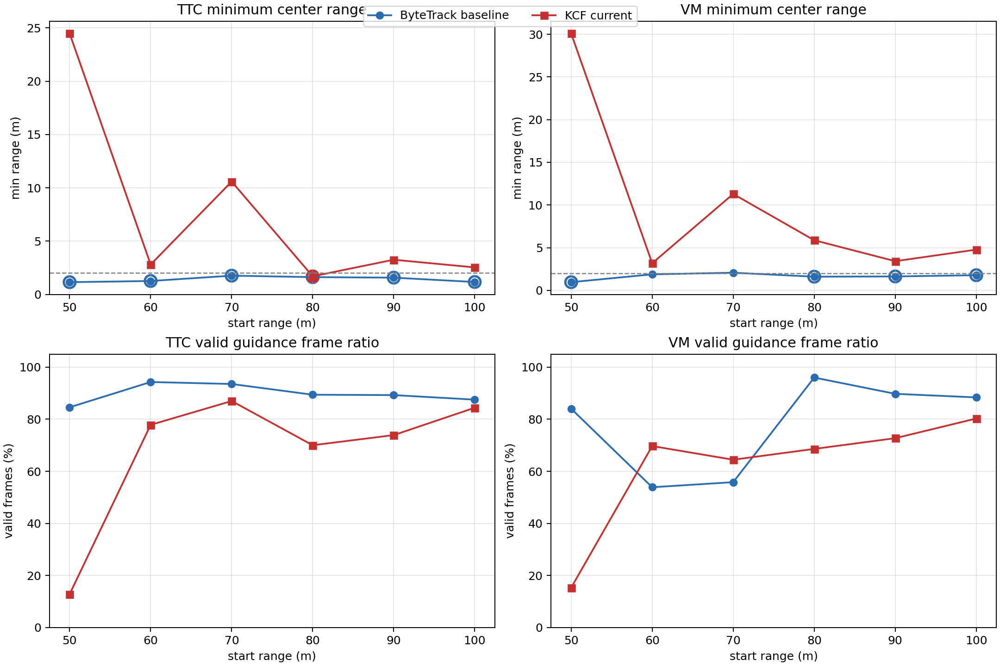
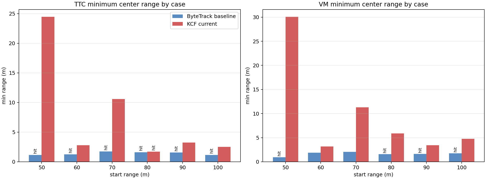

# YOLO+ByteTrack 与 YOLO+KCF frame_centering_tuned 对比报告

## 1. 对比目的

本报告对比 `TERMINAL_PROFILE=terminal_v2` 之前的旧稳定配置：

- 旧基线：YOLOv8 + ByteTrack，stamp `frame_centering_tuned_50_100_20260621_060648`。
- 本轮：YOLOv8 初始化/校正 + KCF 帧间跟踪，stamp `yolo_kcf_frame_centering_tuned_velocity_clock0p2_20260624_101127`。

为避免把控制律差异混入检测器对比，本轮主对比使用 `ClockSpeed=0.2`、`velocity_bias + velocity_yaw_rate`、同一套 frame-centering 参数。此前另外两轮 KCF 排查分别使用 `ClockSpeed=1.0` 或 `accel_integral`，不作为主结论依据。

## 2. 工况一致性

|项目|ByteTrack旧基线|KCF本轮|
|---|---|---|
|settings|`config/airsim_blocks_px4_actor_clock0p2_settings.json`|`config/airsim_blocks_px4_actor_clock0p2_settings.json`|
|ClockSpeed|`0.2`|`0.2`|
|控制链路|`velocity_bias` 旧速度偏置链路 + `velocity_yaw_rate`|`velocity_bias` + `velocity_yaw_rate`|
|检测源|`yolo_bytetrack`|`yolo_kcf`|
|YOLO模型|`vision_guidance/best.pt`|`vision_guidance/best.pt`|
|YOLO参数|`imgsz=640, conf=0.1`|`imgsz=640, conf=0.1`|
|KCF参数|-|`period_n=8, period_s=0.5, max_coast=0.8, min_iou=0.25`|
|相机|前移 `0.5m`, 俯仰 `0deg`, FOV `120deg`|同左|
|目标|`Quadrotor1` actor, scale `1.0`|同左|
|高度差|`20m`|同左|
|距离|`50,60,70,80,90,100m`|同左|

## 3. 总览图

## 4. 汇总结果

|检测器|导引|命中数|命中距离m|未命中距离m|最小中心距离m|平均检测率|平均有效率|平均检测FPS|
|---|---|---:|---|---|---:|---:|---:|---:|
|ByteTrack旧基线|TTC|6/6|50, 60, 70, 80, 90, 100|-|1.149|84.3%|89.7%|8.25|
|ByteTrack旧基线|VM|4/6|50, 80, 90, 100|60, 70|0.961|71.0%|78.0%|8.15|
|KCF本轮|TTC|1/6|80|50, 60, 70, 90, 100|1.697|86.0%|67.7%|7.83|
|KCF本轮|VM|0/6|-|50, 60, 70, 80, 90, 100|3.179|81.0%|61.8%|7.81|

## 5. 分距离对比

|导引|距离m|ByteTrack命中|ByteTrack最小m|ByteTrack有效率|KCF命中|KCF最小m|KCF有效率|KCF状态(track/reinit/correct)|
|---|---:|---:|---:|---:|---:|---:|---:|---|
|TTC|50|1|1.149|84.6%|0|24.483|12.8%|96/76/0|
|TTC|60|1|1.259|94.3%|0|2.808|77.8%|114/99/0|
|TTC|70|1|1.759|93.5%|0|10.587|87.0%|148/126/0|
|TTC|80|1|1.622|89.4%|1|1.697|70.0%|111/90/0|
|TTC|90|1|1.574|89.2%|0|3.257|73.9%|142/120/1|
|TTC|100|1|1.166|87.5%|0|2.534|84.4%|143/120/0|
|VM|50|1|0.961|84.0%|0|30.091|15.3%|92/68/0|
|VM|60|0|1.879|53.9%|0|3.179|69.7%|125/106/0|
|VM|70|0|2.069|55.8%|0|11.294|64.4%|136/112/0|
|VM|80|1|1.604|96.0%|0|5.874|68.6%|138/114/1|
|VM|90|1|1.631|89.7%|0|3.420|72.7%|143/119/0|
|VM|100|1|1.778|88.4%|0|4.775|80.3%|126/99/0|

## 6. KCF 未命中诊断

|导引|距离m|KCF最近距离m|KCF终点距离m|KCF主要状态/失败原因|
|---|---:|---:|---:|---|
|TTC|50|24.483|29.337|los_innovation_reject:159, no_detection:31, image_kf_predict:15, ttc_png:12|
|TTC|60|2.808|21.401|ttc_png:92, area_not_expanding:76, los_innovation_reject:39, image_kf_predict:20|
|TTC|70|10.587|10.587|area_not_expanding:114, ttc_png:112, los_innovation_reject:37, image_kf_predict:10|
|TTC|90|3.257|29.305|ttc_png:119, area_not_expanding:86, los_innovation_reject:52, no_detection:30|
|TTC|100|2.534|17.449|ttc_png:119, area_not_expanding:105, image_kf_predict:28, los_innovation_reject:26|
|VM|50|30.091|41.659|los_innovation_reject:150, no_detection:38, image_kf_predict:24, fixed_vm_png:10|
|VM|60|3.179|3.179|fixed_vm_png:161, los_innovation_reject:70, image_kf_predict:16, no_detection:7|
|VM|70|11.294|16.440|fixed_vm_png:156, los_innovation_reject:92, image_kf_predict:27, no_detection:9|
|VM|80|5.874|13.528|fixed_vm_png:177, los_innovation_reject:76, image_kf_predict:37, no_detection:22|
|VM|90|3.420|41.988|fixed_vm_png:193, los_innovation_reject:69, image_kf_predict:36, no_detection:17|
|VM|100|4.775|8.218|fixed_vm_png:220, no_detection:57, image_kf_predict:32, los_innovation_reject:5|

## 7. 结论

- 在旧 `frame_centering_tuned` 配置下，ByteTrack 基线表现明显更好：TTC 为 `6/6` 命中，VM 为 `4/6` 命中。
- 替换为 KCF 后，TTC 仅 `1/6` 命中，VM `0/6` 命中；因此当前 KCF 接入不能直接替代 ByteTrack。
- KCF 的问题不是检测 FPS 不够：平均 FPS 仍在 `7.6-8.1` 附近。主要问题是 KCF 跟踪框与 YOLO校正框频繁重初始化，且 `los_innovation_reject`、`image_kf_predict`、`no_detection` 增多，使视觉 LOS 有效性降低。
- 速度偏置链路对 LOS 质量门很敏感。KCF 输出虽然连续，但框中心漂移/尺度变化会让 LOS KF 判为异常，导致有效导引帧下降，近距时错过碰撞窗口。
- 后续若继续用 KCF，建议先调 KCF/LOS 的接口，而不是继续调 terminal profile：缩短 YOLO校正周期、降低 KCF 独立 coast 时间、对 KCF输出降低置信权重、只让 KCF做短时丢检补帧，不让它长期替代YOLO检测框。

## 8. 文件索引

- KCF本轮报告：`完整方案/YOLO_KCF_velocity_frame_centering_tuned_clock0p2_50_100测试报告.md`
- KCF本轮日志前缀：`logs/yolo_sitl_ttc_vm/yolo_sitl_*_yolo_kcf_frame_centering_tuned_velocity_clock0p2_20260624_101127_r*_h20.csv`
- ByteTrack旧基线报告：`完整方案/YOLO_SITL_frame_centering_tuned_50_100测试报告.md`
- ByteTrack旧基线日志前缀：`logs/yolo_sitl_ttc_vm/yolo_sitl_*_frame_centering_tuned_50_100_20260621_060648_r*_h20.csv`
