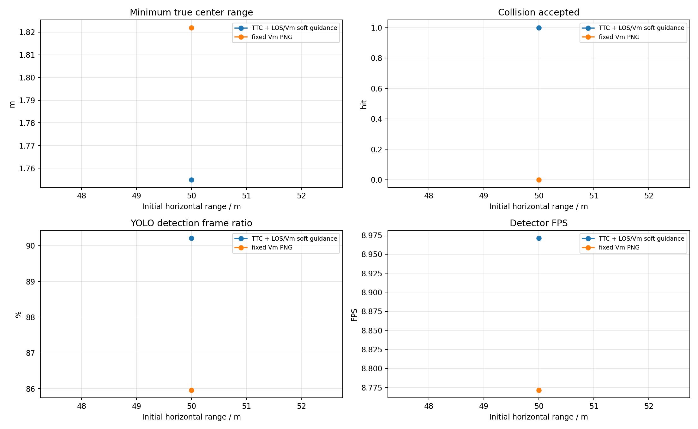
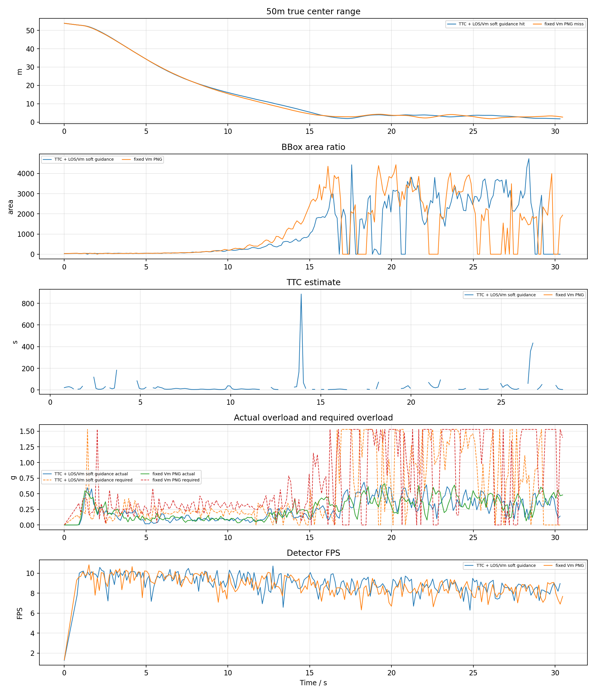

# YOLO + ByteTrack PX4 SITL 加速度过载 PNG TTC / V_m 拦截对比报告

## 1. 实验目的

按照此前已命中的 YOLO 案例配置，改用真正 PX4 SITL actor 场景，比较两种捷联视觉比例导引。本报告优先使用 `n_cmd_g` 作为需用过载；旧日志没有该字段时才回退到 `g_eval` 等效过载。

- `TTC` 组：`ttc_png`，TTC 只参与增益调度，并保留 LOS/Vm soft guidance。
- `VM` 组：`fixed_vm_png`，不使用 TTC，固定 `N * V_m` 导引增益。
- `accel_integral` 输出模式：导引律先计算 `a_cmd` / `n_cmd_g`，再按当前仿真步长积分为速度 setpoint；这不是直接向 PX4 发送加速度 setpoint。
- `accel_body_rate` 输出模式：导引律先计算 PNG 需用加速度，再转换为 PX4 `SET_ATTITUDE_TARGET` 机体系角速度 `p/q/r` 和 thrust；速度只作为沿 LOS 保速参考，不再把 PNG 横向修正直接加到速度指令上。

两组均测试 50m、60m、70m、80m、90m、100m，每个工况重启 PX4 SITL 和 Blocks。

## 2. 基准条件

|参数|值|
|---|---|
|stamp|`accel_body_rate_nolos_20260623_041525`|
|settings|`/home/linux/Documents/PNG/config/airsim_blocks_px4_actor_settings.json`|
|拦截机|`PX4 SITL / mavlink_body_rate`|
|目标 actor|`IntruderActor`|
|actor asset|`Quadrotor1`|
|actor scale|`1.0`|
|检测源|`yolo_bytetrack`|
|YOLO model|`vision_guidance/best.pt`|
|YOLO device|`0` runtime `cuda:0`|
|YOLO conf / iou / imgsz|`0.1` / `0.7` / `640`|
|tracker|`bytetrack.yaml`，single target `1`|
|相机外参|`x=0.5, y=0.0, z=0.0`|
|FOV / resolution|`120.0 deg`, `640x480`|
|高度差|`20.0 m`|
|目标速度 / speed ratio|`5.0 m/s` / `2.0`|
|rate_hz|`8.0`|
|guidance output|`accel_body_rate`|
|max guidance accel|`15.0 m/s^2`|
|min speed ratio|`0.6`|
|body-rate tilt / attitude P|`20.0 deg` / `4.0`|
|body-rate roll/pitch max rate|`60.0` / `60.0 deg/s`|
|body-rate thrust|min/hover/max `0.25` / `0.5` / `0.75`|
|body-rate speed hold|gain `1.2`, max accel `6.0 m/s^2`, total limit `18.0 m/s^2`|
|LOS filter|`0`|
|frame_guard|`True`|
|bbox noise|`0`|

## 3. 总览图

## 4. 汇总表

|组别|命中数|命中距离m|未命中距离m|最小中心距离m|检测帧/总帧|有效帧/总帧|平均检测FPS|
|---|---:|---|---|---:|---:|---:|---:|
|TTC|1/1|50|-|1.755|212/235|225/235|8.97|
|VM|0/1|-|50|1.822|202/235|219/235|8.77|

## 5. 明细表

|组别|距离m|碰撞|碰撞时间s|最小距离m|终点距离m|检测帧率|有效帧率|YOLO FPS|sim FPS|实际过载max g|速度指令差分P95 g|需用过载P95 g|
|---|---:|---:|---:|---:|---:|---:|---:|---:|---:|---:|---:|---:|
|TTC|50|1|30.31|1.755|1.755|90.2%|95.7%|8.97|7.87|0.68|0.86|1.53|
|VM|50|0|-|1.822|2.698|86.0%|93.2%|8.77|7.83|0.66|1.02|1.53|

## 6. 分距离曲线

每个距离一张图，包含真实中心距离、bbox 面积、TTC 估计、实际过载/需用过载和 YOLO 检测 FPS。

## 7. 结论

- TTC: 命中 `1/1`，命中距离 `50m`，未命中 `-`，检测帧比例 `90.2%`，有效导引帧比例 `95.7%`，平均检测 FPS `8.97`。
- VM: 命中 `0/1`，命中距离 `-`，未命中 `50m`，检测帧比例 `86.0%`，有效导引帧比例 `93.2%`，平均检测 FPS `8.77`。
- 对照测试中，`LOS filter=1` 的 TTC 50m 工况未命中，最小中心距 `1.603m`，最近点仍检测到目标但 `reject_reason=los_innovation_reject`，`a_cmd_norm_mps2=0`。关闭 LOS 滤波后同一工况命中，说明本次加速度 body-rate 控制链路可用，当前主要限制来自末端 LOS KF innovation gate 过严。
- VM 关闭 LOS 滤波后仍未碰撞，最小中心距 `1.822m`。最近点附近 `a_cmd` 和 `body_rate_control_accel` 经常触顶，`p/q/r` 也接近限幅，说明固定 `V_m` 在当前 YOLO 帧率和 PX4 响应下更容易擦过目标。
- 本轮使用真实 YOLOv8 + ByteTrack，因此检测连续性和 GPU 推理速度会直接进入闭环；结果不能和 AirSim detect 函数的理想 bbox 直接等价比较。
- `accel_integral` 模式的 `n_cmd_g` 来自导引层 `a_cmd`，底层仍通过 PX4/AirSim 速度 setpoint 闭环；实际过载由真实速度差分估计，因此会同时受 PX4 响应、速度限幅和视觉帧率影响。
- `accel_body_rate` 模式下 `n_cmd_g` 仍表示纯 PNG 需用过载；实际发送给 PX4 的是 `SET_ATTITUDE_TARGET` 机体系 `p/q/r` 角速度和归一化 thrust，日志中的 `body_rate_control_accel_*` 额外包含沿 LOS 的速度保持加速度。
