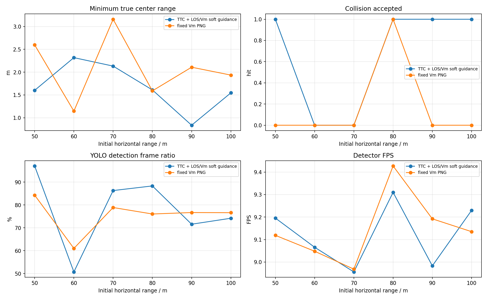

# YOLO + ByteTrack PX4 SITL 加速度过载 PNG TTC / V_m 拦截对比报告

## 1. 实验目的

按照此前已命中的 YOLO 案例配置，改用真正 PX4 SITL actor 场景，比较两种捷联视觉比例导引。本报告优先使用 `n_cmd_g` 作为需用过载；旧日志没有该字段时才回退到 `g_eval` 等效过载。

- `TTC` 组：`ttc_png`，TTC 只参与增益调度，并保留 LOS/Vm soft guidance。
- `VM` 组：`fixed_vm_png`，不使用 TTC，固定 `N * V_m` 导引增益。
- `accel_integral` 输出模式：导引律先计算 `a_cmd` / `n_cmd_g`，再按当前仿真步长积分为速度 setpoint；这不是直接向 PX4 发送加速度 setpoint。
- `accel_body_rate` 输出模式：导引律先计算 PNG 需用加速度，再转换为 PX4 `SET_ATTITUDE_TARGET` 机体系角速度 `p/q/r` 和 thrust；速度只作为沿 LOS 保速参考，不再把 PNG 横向修正直接加到速度指令上。

两组均测试 50m、60m、70m、80m、90m、100m，每个工况重启 PX4 SITL 和 Blocks。

## 2. 基准条件

|参数|值|
|---|---|
|stamp|`accel_body_rate_loskf_relaxed_20260623_073738`|
|settings|`/home/linux/Documents/PNG/config/airsim_blocks_px4_actor_settings.json`|
|拦截机|`PX4 SITL / mavlink_body_rate`|
|目标 actor|`IntruderActor`|
|actor asset|`Quadrotor1`|
|actor scale|`1.0`|
|检测源|`yolo_bytetrack`|
|YOLO model|`vision_guidance/best.pt`|
|YOLO device|`0` runtime `cuda:0`|
|YOLO conf / iou / imgsz|`0.1` / `0.7` / `640`|
|tracker|`bytetrack.yaml`，single target `1`|
|相机外参|`x=0.5, y=0.0, z=0.0`|
|FOV / resolution|`120.0 deg`, `640x480`|
|高度差|`20.0 m`|
|目标速度 / speed ratio|`5.0 m/s` / `2.0`|
|rate_hz|`8.0`|
|guidance output|`accel_body_rate`|
|max guidance accel|`15.0 m/s^2`|
|min speed ratio|`0.6`|
|body-rate tilt / attitude P|`20.0 deg` / `4.0`|
|body-rate roll/pitch max rate|`60.0` / `60.0 deg/s`|
|body-rate thrust|min/hover/max `0.25` / `0.5` / `0.75`|
|body-rate speed hold|gain `1.2`, max accel `6.0 m/s^2`, total limit `18.0 m/s^2`|
|LOS filter|`1`|
|LOS KF q lambda / lambda_dot|`0.0005` / `0.02`|
|LOS KF r / innovation gate|`0.008` / `0.75`|
|frame_guard|`True`|
|bbox noise|`0`|

## 3. 总览图

## 4. 汇总表

|组别|命中数|命中距离m|未命中距离m|最小中心距离m|检测帧/总帧|有效帧/总帧|平均检测FPS|
|---|---:|---|---|---:|---:|---:|---:|
|TTC|4/6|50, 80, 90, 100|60, 70|0.836|1023/1350|1052/1350|9.12|
|VM|1/6|80|50, 60, 70, 90, 100|1.145|1325/1753|1450/1753|9.15|

## 5. 明细表

|组别|距离m|碰撞|碰撞时间s|最小距离m|终点距离m|检测帧率|有效帧率|YOLO FPS|sim FPS|实际过载max g|速度指令差分P95 g|需用过载P95 g|
|---|---:|---:|---:|---:|---:|---:|---:|---:|---:|---:|---:|---:|
|TTC|50|1|17.78|1.600|1.630|97.1%|97.8%|9.20|7.90|0.60|0.68|0.33|
|VM|50|0|-|2.597|4.890|84.3%|92.4%|9.12|7.91|0.70|0.89|1.53|
|TTC|60|0|-|2.317|115.431|50.7%|51.8%|9.07|7.90|0.70|0.68|0.30|
|VM|60|0|-|1.145|58.246|61.0%|66.5%|9.05|7.91|0.60|0.87|1.48|
|TTC|70|0|-|2.132|13.641|86.3%|69.7%|8.96|7.89|0.71|2.18|1.53|
|VM|70|0|-|3.159|7.767|78.9%|85.1%|8.97|7.91|0.87|2.18|1.53|
|TTC|80|1|21.14|1.610|1.610|88.3%|97.5%|9.31|7.92|0.60|2.21|0.71|
|VM|80|1|29.88|1.589|1.662|76.1%|91.9%|9.43|7.94|0.72|2.21|1.53|
|TTC|90|1|32.20|0.836|0.985|71.6%|82.8%|8.98|7.89|0.70|2.22|1.52|
|VM|90|0|-|2.108|9.087|76.7%|74.7%|9.19|7.92|0.69|2.21|1.53|
|TTC|100|1|28.34|1.545|1.545|74.2%|89.1%|9.23|7.92|0.54|2.25|1.53|
|VM|100|0|-|1.935|4.626|76.6%|88.6%|9.14|7.91|0.89|2.25|1.53|

## 6. 分距离曲线

每个距离一张图，包含真实中心距离、bbox 面积、TTC 估计、实际过载/需用过载和 YOLO 检测 FPS。

## 7. LOS KF 与失败原因诊断

|组别|距离m|最近距离m|最近点状态|主要失败/降级原因|检测率|有效率|
|---|---:|---:|---|---|---:|---:|
|TTC|50|1.600|`los_innovation_reject`|valid:100, area_not_expanding:25, image_kf_predict:4, bbox_top_clipped:3|97.1%|97.8%|
|VM|50|2.597|`image_kf_predict`|valid:199, image_kf_predict:19, no_detection:18|84.3%|92.4%|
|TTC|60|2.317|`valid`|no_detection:130, valid:90, area_not_expanding:43, ttc_out_of_range:4|50.7%|51.8%|
|VM|60|1.145|`no_detection`|valid:166, no_detection:91, image_kf_predict:15|61.0%|66.5%|
|TTC|70|2.132|`los_innovation_reject`|valid:113, los_innovation_reject:80, area_not_expanding:66, image_kf_predict:30|86.3%|69.7%|
|VM|70|3.159|`valid`|valid:234, no_detection:37, image_kf_predict:28, los_innovation_reject:9|78.9%|85.1%|
|TTC|80|1.610|`area_not_expanding`|valid:86, area_not_expanding:55, image_kf_predict:15, no_detection:4|88.3%|97.5%|
|VM|80|1.589|`valid`|valid:178, image_kf_predict:37, no_detection:19|76.1%|91.9%|
|TTC|90|0.836|`no_detection`|valid:116, area_not_expanding:50, no_detection:36, image_kf_predict:35|71.6%|82.8%|
|VM|90|2.108|`image_kf_predict`|valid:223, los_innovation_reject:45, no_detection:44, image_kf_predict:40|76.7%|74.7%|
|TTC|100|1.545|`valid`|valid:93, area_not_expanding:66, image_kf_predict:33, no_detection:24|74.2%|89.1%|
|VM|100|1.935|`valid`|valid:269, image_kf_predict:42, no_detection:40|76.6%|88.6%|

- 放宽后的 LOS KF 参数为 `q_lambda=5e-4`、`q_lambda_dot=2e-2`、`r=8e-3`、`innovation_reject=0.75`。相较原始门限，它减少了末端 LOS 被直接判 invalid 的概率，但没有完全消除该问题。
- `TTC 70m` 最近点仍是 `los_innovation_reject`，说明末端 LOS 变化速度和 bbox 中心跳变仍可能超过当前 6D LOS KF 的一致性门限；这类失败不是加速度输出通道失效，而是导引量被质量门断开。
- `TTC 60m` 的检测率只有约一半，最近点虽然仍有效，但之后长时间 `no_detection`，拦截机错过后继续飞离；这更像视场/检测连续性问题。
- `VM` 组只有 `80m` 命中。固定 `N * V_m` 的需用过载基本保持在上限附近，缺少 TTC 对末端速度和增益的调度，近距丢检或外推时更容易错过碰撞判定窗口。
- 当前实际过载峰值低于导引需用过载，主要受 PX4 姿态角/角速度/推力限制、YOLO 约 9 FPS 采样、以及 frame centering 限制横向速度共同影响；因此日志中的 `n_cmd_g` 是导引层需求，不等于机体真实已经实现的过载。

## 8. 结论

- TTC: 命中 `4/6`，命中距离 `50m, 80m, 90m, 100m`，未命中 `60m, 70m`，检测帧比例 `75.8%`，有效导引帧比例 `77.9%`，平均检测 FPS `9.12`。
- VM: 命中 `1/6`，命中距离 `80m`，未命中 `50m, 60m, 70m, 90m, 100m`，检测帧比例 `75.6%`，有效导引帧比例 `82.7%`，平均检测 FPS `9.15`。
- 本轮使用真实 YOLOv8 + ByteTrack，因此检测连续性和 GPU 推理速度会直接进入闭环；结果不能和 AirSim detect 函数的理想 bbox 直接等价比较。
- `accel_integral` 模式的 `n_cmd_g` 来自导引层 `a_cmd`，底层仍通过 PX4/AirSim 速度 setpoint 闭环；实际过载由真实速度差分估计，因此会同时受 PX4 响应、速度限幅和视觉帧率影响。
- `accel_body_rate` 模式下 `n_cmd_g` 仍表示纯 PNG 需用过载；实际发送给 PX4 的是 `SET_ATTITUDE_TARGET` 机体系 `p/q/r` 角速度和归一化 thrust，日志中的 `body_rate_control_accel_*` 额外包含沿 LOS 的速度保持加速度。
