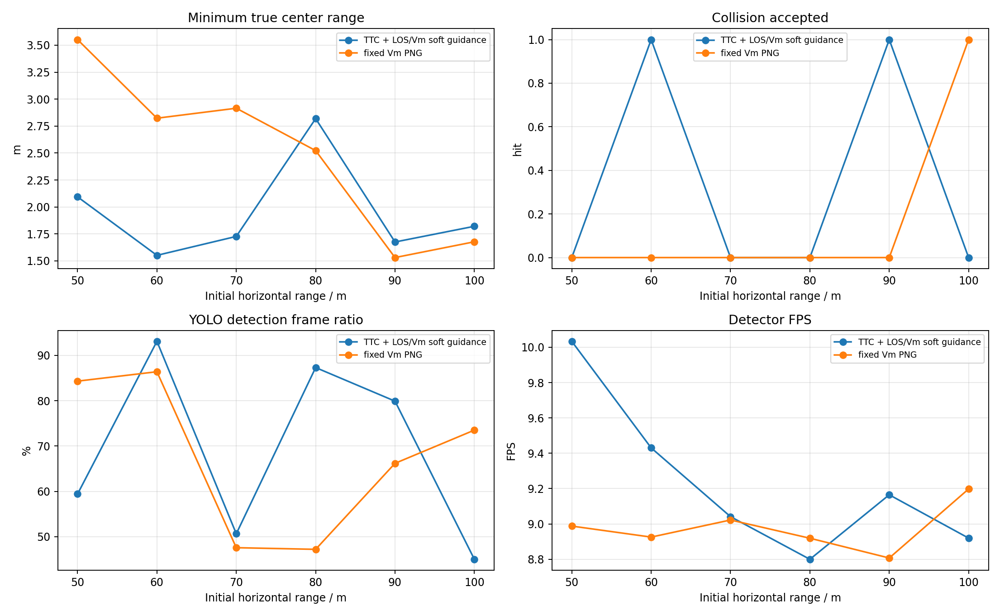
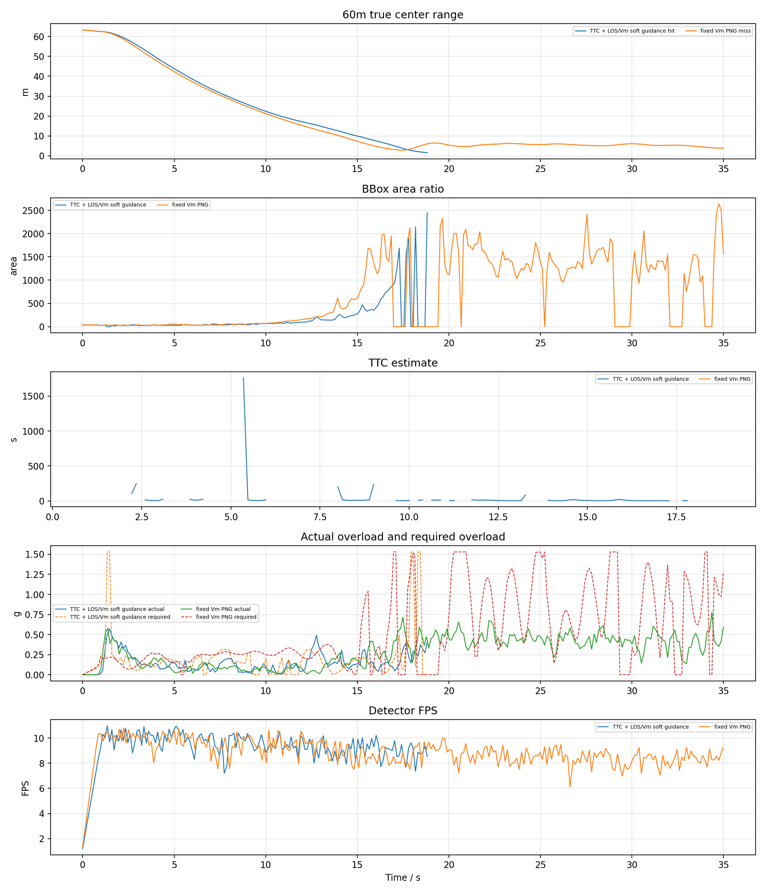
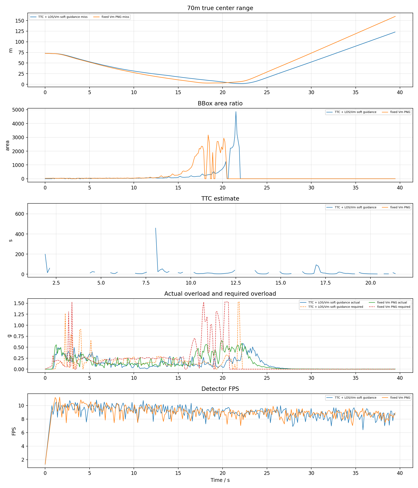
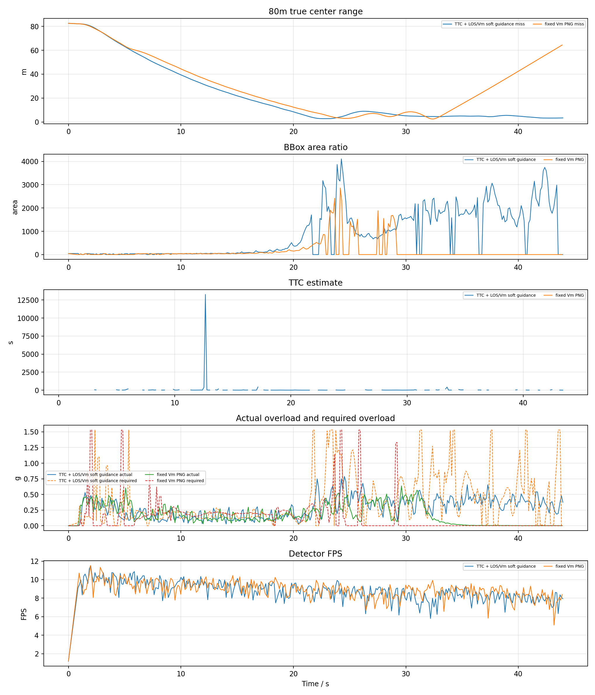
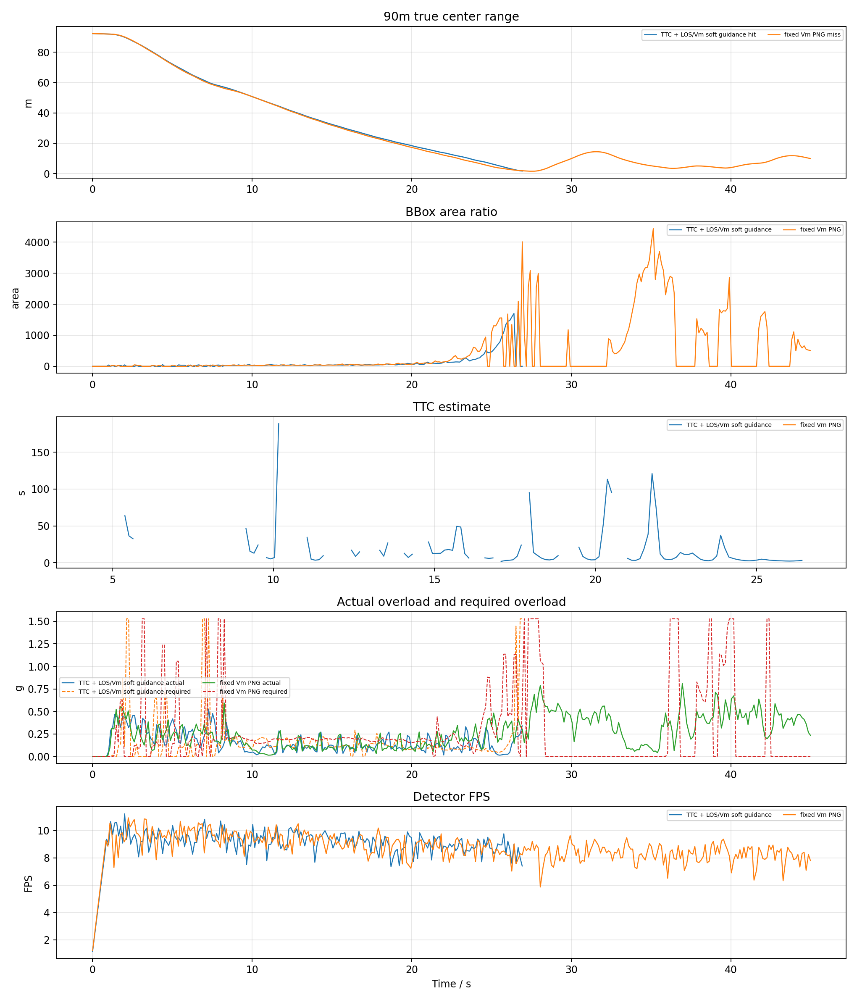
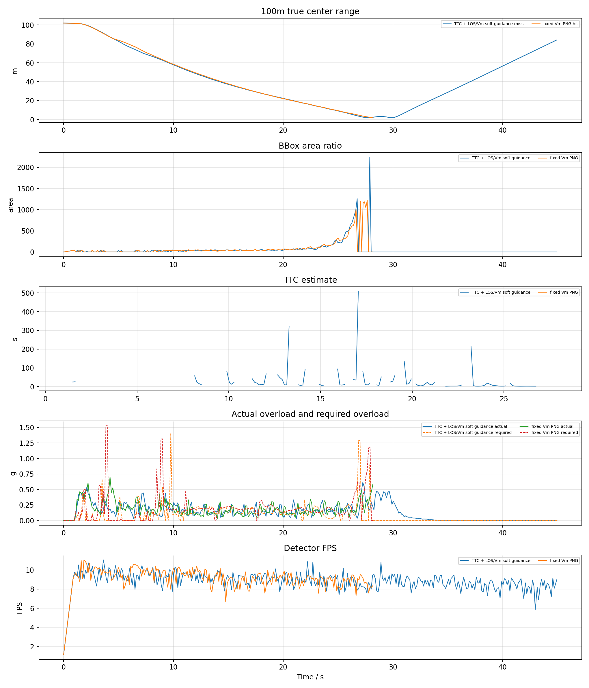

# YOLO + ByteTrack PX4 SITL 加速度过载 PNG TTC / V_m 拦截对比报告

## 1. 实验目的

按照此前已命中的 YOLO 案例配置，改用真正 PX4 SITL actor 场景，比较两种捷联视觉比例导引。本报告优先使用 `n_cmd_g` 作为需用过载；旧日志没有该字段时才回退到 `g_eval` 等效过载。

- `TTC` 组：`ttc_png`，TTC 只参与增益调度，并保留 LOS/Vm soft guidance。
- `VM` 组：`fixed_vm_png`，不使用 TTC，固定 `N * V_m` 导引增益。
- `accel_integral` 输出模式：导引律先计算 `a_cmd` / `n_cmd_g`，再按当前仿真步长积分为速度 setpoint；这不是直接向 PX4 发送加速度 setpoint。
- `accel_body_rate` 输出模式：导引律先计算 PNG 需用加速度，再转换为 PX4 `SET_ATTITUDE_TARGET` 机体系角速度 `p/q/r` 和 thrust；速度只作为沿 LOS 保速参考，不再把 PNG 横向修正直接加到速度指令上。
- `accel_attitude` 输出模式：导引律先计算 PNG 需用加速度，再转换为 PX4 `SET_ATTITUDE_TARGET` 姿态四元数和 thrust；速度只作为沿 LOS 保速参考。

两组均测试 50m、60m、70m、80m、90m、100m，每个工况重启 PX4 SITL 和 Blocks。

## 2. 基准条件

|参数|值|
|---|---|
|stamp|`attitude_ttc_vm_20260623_092510`|
|settings|`/home/linux/Documents/PNG/config/airsim_blocks_px4_actor_settings.json`|
|拦截机|`PX4 SITL / mavlink_attitude`|
|目标 actor|`IntruderActor`|
|actor asset|`Quadrotor1`|
|actor scale|`1.0`|
|检测源|`yolo_bytetrack`|
|YOLO model|`vision_guidance/best.pt`|
|YOLO device|`0` runtime `cuda:0`|
|YOLO conf / iou / imgsz|`0.1` / `0.7` / `640`|
|tracker|`bytetrack.yaml`，single target `1`|
|相机外参|`x=0.5, y=0.0, z=0.0`|
|FOV / resolution|`120.0 deg`, `640x480`|
|高度差|`20.0 m`|
|目标速度 / speed ratio|`5.0 m/s` / `2.0`|
|rate_hz|`8.0`|
|guidance output|`accel_attitude`|
|max guidance accel|`15.0 m/s^2`|
|min speed ratio|`0.6`|
|body-rate tilt / attitude P|`20.0 deg` / `4.0`|
|body-rate roll/pitch max rate|`60.0` / `60.0 deg/s`|
|body-rate thrust|min/hover/max `0.25` / `0.5` / `0.75`|
|body-rate speed hold|gain `1.2`, max accel `6.0 m/s^2`, total limit `18.0 m/s^2`|
|attitude tilt / yaw lookahead|`25.0 deg` / `0.25 s`|
|attitude thrust|min/hover/max `0.25` / `0.5` / `0.8`|
|attitude speed hold|gain `1.2`, max accel `6.0 m/s^2`, total limit `18.0 m/s^2`|
|LOS filter|`1`|
|LOS KF q lambda / lambda_dot|`0.0005` / `0.02`|
|LOS KF r / innovation gate|`0.008` / `0.75`|
|LOS terminal gate / delay|`1.2` / `0.18 s`|
|frame_guard|`True`|
|bbox noise|`0`|

## 3. 总览图

## 4. 汇总表

|组别|命中数|命中距离m|未命中距离m|最小中心距离m|检测帧/总帧|有效帧/总帧|平均检测FPS|
|---|---:|---|---|---:|---:|---:|---:|
|TTC|2/6|60, 90|50, 70, 80, 100|1.551|1054/1591|1165/1591|9.23|
|VM|1/6|100|50, 60, 70, 80, 90|1.531|1134/1726|1177/1726|8.98|

## 5. 明细表

|组别|距离m|碰撞|碰撞时间s|最小距离m|终点距离m|检测帧率|有效帧率|YOLO FPS|sim FPS|实际过载max g|速度指令差分P95 g|需用过载P95 g|
|---|---:|---:|---:|---:|---:|---:|---:|---:|---:|---:|---:|---:|
|TTC|50|0|-|2.094|49.404|59.4%|60.7%|10.03|7.92|0.70|1.03|0.49|
|VM|50|0|-|3.552|10.340|84.3%|74.2%|8.99|7.89|0.74|0.93|1.29|
|TTC|60|1|18.82|1.551|1.551|93.1%|97.9%|9.43|7.91|0.57|2.54|0.40|
|VM|60|0|-|2.823|3.928|86.4%|90.8%|8.93|7.87|0.78|1.56|1.53|
|TTC|70|0|-|1.727|122.933|50.6%|54.9%|9.04|7.90|0.58|2.55|0.28|
|VM|70|0|-|2.916|159.762|47.6%|51.5%|9.02|7.91|0.65|2.56|1.01|
|TTC|80|0|-|2.819|3.445|87.3%|97.1%|8.80|7.82|0.79|2.56|1.53|
|VM|80|0|-|2.523|64.349|47.2%|51.3%|8.92|7.87|0.64|2.61|0.44|
|TTC|90|1|26.92|1.675|1.675|79.9%|91.4%|9.16|7.92|0.53|2.72|0.70|
|VM|90|0|-|1.531|9.861|66.2%|66.5%|8.81|7.85|0.81|2.89|1.53|
|TTC|100|0|-|1.821|84.253|45.0%|53.8%|8.92|7.90|0.61|2.66|0.23|
|VM|100|1|28.17|1.677|1.677|73.5%|86.3%|9.20|7.91|0.70|2.86|0.57|

## 6. 分距离曲线

每个距离一张图，包含真实中心距离、bbox 面积、TTC 估计、实际过载/需用过载和 YOLO 检测 FPS。

## 7. LOS KF 与失败原因诊断

|组别|距离m|最近距离m|最近点状态|主要失败/降级原因|检测率|有效率|
|---|---:|---:|---|---|---:|---:|
|TTC|50|2.094|`valid`|valid:107, no_detection:91, area_not_expanding:25, image_kf_predict:7|59.4%|60.7%|
|VM|50|3.552|`valid`|valid:165, los_innovation_reject:33, no_detection:28, image_kf_predict:10|84.3%|74.2%|
|TTC|60|1.551|`los_innovation_reject`|valid:78, area_not_expanding:51, image_kf_predict:8, ttc_out_of_range:5|93.1%|97.9%|
|VM|60|2.823|`no_detection`|valid:235, no_detection:25, image_kf_predict:12|86.4%|90.8%|
|TTC|70|1.727|`image_kf_predict`|no_detection:139, valid:95, area_not_expanding:58, image_kf_predict:13|50.6%|54.9%|
|VM|70|2.916|`valid`|no_detection:150, valid:147, image_kf_predict:12|47.6%|51.5%|
|TTC|80|2.819|`valid`|valid:167, area_not_expanding:122, image_kf_predict:33, no_detection:10|87.3%|97.1%|
|VM|80|2.523|`no_detection`|no_detection:153, valid:147, image_kf_predict:28, los_innovation_reject:13|47.2%|51.3%|
|TTC|90|1.675|`image_kf_predict`|valid:107, area_not_expanding:58, image_kf_predict:24, no_detection:18|79.9%|91.4%|
|VM|90|1.531|`image_kf_predict`|valid:192, no_detection:79, image_kf_predict:40, los_innovation_reject:38|66.2%|66.5%|
|TTC|100|1.821|`no_detection`|no_detection:162, valid:97, area_not_expanding:56, image_kf_predict:31|45.0%|53.8%|
|VM|100|1.677|`no_detection`|valid:161, no_detection:30, image_kf_predict:28|73.5%|86.3%|

- LOS KF 参数：`q_lambda=0.0005`、`q_lambda_dot=0.02`、`r=0.008`、`innovation_reject=0.75`、`terminal_reject=1.2`。
- 未命中但最近距离小于等于 3m 的工况：TTC 50m(2.094m)，VM 60m(2.823m)，TTC 70m(1.727m)，VM 70m(2.916m)，TTC 80m(2.819m)，VM 80m(2.523m)，VM 90m(1.531m)，TTC 100m(1.821m)。这些工况已接近目标，但没有触发 AirSim 碰撞判定，后续应重点看末端视场保持、外推和碰撞几何。
- 检测率低于 60% 的工况：TTC 50m(59.4%)，TTC 70m(50.6%)，VM 70m(47.6%)，VM 80m(47.2%)，TTC 100m(45.0%)。这类失败优先归因于 YOLO/ByteTrack 连续性和固定相机视场保持，而不是导引律公式本身。
- 最近点处仍处于降级或无效状态的未命中工况：VM 60m:`no_detection`，TTC 70m:`image_kf_predict`，VM 80m:`no_detection`，VM 90m:`image_kf_predict`，TTC 100m:`no_detection`。这些样本说明末端质量门、视觉外推和 bbox 裁切处理仍会影响命中窗口。
- 本轮平均实际过载峰值约 `0.67 g`，平均需用过载 P95 约 `0.83 g`。两者不是同一个量：`n_cmd_g` 是导引层需求，实际过载还受 PX4 姿态/推力限制、YOLO 约 9 FPS 采样和 frame centering 限速影响。

## 8. 结论

- TTC: 命中 `2/6`，命中距离 `60m, 90m`，未命中 `50m, 70m, 80m, 100m`，检测帧比例 `66.2%`，有效导引帧比例 `73.2%`，平均检测 FPS `9.23`。
- VM: 命中 `1/6`，命中距离 `100m`，未命中 `50m, 60m, 70m, 80m, 90m`，检测帧比例 `65.7%`，有效导引帧比例 `68.2%`，平均检测 FPS `8.98`。
- 本轮使用真实 YOLOv8 + ByteTrack，因此检测连续性和 GPU 推理速度会直接进入闭环；结果不能和 AirSim detect 函数的理想 bbox 直接等价比较。
- `accel_integral` 模式的 `n_cmd_g` 来自导引层 `a_cmd`，底层仍通过 PX4/AirSim 速度 setpoint 闭环；实际过载由真实速度差分估计，因此会同时受 PX4 响应、速度限幅和视觉帧率影响。
- `accel_body_rate` 模式下 `n_cmd_g` 仍表示纯 PNG 需用过载；实际发送给 PX4 的是 `SET_ATTITUDE_TARGET` 机体系 `p/q/r` 角速度和归一化 thrust，日志中的 `body_rate_control_accel_*` 额外包含沿 LOS 的速度保持加速度。
- `accel_attitude` 模式下 `n_cmd_g` 同样表示纯 PNG 需用过载；实际发送给 PX4 的是 `SET_ATTITUDE_TARGET` 姿态四元数和归一化 thrust，日志中的 `attitude_control_accel_*` 记录姿态指令生成前的合成加速度。
