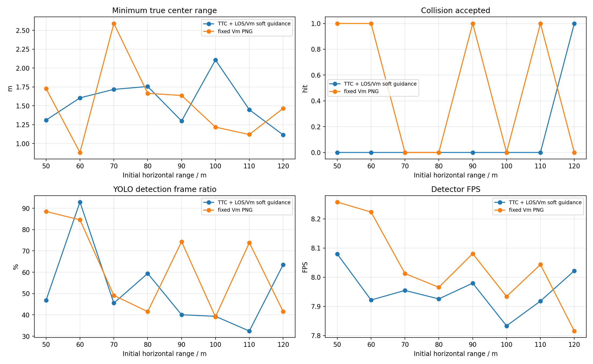
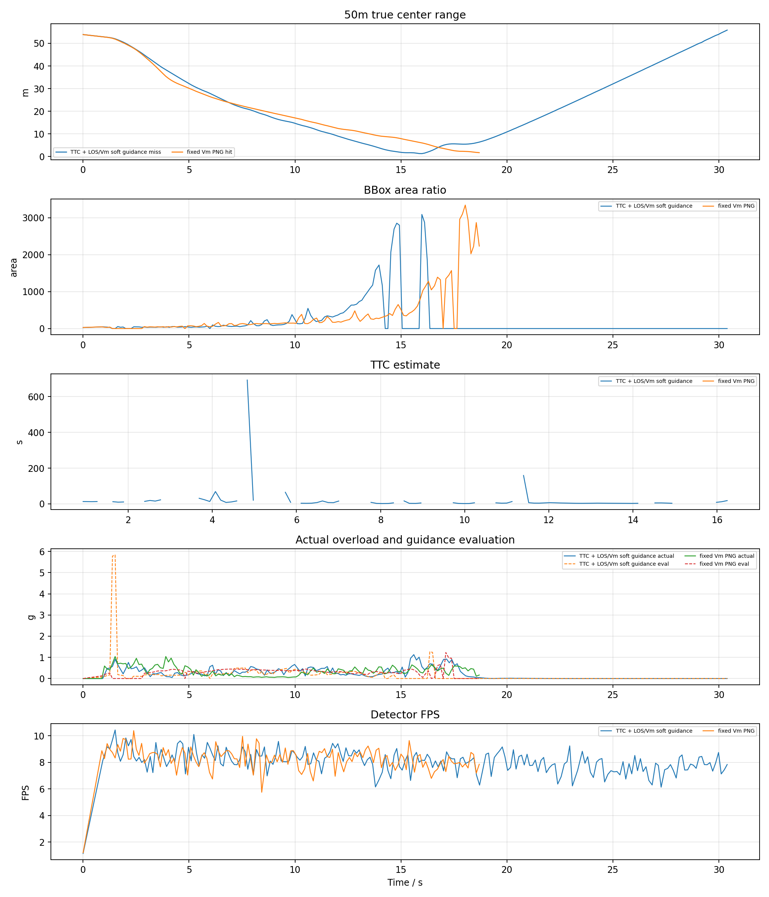
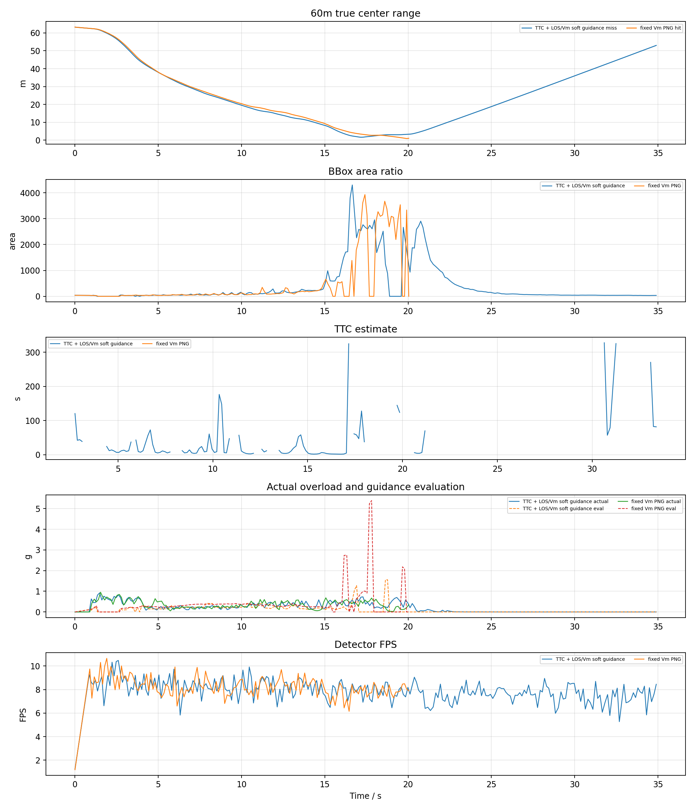
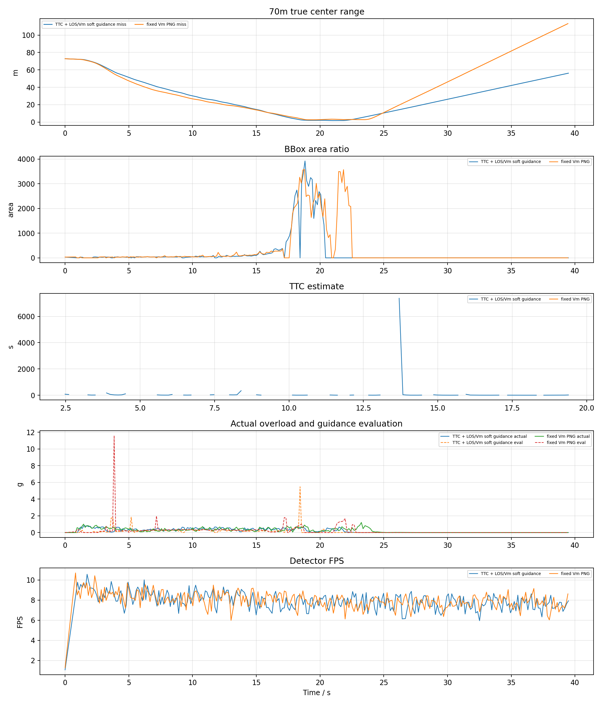
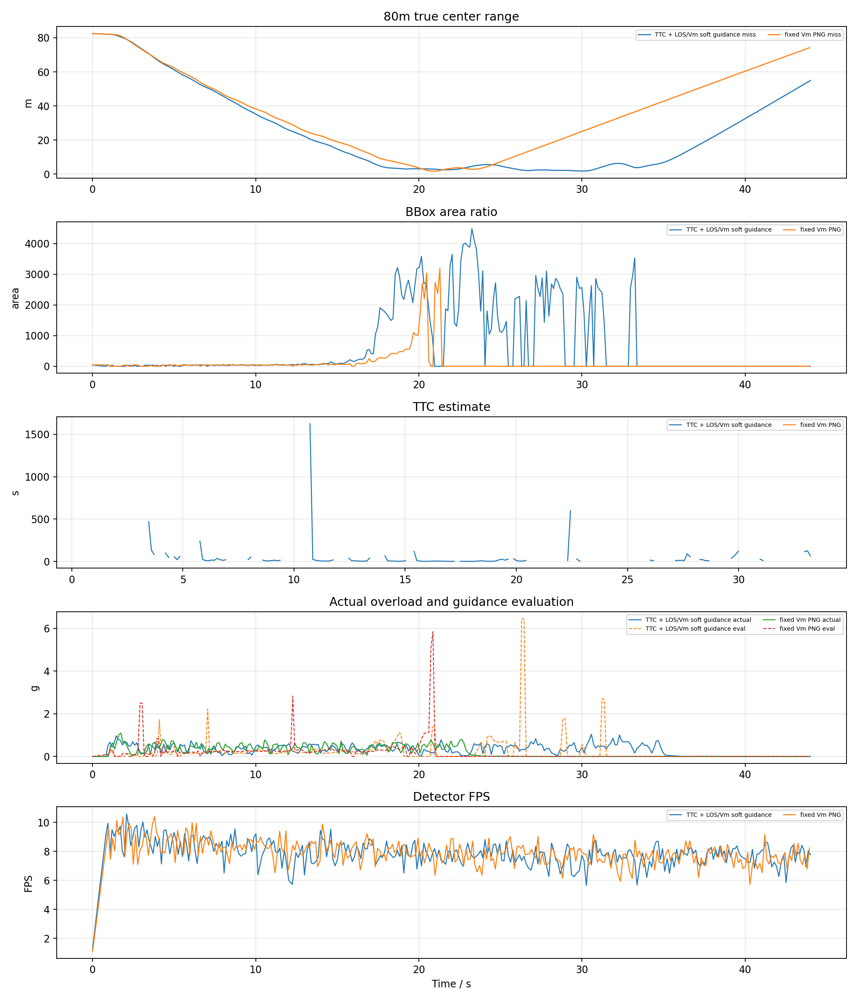
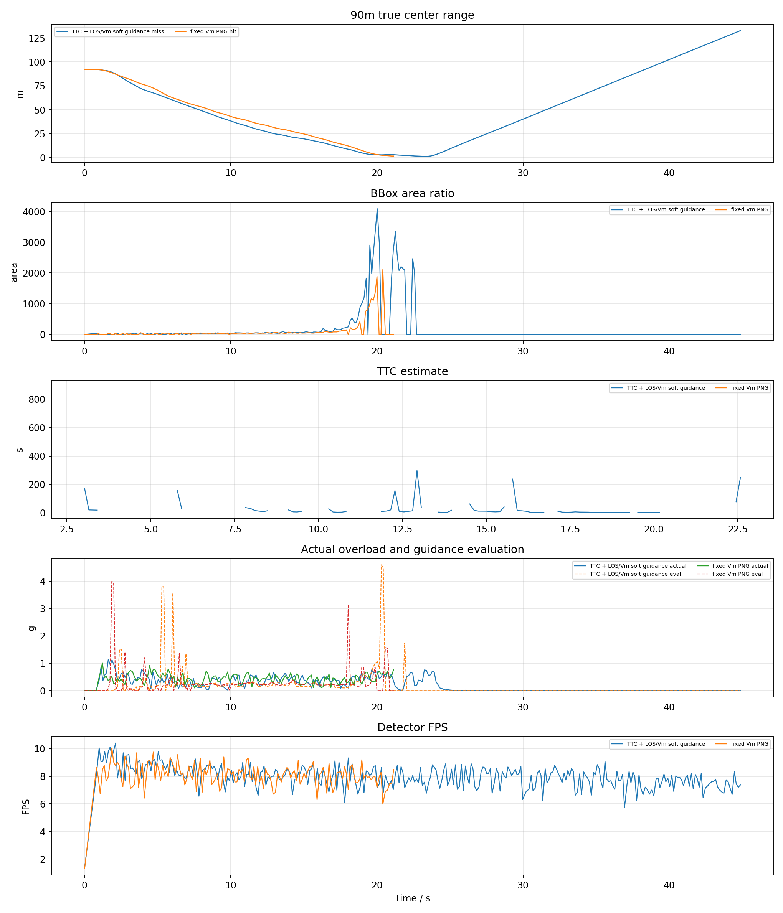
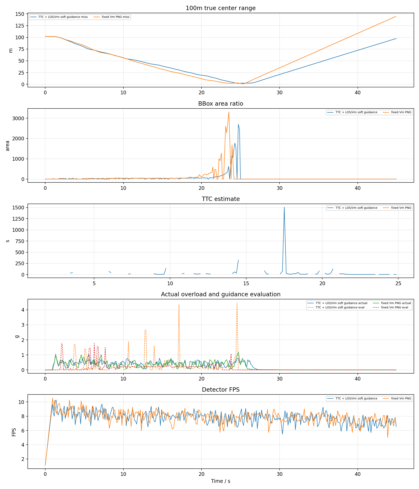
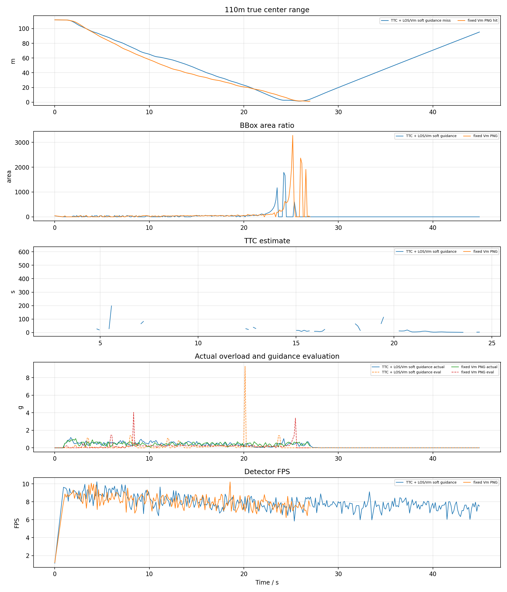
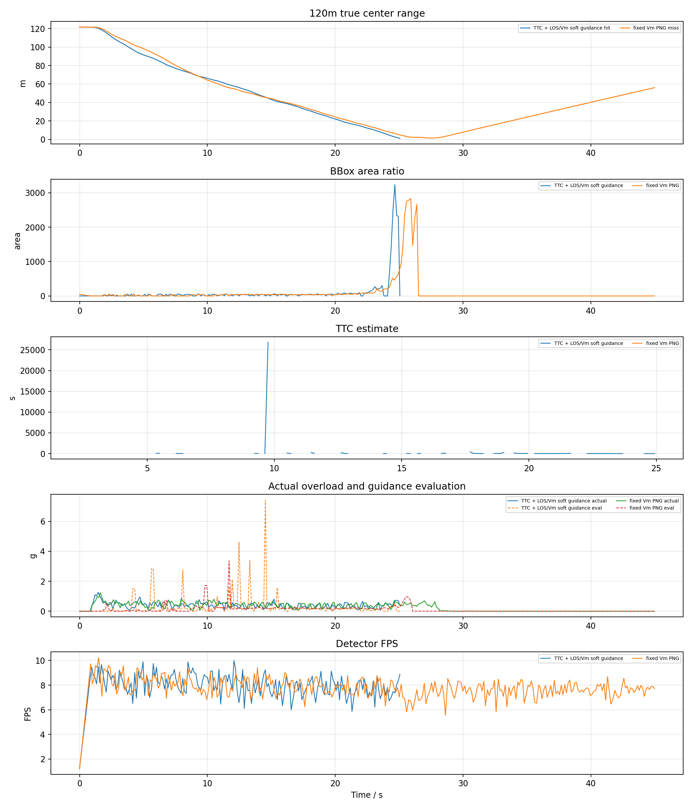

# YOLO + ByteTrack PX4 SITL ClockSpeed0.2 50-120m 无影子检测报告

## 1. 实验目的

按照此前已命中的 YOLO 案例配置，改用真正 PX4 SITL actor 场景，比较两种捷联视觉比例导引：

- `TTC` 组：`ttc_png`，TTC 只参与增益调度，并保留 LOS/Vm soft guidance。
- `VM` 组：`fixed_vm_png`，不使用 TTC，固定 `N * V_m` 导引增益。

两组均测试 50m、60m、70m、80m、90m、100m、110m、120m；目标为 Quadrotor1 actor，检测为 YOLOv8 + ByteTrack，YOLO 参数 imgsz=640、conf=0.1，相机前移 0.5m、俯仰 0deg；关闭 AirSim detect 影子测试。

## 2. 基准条件

|参数|值|
|---|---|
|stamp|`yolo_sitl_clock0p2_noshadow_50_120_20260621_024929`|
|settings|`/home/linux/Documents/PNG/config/airsim_blocks_px4_actor_clock0p2_settings.json`|
|拦截机|`PX4 SITL / velocity_yaw_rate`|
|目标 actor|`IntruderActor`|
|actor asset|`Quadrotor1`|
|actor scale|`1.0`|
|检测源|`yolo_bytetrack`|
|YOLO model|`vision_guidance/best.pt`|
|YOLO device|`0` runtime `cuda:0`|
|YOLO conf / iou / imgsz|`0.1` / `0.7` / `640`|
|tracker|`bytetrack.yaml`，single target `1`|
|相机外参|`x=0.5, y=0.0, z=0.0`|
|FOV / resolution|`120.0 deg`, `640x480`|
|高度差|`20.0 m`|
|目标速度 / speed ratio|`5.0 m/s` / `2.0`|
|rate_hz|`8.0`|
|LOS filter|`1`|
|frame_guard|`True`|
|bbox noise|`0`|

## 3. 总览图

## 4. 汇总表

|组别|命中数|命中距离m|未命中距离m|最小中心距离m|检测帧/总帧|有效帧/总帧|平均检测FPS|
|---|---:|---|---|---:|---:|---:|---:|
|TTC|1/8|120|50, 60, 70, 80, 90, 100, 110|1.114|1151/2265|1155/2265|7.95|
|VM|4/8|50, 60, 90, 110|70, 80, 100, 120|0.882|1057/1921|1159/1921|8.04|

## 5. 明细表

|组别|距离m|碰撞|碰撞时间s|最小距离m|终点距离m|检测帧率|有效帧率|YOLO FPS|sim FPS|实际过载max g|指令P95 g|导引评估P95 g|
|---|---:|---:|---:|---:|---:|---:|---:|---:|---:|---:|---:|---:|
|TTC|50|0|-|1.311|55.832|46.9%|49.6%|8.08|7.57|1.13|2.56|0.43|
|VM|50|1|18.70|1.728|1.728|88.5%|87.1%|8.26|7.68|1.04|2.51|0.44|
|TTC|60|0|-|1.605|53.033|92.9%|46.5%|7.92|7.46|0.92|1.73|0.39|
|VM|60|1|20.04|0.882|1.007|84.6%|83.9%|8.22|7.66|0.95|2.62|0.95|
|TTC|70|0|-|1.718|56.212|45.5%|45.5%|7.95|7.51|0.86|2.28|0.33|
|VM|70|0|-|2.591|113.215|49.1%|47.8%|8.01|7.56|1.21|2.81|0.77|
|TTC|80|0|-|1.756|54.926|59.4%|53.3%|7.93|7.48|1.04|2.78|0.77|
|VM|80|0|-|1.666|74.165|41.5%|46.2%|7.97|7.53|1.10|2.28|0.44|
|TTC|90|0|-|1.299|132.717|40.1%|44.6%|7.98|7.53|1.15|2.15|0.55|
|VM|90|1|21.15|1.637|1.637|74.4%|88.5%|8.08|7.58|1.02|3.54|0.95|
|TTC|100|0|-|2.108|97.492|39.3%|50.6%|7.83|7.44|1.03|2.88|0.57|
|VM|100|0|-|1.218|144.531|39.1%|45.8%|7.93|7.51|1.18|2.38|0.37|
|TTC|110|0|-|1.449|95.297|32.4%|44.8%|7.92|7.48|1.17|3.03|0.26|
|VM|110|1|27.00|1.120|1.501|73.9%|87.4%|8.04|7.56|1.05|2.93|0.42|
|TTC|120|1|25.06|1.114|1.114|63.6%|87.0%|8.02|7.52|1.26|3.10|1.50|
|VM|120|0|-|1.466|56.066|41.5%|48.5%|7.82|7.45|1.23|2.58|0.28|

## 6. 分距离曲线

每个距离一张图，包含真实中心距离、bbox 面积、TTC 估计、实际过载/导引评估过载和 YOLO 检测 FPS。

## 7. 结论

- TTC: 命中 `1/8`，命中距离 `120m`，未命中 `50m, 60m, 70m, 80m, 90m, 100m, 110m`，检测帧比例 `50.8%`，有效导引帧比例 `51.0%`，平均检测 FPS `7.95`。
- VM: 命中 `4/8`，命中距离 `50m, 60m, 90m, 110m`，未命中 `70m, 80m, 100m, 120m`，检测帧比例 `55.0%`，有效导引帧比例 `60.3%`，平均检测 FPS `8.04`。
- 本轮使用真实 YOLOv8 + ByteTrack，因此检测连续性和 GPU 推理速度会直接进入闭环；结果不能和 AirSim detect 函数的理想 bbox 直接等价比较。
