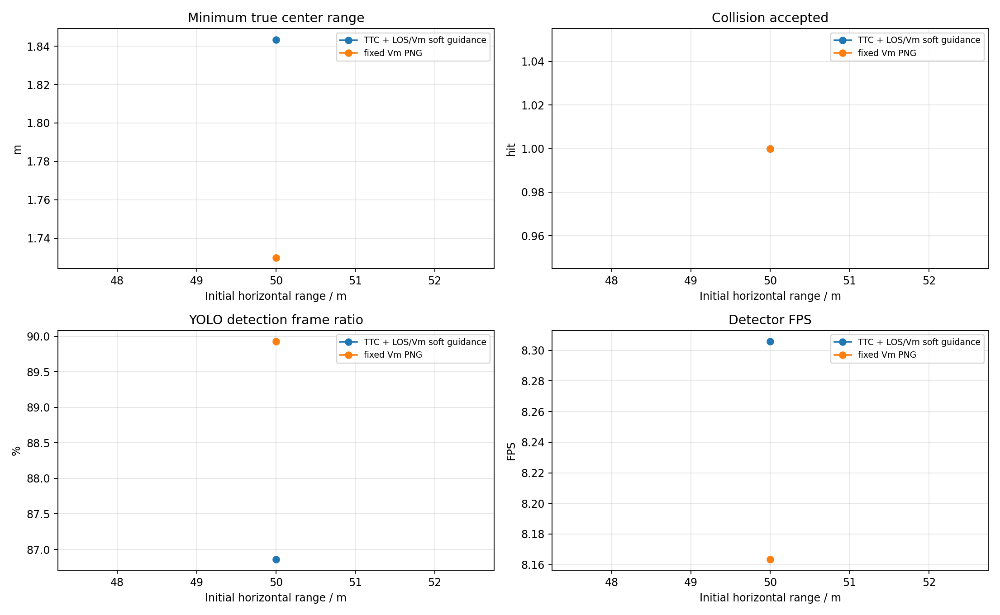
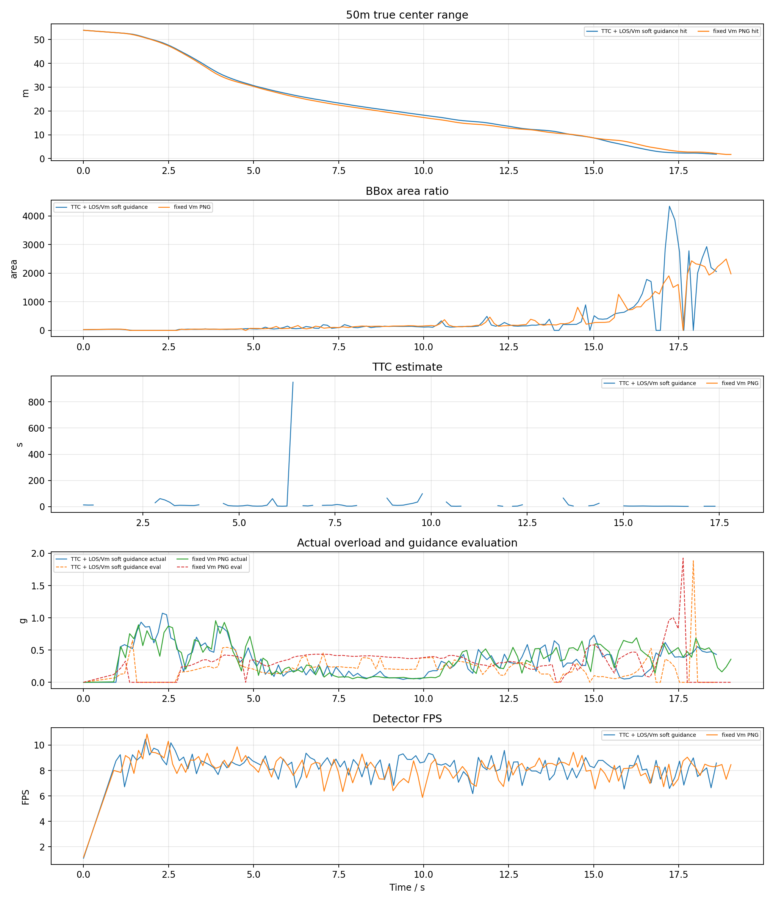

# YOLO + ByteTrack PX4 SITL ClockSpeed0.2 50m 测试报告

## 1. 实验目的

按照此前已命中的 YOLO 案例配置，改用真正 PX4 SITL actor 场景，比较两种捷联视觉比例导引：

- `TTC` 组：`ttc_png`，TTC 只参与增益调度，并保留 LOS/Vm soft guidance。
- `VM` 组：`fixed_vm_png`，不使用 TTC，固定 `N * V_m` 导引增益。

本报告只测试 50m，TTC 和 V_m 两组均重启 PX4 SITL 和 Blocks。

## 2. 基准条件

|参数|值|
|---|---|
|stamp|`yolo_sitl_clock0p2_50m_20260621_023245`|
|settings|`/home/linux/Documents/PNG/config/airsim_blocks_px4_actor_clock0p2_settings.json`|
|拦截机|`PX4 SITL / velocity_yaw_rate`|
|目标 actor|`IntruderActor`|
|actor asset|`Quadrotor1`|
|actor scale|`1.0`|
|检测源|`yolo_bytetrack`|
|YOLO model|`vision_guidance/best.pt`|
|YOLO device|`0` runtime `cuda:0`|
|YOLO conf / iou / imgsz|`0.1` / `0.7` / `640`|
|tracker|`bytetrack.yaml`，single target `1`|
|相机外参|`x=0.5, y=0.0, z=0.0`|
|FOV / resolution|`120.0 deg`, `640x480`|
|高度差|`20.0 m`|
|目标速度 / speed ratio|`5.0 m/s` / `2.0`|
|rate_hz|`8.0`|
|LOS filter|`1`|
|frame_guard|`True`|
|bbox noise|`0`|

## 3. 总览图

## 4. 汇总表

|组别|命中数|命中距离m|未命中距离m|最小中心距离m|检测帧/总帧|有效帧/总帧|平均检测FPS|
|---|---:|---|---|---:|---:|---:|---:|
|TTC|1/1|50|-|1.843|119/137|121/137|8.31|
|VM|1/1|50|-|1.730|125/139|118/139|8.16|

## 5. 明细表

|组别|距离m|碰撞|碰撞时间s|最小距离m|终点距离m|检测帧率|有效帧率|YOLO FPS|sim FPS|实际过载max g|指令P95 g|导引评估P95 g|
|---|---:|---:|---:|---:|---:|---:|---:|---:|---:|---:|---:|---:|
|TTC|50|1|18.61|1.843|1.843|86.9%|88.3%|8.31|7.65|1.07|2.72|0.46|
|VM|50|1|19.04|1.730|1.730|89.9%|84.9%|8.16|7.57|0.96|2.89|0.52|

## 6. 分距离曲线

每个距离一张图，包含真实中心距离、bbox 面积、TTC 估计、实际过载/导引评估过载和 YOLO 检测 FPS。

## 7. 结论

- TTC: 命中 `1/1`，命中距离 `50m`，未命中 `-`，检测帧比例 `86.9%`，有效导引帧比例 `88.3%`，平均检测 FPS `8.31`。
- VM: 命中 `1/1`，命中距离 `50m`，未命中 `-`，检测帧比例 `89.9%`，有效导引帧比例 `84.9%`，平均检测 FPS `8.16`。
- 本轮使用真实 YOLOv8 + ByteTrack，因此检测连续性和 GPU 推理速度会直接进入闭环；结果不能和 AirSim detect 函数的理想 bbox 直接等价比较。
