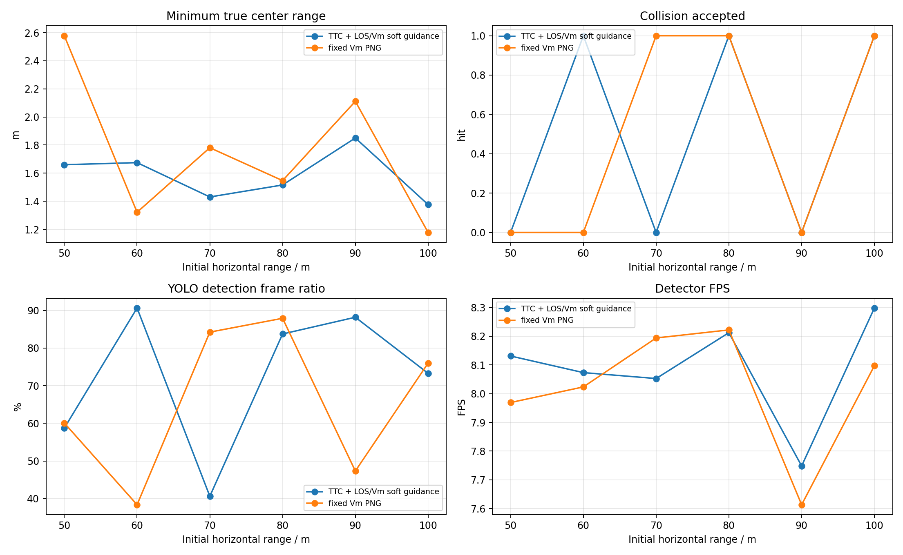
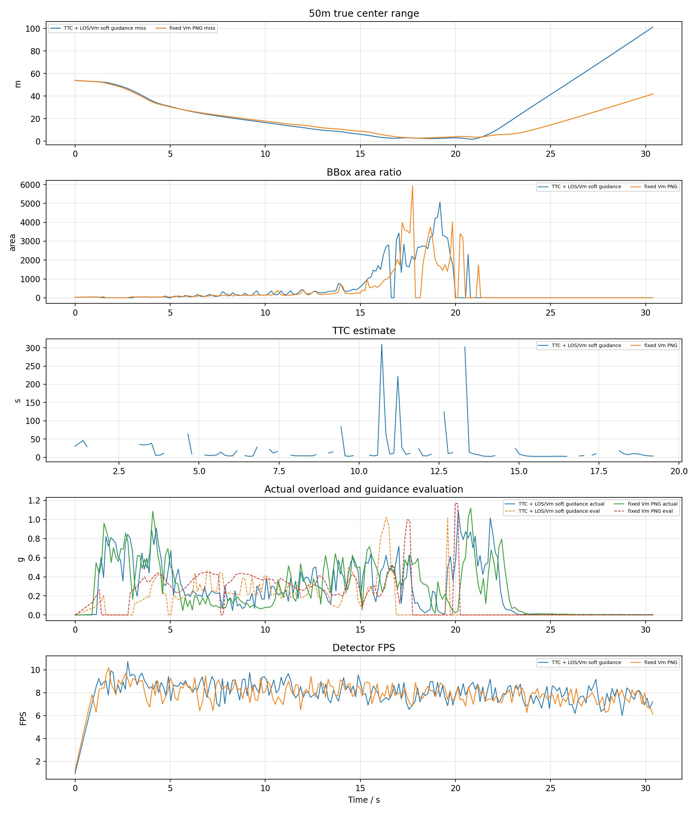
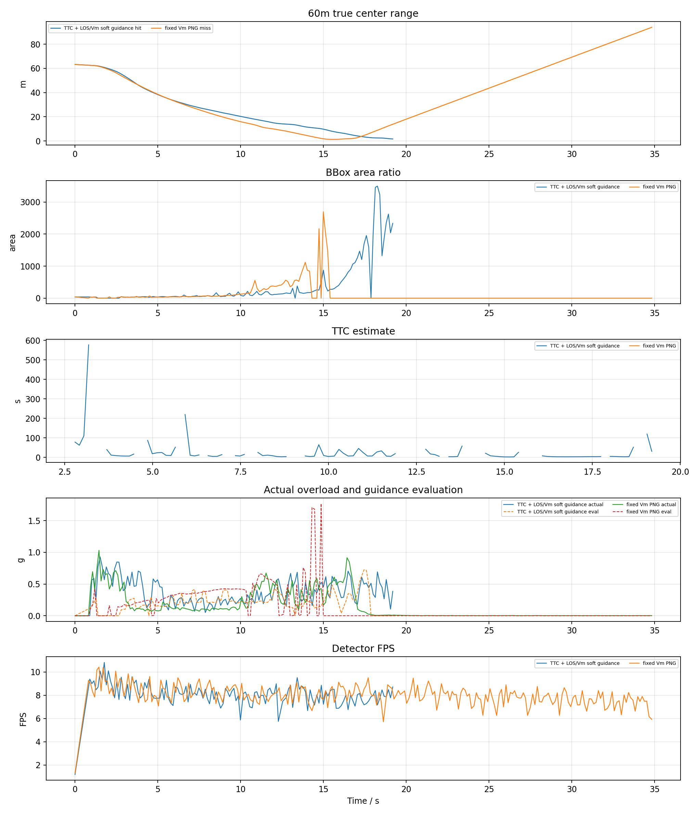
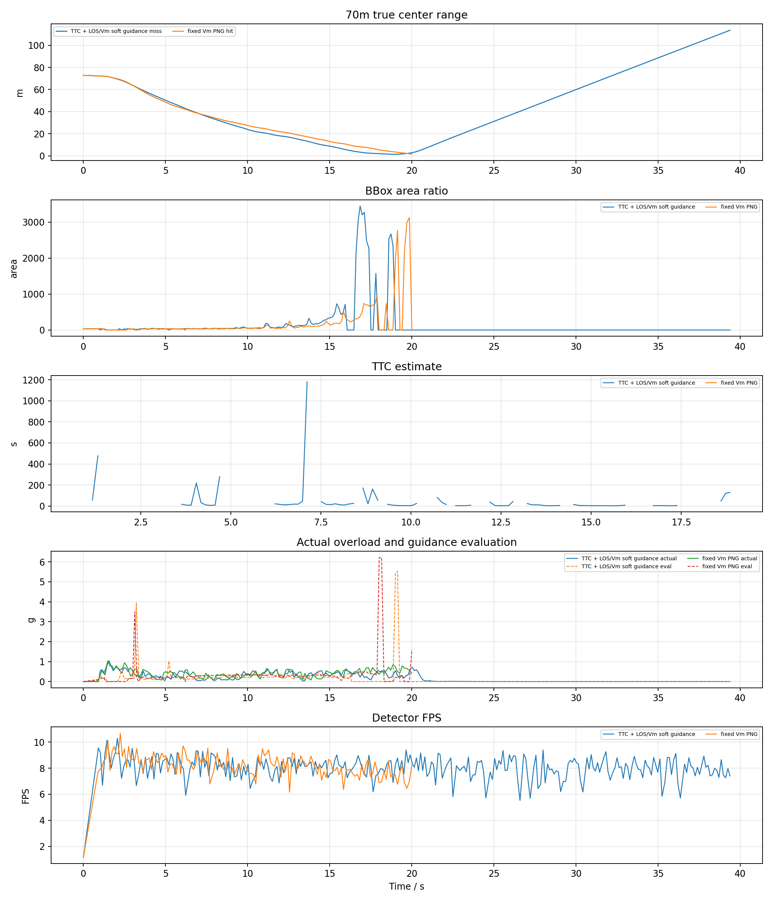
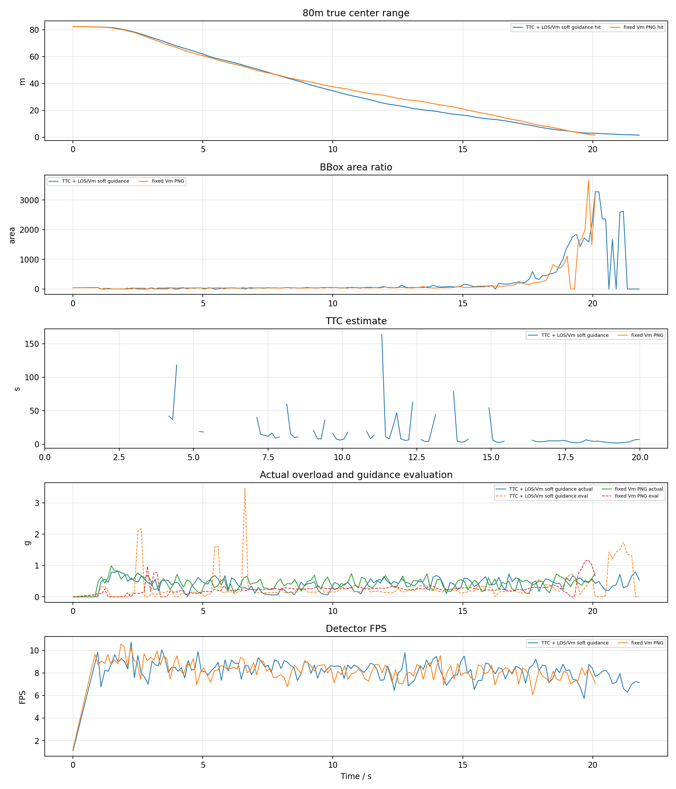
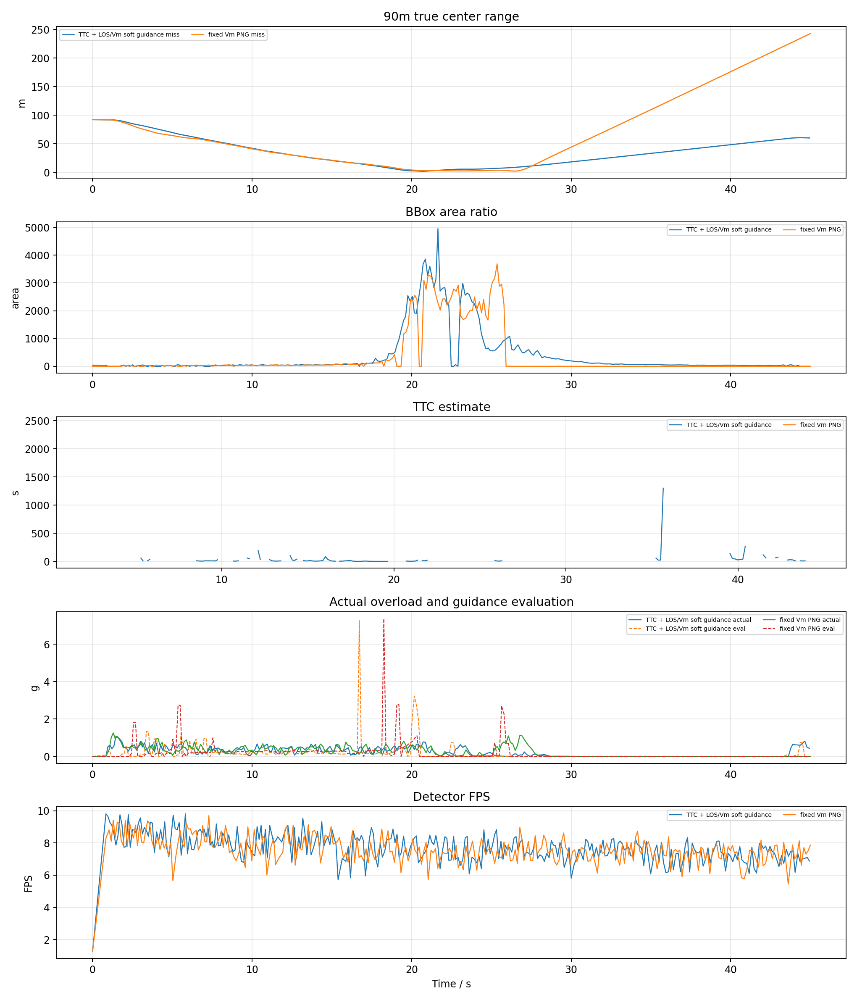
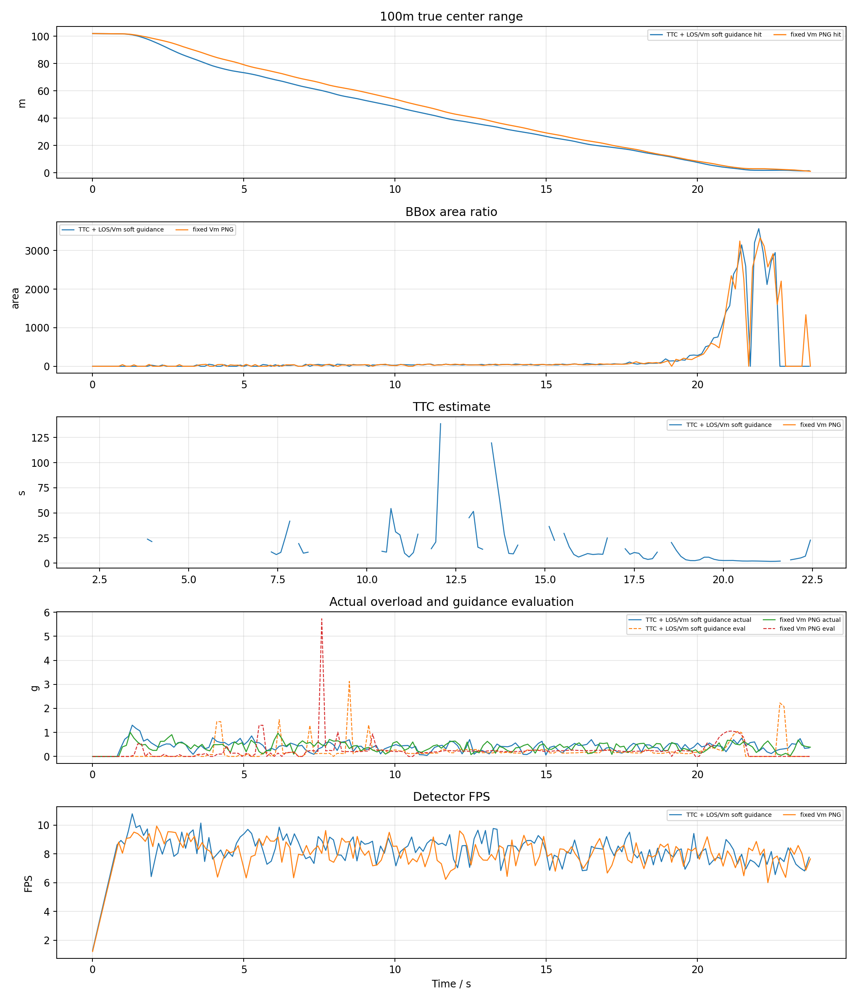

# YOLO + ByteTrack PX4 SITL TTC / V_m 拦截对比报告

## 1. 实验目的

按照此前已命中的 YOLO 案例配置，改用真正 PX4 SITL actor 场景，比较两种捷联视觉比例导引：

- `TTC` 组：`ttc_png`，TTC 只参与增益调度，并保留 LOS/Vm soft guidance。
- `VM` 组：`fixed_vm_png`，不使用 TTC，固定 `N * V_m` 导引增益。

两组均测试 50m、60m、70m、80m、90m、100m，每个工况重启 PX4 SITL 和 Blocks。

## 2. 基准条件

|参数|值|
|---|---|
|stamp|`yolo_sitl_ttc_vm_20260620_202343`|
|settings|`/home/linux/Documents/PNG/config/airsim_blocks_px4_actor_settings.json`|
|拦截机|`PX4 SITL / velocity_yaw_rate`|
|目标 actor|`IntruderActor`|
|actor asset|`Quadrotor1`|
|actor scale|`1.0`|
|检测源|`yolo_bytetrack`|
|YOLO model|`vision_guidance/best.pt`|
|YOLO device|`0` runtime `cuda:0`|
|YOLO conf / iou / imgsz|`0.1` / `0.7` / `640`|
|tracker|`bytetrack.yaml`，single target `1`|
|相机外参|`x=0.5, y=0.0, z=0.0`|
|FOV / resolution|`120.0 deg`, `640x480`|
|高度差|`20.0 m`|
|目标速度 / speed ratio|`5.0 m/s` / `2.0`|
|rate_hz|`8.0`|
|LOS filter|`1`|
|frame_guard|`True`|
|bbox noise|`0`|

## 3. 总览图

## 4. 汇总表

|组别|命中数|命中距离m|未命中距离m|最小中心距离m|检测帧/总帧|有效帧/总帧|平均检测FPS|
|---|---:|---|---|---:|---:|---:|---:|
|TTC|3/6|60, 80, 100|50, 70, 90|1.376|921/1308|801/1308|8.09|
|VM|3/6|70, 80, 100|50, 60, 90|1.178|771/1270|804/1270|8.02|

## 5. 明细表

|组别|距离m|碰撞|碰撞时间s|最小距离m|终点距离m|检测帧率|有效帧率|YOLO FPS|sim FPS|实际过载max g|指令P95 g|导引评估P95 g|
|---|---:|---:|---:|---:|---:|---:|---:|---:|---:|---:|---:|---:|
|TTC|50|0|-|1.660|101.040|58.7%|54.3%|8.13|7.57|1.09|1.96|0.45|
|VM|50|0|-|2.578|41.844|60.1%|57.4%|7.97|7.51|1.12|2.32|0.44|
|TTC|60|1|19.19|1.675|1.675|90.6%|85.6%|8.07|7.51|0.93|2.05|0.42|
|VM|60|0|-|1.322|93.970|38.4%|40.3%|8.02|7.55|1.03|1.82|0.52|
|TTC|70|0|-|1.431|113.602|40.6%|41.0%|8.05|7.52|1.03|2.09|0.35|
|VM|70|1|20.00|1.781|1.781|84.2%|89.7%|8.19|7.56|1.04|3.08|0.47|
|TTC|80|1|21.79|1.516|1.516|83.8%|95.0%|8.21|7.60|0.82|3.03|1.43|
|VM|80|1|20.10|1.547|1.547|87.9%|95.3%|8.22|7.64|0.99|3.04|0.71|
|TTC|90|0|-|1.850|60.119|88.2%|45.3%|7.75|7.32|1.09|2.42|0.73|
|VM|90|0|-|2.111|243.026|47.3%|45.5%|7.61|7.23|1.26|2.38|0.70|
|TTC|100|1|23.69|1.376|1.527|73.3%|82.4%|8.30|7.62|1.30|2.78|1.00|
|VM|100|1|23.74|1.178|1.178|76.0%|88.0%|8.10|7.56|1.01|2.93|0.94|

## 6. 分距离曲线

每个距离一张图，包含真实中心距离、bbox 面积、TTC 估计、实际过载/导引评估过载和 YOLO 检测 FPS。

## 7. 结论

- TTC: 命中 `3/6`，命中距离 `60m, 80m, 100m`，未命中 `50m, 70m, 90m`，检测帧比例 `70.4%`，有效导引帧比例 `61.2%`，平均检测 FPS `8.09`。
- VM: 命中 `3/6`，命中距离 `70m, 80m, 100m`，未命中 `50m, 60m, 90m`，检测帧比例 `60.7%`，有效导引帧比例 `63.3%`，平均检测 FPS `8.02`。
- 本轮使用真实 YOLOv8 + ByteTrack，因此检测连续性和 GPU 推理速度会直接进入闭环；结果不能和 AirSim detect 函数的理想 bbox 直接等价比较。

## 8. 历史 YOLO 命中案例对比

扫描 `logs/` 下除本轮 `yolo_sitl_ttc_vm_20260620_202343` 这 12 个工况以外的 YOLO/ByteTrack 日志，真正满足 `detector_source=yolo_bytetrack` 且发生碰撞命中的历史案例主要如下：

|日志|距离m|碰撞时间s|碰撞距离m|导引律|命令模式|配置文件|检测/有效帧|frame_guard|KF接管帧|备注|
|---|---:|---:|---:|---|---|---|---:|---:|---:|---|
|`yolo_px4_yawrate_ttc_frameguard_post_20260620_032953.csv`|50|21.63|1.623|`ttc_png` + `ttc_soft_vm`|`velocity_yaw_rate`|`config/airsim_blocks_settings.json`|145/149 of 166|154/166|11/166|命中，但配置文件内 `Interceptor` 是 `SimpleFlight`|
|`yolo_px4_yawrate_ttc_frameguard_60m_20260620_033414.csv`|60|29.98|1.293|`ttc_png` + `ttc_soft_vm`|`velocity_yaw_rate`|`config/airsim_blocks_settings.json`|170/181 of 207|162/207|22/207|命中，但配置文件内 `Interceptor` 是 `SimpleFlight`|

这两个案例和本轮 12 组的算法开关基本一致：`velocity_yaw_rate`、`YOLO imgsz=640`、`conf=0.1`、`camera_x=0.5`、`camera_pitch=0`、`Quadrotor1` actor、`frame_guard=1`、`ttc_soft_guidance=1`、`ttc_used_for_guidance=0`、影子 AirSim detect 仅记录不参与导引。

关键差异不是导引逻辑，而是仿真配置：历史两个命中案例使用 `config/airsim_blocks_settings.json`，该文件里 `Interceptor.VehicleType=SimpleFlight`；本轮 12 组使用 `config/airsim_blocks_px4_actor_settings.json`，该文件里 `Interceptor.VehicleType=PX4Multirotor`、`UseTcp=true`、`LockStep=true`。因此历史两个“px4_yawrate”文件名虽然带 PX4 字样，日志里也有 `px4_interceptor=1`，但实际 AirSim 车辆动力学不是严格 PX4 SITL。它们不能直接作为本轮真实 PX4 SITL 的同条件成功复现。

## 9. 本轮 12 组与历史命中案例的差异

|项目|历史 YOLO 命中案例|本轮 12 组|
|---|---|---|
|AirSim 车辆|`SimpleFlight` Interceptor|`PX4Multirotor` Interceptor|
|目标|`Quadrotor1` actor|`Quadrotor1` actor|
|检测|YOLOv8 + ByteTrack|YOLOv8 + ByteTrack|
|YOLO 参数|`imgsz=640, conf=0.1`|`imgsz=640, conf=0.1`|
|相机|前移 `0.5m`，俯仰 `0deg`|前移 `0.5m`，俯仰 `0deg`|
|导引主结构|TTC 软调度 + `N*V_m` 型 LOS 导引|TTC 组相同；VM 组为固定 `N*V_m`|
|TTC 是否直接决定导引有效性|否，`ttc_used_for_guidance=0`|否，`ttc_used_for_guidance=0`|
|视场保持|启用|启用|
|末端图像 KF 外推|启用|启用|
|主要新增不稳定源|较少，SimpleFlight 响应更直接|PX4 速度/航向响应慢，YOLO 约 8 FPS，末端丢检和滞后更明显|

本轮 12 组中，`frame_guard` 的速度收敛和末端减速确实被触发很多次，但 `frame_guard_yaw_active` 次数不高。例如 TTC 100m 命中工况为 `0/176`，VM 100m 为 `5/175`。这说明目标虽然进入了视场保护状态，但航向闭环并没有频繁进入“强 yaw-rate 护框”路径，实际是否能把目标留在中心仍然主要受 PX4 yaw-rate 响应和 YOLO 有效帧影响。

## 10. 六项改进实现状态

|改进项|状态|依据与限制|
|---|---|---|
|1. `--px4-command-mode velocity_yaw_rate`|已实现并用于本轮 12 组|批处理默认 `PX4_COMMAND_MODE=velocity_yaw_rate`，程序使用 `YawMode(is_rate=True)` 下发 yaw-rate。|
|1b. MAVLink Offboard 直接发送 `SET_POSITION_TARGET_LOCAL_NED`|代码路径已实现，但本轮未验证|`mavlink_offboard` 分支已存在，会发送 vx/vy/vz + yaw_rate；但本轮 12 组仍使用 AirSim `velocity_yaw_rate`，没有跑 MAVLink Offboard 消融。|
|2. “视场保持优先” frame_guard|已实现并启用|当 bbox 误差、面积、TTC 或裁切触发风险时，降低速度、缩小横向修正、增加 yaw-rate/垂向偏置。日志已记录 `frame_guard_active`、`frame_guard_mode`、`frame_guard_yaw_active`。|
|3. 近距降速调度|已实现并启用|`frame_guard_min_speed_ratio=1.30`、`frame_guard_mid_speed_ratio=1.60`，近距或大面积时进入 `terminal_capture`，将速度限制到较低倍数。|
|4. TTC 不强依赖面积|已实现|本轮 TTC 组记录 `ttc_used_for_guidance=0`、`ttc_soft_guidance=1`。TTC 失败时仍可走 `ttc_soft_vm`，主导引是 LOS + `V_m`，TTC 只做增益调度和末端触发。|
|5. 提高视觉有效帧率|部分实现|已使用 CUDA、640x480、`imgsz=640`、single-target 和 untracked fallback。正式测试仍保留 `shadow_airsim_detect=1`，平均 YOLO FPS 约 8.0。|
|6. 相机安装角与 top-clipped 策略|接口已实现，本轮基线未启用|程序支持 `camera_pitch_deg` 和 `--reject-top-clipped-pitch`。本轮 12 组 `camera_pitch=0`、未拒绝 top-clipped 俯仰测量。|

## 11. 后续建议

当前最需要确认的是 PX4 yaw-rate 响应链路，而不是继续叠加视觉和相机改动。历史命中案例与本轮 12 组的主要差异已经指向车辆动力学/控制响应：SimpleFlight 能命中 50/60m，真实 PX4 SITL 在同类导引下仍有 50/60/70/90m 等不稳定工况。
