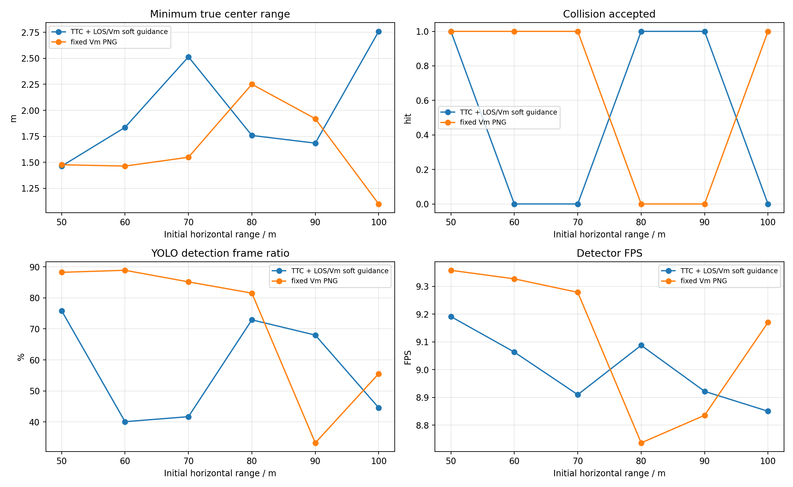
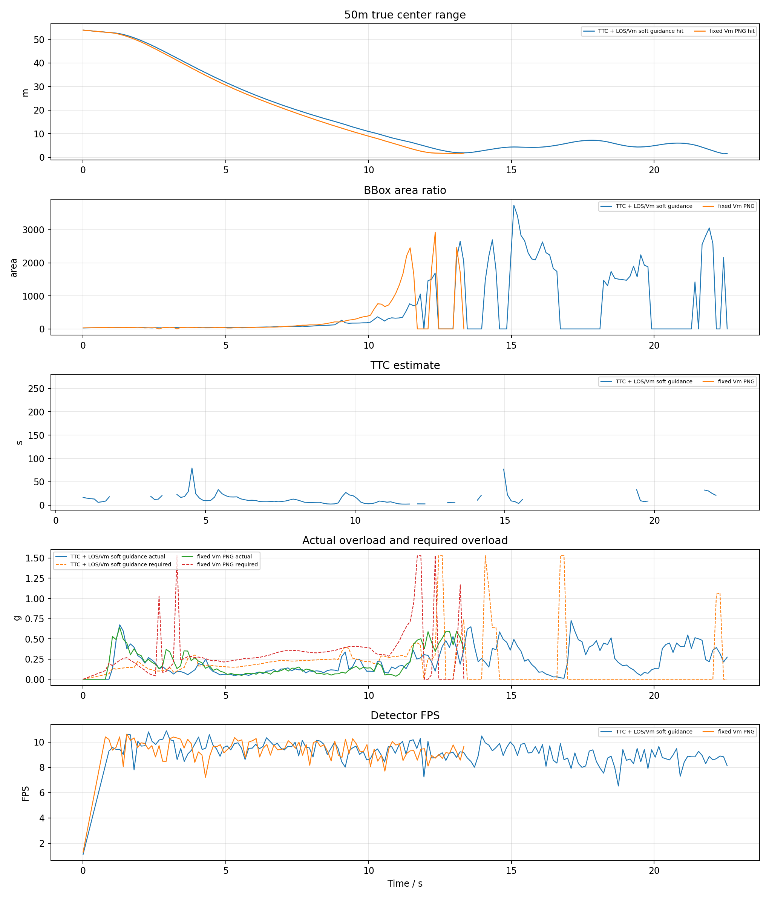
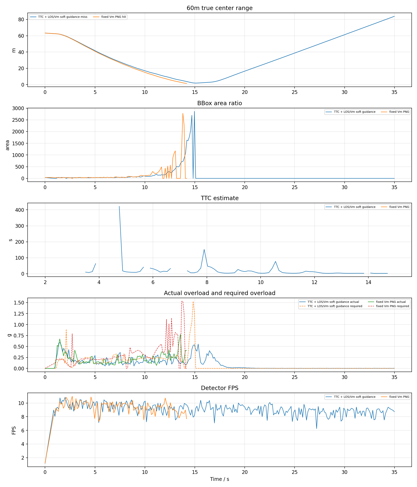
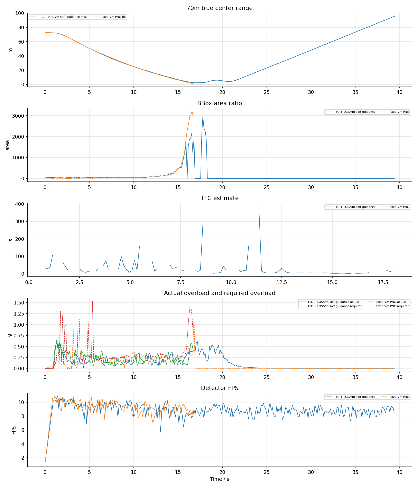
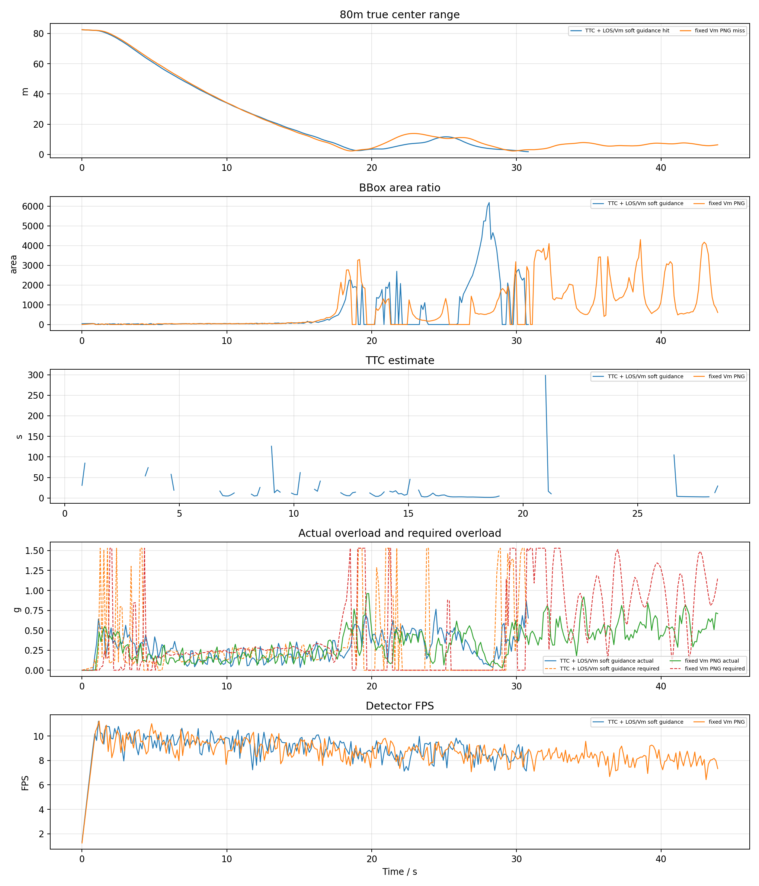
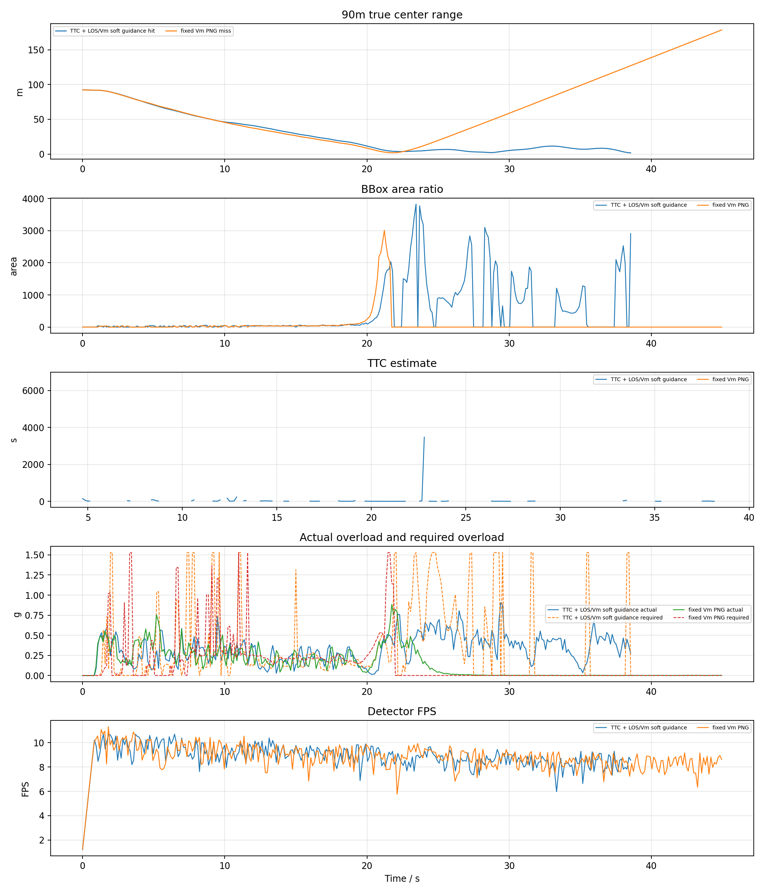
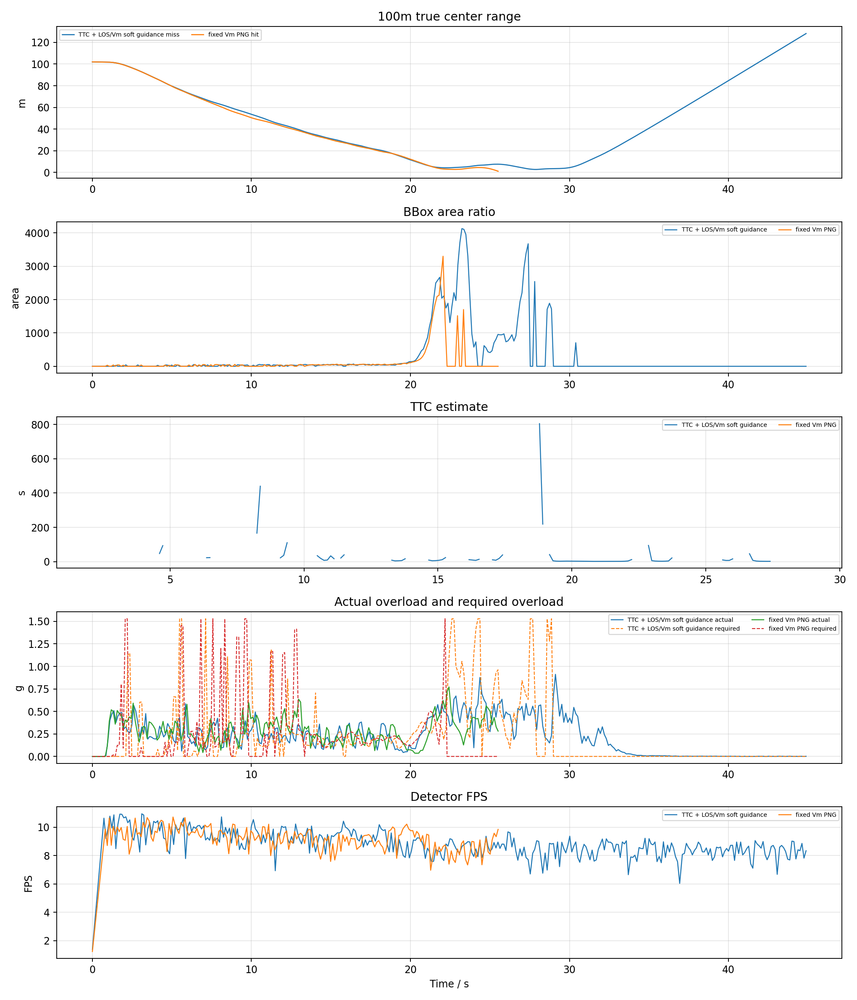
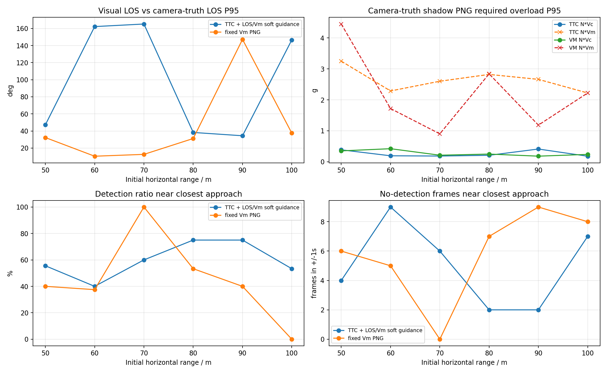

# YOLO + ByteTrack PX4 SITL 加速度过载 PNG TTC / V_m 拦截对比报告

## 1. 实验目的

按照此前已命中的 YOLO 案例配置，改用真正 PX4 SITL actor 场景，比较两种捷联视觉比例导引。本报告优先使用 `n_cmd_g` 作为需用过载；旧日志没有该字段时才回退到 `g_eval` 等效过载。

- `TTC` 组：`ttc_png`，TTC 只参与增益调度，并保留 LOS/Vm soft guidance。
- `VM` 组：`fixed_vm_png`，不使用 TTC，固定 `N * V_m` 导引增益。
- `accel_integral` 输出模式：导引律先计算 `a_cmd` / `n_cmd_g`，再按当前仿真步长积分为速度 setpoint；这不是直接向 PX4 发送加速度 setpoint。
- `accel_body_rate` 输出模式：导引律先计算 PNG 需用加速度，再转换为 PX4 `SET_ATTITUDE_TARGET` 机体系角速度 `p/q/r` 和 thrust；速度只作为沿 LOS 保速参考，不再把 PNG 横向修正直接加到速度指令上。
- `accel_attitude` 输出模式：导引律先计算 PNG 需用加速度，再转换为 PX4 `SET_ATTITUDE_TARGET` 姿态四元数和 thrust；速度只作为沿 LOS 保速参考。

本轮测试 50m、60m、70m、80m、90m、100m，用于验证 AirSim GenericQuad 质量/最大推力 thrust 反解模型。

## 2. 基准条件

|参数|值|
|---|---|
|stamp|`thrustmodel_50_60_20260623_183651`|
|settings|`/home/linux/Documents/PNG/config/airsim_blocks_px4_actor_settings.json`|
|拦截机|`PX4 SITL / mavlink_attitude`|
|目标 actor|`IntruderActor`|
|actor asset|`Quadrotor1`|
|actor scale|`1.0`|
|检测源|`yolo_bytetrack`|
|YOLO model|`vision_guidance/best.pt`|
|YOLO device|`0` runtime `cuda:0`|
|YOLO conf / iou / imgsz|`0.1` / `0.7` / `640`|
|tracker|`bytetrack.yaml`，single target `1`|
|相机外参|`x=0.5, y=0.0, z=0.0`|
|FOV / resolution|`120.0 deg`, `640x480`|
|高度差|`20.0 m`|
|目标速度 / speed ratio|`5.0 m/s` / `2.0`|
|rate_hz|`8.0`|
|guidance output|`accel_attitude`|
|max guidance accel|`15.0 m/s^2`|
|min speed ratio|`0.6`|
|thrust model|`airsim_generic_quad`, mass `1.0 kg`, max total thrust `16.717785072 N`|
|body-rate tilt / attitude P|`20.0 deg` / `4.0`|
|body-rate roll/pitch max rate|`60.0` / `60.0 deg/s`|
|body-rate thrust|min/hover/max `0.25` / `0.5865998371` / `0.95`|
|body-rate speed hold|gain `1.2`, max accel `6.0 m/s^2`, total limit `18.0 m/s^2`|
|attitude tilt / yaw lookahead|`25.0 deg` / `0.25 s`|
|attitude thrust|min/hover/max `0.25` / `0.5865998371` / `0.95`|
|attitude speed hold|gain `1.2`, max accel `6.0 m/s^2`, total limit `18.0 m/s^2`|
|LOS filter|`1`|
|LOS KF q lambda / lambda_dot|`0.0005` / `0.02`|
|LOS KF r / innovation gate|`0.008` / `0.75`|
|LOS terminal gate / delay|`1.2` / `0.18 s`|
|terminal image KF|predict `0.35 s`, reject `0.2 rad`, soft reject `False`|
|terminal image KF dynamics|accel noise `8.0 rad/s^2`, max rate `8.0 rad/s`|
|frame_guard|`True`|
|bbox noise|`0`|

## 3. 总览图



## 4. 汇总表

|组别|命中数|命中距离m|未命中距离m|最小中心距离m|检测帧/总帧|有效帧/总帧|平均检测FPS|
|---|---:|---|---|---:|---:|---:|---:|
|TTC|3/6|50, 80, 90|60, 70, 100|1.463|904/1643|951/1643|9.00|
|VM|4/6|50, 60, 70, 100|80, 90|1.099|799/1226|876/1226|9.12|

## 5. 明细表

|组别|距离m|碰撞|碰撞时间s|最小距离m|终点距离m|检测帧率|有效帧率|YOLO FPS|sim FPS|实际过载max g|速度指令差分P95 g|需用过载P95 g|
|---|---:|---:|---:|---:|---:|---:|---:|---:|---:|---:|---:|---:|
|TTC|50|1|22.56|1.463|1.546|75.9%|63.8%|9.19|7.91|0.73|2.67|0.67|
|VM|50|1|13.34|1.476|1.713|88.2%|95.1%|9.36|7.90|0.64|1.27|1.03|
|TTC|60|0|-|1.836|83.789|40.1%|41.5%|9.06|7.90|0.59|2.59|0.28|
|VM|60|1|14.18|1.464|1.464|88.9%|98.1%|9.33|7.89|0.78|2.64|0.95|
|TTC|70|0|-|2.515|95.381|41.7%|43.0%|8.91|7.89|0.64|2.60|0.31|
|VM|70|1|16.71|1.548|1.548|85.2%|94.5%|9.28|7.90|0.62|2.71|1.14|
|TTC|80|1|30.82|1.758|1.758|72.9%|76.7%|9.09|7.90|0.87|2.66|1.53|
|VM|80|0|-|2.251|6.331|81.5%|75.4%|8.74|7.86|0.96|2.64|1.53|
|TTC|90|1|38.54|1.684|1.684|68.0%|72.3%|8.92|7.89|0.91|2.67|1.53|
|VM|90|0|-|1.919|178.457|33.2%|41.5%|8.84|7.86|0.88|2.63|0.99|
|TTC|100|0|-|2.760|128.158|44.6%|55.4%|8.85|7.87|0.91|2.68|1.12|
|VM|100|1|25.51|1.099|1.099|55.6%|75.8%|9.17|7.91|0.77|2.92|1.42|

## 6. 分距离曲线

每个距离一张图，包含真实中心距离、bbox 面积、TTC 估计、实际过载/需用过载和 YOLO 检测 FPS。








## 7. LOS KF 与失败原因诊断

|组别|距离m|最近距离m|最近点状态|主要失败/降级原因|检测率|有效率|
|---|---:|---:|---|---|---:|---:|
|TTC|50|1.463|`los_innovation_reject`|valid:83, los_innovation_reject:33, no_detection:30, area_not_expanding:14|75.9%|63.8%|
|VM|50|1.476|`valid`|valid:90, image_kf_predict:7, no_detection:5|88.2%|95.1%|
|TTC|60|1.836|`image_kf_predict`|no_detection:159, valid:78, area_not_expanding:29, image_kf_predict:4|40.1%|41.5%|
|VM|60|1.464|`image_kf_predict`|valid:96, image_kf_predict:10, no_detection:2|88.9%|98.1%|
|TTC|70|2.515|`image_kf_predict`|no_detection:171, valid:89, area_not_expanding:30, image_kf_predict:9|41.7%|43.0%|
|VM|70|1.548|`valid`|valid:109, image_kf_predict:12, no_detection:7|85.2%|94.5%|
|TTC|80|1.758|`image_kf_predict`|valid:85, area_not_expanding:64, no_detection:35, image_kf_predict:31|72.9%|76.7%|
|VM|80|2.251|`valid`|valid:229, los_innovation_reject:47, no_detection:37, image_kf_predict:28|81.5%|75.4%|
|TTC|90|1.684|`los_innovation_reject`|valid:87, area_not_expanding:72, no_detection:49, image_kf_predict:49|68.0%|72.3%|
|VM|90|1.919|`image_kf_predict`|no_detection:204, valid:116, image_kf_predict:29|33.2%|41.5%|
|TTC|100|2.760|`valid`|no_detection:155, valid:87, area_not_expanding:62, image_kf_predict:39|44.6%|55.4%|
|VM|100|1.099|`no_detection`|valid:108, no_detection:46, image_kf_predict:42, los_innovation_reject:2|55.6%|75.8%|

- LOS KF 参数：`q_lambda=0.0005`、`q_lambda_dot=0.02`、`r=0.008`、`innovation_reject=0.75`、`terminal_reject=1.2`。
- 未命中但最近距离小于等于 3m 的工况：TTC 60m(1.836m)，TTC 70m(2.515m)，VM 80m(2.251m)，VM 90m(1.919m)，TTC 100m(2.760m)。这些工况已接近目标，但没有触发 AirSim 碰撞判定，后续应重点看末端视场保持、外推和碰撞几何。
- 检测率低于 60% 的工况：TTC 60m(40.1%)，TTC 70m(41.7%)，VM 90m(33.2%)，TTC 100m(44.6%)，VM 100m(55.6%)。这类失败优先归因于 YOLO/ByteTrack 连续性和固定相机视场保持，而不是导引律公式本身。
- 最近点处仍处于降级或无效状态的未命中工况：TTC 60m:`image_kf_predict`，TTC 70m:`image_kf_predict`，VM 90m:`image_kf_predict`。这些样本说明末端质量门、视觉外推和 bbox 裁切处理仍会影响命中窗口。
- 本轮平均实际过载峰值约 `0.77 g`，平均需用过载 P95 约 `1.04 g`。两者不是同一个量：`n_cmd_g` 是导引层需求，实际过载还受 PX4 姿态/推力限制、YOLO 约 9 FPS 采样和 frame centering 限速影响。

## 8. 相机光心真值影子测试诊断



影子测试不参与导引，只用日志中的相机光心 `camera_world_*` 与目标真值位置离线计算经典 `N*Vc` 和固定 `N*Vm` PNG 理论需用过载，并和视觉 LOS、检测连续性对齐。

|组别|距离m|碰撞|最小距离m|最近点检测率|最近点无检测帧|视觉LOS误差P95|影子N*Vc P95 g|影子N*Vm P95 g|视觉需用P95 g|实际过载max g|
|---|---:|---:|---:|---:|---:|---:|---:|---:|---:|---:|
|TTC|50|1|1.463|55.6%|4/9|38.5|0.38|3.25|0.67|0.73|
|VM|50|1|1.476|40.0%|6/10|59.5|0.35|4.45|1.03|0.64|
|TTC|60|0|1.836|40.0%|9/15|71.9|0.19|2.29|0.28|0.59|
|VM|60|1|1.464|37.5%|5/8|22.9|0.42|1.72|0.95|0.78|
|TTC|70|0|2.515|60.0%|6/15|53.7|0.18|2.60|0.31|0.64|
|VM|70|1|1.548|100.0%|0/8|26.2|0.21|0.90|1.14|0.62|
|TTC|80|1|1.758|75.0%|2/8|36.9|0.21|2.82|1.53|0.87|
|VM|80|0|2.251|53.3%|7/15|17.8|0.25|2.84|1.53|0.96|
|TTC|90|1|1.684|75.0%|2/8|18.8|0.41|2.66|1.53|0.91|
|VM|90|0|1.919|40.0%|9/15|92.9|0.18|1.18|0.99|0.88|
|TTC|100|0|2.760|53.3%|7/15|51.3|0.18|2.22|1.12|0.91|
|VM|100|1|1.099|0.0%|8/8|65.8|0.24|2.22|1.42|0.77|

- 如果影子 `N*Vc` P95 很低但视觉 LOS 误差和无检测帧较高，优先定位检测连续性、LOS KF/外推和 frame-centering。
- 如果视觉需用过载高而实际过载低，优先定位 PX4 姿态/推力响应、倾角限制和 speed-hold 混合项。

## 9. PNG 到过载、姿态和角速度的控制流程

当前批测默认 `guidance_output=accel_attitude`、`px4_command_mode=mavlink_attitude`，因此实际链路是“PNG 需用加速度 -> 姿态四元数 + thrust”，不是直接向 PX4 发送角速度。项目中仍保留 `accel_body_rate + mavlink_body_rate`，该模式才是“PNG 需用加速度 -> 机体系角速度 p/q/r + thrust”。

### 9.1 视觉量到 6D LOS

YOLOv8 + ByteTrack 输出 `bbox center=(u,v)`、`bbox area`、`track_id` 和置信度。bbox 中心先通过相机内参转换成相机坐标系单位射线：

```text
x_n = (u - cx) / fx
y_n = (v - cy) / fy
lambda_C = normalize([x_n, y_n, 1])
```

再使用相机外参和机体姿态转到惯性系：

```text
lambda_I = normalize(R_IB * R_BC * lambda_C)
```

其中 `R_BC` 是相机到机体的固定安装旋转，`R_IB` 是机体到惯性系的姿态。LOS 角速度由相邻 LOS 差分并投影到垂直 LOS 的平面得到：

```text
lambda_dot = project_perpendicular((lambda_I[k] - lambda_I[k-1]) / dt, lambda_I[k])
omega_LOS = lambda_I x lambda_dot
```

启用 LOS KF 时，滤波器输出平滑后的 `lambda_I` 和 `omega_LOS`；末端允许更松的 innovation gate，避免目标仍在检测框内时 PNG 加速度被过早清零。

### 9.2 PNG 生成需用加速度和需用过载

两种导引的共同输出都是导引层需用加速度 `a_cmd`：

```text
a_cmd = guidance_gain * (omega_LOS x lambda_I)
a_cmd = clip_norm(a_cmd, max_guidance_accel_mps2)
n_cmd_g = ||a_cmd|| / g
```

`omega_LOS x lambda_I` 给出垂直于视线的修正方向；`n_cmd_g` 是导引层需用过载，只表示 PNG 希望产生的机动强度。它不等于无人机真实过载，真实过载还受 PX4 姿态控制、推力限制、速度保持项、视觉帧率和 frame centering 限速影响。

TTC 组使用 bbox 面积扩张估计 `TTC ~= A / A_dot`，当前只把 TTC 用作增益调度和末端触发；当 TTC 无效但 LOS 有效时，仍保留 LOS/V_m soft guidance。V_m 组不使用 TTC，直接采用固定：

```text
guidance_gain = N * V_m
V_m = speed_ratio * intruder_speed
```

### 9.3 与速度保持项合成

在 `accel_attitude` 和 `accel_body_rate` 中，PNG 横向修正不再积分成速度指令。速度只作为沿 LOS 的保速参考：

```text
v_ref = speed_cap * lambda_I
a_speed_hold = K_v * (v_ref - v_current)
a_control_I = clip_norm(a_cmd + a_speed_hold, total_accel_limit)
```

`a_cmd` 是纯 PNG 需用加速度；`a_speed_hold` 是工程闭环项，用于避免飞机速度掉到无法追击或过度横向漂移。报告中的 `n_cmd_g` 仍来自 `a_cmd`，而 `attitude_control_accel_*` / `body_rate_control_accel_*` 记录合成后的控制加速度。

### 9.4 加速度到姿态四元数，本轮默认链路

当前批测使用 `accel_attitude + mavlink_attitude`。程序先由图像中心误差和 LOS 水平投影得到期望航向：

```text
yaw_sp = current_yaw + yaw_rate_cmd * attitude_yaw_lookahead_s
```

随后把惯性系合成加速度旋转到期望 yaw 对应的水平坐标系：

```text
a_yaw_body = R_z(yaw_sp)^T * a_control_I
```

再用小角度近似得到姿态 setpoint：

```text
pitch_sp = -a_yaw_body.x / g
roll_sp  =  a_yaw_body.y / g
```

roll/pitch 按 `attitude_max_tilt_deg` 限幅，然后和 `yaw_sp` 合成为姿态四元数：

```text
R_sp = R_z(yaw_sp) * R_y(pitch_sp) * R_x(roll_sp)
q_sp = quat(R_sp)
```

垂向加速度通过 AirSim GenericQuad 质量和最大推力参数换算成归一化 thrust 的线性近似：

```text
thrust = hover_thrust + thrust_gain * (-a_control_I.z / g)
thrust = clamp(thrust, min_thrust, max_thrust)
```

最后通过 MAVLink `SET_ATTITUDE_TARGET` 发送：

```text
type_mask = BODY_ROLL_RATE_IGNORE | BODY_PITCH_RATE_IGNORE | BODY_YAW_RATE_IGNORE
q = q_sp
body rates = 0
thrust = thrust
```

PX4 在 Offboard 下跟踪姿态四元数和 thrust，内部姿态/角速度控制器再驱动电机模型。

### 9.5 加速度到机体系角速度，备用链路

若显式设置 `GUIDANCE_OUTPUT_MODE=accel_body_rate`、`PX4_COMMAND_MODE=mavlink_body_rate`，程序会先把 `a_control_I` 转到机体系：

```text
a_control_B = R_BI * a_control_I
```

再用小角度近似得到期望 roll/pitch：

```text
roll_sp  =  body_rate_roll_gain  * a_control_B.y / g
pitch_sp = -body_rate_pitch_gain * a_control_B.x / g
```

姿态误差通过比例环变成机体系角速度：

```text
p_cmd = K_att * (roll_sp  - roll)
q_cmd = K_att * (pitch_sp - pitch)
r_cmd = yaw_rate_cmd
```

再按最大 roll/pitch/yaw rate 限幅。MAVLink 发送仍使用 `SET_ATTITUDE_TARGET`，但 `type_mask` 忽略姿态四元数，只让 PX4 接收 `body_roll_rate/body_pitch_rate/body_yaw_rate` 和 thrust。

### 9.6 本报告中过载曲线的含义

- `需用过载 n_cmd_g`：由 PNG 的 `a_cmd` 直接换算，是导引层希望产生的过载。
- `实际过载 max g`：由拦截机真实速度差分估计，体现 PX4 和 AirSim 动力学真正实现出的机动。
- `速度指令差分 P95 g`：兼容旧速度输出模式的指标，本轮 `accel_attitude` 下主要作为参考，不代表直接发送给 PX4 的控制量。

因此，若 `n_cmd_g` 很平滑但实际过载不足，问题通常在姿态/推力响应、速度保持、限幅或视觉低帧率；若 `n_cmd_g` 本身突变，则应优先检查 LOS/KF、bbox 裁切、丢检外推和 frame guard 状态切换。

## 10. 结论

- TTC: 命中 `3/6`，命中距离 `50m, 80m, 90m`，未命中 `60m, 70m, 100m`，检测帧比例 `55.0%`，有效导引帧比例 `57.9%`，平均检测 FPS `9.00`。
- VM: 命中 `4/6`，命中距离 `50m, 60m, 70m, 100m`，未命中 `80m, 90m`，检测帧比例 `65.2%`，有效导引帧比例 `71.5%`，平均检测 FPS `9.12`。
- 本轮使用真实 YOLOv8 + ByteTrack，因此检测连续性和 GPU 推理速度会直接进入闭环；结果不能和 AirSim detect 函数的理想 bbox 直接等价比较。
- `accel_integral` 模式的 `n_cmd_g` 来自导引层 `a_cmd`，底层仍通过 PX4/AirSim 速度 setpoint 闭环；实际过载由真实速度差分估计，因此会同时受 PX4 响应、速度限幅和视觉帧率影响。
- `accel_body_rate` 模式下 `n_cmd_g` 仍表示纯 PNG 需用过载；实际发送给 PX4 的是 `SET_ATTITUDE_TARGET` 机体系 `p/q/r` 角速度和归一化 thrust，日志中的 `body_rate_control_accel_*` 额外包含沿 LOS 的速度保持加速度。
- `accel_attitude` 模式下 `n_cmd_g` 同样表示纯 PNG 需用过载；实际发送给 PX4 的是 `SET_ATTITUDE_TARGET` 姿态四元数和归一化 thrust，日志中的 `attitude_control_accel_*` 记录姿态指令生成前的合成加速度。
