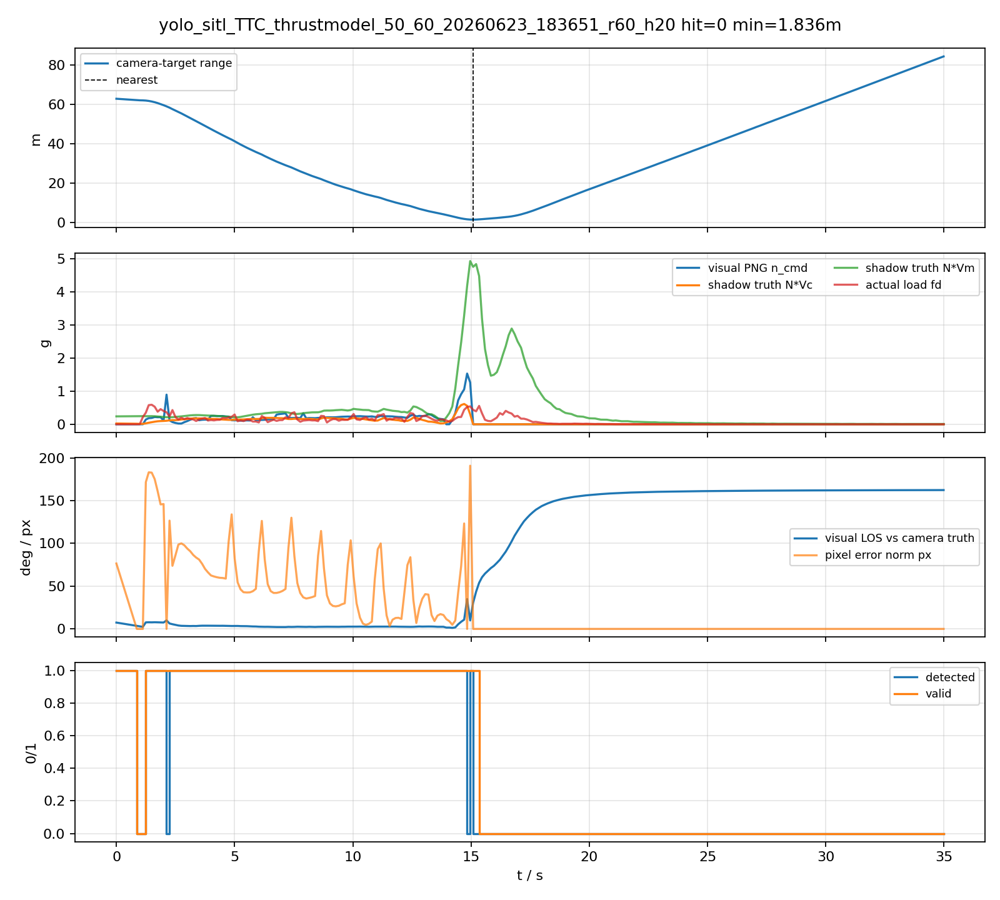
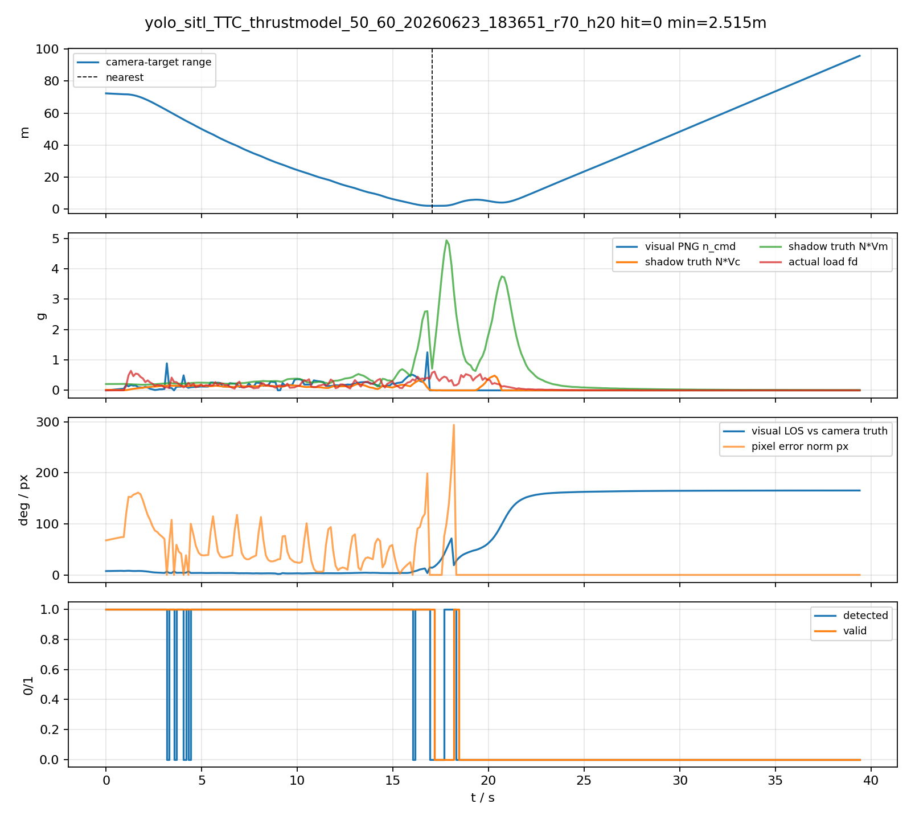
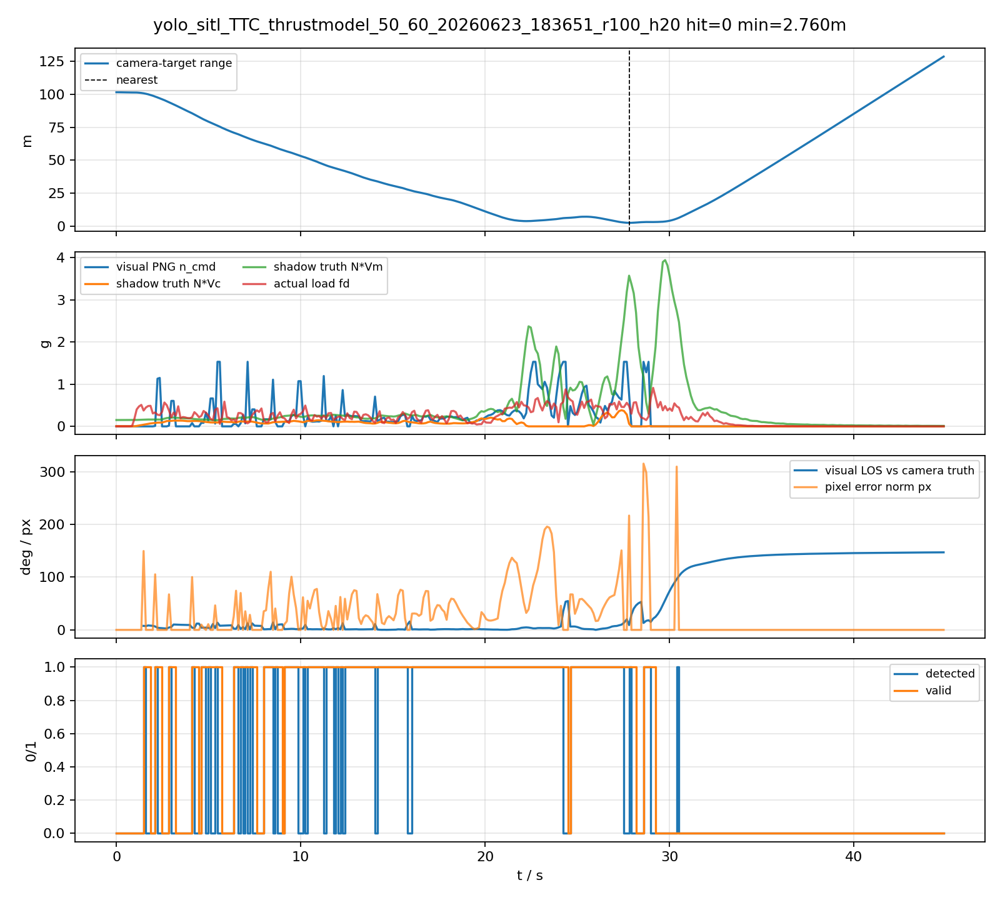
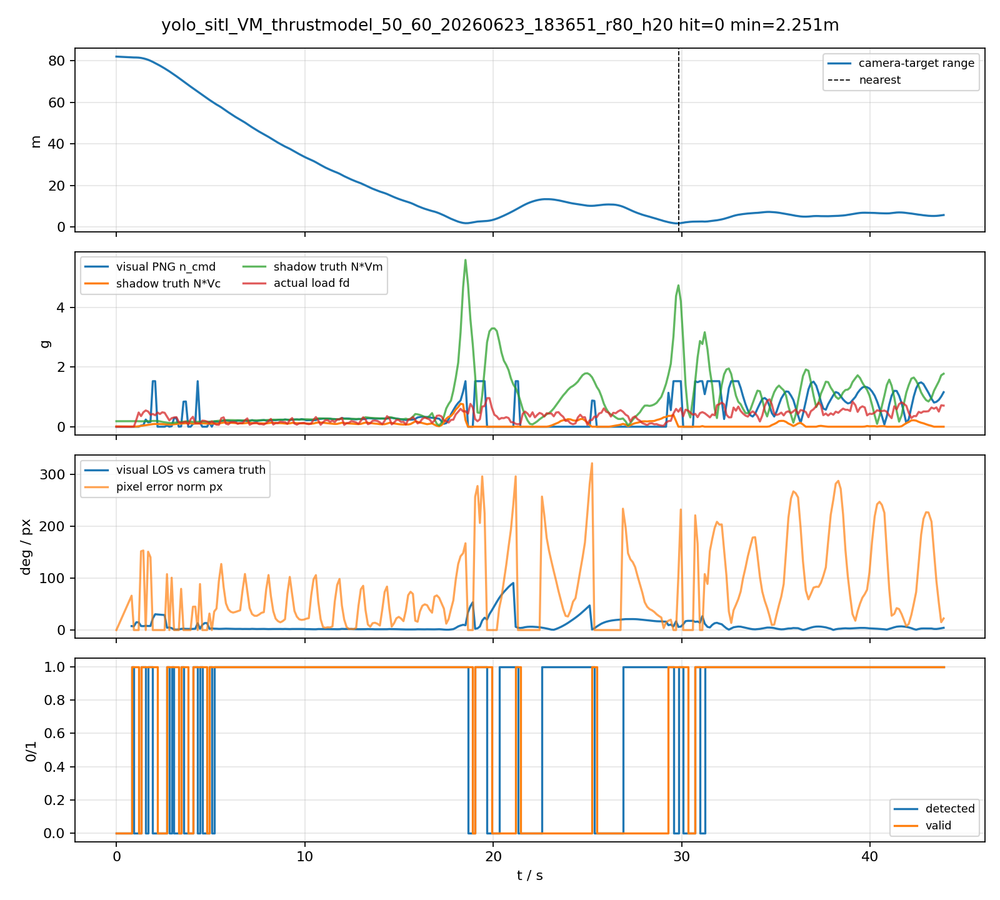
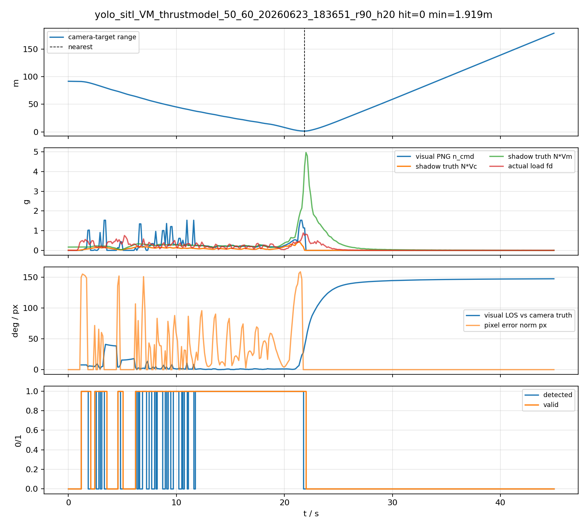

# YOLO SITL ThrustModel 影子测试诊断

本诊断不重跑仿真，只读取最后一组实验 CSV。影子测试使用相机光心 `camera_world_*` 到目标原点的真值相对位置，通过有限差分得到相对速度，离线计算经典 `N*Vc` PNG 和固定 `N*Vm` PNG 的理论需用过载。

## 1. 结论摘要

- 未命中的近失工况多数不是理论 PNG 过载需求过高造成的：相机真值影子 `N*Vc` 的 P95 多在 `0.16-0.23g`，明显低于视觉 PNG 经常打到的 `1.53g` 限幅。

- 主要问题集中在末端视觉连续性和视场保持：最近点前后 0.5-1s 内，经常有 4-9 帧无检测，状态进入 `loss_hold` / `terminal_capture` / `image_kf_predict`，导致航向和垂向修正不能稳定闭环。

- 实际过载峰值约 `0.55-0.96g`，低于视觉需用过载上限，说明 PX4 姿态/推力响应、倾角限制、速度保持项和低视觉帧率共同限制了末端机动。

- 视觉 LOS 与相机真值 LOS 在部分失败工况中偏差很大，尤其 TTC 60/70/100 和 VM 90，全程或末端 P95 可达几十度到 90 度以上；这说明 YOLO/ByteTrack 断续、LOS KF/外推和目标重获会污染 LOS。

## 2. 汇总表

|case|hit|min_range_body_m|final_range_body_m|detected_ratio|valid_ratio|near_detected_ratio|near_valid_ratio|visual_n_p95_g|actual_max_g|shadow_vc_p95_g|shadow_vm_p95_g|near_los_error_p95_deg|near_no_detection_frames|near_frames|
|---|---:|---:|---:|---:|---:|---:|---:|---:|---:|---:|---:|---:|---:|---:|
|yolo_sitl_TTC_thrustmodel_50_60_20260623_183651_r50_h20|1|1.463|1.546|75.9%|63.8%|55.6%|33.3%|0.674|0.727|0.384|3.251|38.532|4|9|
|yolo_sitl_VM_thrustmodel_50_60_20260623_183651_r50_h20|1|1.476|1.713|88.2%|95.1%|40.0%|70.0%|1.025|0.644|0.350|4.452|59.493|6|10|
|yolo_sitl_TTC_thrustmodel_50_60_20260623_183651_r60_h20|0|1.836|83.789|40.1%|41.5%|40.0%|60.0%|0.282|0.589|0.191|2.287|71.906|9|15|
|yolo_sitl_VM_thrustmodel_50_60_20260623_183651_r60_h20|1|1.464|1.464|88.9%|98.1%|37.5%|75.0%|0.946|0.778|0.421|1.718|22.907|5|8|
|yolo_sitl_TTC_thrustmodel_50_60_20260623_183651_r70_h20|0|2.515|95.381|41.7%|43.0%|60.0%|53.3%|0.310|0.642|0.184|2.602|53.741|6|15|
|yolo_sitl_VM_thrustmodel_50_60_20260623_183651_r70_h20|1|1.548|1.548|85.2%|94.5%|100.0%|100.0%|1.143|0.616|0.210|0.901|26.237|0|8|
|yolo_sitl_TTC_thrustmodel_50_60_20260623_183651_r80_h20|1|1.758|1.758|72.9%|76.7%|75.0%|100.0%|1.530|0.870|0.207|2.822|36.907|2|8|
|yolo_sitl_VM_thrustmodel_50_60_20260623_183651_r80_h20|0|2.251|6.331|81.5%|75.4%|53.3%|60.0%|1.530|0.961|0.247|2.841|17.836|7|15|
|yolo_sitl_TTC_thrustmodel_50_60_20260623_183651_r90_h20|1|1.684|1.684|68.0%|72.3%|75.0%|25.0%|1.530|0.905|0.410|2.662|18.750|2|8|
|yolo_sitl_VM_thrustmodel_50_60_20260623_183651_r90_h20|0|1.919|178.457|33.2%|41.5%|40.0%|53.3%|0.988|0.884|0.179|1.184|92.935|9|15|
|yolo_sitl_TTC_thrustmodel_50_60_20260623_183651_r100_h20|0|2.760|128.158|44.6%|55.4%|53.3%|80.0%|1.119|0.912|0.178|2.222|51.336|7|15|
|yolo_sitl_VM_thrustmodel_50_60_20260623_183651_r100_h20|1|1.099|1.099|55.6%|75.8%|0.0%|0.0%|1.420|0.772|0.236|2.222|65.778|8|8|

## 3. 未命中工况诊断图

### yolo_sitl_TTC_thrustmodel_50_60_20260623_183651_r60_h20

### yolo_sitl_TTC_thrustmodel_50_60_20260623_183651_r70_h20

### yolo_sitl_TTC_thrustmodel_50_60_20260623_183651_r100_h20

### yolo_sitl_VM_thrustmodel_50_60_20260623_183651_r80_h20

### yolo_sitl_VM_thrustmodel_50_60_20260623_183651_r90_h20

## 4. 数据文件

- 汇总 CSV：`logs/yolo_sitl_ttc_vm/shadow_truth_required_load/camera_shadow_thrustmodel_50_100_summary.csv`

- 逐帧 CSV 目录：`logs/yolo_sitl_ttc_vm/shadow_truth_required_load`
