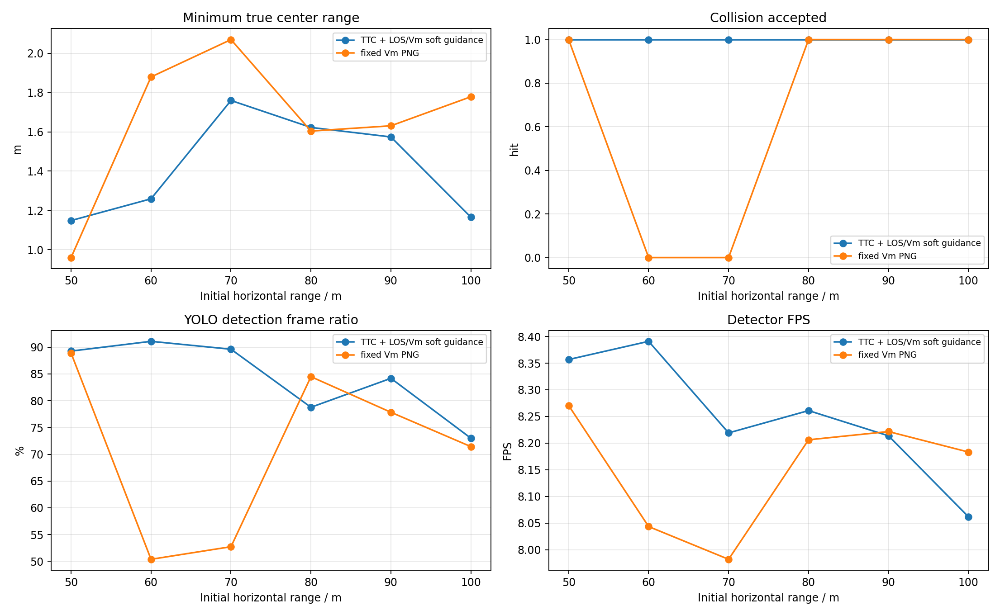
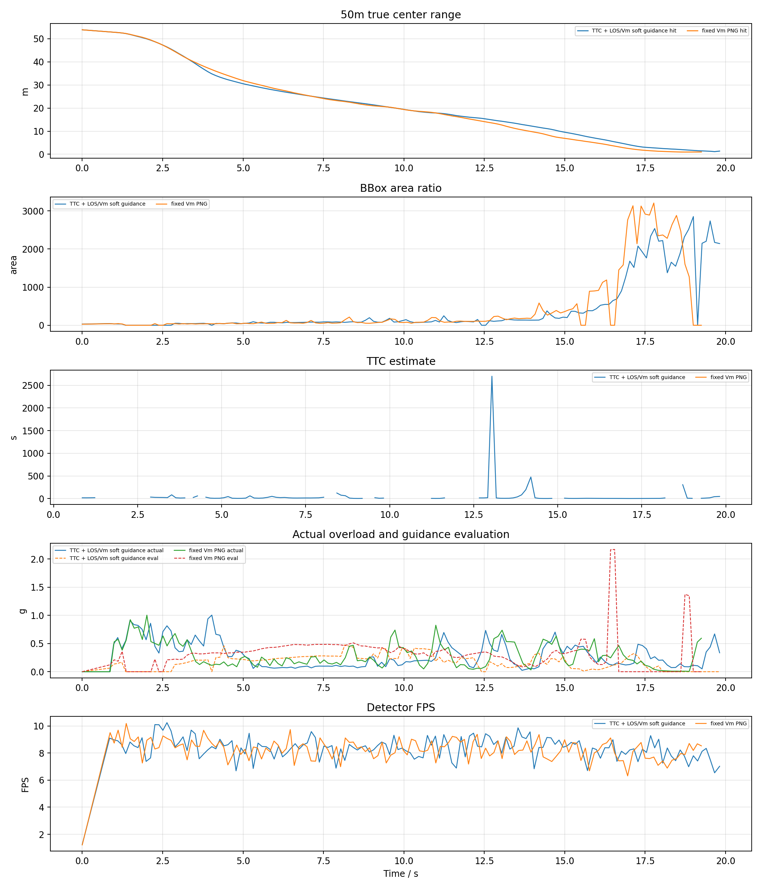
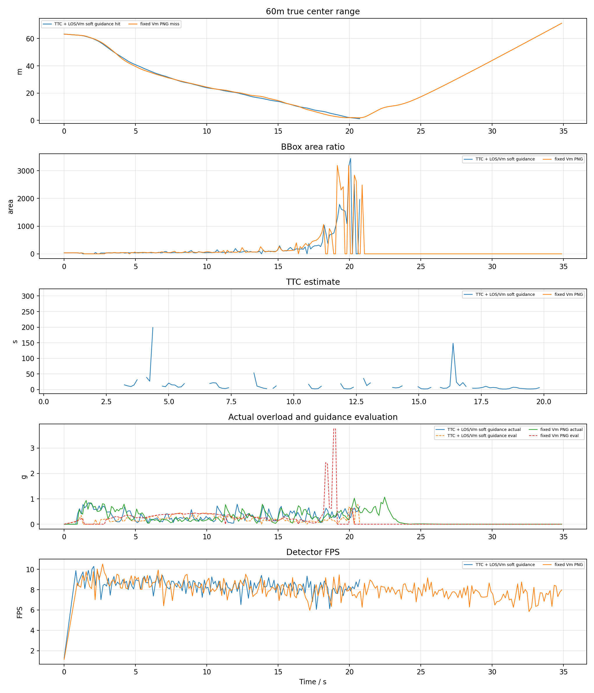
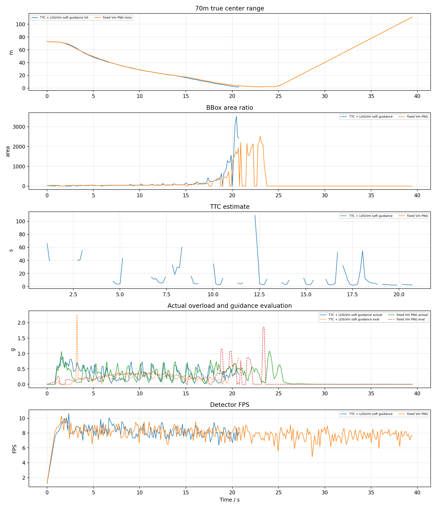
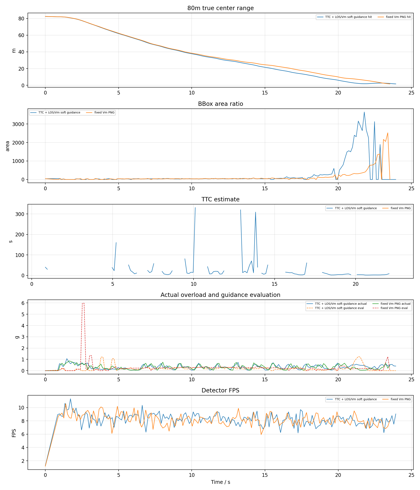
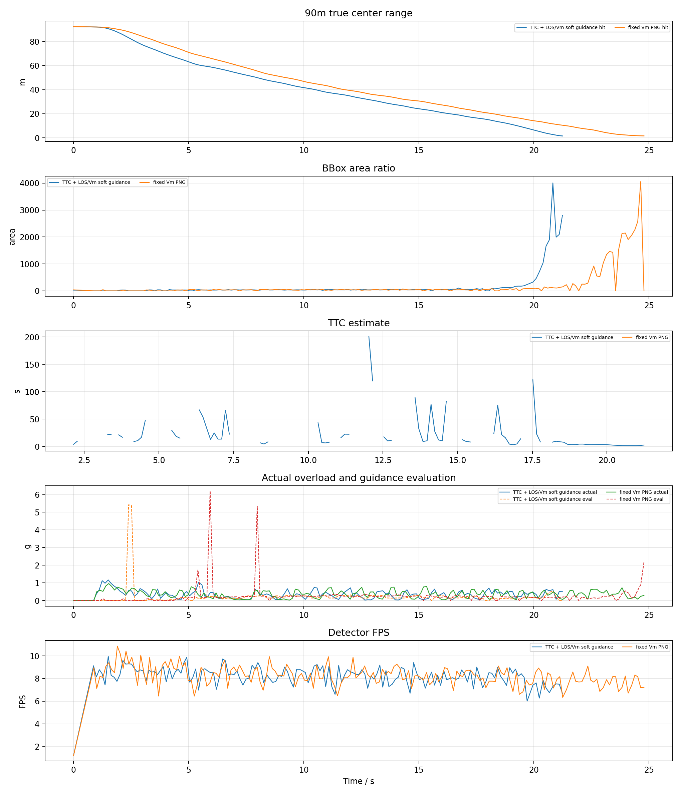
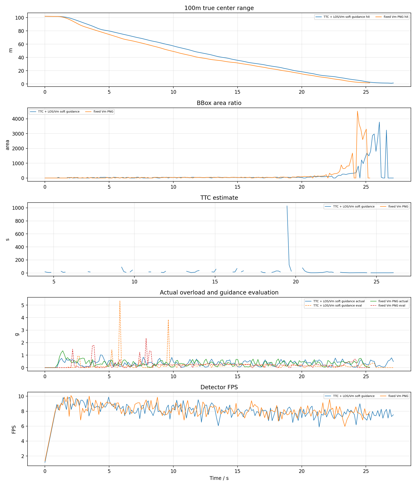

# YOLO + ByteTrack PX4 SITL frame_centering tuned 50-100m 测试报告

## 1. 实验目的

按照此前已命中的 YOLO 案例配置，改用真正 PX4 SITL actor 场景，比较两种捷联视觉比例导引：

- `TTC` 组：`ttc_png`，TTC 只参与增益调度，并保留 LOS/Vm soft guidance。
- `VM` 组：`fixed_vm_png`，不使用 TTC，固定 `N * V_m` 导引增益。

放宽速度版本：TTC 和 V_m 均测试 50m、60m、70m、80m、90m、100m；关闭 AirSim detect 影子测试。

## 2. 基准条件

|参数|值|
|---|---|
|stamp|`frame_centering_tuned_50_100_20260621_060648`|
|settings|`/home/linux/Documents/PNG/config/airsim_blocks_px4_actor_clock0p2_settings.json`|
|拦截机|`PX4 SITL / velocity_yaw_rate`|
|目标 actor|`IntruderActor`|
|actor asset|`Quadrotor1`|
|actor scale|`1.0`|
|检测源|`yolo_bytetrack`|
|YOLO model|`vision_guidance/best.pt`|
|YOLO device|`0` runtime `cuda:0`|
|YOLO conf / iou / imgsz|`0.1` / `0.7` / `640`|
|tracker|`bytetrack.yaml`，single target `1`|
|相机外参|`x=0.5, y=0.0, z=0.0`|
|FOV / resolution|`120.0 deg`, `640x480`|
|高度差|`20.0 m`|
|目标速度 / speed ratio|`5.0 m/s` / `2.0`|
|rate_hz|`8.0`|
|LOS filter|`1`|
|frame_guard|`True`|
|bbox noise|`0`|

## 3. 总览图

## 4. 汇总表

|组别|命中数|命中距离m|未命中距离m|最小中心距离m|检测帧/总帧|有效帧/总帧|平均检测FPS|
|---|---:|---|---|---:|---:|---:|---:|
|TTC|6/6|50, 60, 70, 80, 90, 100|-|1.149|834/997|894/997|8.25|
|VM|4/6|50, 80, 90, 100|60, 70|0.961|838/1242|923/1242|8.15|

## 5. 明细表

|组别|距离m|碰撞|碰撞时间s|最小距离m|终点距离m|检测帧率|有效帧率|YOLO FPS|sim FPS|实际过载max g|指令P95 g|导引评估P95 g|
|---|---:|---:|---:|---:|---:|---:|---:|---:|---:|---:|---:|---:|
|TTC|50|1|19.82|1.149|1.378|89.3%|84.6%|8.36|7.73|1.00|3.07|0.41|
|VM|50|1|19.25|0.961|0.996|88.9%|84.0%|8.27|7.70|1.00|3.48|0.49|
|TTC|60|1|20.72|1.259|1.259|91.1%|94.3%|8.39|7.77|0.84|3.41|0.44|
|VM|60|0|-|1.879|71.228|50.4%|53.9%|8.04|7.56|1.07|2.81|0.42|
|TTC|70|1|20.72|1.759|1.759|89.6%|93.5%|8.22|7.65|0.89|3.41|0.36|
|VM|70|0|-|2.069|111.197|52.7%|55.8%|7.98|7.54|1.08|3.06|0.55|
|TTC|80|1|23.93|1.622|1.622|78.8%|89.4%|8.26|7.66|1.06|3.06|0.50|
|VM|80|1|23.53|1.604|1.604|84.5%|96.0%|8.21|7.61|0.86|3.00|0.38|
|TTC|90|1|21.24|1.574|1.574|84.2%|89.2%|8.21|7.66|1.17|2.92|0.31|
|VM|90|1|24.78|1.631|1.631|77.8%|89.7%|8.22|7.65|0.97|3.12|0.36|
|TTC|100|1|27.14|1.166|1.494|73.0%|87.5%|8.06|7.57|1.02|2.87|0.28|
|VM|100|1|25.30|1.778|1.778|71.4%|88.4%|8.18|7.63|1.35|2.78|0.58|

## 6. 分距离曲线

每个距离一张图，包含真实中心距离、bbox 面积、TTC 估计、实际过载/导引评估过载和 YOLO 检测 FPS。

## 7. 结论

- TTC: 命中 `6/6`，命中距离 `50m, 60m, 70m, 80m, 90m, 100m`，未命中 `-`，检测帧比例 `83.7%`，有效导引帧比例 `89.7%`，平均检测 FPS `8.25`。
- VM: 命中 `4/6`，命中距离 `50m, 80m, 90m, 100m`，未命中 `60m, 70m`，检测帧比例 `67.5%`，有效导引帧比例 `74.3%`，平均检测 FPS `8.15`。
- 本轮使用真实 YOLOv8 + ByteTrack，因此检测连续性和 GPU 推理速度会直接进入闭环；结果不能和 AirSim detect 函数的理想 bbox 直接等价比较。
