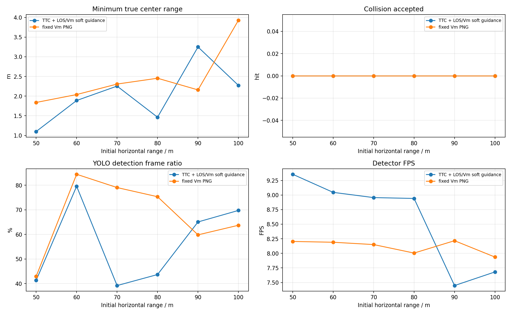
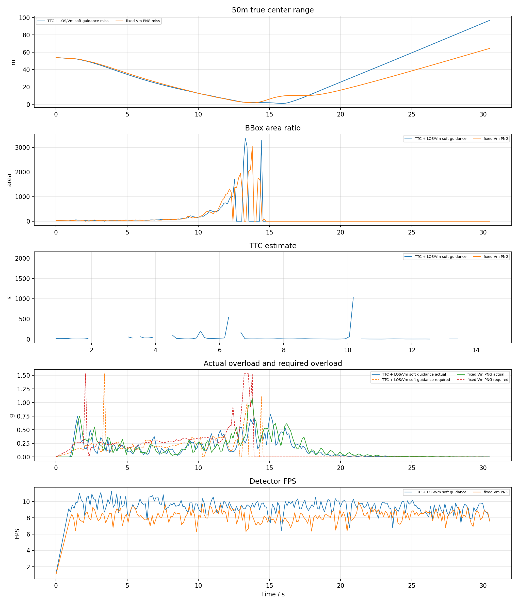
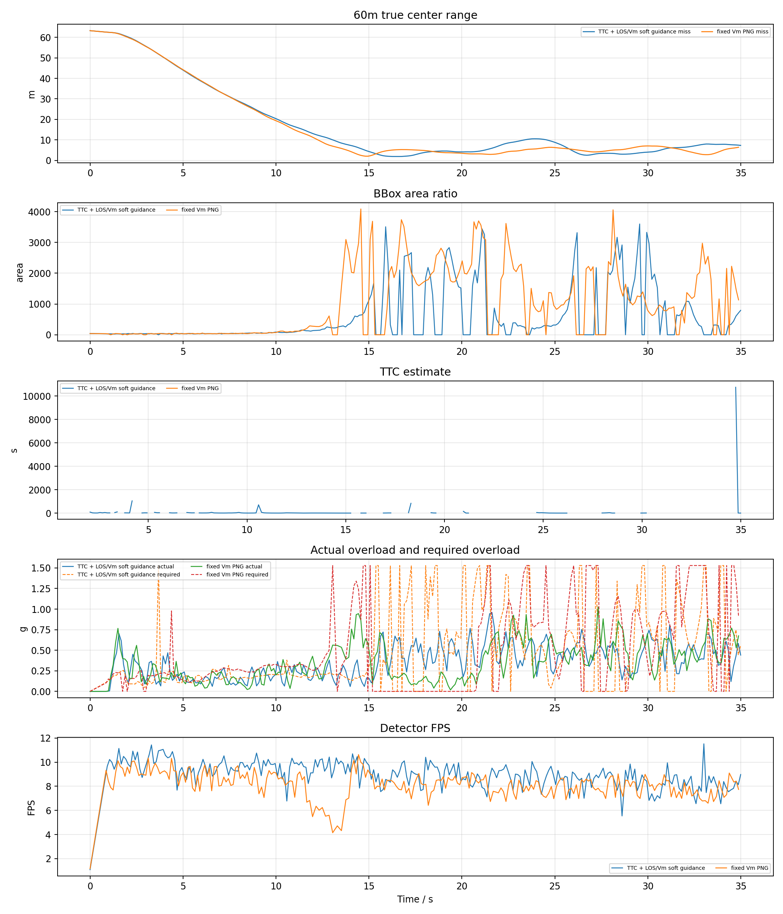
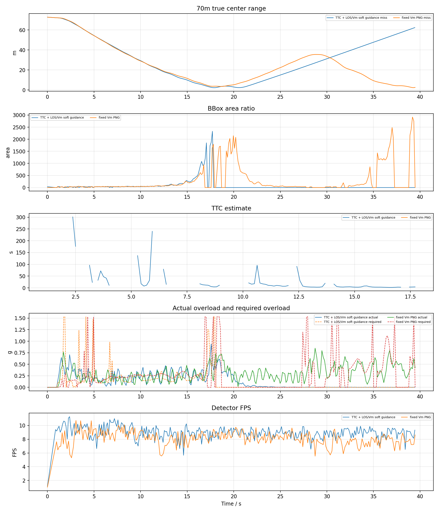
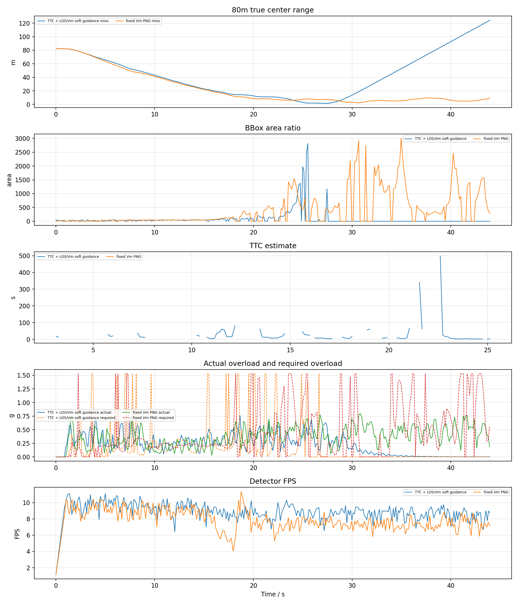
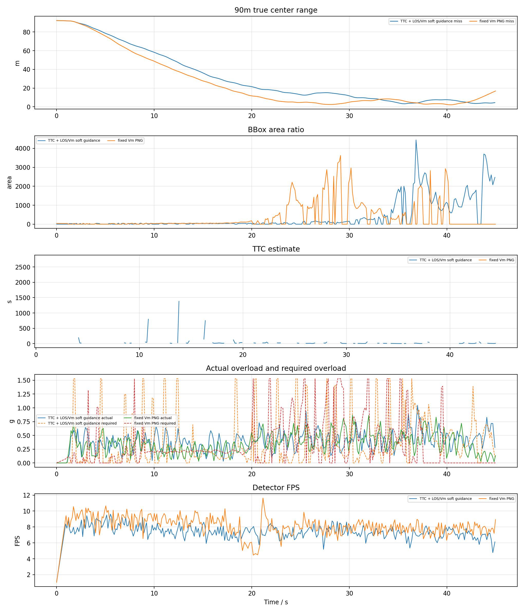
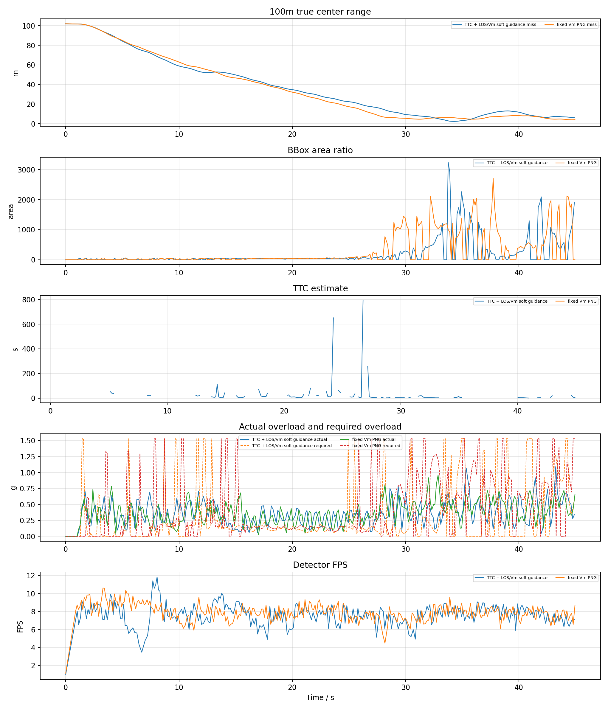
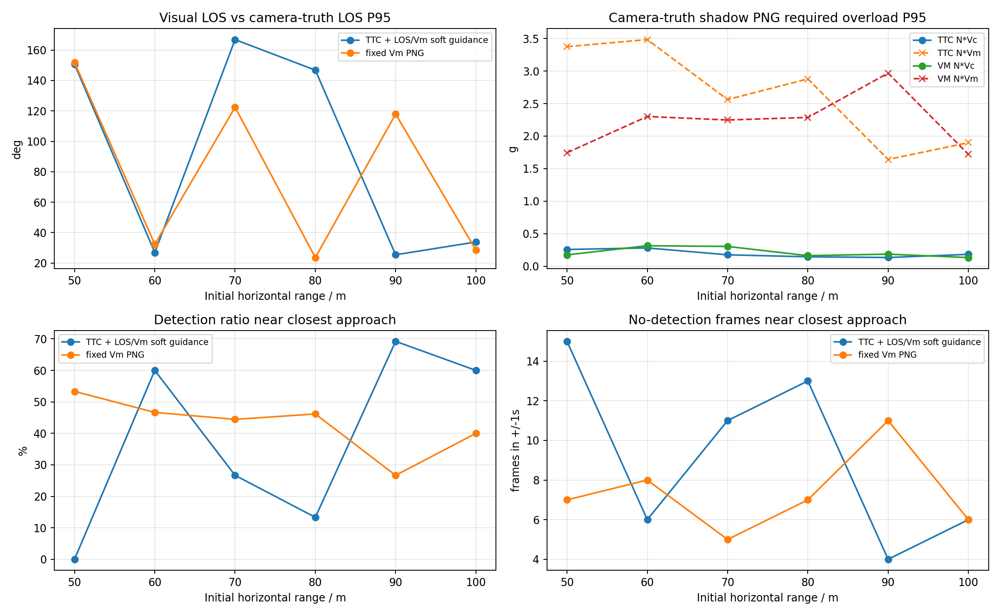

# YOLO + ByteTrack PX4 SITL hybrid_v2 body-rate TTC / V_m 50-100m 测试报告

## 1. 实验目的

按照此前已命中的 YOLO 案例配置，改用真正 PX4 SITL actor 场景，比较两种捷联视觉比例导引。本报告优先使用 `n_cmd_g` 作为需用过载；旧日志没有该字段时才回退到 `g_eval` 等效过载。

- `TTC` 组：`ttc_png`，TTC 只参与增益调度，并保留 LOS/Vm soft guidance。
- `VM` 组：`fixed_vm_png`，不使用 TTC，固定 `N * V_m` 导引增益。
- `accel_integral` 输出模式：导引律先计算 `a_cmd` / `n_cmd_g`，再按当前仿真步长积分为速度 setpoint；这不是直接向 PX4 发送加速度 setpoint。
- `accel_body_rate` 输出模式：导引律先计算 PNG 需用加速度，再转换为 PX4 `SET_ATTITUDE_TARGET` 机体系角速度 `p/q/r` 和 thrust；速度只作为沿 LOS 保速参考，不再把 PNG 横向修正直接加到速度指令上。
- `accel_attitude` 输出模式：导引律先计算 PNG 需用加速度，再转换为 PX4 `SET_ATTITUDE_TARGET` 姿态四元数和 thrust；速度只作为沿 LOS 保速参考。

本轮使用 accel_body_rate + mavlink_body_rate + body_rate_control_profile=hybrid_v2，测试 TTC 与 V_m 在 50m、60m、70m、80m、90m、100m 的拦截结果。

## 2. 基准条件

|参数|值|
|---|---|
|stamp|`hybrid_v2_bodyrate_20260627_075340`|
|settings|`/home/linux/Documents/PNG/config/airsim_blocks_px4_actor_settings.json`|
|拦截机|`PX4 SITL / mavlink_body_rate`|
|目标 actor|`IntruderActor`|
|actor asset|`Quadrotor1`|
|actor scale|`1.0`|
|检测源|`yolo_bytetrack`|
|YOLO model|`vision_guidance/best.pt`|
|YOLO device|`0` runtime `cuda:0`|
|YOLO conf / iou / imgsz|`0.1` / `0.7` / `640`|
|YOLO half / transport|`0` / `compressed`|
|async detector|active `0`，max_age `0.18 s`，drop_stale `True`，return_reused `False`|
|tracker|`bytetrack.yaml`，single target `1`|
|相机外参|`x=0.5, y=0.0, z=0.0`|
|FOV / resolution|`120.0 deg`, `640x480`|
|高度差|`20.0 m`|
|目标速度 / speed ratio|`5.0 m/s` / `2.0`|
|rate_hz|`8.0`|
|guidance output|`accel_body_rate`|
|max guidance accel|`15.0 m/s^2`|
|min speed ratio|`0.6`|
|thrust model|`airsim_generic_quad`, mass `1.0 kg`, max total thrust `16.717785072 N`|
|body-rate tilt / attitude P|`20.0 deg` / `4.0`|
|body-rate roll/pitch max rate|`60.0` / `60.0 deg/s`|
|body-rate profile|`hybrid_v2`|
|body-rate v2 Kp roll/pitch/yaw|`5.0` / `5.0` / `3.0`|
|body-rate v2 max pq / slew pq-r|`120.0 deg/s` / `720.0`-`540.0 deg/s^2`|
|body-rate v2 thrust reserve / guard|`0.15` / error `0.55`, PNG scale `0.85`, speed-hold scale `0.75`|
|body-rate hybrid terminal|tilt `25.0 deg`, max pq `100.0 deg/s`, thrust max `0.85`|
|body-rate thrust|min/hover/max `0.25` / `0.5865998371` / `0.95`|
|body-rate speed hold|gain `1.2`, max accel `6.0 m/s^2`, total limit `18.0 m/s^2`|
|attitude tilt / yaw lookahead|`25.0 deg` / `0.25 s`|
|attitude thrust|min/hover/max `0.25` / `0.5865998371` / `0.95`|
|attitude speed hold|gain `1.2`, max accel `6.0 m/s^2`, total limit `18.0 m/s^2`|
|LOS filter|`1`|
|LOS KF q lambda / lambda_dot|`0.0005` / `0.02`|
|LOS KF r / innovation gate|`0.008` / `0.75`|
|LOS terminal gate / delay|`1.2` / `0.18 s`|
|terminal LOS policy|`raw_capped`, raw cap `4.0 rad/s`, delta cap `3.0 rad/s`|
|terminal vertical accel bias|gain `2.0`, max `2.0 m/s^2`|
|terminal image KF|predict `0.35 s`, reject `0.2 rad`, soft reject `0`|
|terminal image KF dynamics|accel noise `8.0 rad/s^2`, max rate `8.0 rad/s`|
|frame_guard|`True`|
|bbox noise|`0`|

## 3. 总览图



## 4. 汇总表

|组别|命中数|命中距离m|未命中距离m|最小中心距离m|检测帧/总帧|有效帧/总帧|平均检测FPS|
|---|---:|---|---|---:|---:|---:|---:|
|TTC|0/6|-|50, 60, 70, 80, 90, 100|1.100|1003/1779|1180/1779|8.57|
|VM|0/6|-|50, 60, 70, 80, 90, 100|1.839|1190/1751|1293/1751|8.12|

## 5. 明细表

|组别|距离m|碰撞|碰撞时间s|最小距离m|终点距离m|检测帧率|有效帧率|YOLO FPS|sim FPS|实际过载max g|速度指令差分P95 g|需用过载P95 g|
|---|---:|---:|---:|---:|---:|---:|---:|---:|---:|---:|---:|---:|
|TTC|50|0|-|1.100|96.841|41.4%|44.3%|9.36|7.92|0.78|1.07|0.35|
|VM|50|0|-|1.839|64.447|43.0%|45.6%|8.20|7.66|1.08|1.28|0.53|
|TTC|60|0|-|1.888|7.306|79.6%|88.5%|9.05|7.83|0.96|2.62|1.53|
|VM|60|0|-|2.039|6.386|84.4%|80.2%|8.19|7.55|1.03|2.53|1.53|
|TTC|70|0|-|2.254|62.401|39.2%|43.5%|8.96|7.87|0.94|2.26|0.34|
|VM|70|0|-|2.306|2.509|79.0%|66.3%|8.15|7.54|0.85|2.64|1.53|
|TTC|80|0|-|1.463|124.226|43.7%|55.1%|8.94|7.86|0.76|2.71|1.53|
|VM|80|0|-|2.454|9.041|75.3%|86.4%|8.00|7.36|0.80|2.65|1.53|
|TTC|90|0|-|3.249|4.496|65.1%|87.5%|7.45|7.09|1.05|2.79|1.53|
|VM|90|0|-|2.158|16.924|59.8%|73.7%|8.22|7.53|0.87|2.67|1.47|
|TTC|100|0|-|2.272|6.164|69.7%|77.4%|7.68|7.21|1.09|2.67|1.53|
|VM|100|0|-|3.929|4.083|63.7%|83.2%|7.94|7.43|0.96|2.63|1.53|

## 6. 分距离曲线

每个距离一张图，包含真实中心距离、bbox 面积、TTC 估计、实际过载/需用过载和 YOLO 检测 FPS。








## 7. LOS KF 与失败原因诊断

|组别|距离m|最近距离m|最近点状态|主要失败/降级原因|检测率|有效率|
|---|---:|---:|---|---|---:|---:|
|TTC|50|1.100|`no_detection`|no_detection:132, valid:77, area_not_expanding:16, image_kf_predict:7|41.4%|44.3%|
|VM|50|1.839|`image_kf_predict`|no_detection:122, valid:95, image_kf_predict:9, los_innovation_reject:2|43.0%|45.6%|
|TTC|60|1.888|`no_detection`|valid:123, area_not_expanding:74, image_kf_predict:30, no_detection:23|79.6%|88.5%|
|VM|60|2.039|`no_detection`|valid:180, los_innovation_reject:37, image_kf_predict:26, no_detection:14|84.4%|80.2%|
|TTC|70|2.254|`image_kf_predict`|no_detection:173, valid:79, area_not_expanding:37, image_kf_predict:13|39.2%|43.5%|
|VM|70|2.306|`valid`|valid:166, los_innovation_reject:64, no_detection:34, image_kf_predict:27|79.0%|66.3%|
|TTC|80|1.463|`no_detection`|no_detection:151, valid:89, area_not_expanding:51, image_kf_predict:40|43.7%|55.1%|
|VM|80|2.454|`valid`|valid:226, image_kf_predict:47, no_detection:31, los_innovation_reject:12|75.3%|86.4%|
|TTC|90|3.249|`valid`|valid:116, area_not_expanding:75, image_kf_predict:70, no_detection:39|65.1%|87.5%|
|VM|90|2.158|`image_kf_predict`|valid:191, no_detection:80, image_kf_predict:53, los_innovation_reject:7|59.8%|73.7%|
|TTC|100|2.272|`bbox_bottom_clipped`|valid:117, area_not_expanding:65, image_kf_predict:49, no_detection:42|69.7%|77.4%|
|VM|100|3.929|`valid`|valid:209, image_kf_predict:64, no_detection:55|63.7%|83.2%|

- LOS KF 参数：`q_lambda=0.0005`、`q_lambda_dot=0.02`、`r=0.008`、`innovation_reject=0.75`、`terminal_reject=1.2`。
- 未命中但最近距离小于等于 3m 的工况：TTC 50m(1.100m)，VM 50m(1.839m)，TTC 60m(1.888m)，VM 60m(2.039m)，TTC 70m(2.254m)，VM 70m(2.306m)，TTC 80m(1.463m)，VM 80m(2.454m)，VM 90m(2.158m)，TTC 100m(2.272m)。这些工况已接近目标，但没有触发 AirSim 碰撞判定，后续应重点看末端视场保持、外推和碰撞几何。
- 检测率低于 60% 的工况：TTC 50m(41.4%)，VM 50m(43.0%)，TTC 70m(39.2%)，TTC 80m(43.7%)，VM 90m(59.8%)。这类失败优先归因于 YOLO/ByteTrack 连续性和固定相机视场保持，而不是导引律公式本身。
- 最近点处仍处于降级或无效状态的未命中工况：TTC 50m:`no_detection`，VM 50m:`image_kf_predict`，TTC 60m:`no_detection`，VM 60m:`no_detection`，TTC 70m:`image_kf_predict`，TTC 80m:`no_detection`，VM 90m:`image_kf_predict`，TTC 100m:`bbox_bottom_clipped`。这些样本说明末端质量门、视觉外推和 bbox 裁切处理仍会影响命中窗口。
- 本轮平均实际过载峰值约 `0.93 g`，平均需用过载 P95 约 `1.24 g`。两者不是同一个量：`n_cmd_g` 是导引层需求，实际过载还受 PX4 姿态/推力限制、YOLO 约 9 FPS 采样和 frame centering 限速影响。

## 8. 相机光心真值影子测试诊断



影子测试不参与导引，只用日志中的相机光心 `camera_world_*` 与目标真值位置离线计算经典 `N*Vc` 和固定 `N*Vm` PNG 理论需用过载，并和视觉 LOS、检测连续性对齐。

|组别|距离m|碰撞|最小距离m|最近点检测率|最近点无检测帧|视觉LOS误差P95|影子N*Vc P95 g|影子N*Vm P95 g|视觉需用P95 g|实际过载max g|
|---|---:|---:|---:|---:|---:|---:|---:|---:|---:|---:|
|TTC|50|0|1.100|0.0%|15/15|146.1|0.26|3.38|0.35|0.78|
|VM|50|0|1.839|53.3%|7/15|84.4|0.17|1.74|0.53|1.08|
|TTC|60|0|1.888|60.0%|6/15|27.9|0.28|3.48|1.53|0.96|
|VM|60|0|2.039|46.7%|8/15|27.4|0.31|2.30|1.53|1.03|
|TTC|70|0|2.254|26.7%|11/15|45.0|0.17|2.56|0.34|0.94|
|VM|70|0|2.306|44.4%|5/9|33.7|0.30|2.25|1.53|0.85|
|TTC|80|0|1.463|13.3%|13/15|120.6|0.14|2.88|1.53|0.76|
|VM|80|0|2.454|46.2%|7/13|30.5|0.16|2.29|1.53|0.80|
|TTC|90|0|3.249|69.2%|4/13|61.0|0.13|1.64|1.53|1.05|
|VM|90|0|2.158|26.7%|11/15|61.8|0.18|2.97|1.47|0.87|
|TTC|100|0|2.272|60.0%|6/15|33.7|0.18|1.90|1.53|1.09|
|VM|100|0|3.929|40.0%|6/10|31.8|0.13|1.72|1.53|0.96|

- 如果影子 `N*Vc` P95 很低但视觉 LOS 误差和无检测帧较高，优先定位检测连续性、LOS KF/外推和 frame-centering。
- 如果视觉需用过载高而实际过载低，优先定位 PX4 姿态/推力响应、倾角限制和 speed-hold 混合项。

## 9. body-rate v2 控制诊断

|组别|距离m|最近距离m|guard激活|terminal权限|raw-capped LOS|垂直偏置峰值m/s^2|p/q/r斜率限制|推力饱和|p/q/r峰值deg/s|姿态误差峰值|
|---|---:|---:|---:|---:|---:|---:|---|---:|---|---|
|TTC|50|1.100|12.7%|12.7%|0.4%|1.83|1.7%/3.4%/0.0%|1.7%|100.0/100.0/45.0|0.612/0.627/0.179|
|VM|50|1.839|12.3%|12.3%|0.9%|1.90|1.3%/1.3%/0.0%|3.1%|100.0/100.0/45.0|0.770/0.507/0.198|
|TTC|60|1.888|36.4%|36.4%|0.7%|2.00|3.7%/9.3%/0.4%|20.8%|100.0/100.0/45.0|0.885/0.886/0.306|
|VM|60|2.039|47.9%|47.9%|0.4%|2.00|3.5%/6.2%/0.0%|21.0%|100.0/100.0/45.0|1.086/0.837/0.257|
|TTC|70|2.254|9.2%|9.2%|0.0%|1.87|1.6%/2.6%/0.0%|3.9%|100.0/100.0/45.0|0.748/0.633/0.152|
|VM|70|2.306|24.1%|24.1%|0.0%|2.00|3.4%/6.2%/0.0%|8.2%|100.0/100.0/45.0|0.698/0.707/0.290|
|TTC|80|1.463|22.9%|22.9%|0.3%|1.87|5.9%/7.9%/0.0%|8.8%|100.0/100.0/45.0|0.786/0.829/0.187|
|VM|80|2.454|31.0%|31.0%|0.3%|1.89|4.4%/8.5%/0.0%|15.5%|100.0/100.0/45.0|0.923/0.763/0.273|
|TTC|90|3.249|47.1%|47.1%|0.0%|2.00|8.7%/6.1%/0.0%|17.0%|100.0/100.0/45.0|0.802/0.892/0.269|
|VM|90|2.158|38.1%|38.1%|0.0%|1.77|5.7%/8.8%/0.0%|16.0%|100.0/100.0/45.0|0.679/0.869/0.248|
|TTC|100|2.272|31.2%|31.2%|0.0%|2.00|5.4%/6.4%/0.0%|14.6%|100.0/100.0/45.0|0.804/0.769/0.260|
|VM|100|3.929|36.3%|36.3%|0.0%|1.88|6.4%/8.2%/0.0%|25.3%|100.0/100.0/45.0|1.039/0.867/0.236|

- `guard激活` 为 body-rate v2/hybrid 的视场保持保护状态。原 `v2` 中该状态会按 `body_rate_v2_guard_png_scale` 与 `body_rate_v2_guard_speed_hold_scale` 降权；`hybrid_v2` 只在终端视场风险触发时使用这组降权。
- `terminal权限` 是 `hybrid_v2` 的终端权限窗口。它应明显低于全程 100%；如果长期 100%，说明仍然在复现旧 v2 的欠机动问题。
- `raw-capped LOS` 表示末端 LOS KF 拒绝测量时，算法改用限幅后的原始像面 LOS/LOS rate 继续导引。
- `垂直偏置峰值` 是固定相机末端目标偏上时给 body-rate 加速度链路叠加的 NED-Z 加速度偏置，负值方向对应向上。
- `p/q/r峰值` 多次达到当前 profile 的限幅，说明体轴角速度通道经常打满。未命中不只是导引律问题，还受 PX4 body-rate 跟踪能力、角速度限幅和低频视觉闭环共同限制。
- 推力饱和比例整体不高，当前主要瓶颈更像是角速度/姿态响应与 frame guard 长期降权，而不是总推力常态触顶。

## 10. PNG 到过载、姿态和角速度的控制流程

本轮实际使用 `guidance_output=accel_body_rate`、`px4_command_mode=mavlink_body_rate`、`body_rate_control_profile=hybrid_v2`。因此控制链路是“PNG 需用加速度 -> 合成控制加速度 -> PX4 `SET_ATTITUDE_TARGET` 机体系 `p/q/r` 角速度 + thrust”。

### 10.1 视觉量到 6D LOS

YOLOv8 + ByteTrack 输出 `bbox center=(u,v)`、`bbox area`、`track_id` 和置信度。bbox 中心先通过相机内参转换成相机坐标系单位射线：

```text
x_n = (u - cx) / fx
y_n = (v - cy) / fy
lambda_C = normalize([x_n, y_n, 1])
```

再使用相机外参和机体姿态转到惯性系：

```text
lambda_I = normalize(R_IB * R_BC * lambda_C)
```

其中 `R_BC` 是相机到机体的固定安装旋转，`R_IB` 是机体到惯性系的姿态。LOS 角速度由相邻 LOS 差分并投影到垂直 LOS 的平面得到：

```text
lambda_dot = project_perpendicular((lambda_I[k] - lambda_I[k-1]) / dt, lambda_I[k])
omega_LOS = lambda_I x lambda_dot
```

启用 LOS KF 时，滤波器输出平滑后的 `lambda_I` 和 `omega_LOS`；末端允许更松的 innovation gate，避免目标仍在检测框内时 PNG 加速度被过早清零。

### 10.2 PNG 生成需用加速度和需用过载

两种导引的共同输出都是导引层需用加速度 `a_cmd`：

```text
a_cmd = guidance_gain * (omega_LOS x lambda_I)
a_cmd = clip_norm(a_cmd, max_guidance_accel_mps2)
n_cmd_g = ||a_cmd|| / g
```

`omega_LOS x lambda_I` 给出垂直于视线的修正方向；`n_cmd_g` 是导引层需用过载，只表示 PNG 希望产生的机动强度。它不等于无人机真实过载，真实过载还受 PX4 姿态控制、推力限制、速度保持项、视觉帧率和 frame centering 限速影响。

TTC 组使用 bbox 面积扩张估计 `TTC ~= A / A_dot`，当前只把 TTC 用作增益调度和末端触发；当 TTC 无效但 LOS 有效时，仍保留 LOS/V_m soft guidance。V_m 组不使用 TTC，直接采用固定：

```text
guidance_gain = N * V_m
V_m = speed_ratio * intruder_speed
```

### 10.3 与速度保持项合成

在 `accel_attitude` 和 `accel_body_rate` 中，PNG 横向修正不再积分成速度指令。速度只作为沿 LOS 的保速参考：

```text
v_ref = speed_cap * lambda_I
a_speed_hold = K_v * (v_ref - v_current)
a_control_I = clip_norm(a_cmd + a_speed_hold, total_accel_limit)
```

`a_cmd` 是纯 PNG 需用加速度；`a_speed_hold` 是工程闭环项，用于避免飞机速度掉到无法追击或过度横向漂移。报告中的 `n_cmd_g` 仍来自 `a_cmd`，而 `attitude_control_accel_*` / `body_rate_control_accel_*` 记录合成后的控制加速度。

### 10.4 加速度到姿态四元数链路

在 `accel_attitude + mavlink_attitude` 下，程序先由图像中心误差和 LOS 水平投影得到期望航向：

```text
yaw_sp = current_yaw + yaw_rate_cmd * attitude_yaw_lookahead_s
```

随后把惯性系合成加速度旋转到期望 yaw 对应的水平坐标系，得到 roll/pitch setpoint，并发送姿态四元数和 thrust。

### 10.5 加速度到机体系角速度链路

在 `accel_body_rate + mavlink_body_rate` 下，程序先把 `a_control_I` 转到机体系：

```text
a_control_B = R_BI * a_control_I
```

再得到期望 roll/pitch。legacy 用欧拉角误差比例环：

```text
p_cmd = K_att * (roll_sp  - roll)
q_cmd = K_att * (pitch_sp - pitch)
r_cmd = yaw_rate_cmd
```

body-rate v2 使用四元数误差：

```text
q_err = inverse(q_current) * q_desired
e_att = 2 * q_err.xyz
p_raw = Kp_roll  * e_att.x
q_raw = Kp_pitch * e_att.y
r_raw = Kp_yaw   * e_att.z + yaw_rate_cmd
```

随后做角速度限幅和斜率限制。v2 不增加一阶 LPF，只保留 slew rate limit，避免末端视觉闭环额外相位滞后。MAVLink 仍使用 `SET_ATTITUDE_TARGET`，但 `type_mask` 忽略姿态四元数，只让 PX4 接收 `body_roll_rate/body_pitch_rate/body_yaw_rate` 和 thrust。

v2 的 thrust 使用向量投影法，并通过 `body_rate_v2_thrust_reserve` 预留电机差速余量：

```text
z_B_I = R_IB * [0, 0, 1]^T
required_specific_force_I = [-a_control_I.x, -a_control_I.y, g - a_control_I.z]
thrust_raw = mass * dot(required_specific_force_I, z_B_I) / max_total_thrust
```

### 10.6 本报告中过载曲线的含义

- `需用过载 n_cmd_g`：由 PNG 的 `a_cmd` 直接换算，是导引层希望产生的过载。
- `实际过载 max g`：由拦截机真实速度差分估计，体现 PX4 和 AirSim 动力学真正实现出的机动。
- `速度指令差分 P95 g`：兼容旧速度输出模式的指标；在 `accel_body_rate` 和 `accel_attitude` 下主要作为参考，不代表直接发送给 PX4 的控制量。

因此，若 `n_cmd_g` 很平滑但实际过载不足，问题通常在姿态/推力响应、速度保持、限幅或视觉低帧率；若 `n_cmd_g` 本身突变，则应优先检查 LOS/KF、bbox 裁切、丢检外推和 frame guard 状态切换。

## 11. 结论

- TTC: 命中 `0/6`，命中距离 `-`，未命中 `50m, 60m, 70m, 80m, 90m, 100m`，检测帧比例 `56.4%`，有效导引帧比例 `66.3%`，平均检测 FPS `8.57`。
- VM: 命中 `0/6`，命中距离 `-`，未命中 `50m, 60m, 70m, 80m, 90m, 100m`，检测帧比例 `68.0%`，有效导引帧比例 `73.8%`，平均检测 FPS `8.12`。
- 本轮使用真实 YOLOv8 + ByteTrack，因此检测连续性和 GPU 推理速度会直接进入闭环；结果不能和 AirSim detect 函数的理想 bbox 直接等价比较。
- `accel_integral` 模式的 `n_cmd_g` 来自导引层 `a_cmd`，底层仍通过 PX4/AirSim 速度 setpoint 闭环；实际过载由真实速度差分估计，因此会同时受 PX4 响应、速度限幅和视觉帧率影响。
- `accel_body_rate` 模式下 `n_cmd_g` 仍表示纯 PNG 需用过载；实际发送给 PX4 的是 `SET_ATTITUDE_TARGET` 机体系 `p/q/r` 角速度和归一化 thrust，日志中的 `body_rate_control_accel_*` 额外包含沿 LOS 的速度保持加速度。
- `accel_attitude` 模式下 `n_cmd_g` 同样表示纯 PNG 需用过载；实际发送给 PX4 的是 `SET_ATTITUDE_TARGET` 姿态四元数和归一化 thrust，日志中的 `attitude_control_accel_*` 记录姿态指令生成前的合成加速度。
