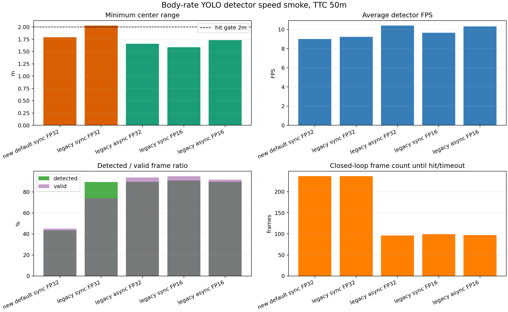
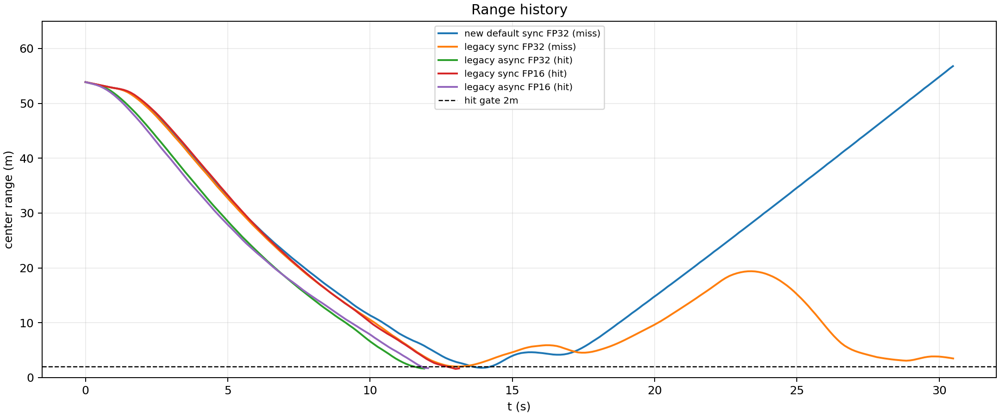
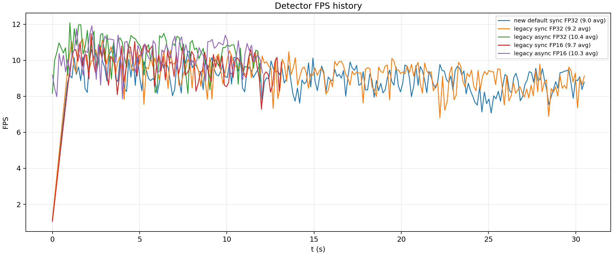
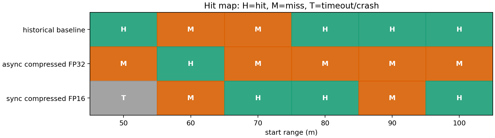
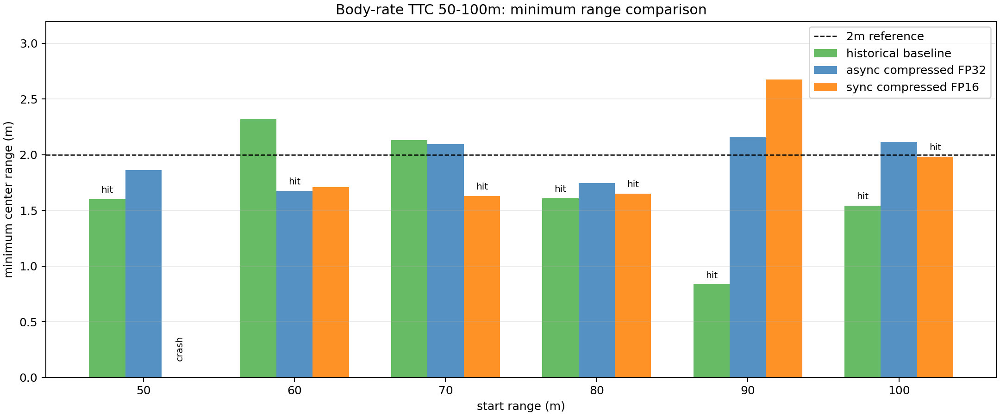
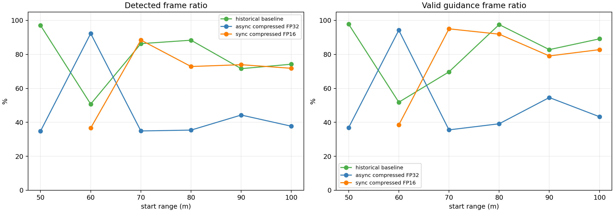

# YOLO 加速链路在 mavlink body-rate 基线下的测试对比

## 1. 结论

本轮测试只使用姿态角速度链路：

```text
guidance_output_mode = accel_body_rate
px4_command_mode = mavlink_body_rate
body_rate_control_profile = legacy
guidance_law = ttc_png
```

因此本报告不是速度控制结果。PX4 接收的是 MAVLink `SET_ATTITUDE_TARGET` 中的机体系 `p/q/r` 角速度和归一化 thrust；速度只作为沿 LOS 的 speed-hold 工程项参与合成加速度。

结论：

- 历史 baseline 仍应暂时保留为 `TTC_accel_body_rate_loskf_relaxed_20260623_073738`，结果为 4/6 命中。
- `yolo_bytetrack_async + compressed + FP32` 在单次 50m smoke 中命中，但完整 50-100m 只有 1/6 命中，异步检测会改变末端闭环相位，不能直接替换 baseline。
- `yolo_bytetrack + compressed + FP16` 在完整 50-100m 中可命中 70m、80m、100m，但 50m 工况 Blocks 崩溃超时，整体为 3/6 有效命中，不比历史 baseline 稳定。
- 目前不建议启用 `raw` image transport；之前测试显示 raw 会显著破坏检测连续性。
- 当前瓶颈不是纯 YOLO 推理速度，而是 AirSim 图像/RPC、YOLO 约 8-10 FPS 的闭环采样、PX4 body-rate 响应和末端目标出框共同作用。

## 2. 50m 检测链路 smoke

|方案|控制参数|检测源|half|命中|最小距离|终点距离|检测帧|有效帧|YOLO FPS|
|---|---|---|---:|---:|---:|---:|---:|---:|---:|
|new default sync FP32|新版默认 thrust/terminal 参数|`yolo_bytetrack`|0|否|1.789m|56.780m|103/237|107/237|9.01|
|legacy sync FP32|历史 body-rate 参数|`yolo_bytetrack`|0|否|2.030m|3.494m|212/237|175/237|9.24|
|legacy async FP32|历史 body-rate 参数|`yolo_bytetrack_async`|0|是|1.659m|1.659m|86/96|90/96|10.42|
|legacy sync FP16|历史 body-rate 参数|`yolo_bytetrack`|1|是|1.588m|1.682m|90/99|94/99|9.66|
|legacy async FP16|历史 body-rate 参数|`yolo_bytetrack_async`|1|是|1.734m|1.734m|87/97|89/97|10.32|







50m 单点 smoke 说明：异步和 FP16 都可能命中，但这个结论不能直接外推到全距离。完整批跑中，异步 FP32 的 50m 又变成近失后脱离。

## 3. 50-100m 完整对比

|方案|50m|60m|70m|80m|90m|100m|命中数|
|---|---|---|---|---|---|---|---:|
|历史 baseline sync FP32|命中 1.600m|未命中 2.317m|未命中 2.132m|命中 1.610m|命中 0.836m|命中 1.545m|4/6|
|async compressed FP32|未命中 1.862m|命中 1.676m|未命中 2.094m|未命中 1.747m|未命中 2.156m|未命中 2.114m|1/6|
|sync compressed FP16|超时/Blocks 崩溃|未命中 1.708m|命中 1.631m|命中 1.651m|未命中 2.676m|命中 1.982m|3/6 有效|







## 4. 关键观察

1. `async compressed FP32` 的 detector FPS 从约 9 FPS 提高到约 10 FPS，但完整批跑命中率下降。原因不是推理慢，而是检测结果异步返回后存在测量年龄，末端 0.1-0.3s 内相当于额外相位滞后。

2. `sync compressed FP16` 没有显著提高闭环 FPS。完整批跑中 detector FPS 约 8.9-9.5 FPS，且 50m 触发 Blocks `SparseArray.h Index < GetMaxIndex()` 崩溃，不能作为稳定配置。

3. 多个未命中工况的最小中心距离已经小于或接近 2m，但 AirSim collision 没有触发。当前判据仍以碰撞对象为准，中心距离只能作为脱靶量参考。

4. 末端主要问题仍是固定相机 body-rate 闭环：目标接近画面边缘后，YOLO 低频检测、LOS/KF 外推、PX4 姿态响应和 yaw-rate 限幅共同造成近失。

## 5. 建议

- baseline 暂时不替换：继续以历史 `TTC_accel_body_rate_loskf_relaxed_20260623_073738` 作为 body-rate 基线。
- 检测链路建议保留 `compressed`，不启用 `raw`。
- `async` 可继续作为实验分支，但必须把 detection timestamp、measurement age 和 LOS 外推显式接入导引，否则不能用于末端闭环。
- `FP16` 可保留开关，但不作为默认；需要先查清 Blocks 50m 崩溃是否可复现。
- 下一步优化优先级应是末端时序补偿和 frame-centering/body-rate 控制，而不是继续只压 YOLO 单帧推理时间。

## 6. 产物

- 单点 smoke 汇总 CSV：`完整方案/assets/YOLO_body_rate_detector_speed_smoke对比报告/bodyrate_detector_speed_smoke_summary.csv`
- 50-100m 汇总 CSV：`完整方案/assets/YOLO_body_rate_detector_speed_50_100对比报告/bodyrate_detector_50_100_summary.csv`
- async FP32 完整报告：`完整方案/YOLO_body_rate_async_compressed_fp32_50_100测试报告.md`
- sync FP16 完整报告：`完整方案/YOLO_body_rate_sync_compressed_half_50_100测试报告.md`
