# AirSim Blocks 三类 PNG 拦截仿真实验报告

生成日期：2026-06-14  
项目目录：`/home/linux/Documents/PNG`

## 1. 实验目的与结论摘要

本轮实验用于对比三种拦截验证程序：

- **真实位置 PNG**：算法直接读取入侵无人机真实位置和速度，是控制链路上限基准，不代表可交付视觉方案。
- **云台视觉 PNG**：算法内部只使用 AirSim `detect` 输出的检测框，云台持续把目标保持在图像中心，再由 `LOS + TTC` 形成导引量。
- **捷联视觉 PNG**：相机固定在拦截机机体上，初始只用真实位置对准机体航向，之后算法内部同样只使用检测框，靠机体 yaw-rate 和速度指令完成拦截。

当前结论：

- 真实位置 PNG 已能稳定打通比例导引控制链路，碰撞成功。
- 视觉方案的核心可行性已验证：云台和捷联在低速裕度工况下均碰撞成功。
- 捷联基准工况当前优于云台基准工况：捷联基准碰撞成功，云台基准最小距离约 `0.509 m` 但未触发 AirSim 车辆碰撞。
- 视觉末端的主要风险不是中段 LOS 估计，而是目标填满视场后的裁切、丢检、云台限位和 BlindPush 参数标定。
- 快速目标工况仍未成功，说明当前视觉 PNG 的边界主要受末端状态机、最大速度/转向能力和目标穿越角速度约束。

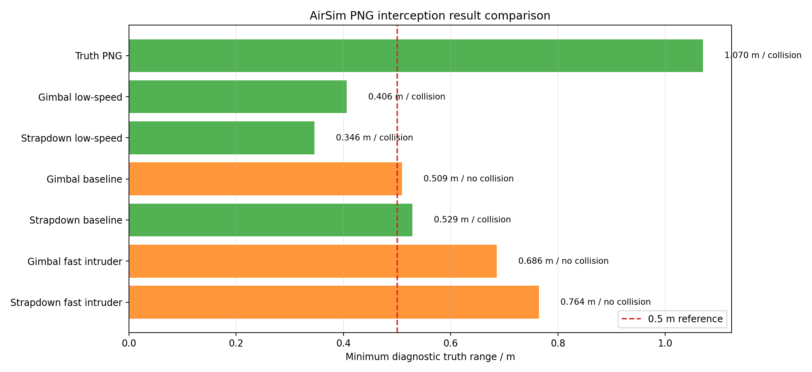

## 2. 实验环境与约束

AirSim 设置使用 `config/airsim_blocks_settings.json`：

- 场景：AirSim Blocks，多无人机模式。
- 车辆：`Interceptor` 和 `Intruder`，均为 `SimpleFlight`。
- 相机：`640 x 480`，`FOV = 120 deg`。
- 拦截机相机位置：机体坐标 `X=0, Y=0, Z=-0.5 m`，用于减小机架遮挡。
- 起始流程：两机起飞后先爬升到拦截高度，再开始拦截；拦截机高度 `50 m`，入侵机可设置为高出 `10 m` 或 `30 m`。
- 碰撞判据：不再用距离阈值判定成功，而是 AirSim `simGetCollisionInfo` 的车辆对象名通配匹配。

重要信息边界：

- 视觉 PNG 算法内部不使用入侵机真实位置。
- 真实位置只用于初始对准、离线评价、绘图和日志诊断。
- AirSim `detect` 是本轮视觉检测替代源，目标检测网络暂未接入。

截图采集记录：

- 曾出现一次 Blocks 1.8.1 在 AirSim RPC dispatcher 线程内崩溃，断言为 `SparseArray.h:94 Index < GetMaxIndex()`；后续采集改为只在末端保存少量关键帧，避免全程高频 `simGetImage`。
- 2026-06-14 重新手动启动 Blocks 后，云台和捷联两组均成功保存第一人称检测框截图。
- 云台截图工况碰撞成功，日志前缀为 `report_gimbal_preview`，保存 5 张末端关键帧。
- 捷联截图工况保存 8 张末端关键帧，但该次未碰撞，最小诊断距离约 `0.552 m`，可用于展示 bbox 裁切、BlindPush 和丢检过程。

## 3. 三类方案说明

### 3.1 真实位置 PNG 基准

真实位置 PNG 直接读取：

- 入侵机真实位置 `p_t`
- 入侵机真实速度 `v_t`
- 拦截机真实位置 `p_m`
- 拦截机真实速度 `v_m`

导引核心是经典比例导引：

```text
r = p_t - p_m
lambda = r / ||r||
v_rel = v_t - v_m
omega_LOS = r x v_rel / ||r||^2
a_cmd = N * Vc * (omega_LOS x lambda)
```

该方案用于确认 AirSim 多机控制、速度指令、碰撞判定和绘图链路是否正常。它不适合作为最终交付算法，因为实机中不能获得敌方无人机真实状态。

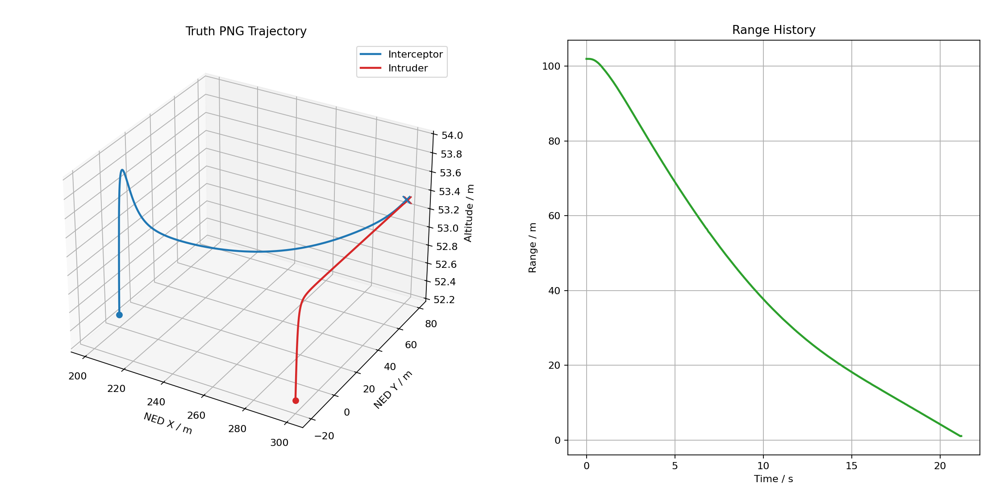

### 3.2 云台视觉 PNG

云台方案的输入只有检测框：

- `bbox center`：用于角度通道。
- `bbox area`：用于尺度膨胀和 TTC。
- `track/detection name`：用于保持目标连续性。

流程：

1. 初始阶段允许读取一次真实位置，把云台对准入侵机，使目标进入相机视野。
2. 拦截开始后只读取 AirSim `detect` 的检测框。
3. 云台根据像面误差调整 yaw/pitch，使目标尽量保持在图像中心。
4. `bbox center` 进入 6D LOS 滤波器，输出视线方向和视线角速度。
5. `bbox area` 进入 TTC 通道，估计接近阶段和增益。
6. 导引输出速度指令，同时通过机体 yaw 控制让拦截机朝向期望速度方向。
7. 末端出现云台限位、裁切或丢检时，进入 BlindPush 和像面 KF 外推。

低速裕度工况中云台方案成功碰撞，但末端 yaw 达到 `-80 deg` 限位，说明成功依赖 BlindPush 和 KF 外推兜底。

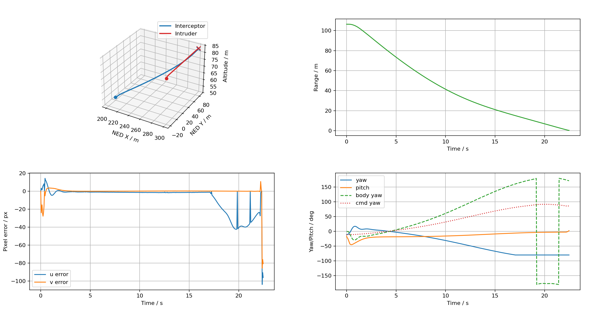

本次重新采集的云台第一人称检测截图如下。可以看到末端进入 `BlindPush`，触发原因为 `gimbal_limit`；最后一帧碰撞成功，但 LOS 创新已拒绝，说明目标已处于视觉几何失效边界。

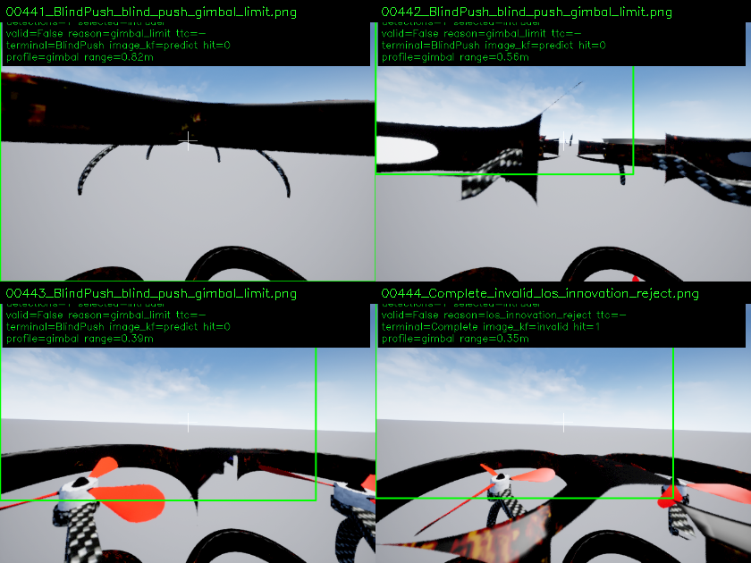

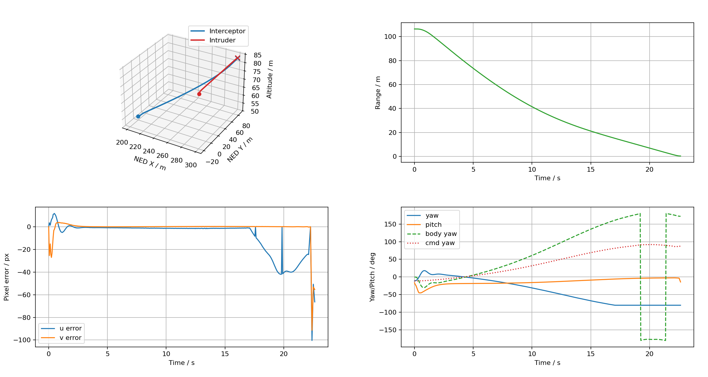

云台基准工况最小距离约 `0.509 m`，但未触发碰撞，末端最终进入 `LossHold/no_detection`。这说明当前云台限位和目标高速穿越视场仍是核心短板。

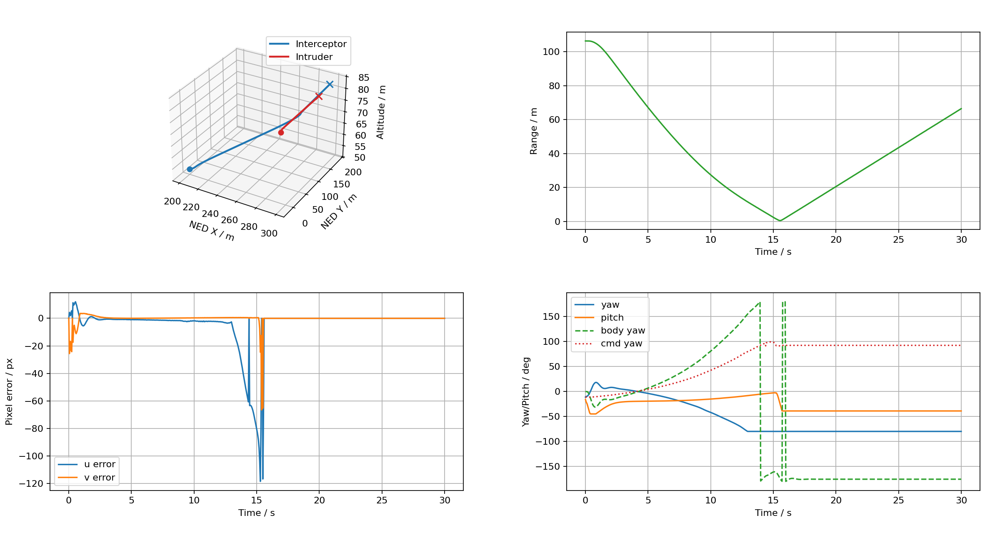

### 3.3 捷联视觉 PNG

捷联方案中相机固定，不再持续转动云台：

- 初始阶段允许读取一次真实位置，旋转拦截机机体 yaw，让固定相机朝向入侵机。
- 拦截开始后相机姿态随机体运动，算法只用检测框。
- 像面横向误差会生成 yaw-rate 修正，让机体持续把目标拉回视场。
- 速度指令仍由 `LOS + TTC` 生成。

捷联方案在当前基准工况中成功碰撞，末端触发原因主要是 `bbox_clipped`，说明目标填满视野后 BlindPush 生效。

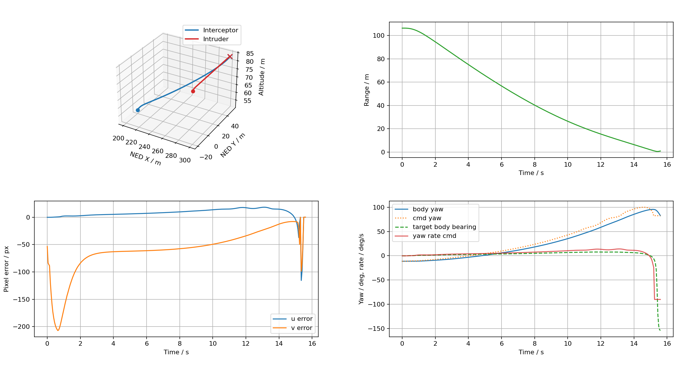

低速裕度工况中捷联方案也成功碰撞，最小诊断距离约 `0.346 m`。

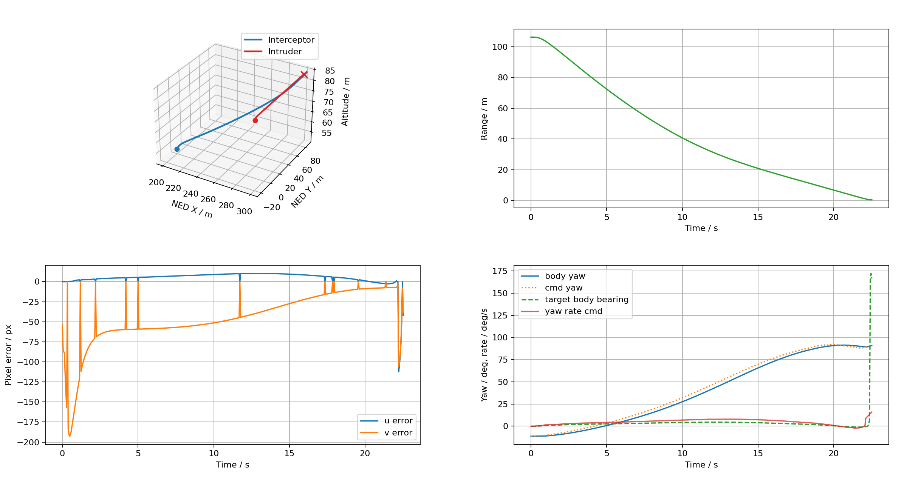

本次重新采集的捷联第一人称截图如下。该次未碰撞，但截图清楚记录了 `TerminalVisual -> BlindPush -> no_detection` 的末端过程，适合用于分析固定相机视野裁切和 yaw-rate 外推边界。

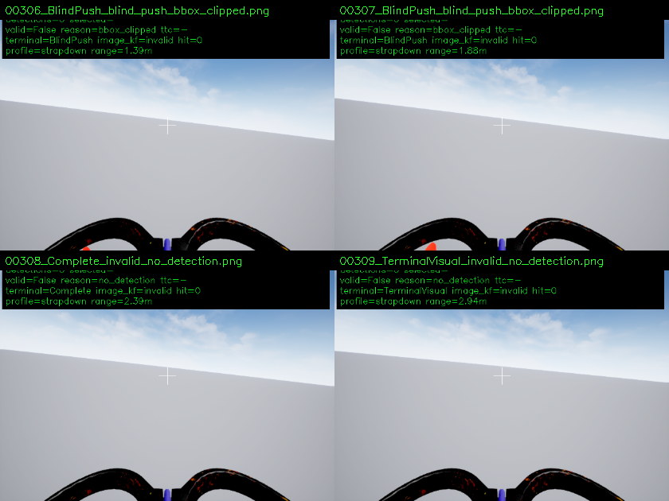

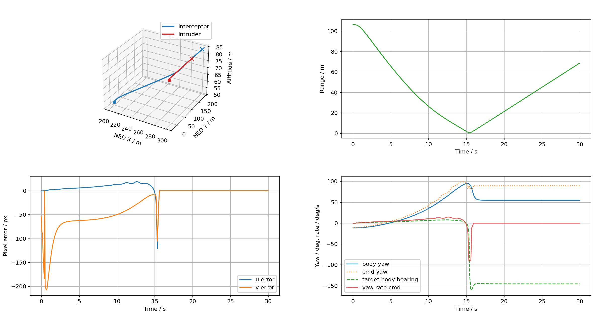

## 4. 视觉 LOS + TTC 融合架构

视觉方案没有把单目距离强行塞进 8D EKF，而是把角度和接近程度解耦。

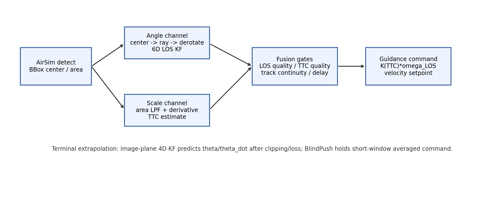

### 4.1 角度通道：6D LOS

角度通道只关心目标方向：

```text
状态：x = [lambda_x, lambda_y, lambda_z, lambda_dot_x, lambda_dot_y, lambda_dot_z]
输入：bbox center -> camera ray
姿态补偿：camera ray -> body -> inertial
输出：lambda_I, omega_LOS
```

主要优点：

- 相机天然是高精度测角传感器，bbox 中心对 LOS 方向非常敏感。
- 不估计绝对距离，避免单目尺度噪声污染视线角速度。
- 能与 Pixhawk 或 AirSim 姿态历史缓存配合，进行曝光时刻去旋转。

主要劣势和边界：

- 6D LOS 自身不知道目标多远，也不知道闭合速度 `Vc`。
- 若直接固定 `Vc`，不同交会角下等效导引比会变化。
- 当目标大幅裁切、检测框中心不再代表目标质心时，LOS 会被像面几何破坏。
- 目标突然出视野后，LOS 只能短时 coast，不能长期预测。

### 4.2 尺度通道：Scale Expansion / TTC

尺度通道使用检测框面积变化判断接近速度趋势：

```text
A = bbox_area
A_filt = LPF(A)
A_dot = d(A_filt) / dt
TTC ~= 2A / A_dot
```

这里不求绝对距离，只求碰撞时间趋势。它的价值是给 PNG 提供动态增益：

- TTC 大：降低增益，避免远距离阶段过度打舵。
- TTC 小：提高末端响应，压制残余像面误差。
- 面积不膨胀或质量差：退回 LOS fallback，而不是信任错误 TTC。

工程注意点：

- `A_dot` 对噪声很敏感，必须低通滤波。
- 检测框裁切后面积不再可信，应触发 terminal gate。
- 目标姿态变化会改变投影面积，TTC 只能作为增益调节量，不应当被当作精确测距。

### 4.3 融合门控

视觉 PNG 输出前需要同时检查：

- LOS 质量有效。
- TTC 质量有效，或允许 LOS fallback。
- track/detection 名称连续。
- 姿态缓存时间对齐有效。
- bbox 未严重裁切，或已进入 terminal state。
- 视觉延迟、丢检次数、云台限位未超过容许范围。

任一质量门失败时，算法不继续输出普通 PNG 导引，而是进入 coast、LossHold 或 BlindPush。

## 5. 末端外推与 BlindPush

末端视觉失效是高概率事件。目标接近时可能出现：

- 目标填满视野，bbox 被裁切。
- 检测函数返回框不稳定或短时丢检。
- 云台 yaw/pitch 达到限位。
- 捷联相机因机体姿态滞后导致目标快速扫出视场。

当前实现采用两层兜底。

第一层是 **TerminalExtrapolator / BlindPush**：

- 缓存最近约 `0.1 s` 的速度指令。
- 进入末端后，不直接锁死最后一帧，而是使用短窗口平均。
- 叠加 LOS 趋势偏置和轻微 pitch-up 偏置。
- 用指数衰减避免盲推结束时指令突变。
- 盲推持续时间有限，当前调优工况使用 `0.45 s`。

第二层是 **终端像面 KF 外推**：

```text
状态：x = [theta_x, theta_y, theta_dot_x, theta_dot_y]
模型：常速度
观测：bbox center -> 像面角误差
预测窗口：当前调优工况为 0.50 s
```

云台版和捷联版的外推使用方式不同：

- 云台版：KF 预测像面角误差后，生成预测中心点，让云台继续按预测方向扫；但接近 `±80 deg` 限位后只能冻结/盲推。
- 捷联版：KF 预测横向角误差和角速度后，继续输出 yaw-rate 修正；末端更容易保持机体朝向目标穿越方向。

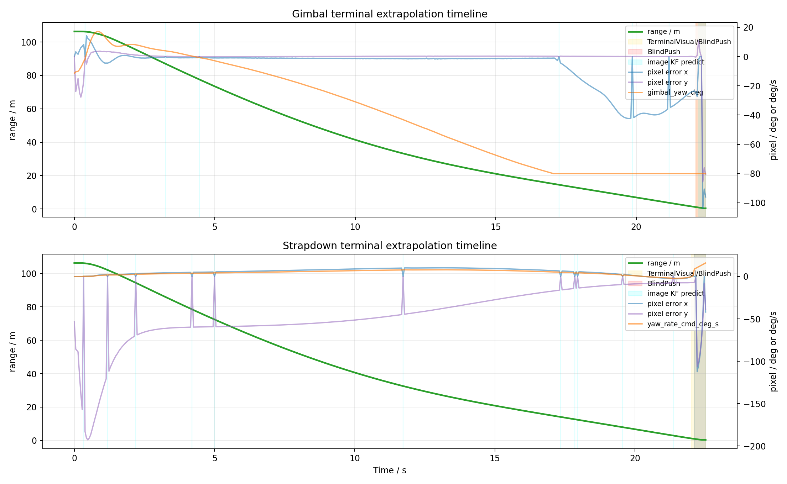

从日志看：

- 云台低速成功工况：末端 `gimbal_limit` 触发 BlindPush，KF predict 12 帧，云台 yaw 锁在 `-80 deg`。
- 捷联低速成功工况：末端 `bbox_clipped` 触发 BlindPush，KF predict 20 帧，yaw-rate 持续外推。
- 捷联基准成功工况：末端 yaw-rate 达到限幅 `-90 deg/s`，说明仍接近控制能力边界。

## 6. 实验结果汇总

| 工况 | 方案 | 入侵机速度 m/s | 速度系数 | 高度差 m | 是否碰撞 | 命中时间 s | 最小距离 m | KF predict 帧 | BlindPush 帧 | 末端原因 |
|---|---:|---:|---:|---:|---|---:|---:|---:|---:|---|
| 真实位置 PNG | truth | - | - | - | 是 | 21.202 | 1.070 | 0 | 0 | - |
| 云台-低速裕度 | gimbal | 5.0 | 1.6 | 30 | 是 | 22.471 | 0.406 | 12 | 8 | gimbal_limit |
| 捷联-低速裕度 | strapdown | 5.0 | 1.6 | 30 | 是 | 22.519 | 0.346 | 20 | 9 | bbox_clipped |
| 云台-基准 | gimbal | 5.0 | 2.0 | 30 | 否 | - | 0.509 | 11 | 9 | no_detection |
| 捷联-基准 | strapdown | 5.0 | 2.0 | 30 | 是 | 15.594 | 0.529 | 8 | 8 | bbox_clipped |
| 云台-快速目标 | gimbal | 8.0 | 2.0 | 30 | 否 | - | 0.686 | 11 | 9 | no_detection |
| 捷联-快速目标 | strapdown | 8.0 | 2.0 | 30 | 否 | - | 0.764 | 12 | 18 | no_detection |
| 云台-截图复测 | gimbal | 5.0 | 1.6 | 30 | 是 | 22.640 | 0.349 | 5 | 4 | los_innovation_reject |
| 捷联-截图复测 | strapdown | 5.0 | 2.0 | 30 | 否 | - | 0.552 | 4 | 4 | no_detection |

注意：成功判定来自 AirSim 车辆碰撞对象名匹配，不是表中的最小距离阈值。真实位置 PNG 的最小距离约 `1.07 m` 仍可碰撞，是因为 AirSim 碰撞体尺寸和几何中心距离不完全等同。

## 7. 原因分析

### 7.1 为什么真实位置 PNG 能成功

真实位置 PNG 没有视觉测量延迟、检测框裁切和 TTC 噪声，LOS、闭合速度和加速度方向都来自真实状态。它验证的是控制闭环和碰撞判据，而不是视觉导引鲁棒性。

### 7.2 为什么云台低速能成功但基准未碰撞

云台低速工况把速度系数从 `2.0` 降到 `1.6`，末端相对穿越角速度更低，BlindPush 有足够时间完成最后接触。基准工况虽然最小距离已到 `0.509 m`，但末端丢检后进入 `LossHold`，没有触发车辆碰撞。

云台方案的主要问题：

- 目标侧向穿越时云台 yaw 很快接近 `±80 deg`。
- 云台限位后，即便 LOS/TTC 仍有估计，传感器视轴已经不能继续跟踪目标。
- 末端只能依赖 BlindPush 和短时 KF 外推，窗口过短会错失，窗口过长会过度外推。

### 7.3 为什么捷联基准更稳定

捷联方案把横向目标保持任务交给机体 yaw-rate，而不是云台 yaw。它的优势是视轴和飞行方向更一致，末端速度方向、机体朝向和检测视场不会像云台方案那样严重分离。

但捷联也有边界：

- 机体 yaw-rate 达到限幅时，目标仍会快速离开视场。
- 固定相机没有云台的独立补偿能力，中段如果初始航向差大，会更容易丢目标。
- 目标高度差较大时，pitch/vertical command 的耦合更明显。

### 7.4 为什么快速目标仍失败

快速目标工况中入侵机速度 `8 m/s`，速度系数 `2.0`，拦截机速度上限 `16 m/s`。虽然速度比看似足够，但侧向交会时初始 LOS 角速度和末端穿越角速度明显增大，当前参数存在三个不足：

- 末端 `terminal_enter_area_ratio` 与 `cutoff_area_ratio` 触发时机偏晚。
- KF 预测窗口虽有 `0.5 s`，但预测控制仍受 yaw-rate、云台限位和速度指令限幅约束。
- PNG/TTC 增益在快速侧向穿越时可能不够前置，导致中段碰撞航线建立不充分。

## 8. 工程建议

短期建议：

- 对云台方案降低 `terminal_gimbal_limit_area_ratio`，让接近限位时更早进入 TerminalVisual。
- 云台 BlindPush 不建议继续追求大 yaw 扫动，应该更早冻结云台，依赖速度矢量完成末端。
- 捷联方案继续调 `terminal_yaw_rate_scale`、`terminal_yaw_rate_decay_tau_s` 和 `max_yaw_rate_deg`，避免末端长时间贴限幅。
- 快速目标工况需要提前进入 terminal gain schedule，而不是只在目标很大时才提高增益。

中期建议：

- 对 `TTC` 通道增加按面积质量的置信度曲线，目标裁切后立即停止使用面积膨胀率。
- 把终端像面 KF 的预测窗口按速度和视场占比自适应：低速可长，快速目标应短而强。
- 增加按工况自动输出的实验报告脚本，固定保存参数、曲线、关键帧和 CSV 摘要。
- 当 Blocks 可正常渲染时，用新增 `--record-preview` 参数采集相机第一人称检测关键帧。

推荐采集命令示例：

```bash
python3 examples/run_airsim_gimbal_vision_png.py \
  --enable-motion --duration-s 30 \
  --intruder-speed 5 --speed-ratio 1.6 \
  --intruder-altitude-offset-m 30 \
  --terminal-blind-duration-s 0.45 \
  --terminal-command-decay-tau-s 0.30 \
  --terminal-image-kf-max-predict-s 0.50 \
  --terminal-enter-area-ratio 0.12 \
  --terminal-cutoff-area-ratio 0.45 \
  --terminal-gimbal-gain-scale 0.60 \
  --terminal-gimbal-limit-area-ratio 0.10 \
  --max-vision-vertical-speed 4.0 \
  --terminal-pitch-up-bias-mps 1.2 \
  --record-preview \
  --preview-max-frames 8 \
  --trajectory-prefix report_gimbal_low_speed
```

```bash
python3 examples/run_airsim_strapdown_vision_png.py \
  --enable-motion --duration-s 30 \
  --intruder-speed 5 --speed-ratio 2.0 \
  --intruder-altitude-offset-m 30 \
  --terminal-blind-duration-s 0.45 \
  --terminal-command-decay-tau-s 0.30 \
  --terminal-image-kf-max-predict-s 0.50 \
  --terminal-enter-area-ratio 0.12 \
  --terminal-cutoff-area-ratio 0.45 \
  --terminal-yaw-rate-decay-tau-s 0.30 \
  --terminal-yaw-rate-scale 0.85 \
  --max-vision-vertical-speed 4.0 \
  --terminal-pitch-up-bias-mps 1.2 \
  --record-preview \
  --preview-max-frames 8 \
  --trajectory-prefix report_strapdown_baseline
```

为降低 Blocks 1.8.1 的 RPC 崩溃概率，建议不要加 `--no-preview-near-terminal-only`。默认只在末端状态、BlindPush、裁切、丢检或碰撞附近保存关键帧，避免全程高频调用 `simGetImage`。

## 9. 当前交付状态

本报告已使用已有日志生成图表和结论。另已补充视觉脚本的关键帧保存能力：

- `examples/run_airsim_gimbal_vision_png.py`
- `examples/run_airsim_strapdown_vision_png.py`

新增参数默认关闭，不影响现有测试流程。本报告已包含本次采集到的云台和捷联第一人称检测截图，原始图片分别位于：

- `完整方案/assets/拦截仿真实验报告/gimbal_preview/`
- `完整方案/assets/拦截仿真实验报告/strapdown_preview/`

对应 CSV 与轨迹图：

- `logs/report_gimbal_preview.csv`
- `logs/report_gimbal_preview.png`
- `logs/report_strapdown_preview.csv`
- `logs/report_strapdown_preview.png`
