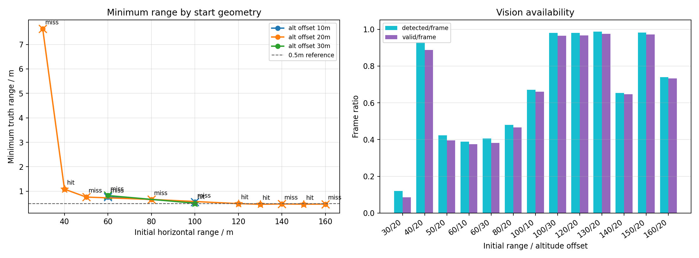
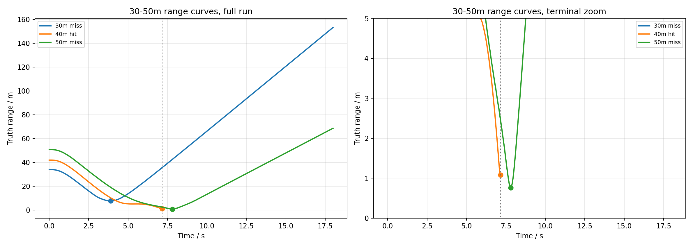
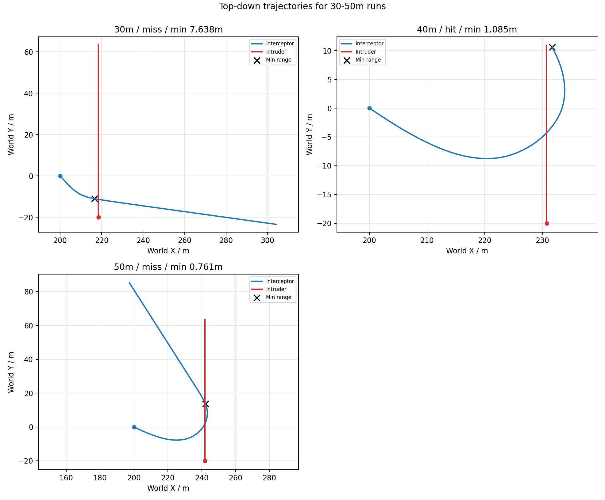
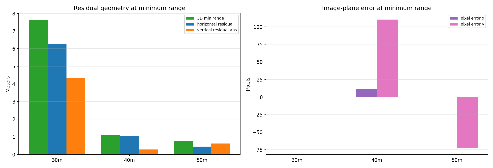
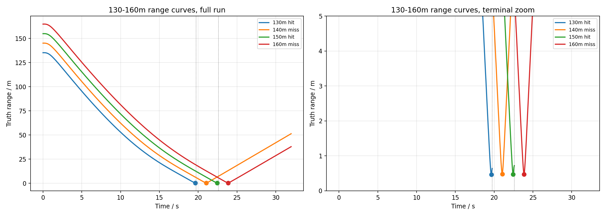
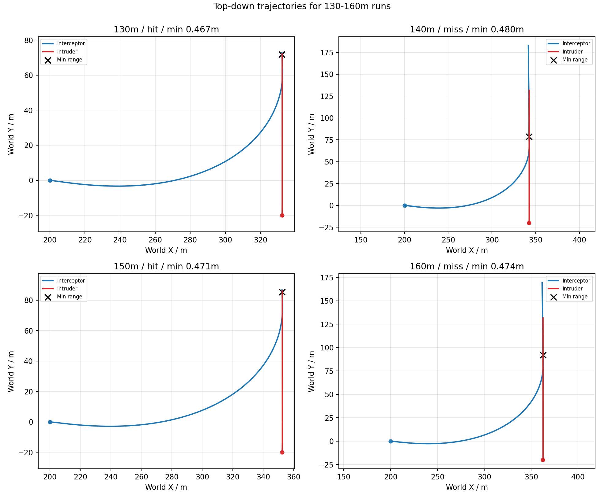
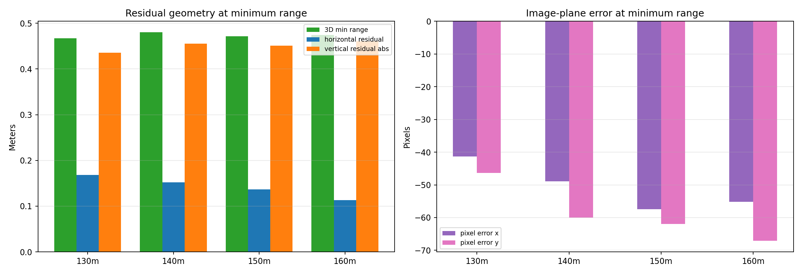

# 捷联视觉 PNG 无头距离测试报告

## 1. 测试目的

本报告整理 AirSim Blocks 中捷联视觉 PNG 的无头批量测试结果。测试只使用捷联相机方案，不打开 OpenCV 界面，不保存检测截图，不生成仿真窗口录屏；本文图片均由 CSV 实验日志离线绘制。

成功判据采用 AirSim 双机碰撞检测；真值距离、水平残差和垂直残差只用于算法评价，不参与 PNG 内部导引。

## 2. 测试条件

- 测试对象：`examples/run_airsim_strapdown_vision_png.py`
- 批量脚本：`examples/batch_strapdown_accuracy.py`
- AirSim 配置：`config/airsim_blocks_settings.json`，`ViewMode=NoDisplay`
- 相机视场角：`120 deg`
- 拦截机起始高度：`50 m`
- 入侵机速度：`5.0 m/s`
- 速度比：`2.0`
- 侧向偏置：`-20 m`
- 测试距离组 A：`30m, 40m, 50m`
- 测试距离组 B：`130m, 140m, 150m, 160m`

距离组 A 运行命令：

```bash
python3 examples/batch_strapdown_accuracy.py --ranges 30 40 50 --altitude-offsets 20 --duration-s 18 --intruder-speed 5 --speed-ratio 2 --rate-hz 20 --print-every-n 0 --trajectory-dir logs/strapdown_accuracy
```

距离组 B 运行命令：

```bash
python3 examples/batch_strapdown_accuracy.py --ranges 130 140 150 160 --altitude-offsets 20 --duration-s 32 --intruder-speed 5 --speed-ratio 2 --rate-hz 20 --print-every-n 0 --trajectory-dir logs/strapdown_accuracy
```

## 3. 结果总览



| 初始水平距离 | 高度差 | 侧向偏置 | 是否碰撞 | 碰撞时间 | 最小距离 | 末端距离 | 检测帧 | 有效帧 |
|---:|---:|---:|---:|---:|---:|---:|---:|---:|
| 30m | 20m | -20m | 否 | - | 7.638m | 153.168m | 43/359 | 31/359 |
| 40m | 20m | -20m | 是 | 7.15s | 1.085m | 1.085m | 133/143 | 127/143 |
| 50m | 20m | -20m | 否 | - | 0.761m | 68.593m | 152/359 | 142/359 |
| 60m | 10m | -20m | 否 | - | 0.764m | 69.491m | 170/438 | 164/438 |
| 60m | 30m | -20m | 否 | - | 0.823m | 64.709m | 178/438 | 167/438 |
| 80m | 20m | -20m | 否 | - | 0.666m | 59.889m | 229/478 | 223/478 |
| 100m | 10m | -20m | 否 | - | 0.556m | 32.825m | 294/438 | 289/438 |
| 100m | 30m | -20m | 是 | 15.58s | 0.511m | 0.803m | 305/311 | 300/311 |
| 120m | 20m | -20m | 是 | 18.34s | 0.494m | 0.706m | 359/366 | 354/366 |
| 130m | 20m | -20m | 是 | 19.75s | 0.467m | 0.638m | 389/394 | 384/394 |
| 140m | 20m | -20m | 否 | - | 0.480m | 51.396m | 417/638 | 412/638 |
| 150m | 20m | -20m | 是 | 22.60s | 0.471m | 0.724m | 443/451 | 438/451 |
| 160m | 20m | -20m | 否 | - | 0.474m | 37.964m | 472/638 | 467/638 |

## 4. 30-50m 工况





| 初始水平距离 | 高度差 | 侧向偏置 | 是否碰撞 | 碰撞时间 | 最小距离 | 末端距离 | 检测帧 | 有效帧 |
|---:|---:|---:|---:|---:|---:|---:|---:|---:|
| 30m | 20m | -20m | 否 | - | 7.638m | 153.168m | 43/359 | 31/359 |
| 40m | 20m | -20m | 是 | 7.15s | 1.085m | 1.085m | 133/143 | 127/143 |
| 50m | 20m | -20m | 否 | - | 0.761m | 68.593m | 152/359 | 142/359 |



| 初始水平距离 | 是否碰撞 | 最小距离时刻 | 最小距离 | 水平残差 | 垂直残差 | 像面误差 x/y | 末端状态 | 原因 |
|---:|---:|---:|---:|---:|---:|---:|---|---|
| 30m | 否 | 3.89s | 7.638m | 6.281m | -4.345m | 0.0/0.0px | LossHold | no_detection |
| 40m | 是 | 7.15s | 1.085m | 1.047m | 0.284m | 11.9/110.4px | TerminalVisual |  |
| 50m | 否 | 7.81s | 0.761m | 0.448m | -0.616m | 0.0/-72.6px | BlindPush | bbox_clipped |

本距离组用于观察捷联固定相机在对应初始距离下的 LOS+TTC 收敛、检测连续性和末端外推表现。当前命中率为 `1/3`，测试距离为 `30m, 40m, 50m`。未碰撞工况需要结合最小距离、检测帧比例、末端状态和残差共同判断；如果最小距离已经进入亚米级，主要问题通常集中在末端裁切、盲推时长、垂直偏置和 AirSim 碰撞体交叠判据。

## 5. 130-160m 工况





| 初始水平距离 | 高度差 | 侧向偏置 | 是否碰撞 | 碰撞时间 | 最小距离 | 末端距离 | 检测帧 | 有效帧 |
|---:|---:|---:|---:|---:|---:|---:|---:|---:|
| 130m | 20m | -20m | 是 | 19.75s | 0.467m | 0.638m | 389/394 | 384/394 |
| 140m | 20m | -20m | 否 | - | 0.480m | 51.396m | 417/638 | 412/638 |
| 150m | 20m | -20m | 是 | 22.60s | 0.471m | 0.724m | 443/451 | 438/451 |
| 160m | 20m | -20m | 否 | - | 0.474m | 37.964m | 472/638 | 467/638 |



| 初始水平距离 | 是否碰撞 | 最小距离时刻 | 最小距离 | 水平残差 | 垂直残差 | 像面误差 x/y | 末端状态 | 原因 |
|---:|---:|---:|---:|---:|---:|---:|---|---|
| 130m | 是 | 19.65s | 0.467m | 0.169m | -0.436m | -41.3/-46.3px | BlindPush | bbox_clipped |
| 140m | 否 | 21.05s | 0.480m | 0.152m | -0.455m | -48.9/-60.0px | BlindPush | bbox_clipped |
| 150m | 是 | 22.45s | 0.471m | 0.137m | -0.451m | -57.4/-62.0px | BlindPush | bbox_clipped |
| 160m | 否 | 23.86s | 0.474m | 0.113m | -0.461m | -55.2/-67.1px | BlindPush | bbox_clipped |

本距离组用于观察捷联固定相机在对应初始距离下的 LOS+TTC 收敛、检测连续性和末端外推表现。当前命中率为 `2/4`，测试距离为 `130m, 140m, 150m, 160m`。未碰撞工况需要结合最小距离、检测帧比例、末端状态和残差共同判断；如果最小距离已经进入亚米级，主要问题通常集中在末端裁切、盲推时长、垂直偏置和 AirSim 碰撞体交叠判据。

## 6. 结论和后续调参方向

从现有批量测试看，捷联视觉 PNG 在多数距离下可以把目标导入亚米级最小距离。未触发碰撞的工况需要结合最小距离、水平残差、垂直残差和末端状态一起判断；如果最小距离已经接近或小于 `0.5m`，失败更可能来自末端视觉裁切后的 BlindPush 外推、上下方向偏置不足或碰撞体交叠不足，而不是 LOS 中段估计完全失败。

后续调参优先级：

1. 先调 `BlindPush` 的持续时间和衰减，避免过早退出或保持过久。
2. 再调末端 pitch-up / 垂直方向偏置，使最小距离时刻的垂直残差进一步收敛。
3. 最后调 TTC 增益和 LOS 像面 KF 外推，降低 `bbox_clipped` 后的像面残差。

## 7. 日志文件

- 总汇总：`logs/strapdown_accuracy/strapdown_headless_all_summary.csv`
自动纳入的批次汇总：
  - `logs/strapdown_accuracy/strapdown_headless_20260615_024445_summary.csv`
  - `logs/strapdown_accuracy/strapdown_headless_20260615_024907_extra_summary.csv`
  - `logs/strapdown_accuracy/strapdown_headless_20260615_025832_far_summary.csv`
  - `logs/strapdown_accuracy/strapdown_headless_20260615_043827_near_summary.csv`
